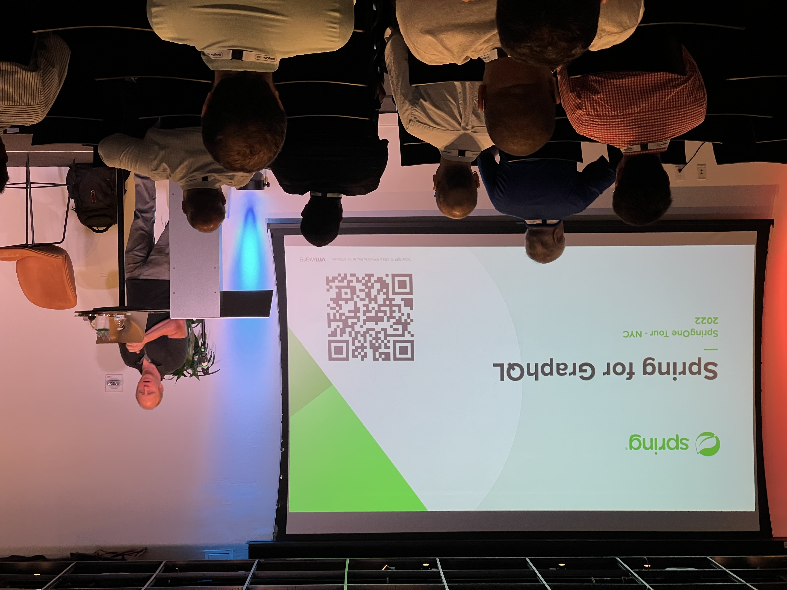

It’s hard to believe that another year has passed but I’m guessing this is something we say at the end of every year. I like to sit down over Christmas break and spend some time reflecting because I believe it's a good reminder of the good and the bad as I began to set some goals for next year.

## Spring Developer Advocate

This was one of my best years professionally and it began in January when [I started my dream job](https://www.danvega.dev/blog/2022/01/24/im-joining-vmware/) as a Spring Developer Advocate at VMware. I joined an amazing company and a team that I absolutely love working with every single day. I often joke that I was an advocate for Spring long before I joined VMware but this has literally been a dream come true.

I remember that feeling on Sunday evening of dreading the new work week and the stress that would follow. Now I sit down on Sunday with a smile on my face and plan out what I get to work on during the upcoming week. I absolutely love creating content and helping developers solve their problems.

When I joined DaShaun and I started talking about creating a place for Spring Developers to ask their questions. After some brainstorming sessions, we created Spring Office Hours, and honestly, it’s been one of the highlights of my year. This is a weekly live stream where we discuss what’s new in the Spring community and answer any questions you might have. If you want to learn more about the show head over to the [Tanzu Developer Center](https://tanzu.vmware.com/developer/tv/spring-office-hours/) and watch previous episodes.

I spent a lot of this year learning as much as I could and teaching what I learned back to the community. My plan is to continue that in 2023 because the Spring ecosystem is vast and there is so much more I hope to learn. It was an amazing year of traveling and giving presentations on topics I am passionate about and it’s something I hope to continue in the new year. Here is a short list of some of the presentations I gave in 2022:

- [SpringOne Tour Toronto](https://tanzu.vmware.com/developer/springone-tour/2022/toronto/)
- [VueConf US](https://us.vuejs.org/)
- [SpringOne Tour Seattle](https://tanzu.vmware.com/developer/springone-tour/2022/seattle/)
- [Kansas City Developer Conference (KCDC)](https://www.kcdc.info/)
- [Code On The Beach](https://www.codeonthebeach.com/)
- [SpringOne Tour NewYork](https://tanzu.vmware.com/developer/springone-tour/2022/new-york/)

## YouTube

I ended up crossing a huge milestone towards the end of the year and passing 20,000 subscribers on YouTube. I think I heard somewhere that only 1% of YouTubers hit this mark and that is just amazing company to be in 🤩 It’s been an amazing journey getting to this point and I have learned so much since I uploaded my first video in October of 2013.

I think what I am most excited about is that I have barely scratched the surface of what I could do with this channel. I know I have a lot of room to grow and I have big plans for my channel in the new year. Here is a video I published when I hit 20k thanking my subscribers and looking back at some of my older videos.

`youtube:https://youtu.be/hsMKOirkLZU`

I ended up posting 71 videos this year which exceeded my lofty goal of 1x per week for a total of 52 videos. I also ended up live streaming 24 times which was the exact number I set as a goal at the beginning of the year. I'm proud of the content I published on my channel and across YouTube and here are a few of my most popular videos:

- [What’s new in Spring Boot 2.6](https://www.youtube.com/watch?v=4L4LEnawcO8)
- [Building REST APIs in Spring Boot](https://www.youtube.com/watch?v=q_RLfOB7axQ)
- [Spring Security JWT: How to secure your Spring Boot REST APIs with JSON Web Tokens](https://studio.youtube.com/video/KYNR5js2cXE/edit)
- [Spring Security without the WebSecurityConfigurerAdapter](https://studio.youtube.com/video/s4X4SJv2RrU/edit)
- [Spring Boot 3 - What’s new in Spring Framework 6 and Spring Boot 3.0](https://studio.youtube.com/video/TR254zh-f3c/edit)

## 7 QUESTIONS TO SUCCESSFULLY REFLECT ON 2022

I’m a huge fan of Jay Shetty and his podcast. On a [recent episode](https://jayshetty.me/podcast/7-powerful-questions-to-successfully-reflect-on-2022-and-end-the-year-with-confidence/), he proposed answering the following 7 questions as a way to reflect on the past year. I thought this was a great idea to learn from it and take what I have learned into the new year.

### What is the challenge that you’ve overcome this year?

I have been struggling with my health and my battle with type 2 diabetes. Towards the end of last year, my numbers were not good and they didn’t get better through the first half of this year. I ended up having to go on a 3rd medicine and that really started to scare me. Suddenly this wasn’t something I was managing and could begin to have pretty serious consequences.

After asking myself some hard questions and confronting some truths I realized that a big part of my problem was alcohol. In the middle of August, I decided that I was going to stop drinking. I didn’t know for how long and If I am being honest I still don’t know the answer to that question.

What I do know is that my A1C went from 11.1 all the way down to 5.6 in November and I am getting healthier every single day. I eat better, exercise regularly and I am much more focused on a daily basis. In the month of December, I am hoping to cross 100 miles of running indoors on a treadmill which is an all-time best for me by a long shot.

While I am thankful for this decision and my progress I know it's just the beginning. I want to be off of all medicine one day and manage this through good lifestyle choices. I don’t know if that’s possible but I am working towards that goal every single day.

### What’s a surprise you dealt with?

A big surprise I had to deal with this year was getting Covid for the first time. We were very careful for a long time because when the pandemic hit my 2nd daughter was born. We ended up going on a family trip with our friends and their 2 kids to Hilton Head, SC.

On our way home I started feeling weak and honestly didn’t think much of it. The next day I still didn’t feel great and decided to take a test because I was supposed to travel the next day for my first in-person event in Chicago. What’s even crazier is that all of these people I spent every single hour with were just fine.

I was really bummed out that I had to miss my first SpringOne Tour event but I told myself it was just the first of many. I’m not sure what next year will bring but I hope to travel and talk code in a city near you!

### What is something you bought this year?

I bought a [new treadmill](https://amzn.to/3Vq4u2M) last January and it was one of the best purchases I have ever made. I’m normally not a big fan of running inside but this one changed all of that for me. This treadmill came with an LCD and you could sign up for a service called [iFit](https://www.ifit.com/) which has guided workouts on it.

I really enjoyed the 5k & 10k series that took me all over the world. There is something very subversive about these runs and being transported to a remote island on the other side of the planet. I also enjoy that they are all different kinds of workouts like tempo, interval, and long runs. The trainer also changes the speed for you and the incline automatically aligns with the hills they are running on.

This is a reminder to invest in anything that makes you happy and for me, this treadmill has done a lot for me this year.

### What’s the best book/podcast you read/listened to?

I discovered [Cal Newport](https://www.calnewport.com/) this year and for that reason, he is going to be both the best book and podcast I listened to this year. I really enjoyed his book [Deep Work](https://amzn.to/3Cadi60) which I wrote a review on in a [previous newsletter](https://www.danvega.dev/newsletter/deep-work/).

### What are your blind spots for next year?

VMWare was acquired by Broadcom this year and this does leave a little bit of uncertainty for me. I am not sure what will happen because of this acquisition but a lot of that is out of my hands. I love the company I work for and the team I get to work with every single day. It’s because of this I am going to keep a positive attitude and keep on doing what I love to do until I am told otherwise.

### What made you the happiest this year?

- My family and I got to take some really amazing trips this year. It was great to see so many beaches and the highlight was going to Disney World. My girls love to travel and I love seeing them happy.
- Seeing my girls grow up and realizing just how freaking lucky I am to be their dad #girldad
- My work makes me happy and the people I get to help every day puts a big smile on my face.
- Running has improved my physical and mental health and makes me so happy.

### Who’s the person you couldn’t have gotten through this year without?

This is without a doubt, my wife. She is my person, my best friend, my love, and my rock. I always dreamed about the life I have now and I owe a lot of that to her ❤️

## Conclusion

I had a lot of fun sitting down` and reflecting on the past year. Like every year it had its up and downs but I choose to focus on the positives and learn from my mistakes as I move into the new year. Be sure to stay on the lookout as I post my goals for 2023.

