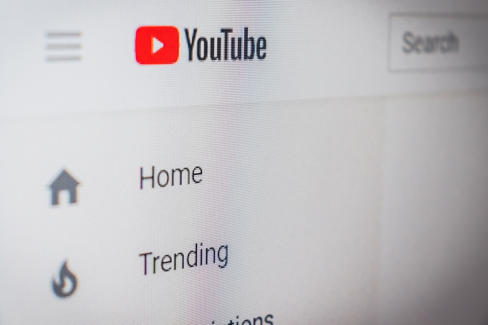
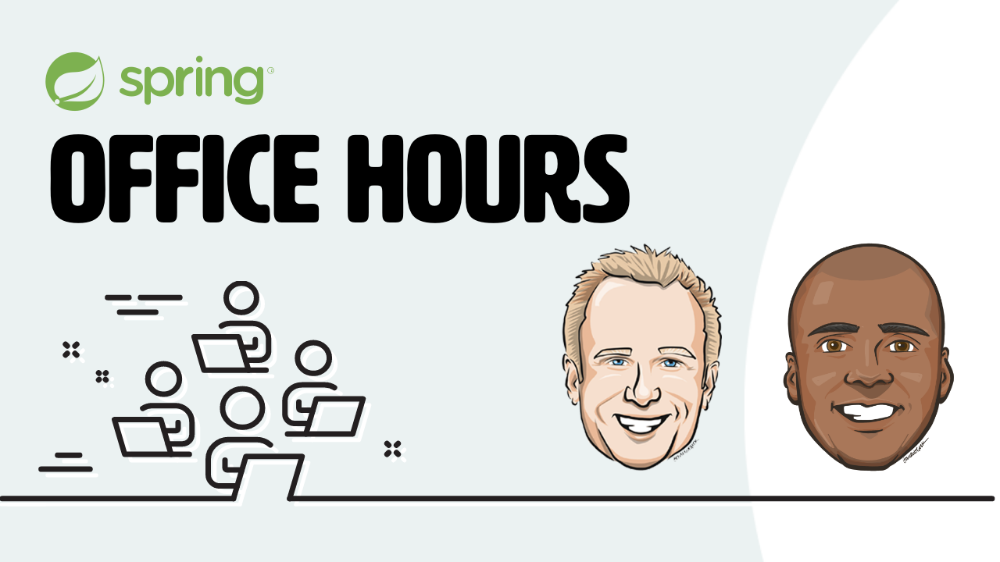
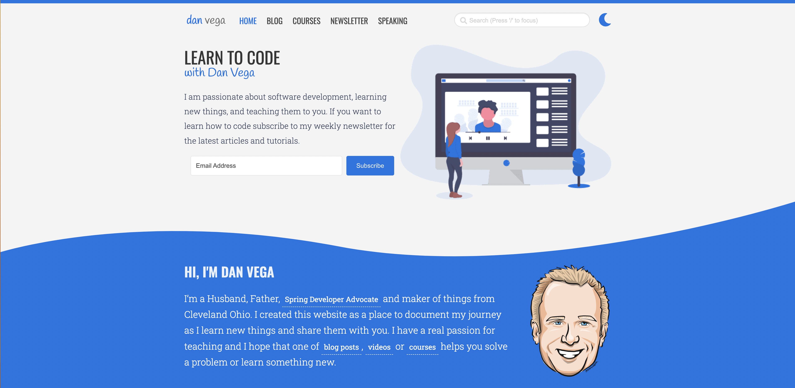
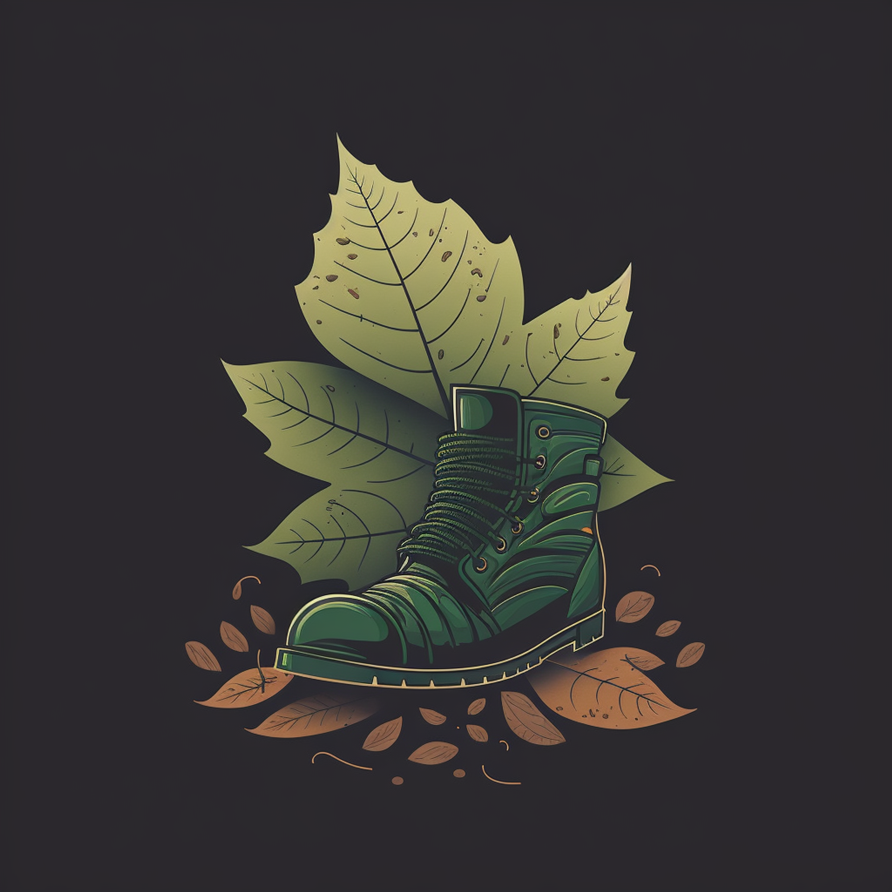

It’s that time of year again. If you missed [my last post](https://www.danvega.dev/blog/2022/12/29/2022-reflections/) I spent some time reflecting on 2022 before setting some goals for the new year. I mentioned this in [last year's new year's post](https://www.danvega.dev/blog/2022/01/01/happy-new-year-2022/) but I have 2 small kids at home so I am hesitant to attach the word goal but I will give it a shot.

I have read Michael Hyatt’s book **[Your Best Year](https://amzn.to/3VvC1sd)** a couple of times now, so I know that by not creating SMART goals, I am setting myself up for failure. With that, I will list some things I want to focus on in the new year and try to revisit the idea of setting a more measurable goal later. Even as I am writing this it reminds me a lot of when I say I will come back and write those tests later 🤦‍♂️🤣

## Professional Goals

I will be hitting my 1 year anniversary as a [Spring Developer Advocate](https://tanzu.vmware.com/developer/team/dan-vega/) in January and couldn’t be more excited about the year ahead. While I feel like I have some breadth across the Spring Ecosystem of projects there is still a lot I have to learn in terms of depth.

That is why a big focus this year for me is to keep doing what I did last year. I want to learn as much as I can and take what I have learned and share that with the community. I will do that by listening to our community on places like YouTube, Twitter, Facebook, Stack Overflow, and Spring Office Hours. Whatever questions are facing you the most are the subjects I will try and dive deeper into.

I love writing articles, creating videos, and live streaming but nothing quite beats an in-person event. This is why I spent some time towards the end of last year identifying which events I could submit proposals to. My goal here is to speak at 8-10 different in-person conferences and meetups. I may adjust this goal when I learn more about our plans at work but for now, here are the appearances I have scheduled:

- CodeMash
- Cleveland Java User Group
- Spring Essentials Tour Stop (San Francisco)
- DevNexus

## YouTube

I had a great year on YouTube last year and it gave me a glimpse of what could be. While I am happy with how consistent I was at times and the quality of content I produced I believe that I have a lot to learn and room to grow.

The first item I want to focus on is just being consistent and coming up with a good plan. I think consistency is a big part of why successful YouTubers are successful. I also have so many different types of videos that I work on from shorts to live streams to full-length tutorials. I think coming up with a consistent schedule of when I post what type of content is going to help me. If I can just post 1 of each per week that would be 144 uploads for the year and I think that would be a great goal.

While I am on that subject a focus of mine last year was repurposing content and I need to get better at that on YouTube. If I prepare content to work on during a live stream I should use that across multiple shorts as well as full-length tutorials. It takes time to prepare content and If I am creating new content for each type of video I am not going to be very productive.

I know my way around video editing software but I wouldn’t call myself much of an editor. I need to get better at editing and this involves cuts, transitions, motion graphics, and more. I understand that the most important part of the video is the content but if you can tell a great story with visuals to keep the audience engaged it will only lead to great things. This is all in the name of creating better-quality videos.

## Spring Office Hours

Last year DaShaun and I started a new show on Tanzu TV called [Spring Office Hours](https://tanzu.vmware.com/developer/tv/spring-office-hours/). This was our chance to talk about what was new in the Spring community, show off any cool things we were working on and answer questions from the community.

We did some shows without really telling anyone before we officially launched the show in May. During the summer we were traveling a lot for the SpringOne Tour and ended up not being as consistent as we would have liked. Towards the end of the year, we found a new home on Tuesdays at 3:30 EDT to hopefully include our friends all over and I think that really worked out well.

This is something both of us really look forward to each week and that isn’t going to change in the new year. I think some things we do want to improve on are scheduling shows in advance as well as automating that along with other tasks like show notes.

Finally, we do have a big idea for this show that we are working on but I don’t want to let the cat out of the bag just yet. We want to do our research on this particular thing before we decide to move forward with it. As soon as we can figure it out though we will be sure to let you know!

## danvega.dev

My personal website is one of the things that I am most proud of. It has certainly evolved over the years but its purpose never has. This is a place where you can learn more about me as well as get access to all of the content that I produce.

### Moving to Nuxt 3

I mentioned this in [last year's new year’s goals](https://www.danvega.dev/blog/2022/01/01/happy-new-year-2022/) but I would like to move my website over to Nuxt 3. This never panned out last year because Nuxt 3 didn’t get released until the end of the year. I think one of the big questions I still have to answer is how I am going to convert all of my blog posts over to the format that Nuxt 3 is looking for. I currently have all of the images in the same folder as the post and Nuxt would like them in a public folder. If you are doing the same and found a solution for this please reach out.

### Writing

The biggest thing I need to figure out what to do with my website is where I am going to focus my writing efforts. Last year I wrote a lousy 6 blog posts while sending out 32 editions of my newsletter. I enjoy writing and don’t want to stop doing it but at the same time, I have to be smart with my time.

If I am being honest when it comes to the blog I want the ability to post the occasional random blog post. What I really want on the blog are posts about the tutorials I am working on. The time I spend working on these tutorials though is for my YouTube channel. The question is how I can create a quick blog post that summarizes the YouTube video and links to it so I can get some cross-promotion between the blog and Youtube.

[Chris Sev](https://twitter.com/chris__sev) has a solution to this problem called [VideoTap](https://videotapit.com/). It will transcribe your video and create a blog post it. My only concern here is that my videos don’t really transcribe to a blog post all that well. It doesn’t feel like something I would write but I also haven’t spent a ton of time testing out this wonderful tool. This is something I need to spend more time playing in the new year.

It’s also been an up-and-down year with the newsletter. I haven’t really been able to grow my subscriber base and in fact, I lose around 5-10 subscribers every time I send out a newsletter. I also haven’t put a lot of effort into driving newsletter subscribers. I know a lot of people create landing pages with something to entice someone into subscribing and I just haven’t done that.

I love to write but I also don’t want to write without a specific plan. I need to figure this out 🙇‍♂️

## Reading

I went on a trip this year to Ocean Isle NC for a friend's wedding and it was an amazing getaway. It was great to see my good friend so happy and the wedding was very special. On top of that, I get to spend some time with friends, run alongside the ocean, and even managed to read 2 books on that trip. If you’re interested in reading more about that I talked it about in [my newsletter](https://www.danvega.dev/newsletter/deep-work/).

I was reminded how much I love reading and I need to make it more of a priority. I really do love learning new things but I also realized that it doesn’t need to just be related to work. I have gotten into history lately and have some great books lined up about the history of mankind.

I don’t have a goal for the number of books I want to read next year, I just need to make more time for it. If I can get the kids to sleep (on their own) at a decent time that is probably my best chance to find a regular reading cadence.

## Health & Fitness

I talked a little bit about this in my 2022 reflections but Health and Fitness must take priority over most things throughout this year. I am going to continue not drinking for the foreseeable future. My goal is to get off all medicine if possible so anything I can do that will contribute to that goal will be my focus.

I really enjoy running and spent the last part of this year running a lot. I want to run a half marathon this year and would like to sign up for the Cleveland Half in May. I also want to put in a lot of miles this year so I am setting a goal of running 600 miles for the year. This will of course rely on me not getting injured so I am going to strength train 2x per week on top of running 4x week.

## Java Champions

I listed this in your last year's goals but this is going to continue to be a top goal of mine until it happens. Yes, I did say until it happens because I believe if you want something in life you need to believe in yourself and work hard at it.

The [Java Champions](https://dev.java/community/jcs/) Program consists of a unique group of skilled Java technologists and community leaders sponsored by Oracle. These are leaders, influencers, and enablers who help grow the size of the Java community.

While I have been a fan of Java and Spring I spend most of my time talking about Spring. I am going to focus more this year on general Java content. If there are questions you have about Java and would like me to create a tutorial or explanation about please feel free to reach out.

## Artificial Intelligence (AI)

There are some really amazing tools in the AI / Machine Learning space and I think we are only going to see more in the new year. When ChatGPT exploded towards the end of last year I received a lot of questions from developers wondering if this was going to take their job.

I don’t have a crystal ball and can’t see into the future but what I would say is you’re safe for now. With any industry, I think it would be a mistake to ignore AI. I think you can use AI as another tool in your tool belt. I’m excited about the future of AI and I will be particularly paying attention to the following services:

- [ChatGPT](https://chat.openai.com/chat)
- [DALLE](https://openai.com/dall-e-2/)
- [Midjourney](https://www.midjourney.com/home/?callbackUrl=%2Fapp%2F)
- [Github Copilot](https://github.com/features/copilot)
- [QuillBot](https://quillbot.com/)

I spent some time over the break playing around with Midjourney and like ChatGPT the trick is understanding what to ask the service for. I was looking to create a new image for a landing page related to Spring Boot. After playing around with different prompts I came up with the following image which I really love.

Going back to my writing blog posts about my YouTube videos. There has to be a solution here somewhere, just need to figure it out 😉

## Conclusion

Another year has come and gone and after doing some reflecting I was able to sit down and put together this list of priorities for 2023. I look forward to revisiting this list at the end of the year to see what I actually followed through on.

