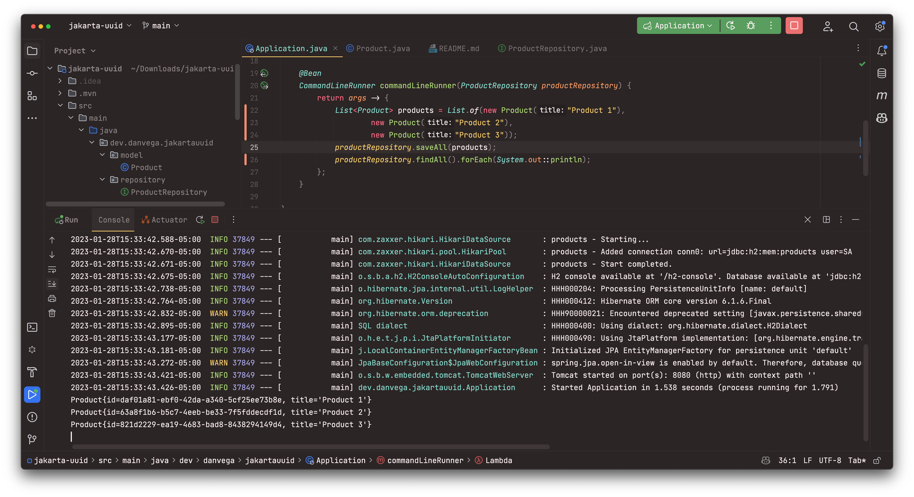

In this blog post, we will take a trip down memory lane and discuss the evolution of Jakarta EE (formerly known as Java EE) and its impact on enterprise development in Java. We will explore the role of the Eclipse Foundation in furthering the development of Jakarta EE and how it has led to the introduction of new APIs, fixes, and features. This article will also delve into one specific change in Jakarta EE 10, the ability to use a UUID as a primary key, and how it can be easily implemented in a Spring Boot 3 project using Spring Data JPA.

## What is Jakarta EE

Jakarta EE is an open-source platform for developing enterprise-level applications in Java, maintained and managed by the Eclipse Foundation. It provides secure, scalable, and extensible tools for creating, deploying, and managing applications. Formerly known as Java EE (Enterprise Edition), it has been available since 1999. In recent years, Jakarta EE has been updated with new APIs, bug fixes, and features, giving developers more options for creating enterprise applications.

The real question is: why are we discussing this now, and why should Spring developers care? This is because Spring Framework 6 now has a baseline on Jakarta EE 9 and 10. The two versions are necessary because we will use 10 wherever possible, and fall back to 9 when we can't. Jakarta EE 9 was the version where all the namespace changes from `javax.*` to `jakarta.*` were made, without any changes to the APIs. In Jakarta EE 10, we start to see the evolution of the APIs, which includes new features.

Now that you have some background on Jakarta EE and why we are discussing it in the context of a Spring Application, it's time to write some code. Create a new Spring Boot project and use one of the new features from Jakarta EE 10.

## Create a new Spring Boot Project

To create a new project, go to [start.spring.io](http://start.spring.io/), select Maven as the project type, Java as the language, and the latest stable version of Spring Boot. Then, fill in your project metadata and select the Web, Spring Data JPA, and H2 dependencies.

Once you have entered the details, you can download the project as a zip file and unzip it. Then, you can import the project into your preferred Integrated Development Environment (IDE) and begin development.


### Spring Data JPA Entity

With our project created, it's time to write some code. Let's start by creating a new class called `Product`. When creating an Entity class in Spring Data JPA you need to mark it with the `@Entity` annotation. Next, you need to create a new field called `id` and annotate it with `@Id`. Nothing you have done so far is new, but here is where things get interesting.

You could always annotate the ID field with `@GeneratedValue` . This annotation defines the primary key generation strategy that the persistence provider must use to generate the primary key. Jakarta EE 10 now adds the `GenerationType` for a UUID, so that you can use Universally Unique Identifiers (UUIDs) as the primary key.

```java
@Entity
public class Product {

    @Id
    @GeneratedValue(strategy = GenerationType.UUID)
    private UUID id;
    private String title;

    public Product() {
    }

    public Product(String title) {
        this.title = title;
    }

    // getters and setters
}
```

As I mentioned in the video I don’t want to get into the pros/cons of using a UUID as the primary key. There were a lot of really good comments in the Twitter thread I linked to above so if you’re interested in that please take a chance to read through that.

### Spring Data Repository

Now that you have an Entity in place you need to create a Repository. The Spring Data `ListCrudRepository` is an interface that extends the Spring Data Repository interface and adds support for the CRUD (Create, Read, Update and Delete) operations on a list of objects. It provides basic methods for saving and retrieving data from a list of objects, and also includes methods for pagination, sorting and querying. This makes it an ideal choice for applications that require the ability to perform basic CRUD operations on a list of objects.

```java
public interface ProductRepository extends ListCrudRepository<Product, UUID> {

}
```

### Command Line Runner

Now that you have a repository in place you can create some new products and persist them to the database. A `CommandLineRunner` is a Spring Boot interface that is used to execute code when the application starts up. It is useful for performing any setup tasks that need to be done before the application can be used. It can also be used to run simple tasks that need to be executed at startup, such as setting up a database or loading data from an external source. It provides an easy way to execute code when the application starts, making it a useful tool for developers.

In the following example you will create 3 new products, save them to the database and then print out all of the records in the db so that you can view the generated IDs.

```java
@SpringBootApplication
public class Application {

	public static void main(String[] args) {
		SpringApplication.run(Application.class, args);
	}

	@Bean
	CommandLineRunner commandLineRunner(ProductRepository productRepository) {
		return args -> {
			List<Product> products = List.of(new Product("Product 1"),
					new Product("Product 2"),
					new Product("Product 3"));
			productRepository.saveAll(products);

			productRepository.findAll().stream().forEach(System.out::println);
		};
	}

}
```

If you run the application you should see the following output:

```bash
Product{id=fe63db2b-a76e-47aa-a1cb-e613b0b987e8, title='Product 1'}
Product{id=2236597b-1366-4cad-9a05-77ebb283acd3, title='Product 2'}
Product{id=c9f0596a-cfbc-48a7-8202-1ddd058120c0, title='Product 3'}
```



## Conclusion

The transition to Jakarta EE 9/10 was not easy, but it was necessary for the Spring Framework. Going forward, the Spring Framework and its associated libraries can benefit from the evolution of the Jakarta EE APIs.

