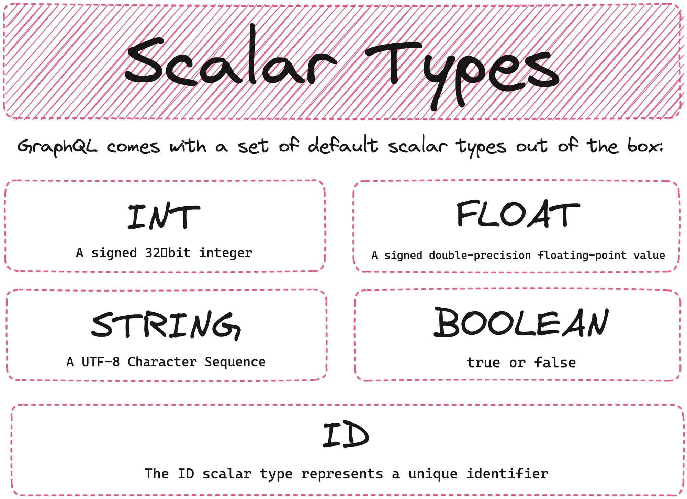
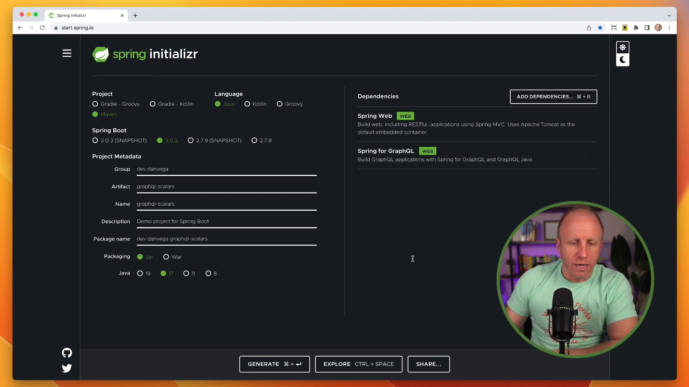

Whether you're new to GraphQL or a seasoned user, understanding the scalar types in GraphQL is important. Within the GraphQL specification, there are five defined scalar types: **int**, **float**, **string**, **boolean**, and **ID**. These will work for many components of your schema definition. But what happens when you need a custom scalar? Unfortunately, you'll inevitably need to create a custom scalar at some point.



That's what we'll be doing today. We're going to create a new Spring Boot 3 project that includes Spring for GraphQL. We'll be defining our schema and integrating built-in scalars. Then, we'll discuss how to bring in custom scalars when needed.

So, let's dive into some code.

## Setting Up a New Project with GraphQL

For those of you who have built a Spring Boot application, you'll be familiar with the process of how we set up a new project.

We'll start by heading to start.spring.io, where we'll input our project details. I'm going to use Maven for the project type, with Java as the language. As for dependencies, we're going to include **Spring Web** and **Spring for GraphQL**.



Once our metadata is filled in, we can hit Generate, which will download a zip file. Open this in your preferred IDE - I typically use IntelliJ Ultimate.

## Create a Model

Now that our application is set up and ready to go, the first thing we're going to do is create a new model named Product. We'll give it the properties **id** and **title**, with **id** being an integer and **title** a string.

```java
@Entity
public class Product {

    @Id
    @GeneratedValue
    private Integer id;
    private String title;

    // constructors, getters, setters and toSring

}
```

Next, we'll create a repository package to be able to fetch or persist data from the database.

```java
public interface ProductRepository extends ListCrudRepository<Product, Integer> {

}
```

In order to actually pull this data, we'll create a Command Line Runner which will include a few new products that we can later test.

```java
@SpringBootApplication
public class Application {

	public static void main(String[] args) {
		SpringApplication.run(Application.class, args);
	}

	@Bean
	CommandLineRunner commandLineRunner(ProductRepository repository) {
		return args -> {
			List<Product> products = List.of(
        new Product("Product 1",true,1.99F,new BigDecimal(9.99),LocalDateTime.now()),
        new Product("Product 2",false, 3.99F,new BigDecimal(9.99),LocalDateTime.now()),
        new Product("Product 3", true, 19.99F,new BigDecimal(9.99),LocalDateTime.now())
      );
			repository.saveAll(products);
			repository.findAll().forEach(System.out::println);
		};
	}

}
```

## Defining our Schema

After successfully creating our products and ensuring they're in the database, let's move onto defining our GraphQL schema.

In `/src/main/resources/graphql` directory, we will create a new file named **`**schema.graphqls`. Here we will start with our object type, **Product**. With ID and Title being our two types, we will declare **id** as an **ID** and **title** as a **String**.

Next, we define our 'Query' type. We want a way to get all of our products and this will return a collection of products.

```graphql
type Product {
    id: ID!
    title: String
}

type Query {
    allProducts: [Product]!
}
```

## Controller Creation and Testing

Now it's time to create our product controller, along with a 'Find All' method, which will pull all of our products from the database. Finally, we link our GraphQL 'allProducts' query to our repository's 'findAll' method.

```java
@Controller
public class ProductController {

    private final ProductRepository repository;

    public ProductController(ProductRepository repository) {
        this.repository = repository;
    }

    @QueryMapping
    public List<Product> allProducts() {
        return repository.findAll();
    }
}
```

Once we restart our application, we can navigate to localhost:8080/graphiql and test whether our query returns the products we stored earlier.

## Dealing with Four Built-in Scalars

With our application working so far, let's move on to implementing some more built-in scalars - the boolean and float types. For our Product model, we'll add two new properties: **onSale** (a boolean) and **weight** (a float). Remember to update your schema definition to include these new fields.

```java
@Entity
public class Product {

    @Id
    @GeneratedValue
    private Integer id;
    private String title;
    private Boolean isOnSale;
    private Float weight;

    // constructors, getters, setters and toSring

}
```

Now, if we rerun our application and add 'onSale' and 'weight' to our query, we should successfully receive back the details we stored for them.

So, what do we do when we need some custom scalars? Let's investigate how to handle this.

## Implementing Custom Scalars

Let's add a **price** to our Product model, as a **BigDecimal**, and a **dateCreated** as a **LocalDateTime**.

```java
@Entity
public class Product {

    @Id
    @GeneratedValue
    private Integer id;
    private String title;
    private Boolean isOnSale;
    private Float weight;
    private BigDecimal price;
    private LocalDateTime dateCreated;
```

Unfortunately, these two properties aren't covered by our built-in scalars, so we are going to need to use custom scalars.

The first place to look for help with this is the GraphQL Java documentation. Herein, we also find details of the *Extended Scalars* - which includes special types like BigDecimal and BigInteger - but this requires a separate library, the *GraphQL Java Extended Scalars Library*.

```xml
<dependency>
  <groupId>com.graphql-java</groupId>
  <artifactId>graphql-java-extended-scalars</artifactId>
  <version>20.0</version>
</dependency>
```

To use it, we need to add the library to our Maven dependencies and create a new config bean for the extended scalars. This allows us to declare the scalar in the GraphQL schema definition.

```java
@Configuration
public class GraphQlConfig {

    @Bean
    public RuntimeWiringConfigurer runtimeWiringConfigurer() {
        return wiringBuilder -> wiringBuilder
                .scalar(ExtendedScalars.GraphQLBigDecimal);

    }

}
```

```graphql
scalar BigDecimal
scalar LocalDateTime

type Product {
    id: ID!
    title: String
    isOnSale: Boolean
    weight: Float
    price: BigDecimal
    dateCreated: LocalDateTime
}

type Query {
    allProducts: [Product]!
}
```

The LocalDateTime type isn't covered in the Extended Scalars but another project – *GraphQL Java DateTime* - can take care of this one. Include this new dependency and update your `schema.graphqls`.

Having made these changes, let's rerun our application one last time and see if we are successful.

## Conclusion

As we can see, we have now successfully used all of the five built-in scalar types, and even created some custom scalars for our application.

Remember though, before you go all out creating your own custom scalar, always check if there's an existing scalar that could do the job for you.

GraphQL is great. It makes building APIs easy and manageable, and I love using it with Spring. I hope you found this tutorial helpful, and remember, happy coding!
