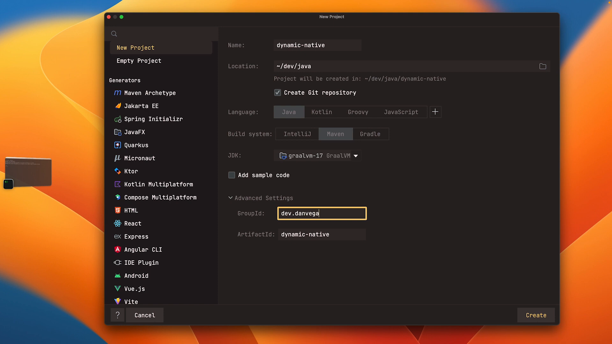
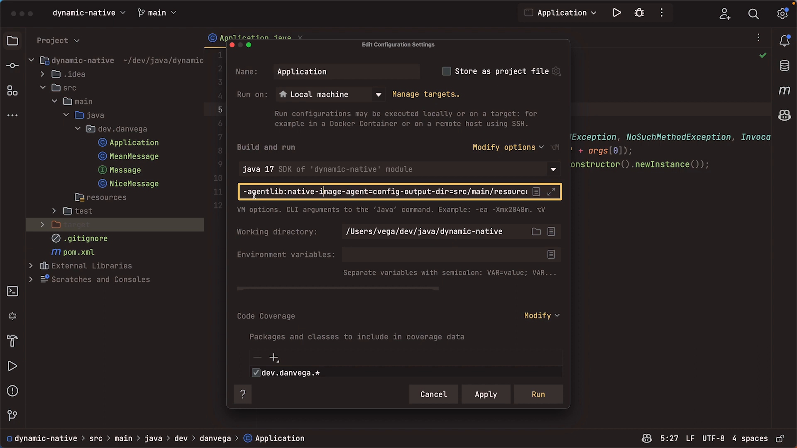

When building native executables with GraalVM, you might run into issues when your application uses dynamic language features of the JVM. This article will walk you through a practical example of how to work with these types of features and provide metadata to GraalVM's Native Image Builder.

## The Problem

When you build a native executable without any dynamic language features, everything works as expected. However, when you introduce dynamic features like reflection, you need to instruct GraalVM where the different dynamic features in your application are.

## GraalVM Reachability Metadata

GraalVM provides a way to include metadata about the dynamic features of your JVM application. You can supply metadata to the Native Image Builder by providing JSON files stored in the `META-INF/native-image` directory. This article will demonstrate this approach using a sample Java project.

## Creating a Java Project with Dynamic Features

First, create a new Java project with Maven and the GraalVM Native Maven plugin. In this example, the project will use Java, Maven, and the [GraalVM JDK 17.22.3](https://www.graalvm.org/). Create a simple "Hello World" application with no dynamic features to start.



Next, introduce dynamic capabilities in the form of a `Message` interface, with two implementations: `NiceMessage` and `MeanMessage`. The `Message` interface will have a single method called `printMessage()`. The `NiceMessage` and `MeanMessage` classes will each implement the `Message` interface with their versions of the `printMessage()` method.

```java
public interface Message {

    void printMessage();

}
```

```java
public class NiceMessage implements Message {

    @Override
    public void printMessage() {
        System.out.println("This is a nice message!");
    }

}
```

```java
public class MeanMessage implements Message {

    @Override
    public void printMessage() {
        System.out.println("This is a mean message!");
    }

}
```

The main class of the application will dynamically invoke either the `NiceMessage` or `MeanMessage` implementation based on a program argument. To accomplish this, the main class will use reflection to dynamically load and call the target implementation's `printMessage()` method.

```java
public class Application {

    public static void main(String[] args) throws ClassNotFoundException, NoSuchMethodException,
    InvocationTargetException, InstantiationException, IllegalAccessException {
        Class<?> clazz = Class.forName("dev.danvega." + args[0]);
        clazz.getMethod("printMessage").invoke(clazz.getConstructor().newInstance());
    }

}
```

When you run the application with your desired argument (e.g., `NiceMessage`), it will work correctly. However, when you attempt to build a native image with GraalVM, it will fail at runtime with a `ClassNotFoundException`. This is because GraalVM does not include the dynamic classes in the final binary since it cannot discover them through static analysis.

## Using a Tracing Agent

To resolve this issue, you can use a tracing agent to supply metadata about the dynamic features in your application. The tracing agent is a JVM command-line option that you can use when running your application. It generates JSON configuration files in the `META-INF/native-image` directory to inform GraalVM's Native Image Builder about the dynamically reachable classes and methods.

For example, in IntelliJ IDEA, go to the "Edit Configurations" menu and add the following VM option:

```shell
-agentlib:native-image-agent=config-output-dir=src/main/resources/META-INF/native-image
```



Now, when you run your application with the tracing agent enabled, GraalVM will generate the required configuration files, such as `reflect-config.json`, in the specified output directory (`src/main/resources/META-INF/native-image`). These files tell GraalVM about the dynamically reachable classes and methods, such as the `NiceMessage` and `MeanMessage` implementations.

However, as you might have noticed, the generated configuration files only include information about the `NiceMessage` class since that was the only class dynamically invoked during application runtime with the tracing agent enabled. To add the `MeanMessage` class, you can either run the application again with the `MeanMessage` argument and the tracing agent enabled, or you can manually edit the `reflect-config.json` file and add a new entry for the `MeanMessage` class, like this:

```json
{
  "name": "dev.danvega.MeanMessage",
  "methods": [
    {
      "name": "printMessage",
      "parameterTypes": []
    }
  ]
}
```

After updating the configuration files, rebuild the native image with GraalVM. This time, you'll be able to successfully run the native image with both `NiceMessage` and `MeanMessage` arguments.

## Conclusion

In this article, we created a Java project with dynamic features and learned how to provide metadata to GraalVM's Native Image Builder using JSON configuration files generated by a tracing agent. This approach helps GraalVM understand the dynamic features of your JVM application and build native images accordingly. By following these steps, you can ensure that your dynamic JVM applications can be successfully compiled to native executables using GraalVM.

