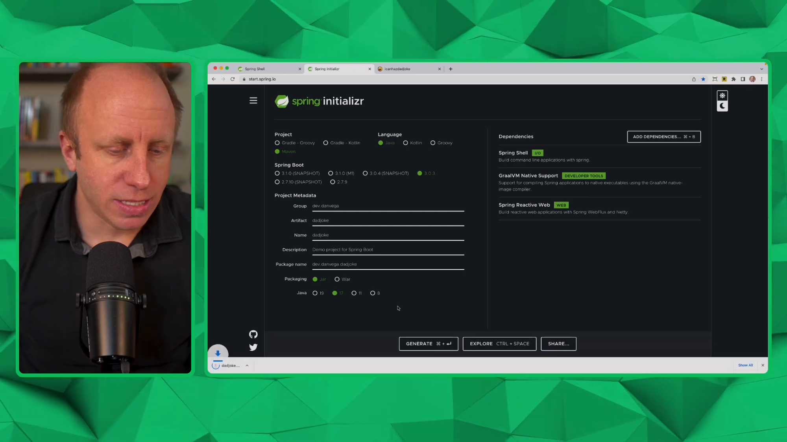

Today, we're going to talk about building command line applications using [Spring Shell](https://spring.io/projects/spring-shell). Spring Shell allows you to use the programming model, tools, frameworks, and languages that you're used to using every day to build command line applications. We're going to build a command line application called "Dad Joke" that fetches a random dad joke from a public API.

## Setup

1. Head over to [https://start.spring.io](https://start.spring.io/) to create a new Spring Boot project.
2. Choose the "Java" project type and "Maven" as the build tool.
3. Use the latest stable release of Spring Boot (3.0.3 at the time of this recording).
4. Set the artifact name to "DadJoke" and use the following dependencies:
   - Spring Shell
   - GraalVM Native support (more on this later)
   - Spring WebFlux (Reactive Web)
5. Generate and download the .zip file, then open it up in your favorite IDE.



## Creating a Hello Command

When building command line applications with Spring Shell, we write functionality in classes called "commands". Let's create a basic "Hello Command":

1. Create a new package called `commands`.
2. Create a new class `HelloCommand` in the `commands` package with the following annotations and methods:

```java
import org.springframework.shell.standard.ShellComponent;
import org.springframework.shell.standard.ShellMethod;

@ShellComponent
public class HelloCommand {
    @ShellMethod(key = "hello", value = "Say hello")
    public String hello() {
        return "Hello, world!";
    }

    @ShellMethod(key = "goodbye", value = "Say goodbye")
    public String goodbye() {
        return "Goodbye!";
    }
}
```

The `@ShellComponent` annotation indicates that this class contains shell methods (annotated with `@ShellMethod`). The `@ShellMethod` annotation specifies the command name and the description. The `key` argument is the command you will use to execute the method and the `value` is the description that will appear in the help documentation.

## Running the Application

When you run the Spring Boot application, it will launch the Spring Shell and you can type the command names and execute the `hello()` and `goodbye()` methods directly from the command line.

```bash
$ hello
Hello, world!
$ goodbye
Goodbye!
```

### Customizing Shell Methods with ShellOption

You can use the `@ShellOption` annotation to customize the handling of shell method parameters. For instance, you can add an optional `name` parameter to the `hello()` method:

```java
import org.springframework.shell.standard.ShellOption;

@ShellMethod(key = "hello", value = "Say hello")
public String hello(@ShellOption(value = "name", defaultValue = "world") String name) {
    return "Hello, " + name + "!";
}
```

Now, when you run the `hello` command with an argument, it will display a personalized greeting:

```bash
$ hello --name Dan
Hello, Dan!
```

## Fetching a Random Dad Joke

Let's build the main functionality of our command line application: fetching a random dad joke from the [icanhazdadjoke.com](https://icanhazdadjoke.com/api) public API.

Create a new package `model` and a new record class `DadJokeResponse`:

```java
public record DadJokeResponse(String id, String joke, int status) {

}
```

Create a new package `client` and a new interface `DadJokeClient`:

```java
package dev.danvega.dadjoke.client;

import dev.danvega.dadjoke.model.DadJokeResponse;
import org.springframework.web.service.annotation.GetExchange;

public interface DadJokeClient {

    @GetExchange("/")
    DadJokeResponse random();
}
```

Update the `DadJokeCommands` class to fetch a random dad joke and output it to the command line:

```java
import org.springframework.shell.standard.ShellMethod;
import org.springframework.shell.standard.ShellComponent;
import org.springframework.beans.factory.annotation.Autowired;

@ShellComponent
public class DadJokeCommands {

    private final DadJokeClient dadJokeClient;

    @Autowired
    public DadJokeCommands(DadJokeClient dadJokeClient) {
        this.dadJokeClient = dadJokeClient;
    }

    @ShellMethod(key = "random", value = "Get a random dad joke")
    public String getRandomDadJoke() {
        DadJokeResponse response = dadJokeClient.random();
        return response.joke();
    }
}
```

Ask Spring to turn that interface into an implementation at runtime by using the `HttpServiceProxyFactory`

```java
@SpringBootApplication
public class Application {

	public static void main(String[] args) {
		SpringApplication.run(Application.class, args);
	}

	@Bean
	DadJokeClient dadJokeClient() {
		WebClient client = WebClient.builder()
				.baseUrl("https://icanhazdadjoke.com")
				.defaultHeader("Accept","application/json")
				.build();

		HttpServiceProxyFactory factory = HttpServiceProxyFactory
            .builder(WebClientAdapter.forClient(client))
            .build();
		return factory.createClient(DadJokeClient.class);
	}
}
```

Run the Spring Boot application and test the `random` command:

```bash
$ random
Why don't scientists trust atoms? Because they make up everything.
```

## Building a Native Application

To make our command line application fast and portable, let's build a native application using GraalVM. Configure `Logback` and `Spring Boot` properties in `application.properties` to remove unnecessary logging and disable the Spring Boot banner:

```properties
logging.level.root=off
spring.main.banner-mode=off
```

Build the native application using Maven:

```bash
$ ./mvnw -Pnative -DskipTests=true clean package
```

The native application will be generated in the `target` directory.

## Using the Native Application

Create an alias for the native application in your shell configuration file (e.g., `.bashrc` or `.zshrc`):

```bash
alias dadjoke="path/to/your/target/DadJoke"
```

1. Run the native application by typing `dadjoke` in your command line:

```bash
$ dadjoke
Dad Joke> random
Why don't some couples go to the gym? Because some relationships don't work out.
```

Now you can enjoy random dad jokes anytime you want right from your command line!

## Conclusion

In this tutorial, we built a command line application using Spring Shell that fetches random dad jokes from a public API. We demonstrated how to create shell commands, fetch data from an API, and build a native application using GraalVM for fast startup times.

As you can see, Spring Shell is a powerful tool that allows you to build command line applications using the familiar Spring Boot environment. Give it a try for your next CLI project!

