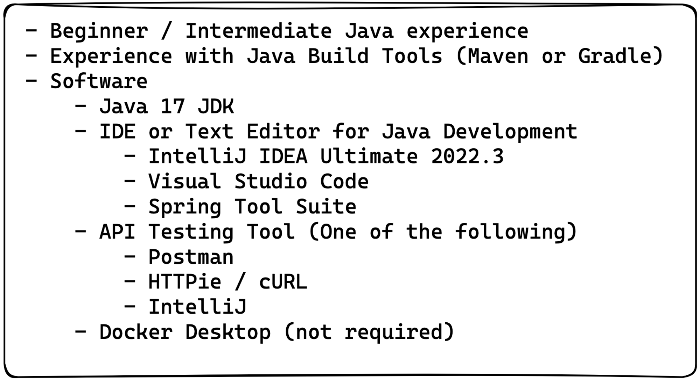
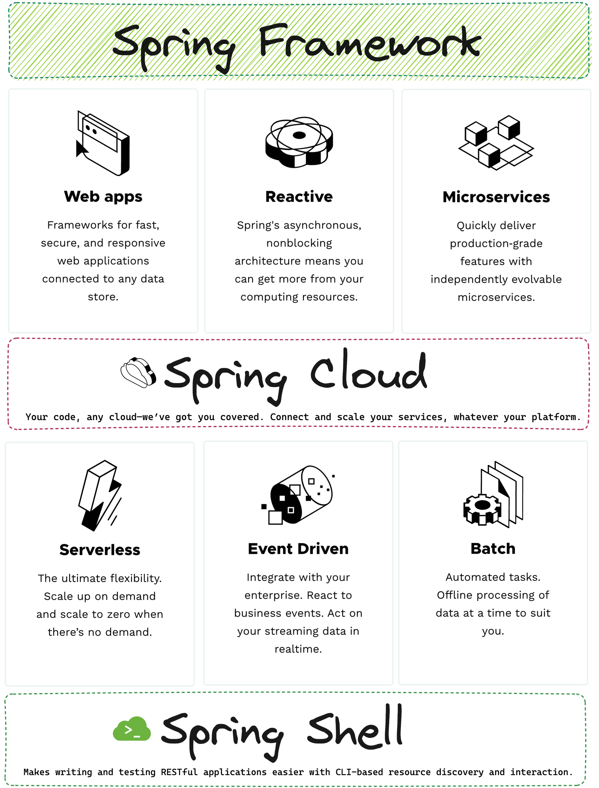
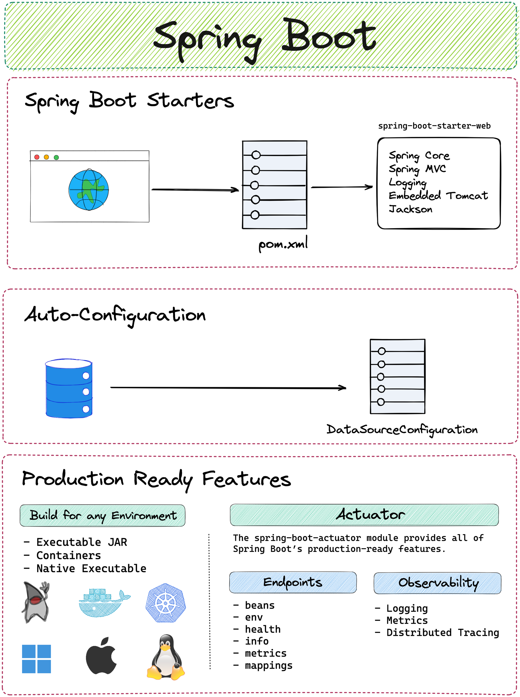
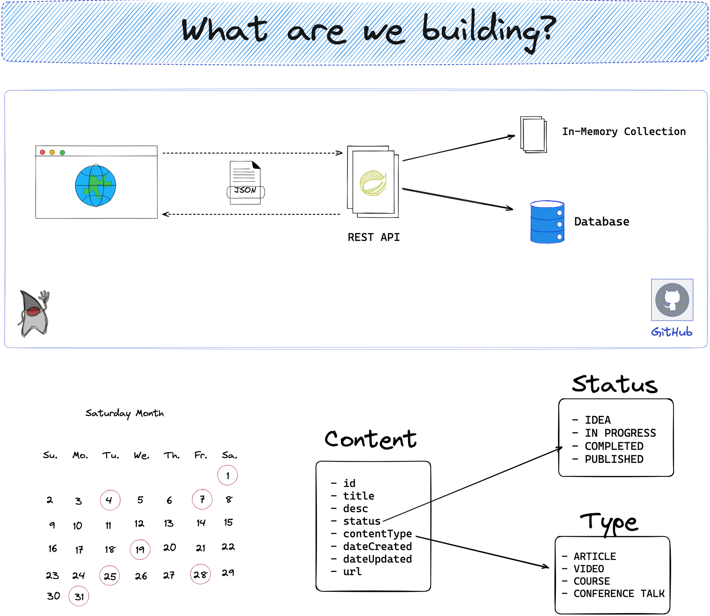
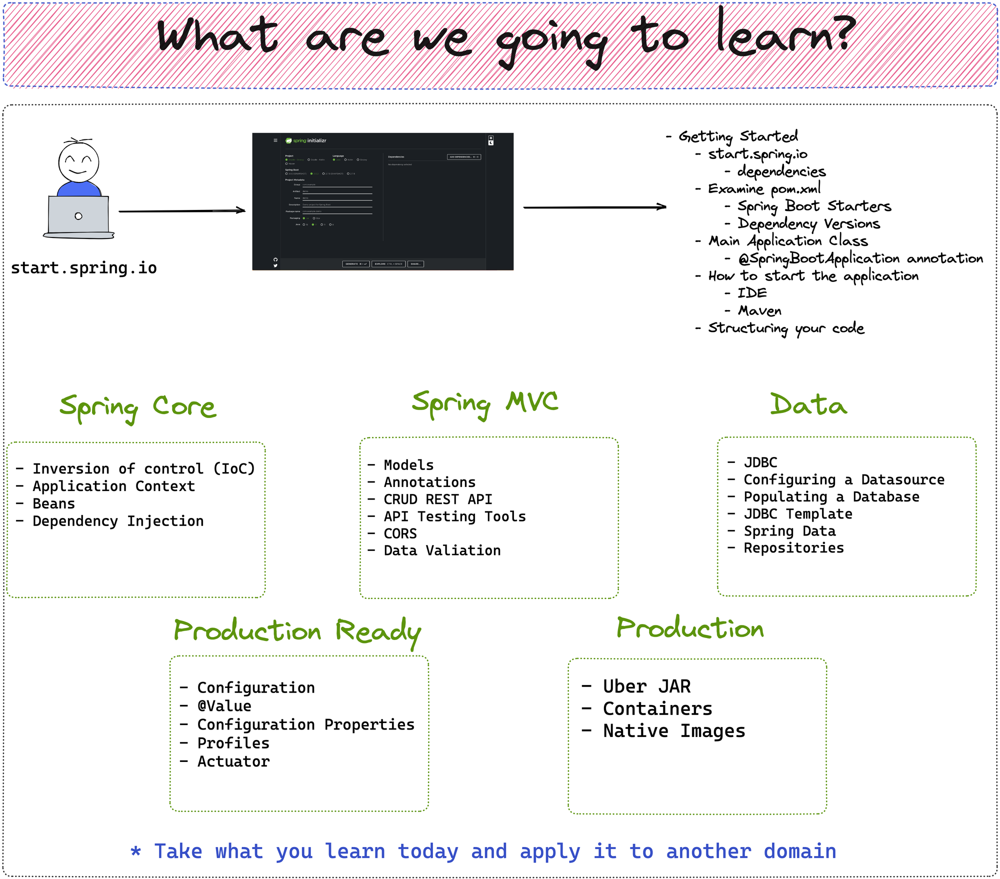

## Where do I start?

I often receive the question, "I want to learn Spring. Where do I start?" This is usually asked by someone with Java experience who wants to learn Spring for either their current job or a job they are seeking. Another question I frequently hear is whether someone needs to learn Spring before learning Spring Boot. This article aims to answer these questions.

I decided to sit down and put together an outline for a course that would help anyone interested in learning Spring get up and running quickly. The first goal of this course is that it is accessible to anyone who wanted to learn Spring and with that I decided to make it available for free on my YouTube channel. Before we take a look at what you need to learn let’s talk about what you should know first.

Next, I wanted to ensure that the course was the appropriate length, being long enough to cover the material, but still something they can complete over a weekend. As a Udemy course instructor, I have access to statistics on students who start long courses versus those who finish them, and the numbers are rather alarming.


## Prerequisites

To get started with Spring, you should have some experience with the Java Programming Language. Although it is possible to build applications with Kotlin or Groovy, most developers find it helpful to learn Java first and then pick up other JVM languages later.

If you want to follow the course that I have created, you will need a basic understanding of Java. If you are new to Java, you can check out my [free course](https://www.danvega.dev/courses) on Getting Started with Java.

For the latest version of Spring, we have set Java 17 as the baseline. Therefore, before proceeding, make sure that you have Java 17 installed on your system. You will need an IDE or text editor that supports Java development. I am a big fan of [IntelliJ IDEA](https://www.jetbrains.com/idea/) Ultimate which is what I use in this course but feel free to use whatever IDE or text editor you’re most productive in.



Once you feel comfortable that you are the ideal student for this course and have everything installed we can start by covering the basics.

## Spring Framework vs Spring Boot

If you are new to Spring and have started researching, you have probably encountered the terms Spring Framework and Spring Boot. Do you need to learn both? Which one should you learn first? These are probably some of the questions running through your head, and I hope to help you answer them.

### Spring Framework

[Spring Framework](https://spring.io/projects/spring-framework) is the foundation which all Spring applications are built upon. The great thing and probably what can be confusing for anyone new to the Spring Framework is that it can be used to build a wide range of applications.

Traditionally, Spring has been used for building web applications using Spring MVC, which enables the creation of fast, responsive applications that can connect to any data store. However, Spring introduced Spring Webflux to allow for asynchronous, non-blocking architecture, which can improve the performance and scalability of certain applications.

You can use Spring to break down monolithic architectures into smaller, independently deployable microservices. Building distributed architectures present a set of problems that need to be solved, but don't worry, [Spring Cloud](https://spring.io/projects/spring-cloud) has you covered.

Spring can be used to build serverless workloads that provide ultimate flexibility by scaling on demand, as well as scaling to zero when there is no demand. You can use [Spring Batch](https://spring.io/projects/spring-batch) to build automated tasks for processing large sets of data. Finally, one of my new favorite ways to use Spring is to build command-line applications with [Spring Shell](https://spring.io/projects/spring-shell).



As you can see, Spring can be used to provide solutions for a variety of application needs. That's why when people ask me how to get started with Spring, I usually ask them what they want to use it for. By understanding the type of applications they're trying to build, they can narrow down their learning path to something much more manageable.

### Spring Boot

Now that you have a good understanding of what the Spring Framework is, let's discuss where Spring Boot fits into the picture. Surprisingly, you don't actually need Spring Boot to build Spring applications. However, as you'll learn here, you would never want to build one without it.

Spring Boot provides a lot of features out of the box for building Spring applications but I want to focus on 3 of them in this article:

- Spring Boot Starters
- AutoConfiguration
- Production Ready



**Spring Boot Starters**

As I mentioned earlier, you don't necessarily need to use Spring Boot to create a Spring application. In fact, I [created a tutorial](https://youtu.be/e8aSyQo0nHo) on how to do this, which outlines the process. While the example I provided is relatively simple, the process can become more complicated depending on the type of application you want to build. Nonetheless, I hope this tutorial helps you get started.

Spring Boot starters are dependency descriptors that simplify the process of including libraries in your project. They provide a quick and easy way to add common functionality to your application, without the need to manually configure each library. Spring Boot starters are available for a wide range of applications, including web, data, testing, and security.

For example, suppose you want to build a web application. First, you should determine which libraries you need to meet your requirements. For a typical web application, you need Spring Core, along with an embedded servlet container like Tomcat, Spring MVC, and a library like Jackson for serializing and deserializing objects to and from JSON.

Once you have identified the dependencies of your application, you need to determine their respective versions and whether they are compatible with each other. This task becomes increasingly difficult as the complexity of your application grows.

When creating a new project at [start.spring.io](http://start.spring.io/), one of the options is to select your dependencies. If you choose Spring Web, you are indicating that you want to build a traditional Spring MVC application. By doing so, you will receive a single Spring Boot Starter called `spring-boot-starter-web`, which includes all of the necessary dependencies with the correct versions.

```xml
<dependency>
	<groupId>org.springframework.boot</groupId>
	<artifactId>spring-boot-starter-web</artifactId>
</dependency>
```

**Auto-Configuration**

The next important feature of Spring Boot we need to discuss is auto-configuration. Spring Boot auto-configuration attempts to configure your application based on the dependencies that you have added.

If you create a Spring Web application, an embedded version of Tomcat is included. In a typical Java application, you would need to set up and configure Tomcat yourself. However, since Tomcat is on the classpath, Spring automatically configures it and provides sensible defaults such as setting the default port to 8080. You can always change the port through your own configuration, but Spring sets this default to get you up and running quickly.

Here's another example of how to include a database like `H2` in your project. In a typical Java application, you would need to set up and configure a data source, which can be a tedious process that slows down your development. With Spring, however, you can easily configure a data source without any extra hassle. If needed, you can always modify the configuration to fit your specific requirements.

Auto-configuration is a feature of Spring Boot that allows developers to configure their applications without writing any boilerplate code. Spring Boot combines a set of sensible default configurations, based on what dependencies you have added to your project, to help you get up and running quickly. This means that you can focus on writing business logic rather than worrying about configuration details.

**Production Ready Features**


Enabling developers to build the next generation of applications is not enough if you cannot get them into production. Spring provides a range of features that can assist you in building your applications for any environment and comprehending how they are performing in that environment.

The first step in moving to production is to build an artifact suitable for the environment you are moving to. The Spring Boot Maven and Gradle plugins allow you to build an executable JAR that can be run in any environment that supports Java. For environments that don't support Java, you can use Cloud Native Buildpacks to create an optimized Docker-compatible container image. Finally, for certain workloads, it might make sense to create a native executable.

Once you move your application to production you need to ensure that it is working as expected. You can use the Spring Actuator to gain observability into your application, allowing you to monitor and troubleshoot issues as they arise. Spring Boot provides a range of features to help you build and deploy your applications for any environment, whether it be on-premise or in the cloud.

### Which one do I learn first?

Now that we know the difference between Spring Framework and Spring Boot, we can answer the question of which one to learn first. When building your first Spring application, you will use Spring Boot. However, in the process of building it, you will inherently learn Spring Framework.

The Spring Framework is based on the concepts of Inversion of Control (IoC) and Dependency Injection (DI). In this crash course, you will learn about these concepts and come to understand terms like Application Context, Containers, and beans. Once you have a basic understanding of these concepts and have built something with them, you can dive deeper into the [Spring Reference documentation](https://docs.spring.io/spring-framework/docs/current/reference/html/core.html#spring-core).

## Spring Boot Crash Course

By now, I hope you have a good understanding of Spring. I believe that theory can only take you so far, and it's time to get your hands dirty. As a proponent of hands-on learning, I encourage you to build something real and tangible when learning something new.

### What are we building

This is a REST API application that will communicate with a database. To focus our application, we decided to build out a content calendar since the content has many different properties and we could include a couple of Enums.

When a client calls the REST API, it initially talks to an in-memory collection of data. Once the application is fully functional, we will move the in-memory collection to a database. You will learn about connecting to, reading, and persisting data in Java and Spring.

Ultimately, it is important to get our applications into production. Therefore, I will guide you through deploying your application and database into production using a free hosting service.



### What are we going to learn?

To start, you will build a new application from scratch using [start.spring.io](http://start.spring.io/). Along the way, you will learn many core concepts in Spring, such as Bean and Dependency Injection. You will also learn how to build a REST API using Spring MVC, connect and configure a database in Spring, and use Spring Data Repositories to remove boilerplate code and focus on application requirements. Finally, you will prepare your application for production, build and deploy it.



### Spring Boot Crash Course Video

If you didn't receive the link to the video at the beginning of the article, you can find the course here. The video is almost 4 hours long, but there are chapters listed in the YouTube description if you need to jump around. I hope you enjoy it and would love to hear your feedback.

`youtube:https://youtu.be/UgX5lgv4uVM`

### Github Repository

You can find all of the code for the Spring Boot Crash Course at the GitHub Repository listed below.

[https://github.com/danvega/content-calendar](https://github.com/danvega/content-calendar)

## Resources

This is a list of resources I recommend when learning Spring.

### Documentation

- [Spring Framework Reference](https://docs.spring.io/spring-framework/docs/current/reference/html/)
- [Spring Framework API](https://docs.spring.io/spring-framework/docs/current/javadoc-api/)
- [Spring Boot Reference](https://docs.spring.io/spring-boot/docs/current/reference/html/index.html)
- [Spring Boot API](https://docs.spring.io/spring-boot/docs/current/api/)
- [Spring Boot Guides](https://spring.io/guides)
- [Tanzu Developer Center Guides](https://tanzu.vmware.com/developer/guides/)

### Books

- [Spring Boot Up and Running - Mark Heckler](https://amzn.to/3WOSutb)
- [Learning Spring Boot 3.0 - Greg Turnquist](https://amzn.to/3CuCgxc)
- [Spring Boot in Action - Craig Walls](https://amzn.to/3ZcI3kx)

### Podcasts

- [Bootiful Podcast](http://bootifulpodcast.fm/)
- [Spring Office Hours](https://www.springofficehours.io)

### YouTube

- [Spring Boot Learning](https://www.youtube.com/@SpringBootLearning)
- [Spring Tips](https://www.youtube.com/playlist?list=PLgGXSWYM2FpPw8rV0tZoMiJYSCiLhPnOc)
- [Spring Developer](https://www.youtube.com/@SpringSourceDev)
- [Amigoscode](https://www.youtube.com/@amigoscode)
- [Java Brains](https://www.youtube.com/c/JavaBrainsChannel)
- [DaShaun Carter](https://www.youtube.com/@dashaun)
- [Coffee and Software](https://www.youtube.com/@coffeesoftware)
- [Daily Code Buffer](https://www.youtube.com/@DailyCodeBuffer)
- [Marco Codes](https://www.youtube.com/@MarcoCodes)

## Conclusion

I had a lot of fun putting together this Spring Boot Crash Course. I hope it helps anyone interested in learning Spring, and that the video and this article help answer any questions you have about getting started. Please feel free to follow me on [Twitter](https://twitter.com/therealdanvega), Subscribe to my [YouTube channel](https://www.youtube.com/@danvega), or sign up for my free [newsletter](https://www.danvega.dev/newsletter/) to stay up to date with what I am working on.

