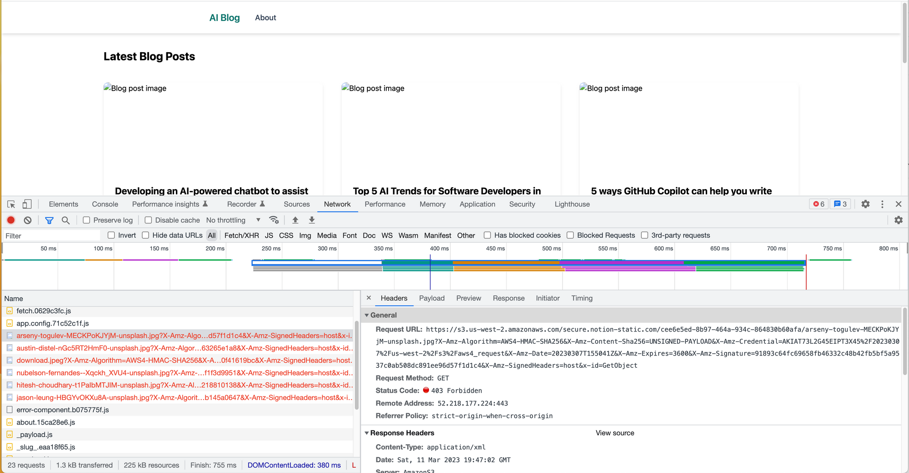

If you follow me, you know I'm a huge fan of Notion. I use it for everything in my personal and professional life. Since the release of the [Notion API](https://developers.notion.com/), I've been playing with it, but I've never built anything that I was going to launch publicly.

That's all about to change as I work on launching my wife's new blog, [This is my Momoir](https://www.thisismymomoir.com/). To prepare for that, I put together a simple blog called AI Blog. This is a blog that I'm writing in Notion, using Notion AI to generate blog posts.

I figured this would be a great playground for me to work out any issues I might come across before I work on launching her site. I'm building the website in Vue using Nuxt 3. There are a bunch of things I want to blog about or create YouTube videos on, but I wanted to start with this one.

After finishing the AI Blog, I wanted to deploy it on Netlify to see if there were any issues with publishing it out in the wild. I decided to statically generate the entire site because there will only be about 1-2 blog posts per week, making this a perfect scenario to prioritize performance over real-time updates.

When I first deployed the [site](https://ai-notion-blog.netlify.app/) everything looked as I expected it to:


When I returned to the blog the following day, I noticed that all of the images were missing. This was puzzling, so I decided to investigate further. Using the Chrome Dev Tools, I quickly discovered that I was receiving a 403 Forbidden error on each of the images. What was particularly strange was that some of the blog posts had images that were displaying properly.



I decided to redeploy the website and sure enough, everything was working again. I came back a couple of hours later and the images were missing again.

## Notion Page Property File & Media Type

I decided to investigate the cause of this issue. It turns out that the cover images are a property of the page in Notion. If you take a look at the screenshot below, you can see that the page has various properties such as status, date created, and Image. The "Image" property is a file type, which I use to select the thumbnail image for this post.


When you retrieve the details for a page and request a specific property, you will receive some data that looks like this. Is there anything that stands out to you?

```json
"Image": {
    "id": "%5EmJf",
    "type": "files",
    "files": [
        {
            "name": "arseny-togulev-MECKPoKJYjM-unsplash.jpg",
            "type": "file",
            "file": {
                "url": "https://s3.us-west-2.amazonaws.com/secure.notion-static.com
                cee6e5ed-8b97-464a-934c-864830b60afa/arseny-togulev-MECKPoKJYjM-unsplash.jpg",
                "expiry_time": "2023-03-11T20:56:53.872Z"
            }
        }
    ]
},
```

That's right, each file and media type, including images returned by the [Notion API](https://developers.notion.com/reference/file-object), has an `expiry_time` field. This means that they will expire after 1 hour. If the cover image is going to expire after an hour and I'm statically generating the entire site, I only have one option, which is to download all of the cover images.

This raises some questions about build time performance when the site gets larger, but I can put that issue aside for now as I have bigger problems to deal with. To solve this, I wrote a function that will take the image URL and a destination to save it in. When working in Nuxt 3, you should save any public images to the `/public` directory. In this case, I am putting them into an `images` directory, but on a larger site, I could create a directory structure for each post.

```javascript
database.results.forEach(post => {
  // cover: post.properties.Image.files[0]?.file.url,
  const imgName = post.properties.Image.files[0]?.name;

  posts.push({
    id: post.id,
    title: post.properties.Name.title[0].plain_text,
    slug: post.properties.Slug.rich_text[0].plain_text,
    excerpt: post.properties.Excerpt.rich_text[0].plain_text,
    cover: post.properties.Image.files[0]?.name
  });
  // the cover image expires after 1 hour so we need to download it
  downloadImage(
    post.properties.Image.files[0]?.file.url,
    `./public/images/${imgName}`
  );
});

async function downloadImage(url, filepath) {
  fetch(url)
    .then(
      res =>
        new Promise((resolve, reject) => {
          const dest = fs.createWriteStream(filepath);
          res.body.pipe(dest);
          res.body.on("end", () =>
            resolve(filepath.split("/")[3] + " was downloaded successfully.")
          );
          dest.on("error", reject);
        })
    )
    .then(x => console.log(x));
}
```

Back on the home page where I display the image I can now just reference the local `/images` directory.

```html
<NuxtLink :to="`/blog/${post.slug}`">
  
</NuxtLink>
```

I tried writing the download image function using Nuxt’s `$fetch` but I didn’t have much luck. I decided to take my issues to Twitter and ask my friends there. I don’t have any answers yet but If I get one I will be sure to update this blog post.

[https://twitter.com/therealdanvega/status/1634977252931960832](https://twitter.com/therealdanvega/status/1634977252931960832)

## Conclusion

I’m having a lot of fun writing a blog that uses Notion as the CMS. It certainly hasn’t been easy but I am learning a lot and that always makes me happy. If you’re interested in the code for the AI Blog you can check it out [here](https://github.com/danvega/ai-blog).

