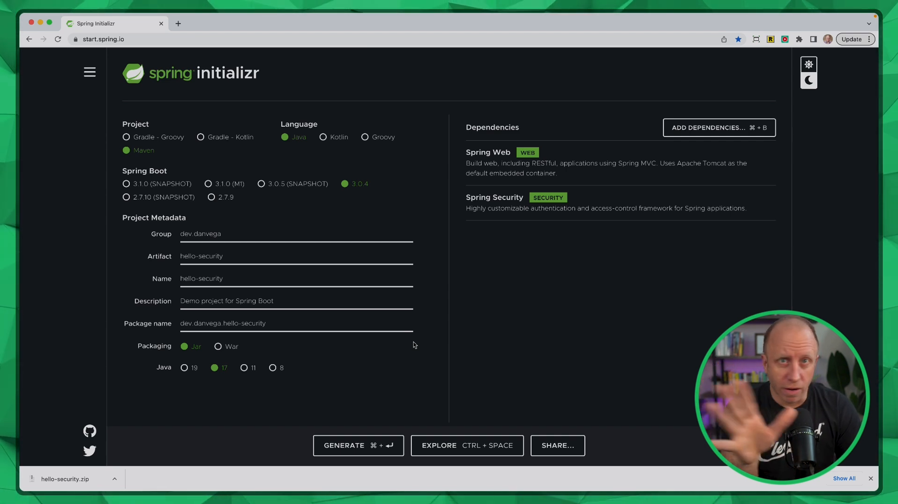
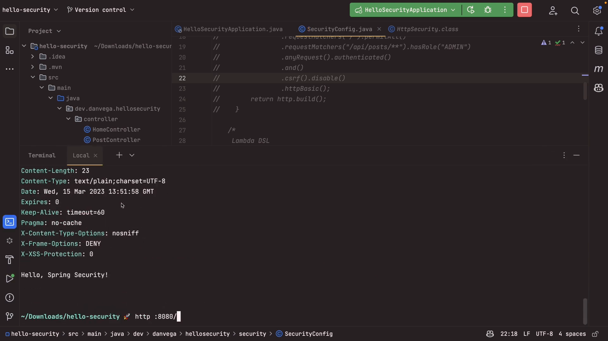

Hello, friends! Today, we'll discuss two different ways to configure Spring Security in your applications and create a basic security configuration in a Spring Boot project using each approach. I will walk you through each method, explaining the pros and cons of each, so that you can better understand the different configurations you might come across in your projects.

## Setting Up The Project

To get started, we'll create a new Spring Boot project at [start.spring.io](https://start.spring.io/), using the following settings:

- Project Type: Maven Project
- Language: Java
- Packaging: Jar
- Java Version: 17
- Group: dev.danvega
- Artifact: hello-security
- Dependencies: Web & Security



Once our project is generated, we'll download the ZIP file and open it in IntelliJ IDEA or whatever IDE you’re most productive in.

## Creating Controllers

Next, we'll create two controllers so that we can demonstrate our security configurations:

1. **HomeController:** This controller will handle requests to the root ("/") endpoint, returning a simple "Hello, Spring Security" message.
2. **PostController:** This controller will handle requests to the "/api/posts" endpoint, returning a string representing all available posts.

With our controllers in place, we can start exploring the different Spring Security configurations.

```java
@RestController
public class HomeController {

    @GetMapping("/")
    String home() {
        return "Hello, Spring Security!";
    }

}
```

```java
@RestController
@RequestMapping("/api/posts")
public class PostController {

    private final PostService postService;

    public PostController(PostService postService) {
        this.postService = postService;
    }
}
```

## Chaining Style Configuration

First, let's look at the _chaining style_ configuration, which is an older approach but still very valid. We'll create a new `@Configuration` class called `SecurityConfig`, and add a `SecurityFilterChain` bean definition to it. We'll use the `HttpSecurity` object to define our security rules, as shown below:

```java
@Configuration
@EnableWebSecurity
public class SecurityConfig {

    @Bean
    public SecurityFilterChain securityFilterChain(HttpSecurity http) throws Exception {
        return http.authorizeRequests()
                .requestMatchers(PathRequest.to("/")).permitAll()
                .requestMatchers(PathRequest.to("/api/posts")).hasRole("ADMIN")
                .anyRequest().authenticated()
            .and()
                .csrf().disable()
                .httpBasic()
            .and()
                .build();
    }

}

```

This configuration sets the following rules:

1. Allow anyone to access the root ("/") endpoint.
2. Require the "ADMIN" role to access the "/api/posts" endpoint.
3. Require authentication for any other request.

As you can see, this approach involves chaining each configuration option using the `and()` method. This can become quite lengthy in more complex configurations.

## Lambda DSL Configuration

Now, let's explore the _Lambda DSL_ configuration, which offers a cleaner and more concise approach. We'll create another `SecurityFilterChain` bean definition in our `SecurityConfig` class, implementing the same security rules but using lambda expressions:

```java
@Bean
public SecurityFilterChain securityFilterChain(HttpSecurity http) {
    return http.authorizeRequests(auth -> auth
            .requestMatchers(PathRequest.to("/")).permitAll()
            .requestMatchers(PathRequest.to("/api/posts")).hasRole("ADMIN")
            .anyRequest().authenticated())
        .csrf(csrf -> csrf.disable())
        .httpBasic(withDefaults())
        .build();
}

```

As you can see, the Lambda DSL configuration is shorter and easier to read. It automatically returns the `HttpSecurity` instance, so there's no need to chain options using the `and()` method. If you’re curious how this works you can take a look at the [HttpSecurity](https://docs.spring.io/spring-security/site/docs/current/api/org/springframework/security/config/annotation/web/builders/HttpSecurity.html) class which exposes a method named `authorizeHttpRequests` which accepts an argument of type `Customizer<T>`.

```java
public HttpSecurity authorizeHttpRequests(Customizer<AuthorizeHttpRequestsConfigurer<HttpSecurity>.
AuthorizationManagerRequestMatcherRegistry> authorizeHttpRequestsCustomizer) throws Exception {
    ApplicationContext context = this.getContext();
    authorizeHttpRequestsCustomizer.customize(((AuthorizeHttpRequestsConfigurer)
    this.getOrApply(new AuthorizeHttpRequestsConfigurer(context))).getRegistry());
    return this;
}
```

That Customizer type is a Functional Interface which means its a candidate for a lambda expression.

```java
@FunctionalInterface
public interface Customizer<T> {
    void customize(T t);

    static <T> Customizer<T> withDefaults() {
        return (t) -> {
        };
    }
}
```

## Testing the Configurations

To test our configurations, we can run the application and use the default user and generated password provided by Spring Security. When accessing the root ("/") endpoint, we should receive a 200 OK response with the "Hello, Spring Security" message. If we try to access the "/api/posts" endpoint without providing valid credentials, we'll get a 401 Unauthorized response.



Both of these configurations achieve the same result; ultimately, it's a matter of personal preference which one you choose to use. However, keep in mind that the Lambda DSL approach is generally more concise and easier to read, especially for more complex configurations.

## Conclusion

In this tutorial, we explored two different Spring Security configuration approaches: chaining style and Lambda DSL. Both approaches are valid and used in various projects, but the Lambda DSL is cleaner and more concise. Experiment with both configurations and choose the one that you find the most comfortable to work with. Remember to stay up-to-date with the latest features and best practices of the Spring ecosystem to ensure that your projects are efficient and maintainable. Happy coding!

