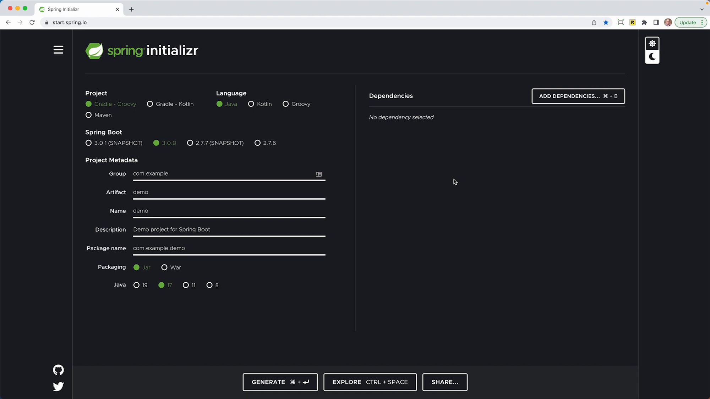
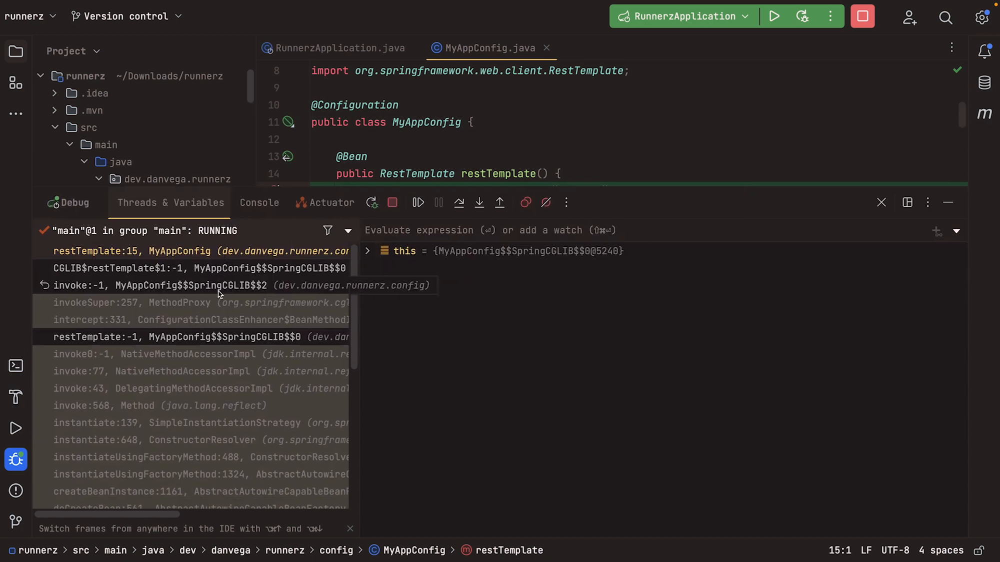

In this blog post, we will explore the configuration classes in Spring and explain how setting a property on the `@Configuration` annotation of `proxyBeanMethods=false` can resolve certain issues. We will guide you through creating a few services that depend on a RestTemplate using the `@Configuration` annotation. Along the way, we will examine a problem and how to address it.

## Create a new project using the Spring Initializr



Let's start by creating a new project at [start.spring.io](http://start.spring.io/). I have bookmarked this site, and I recommend you do the same. I am currently creating a Runners application for an upcoming Spring Workshop, and we'll use this to start the tutorial.

We'll choose Maven and Java, using the latest version of Spring Boot 3.0. We will create a group called `dev.danvega` with this project's artifact, Runners. The only dependency we need right now is the web, and we'll use a rest template underneath the hood.

## Setting up the Services

Let's create a couple of classes that will be the services that we'll use in our application. These classes will require the use of a rest template. We'll create a Run Service and a Track Service in our application, each with a rest template as a dependency.

```java
public class RunService {
    private final RestTemplate restTemplate;
    public RunService(RestTemplate restTemplate) {
        this.restTemplate = restTemplate;
    }
}

public class TrackService {
    private final RestTemplate restTemplate;
    public TrackService(RestTemplate restTemplate) {
        this.restTemplate = restTemplate;
    }
}
```

We're not annotating these with "@Service" because we'll create these using the "app Bean" annotation. If you’re new to Spring Beans and what the `@Bean` annotation does please check out my post on [Component vs Bean](https://www.danvega.dev/blog/2017/05/17/spring-component-vs-bean/).

## Creating a Configuration Class

Let's create a configuration class called `MyAppConfig` We'll start by creating a bean of type RestTemplate, which will be used in both of our services.

```java
@Configuration
public class MyAppConfig {
    @Bean
    public RestTemplate restTemplate() {
        return new RestTemplateBuilder().build();
    }
}
```

We have created a Singleton of RestTemplate, which we can now use in both of our services. We can create two more beans called `RunService` and `TrackService` . We'll return a new instance of both of these services. The constructor in both of these services needs an instance of rest template, so we'll call that corresponding method.

```java
@Configuration
public class MyAppConfig {
    @Bean
    public RestTemplate restTemplate() {
        return new RestTemplateBuilder().build();
    }

    @Bean
    public RunService runService() {
        return new RunService(restTemplate());
    }

    @Bean
    public TrackService trackService() {
        return new TrackService(restTemplate());
    }
}
```

When we run our application, we have no errors, and everything works fine. However, Spring creates a proxy class using the CGlib code generation library. The reason behind this is Spring doesn't want to call the method that returns a new RestTemplate every time a bean is created. It only wants one instance of RestTemplate. When we create a new service class, it retrieves the already-created instance of RestTemplate using the proxy class.



## Fixing the Problem

Using a proxy class most of the time isn’t an issue, but we want to get rid of it because it's using the CGlib library, which won’t work for native executables. I’m also a big fan of avoiding proxies in any situation I can so even If you’re not building a native executable I find this to be a best practice. We can disable this by setting a property proxy bean methods equal to false on the `@Configuration` annotation.

```java
@Configuration(proxyBeanMethods = false)
```

Now we have a new problem. If we set proxyBeanMethods to false, every time we create a service, it calls the method that returns a new RestTemplate instance. This eliminates the benefit we previously had of only creating one instance of RestTemplate.

The solution to this problem is to make RestTemplate an argument to our service classes. Spring already has an instance of RestTemplate since we've created it using the MyAppConfig class. Therefore, we can just pass an instance of RestTemplate to the constructor of our service classes.

```java
public class RunService {
    private final RestTemplate restTemplate;
    public RunService(RestTemplate restTemplate) {
        this.restTemplate = restTemplate;
    }
}

public class TrackService {
    private final RestTemplate restTemplate;
    public TrackService(RestTemplate restTemplate) {
        this.restTemplate = restTemplate;
    }
}
```

Lastly, we need to modify our configuration class to reflect this:

```java
@Bean
public RunService runService(RestTemplate restTemplate) {
    return new RunService(restTemplate);
}

@Bean
public TrackService trackService(RestTemplate restTemplate) {
    return new TrackService(restTemplate);
}31
```

Now when we run our application, the CGlib proxy class is not used, and we only create one instance of RestTemplate.

## Conclusion

By setting the "proxy Bean methods" property to "false," we can eliminate the proxy class. This is something you must do if you’re creating a native executable but I also find it a best practice if it is something you can do. Removing overhead such as the proxy class can help improve your application's performance. I hope this blog post has helped you gain a better understanding of Spring's configuration classes.

