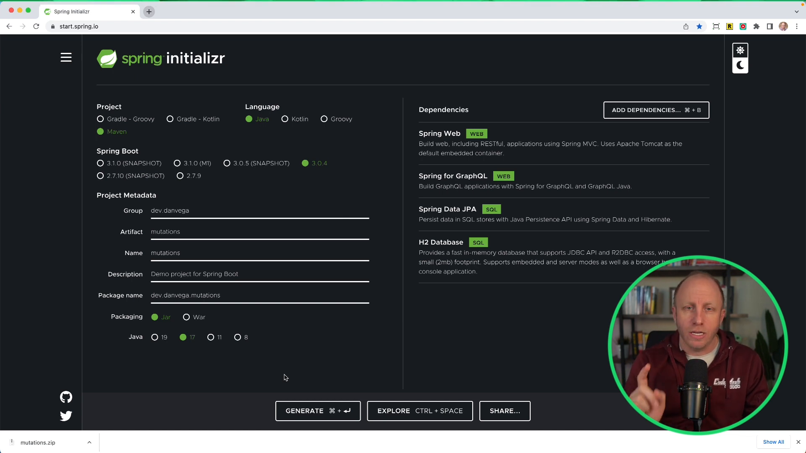

In this blog post, we'll be taking a look at mutations in GraphQL, specifically using Spring Boot, GraphQL Java, and Spring Data JPA. Up until now, we've mostly been focused on getting started with GraphQL and simple operations like queries. However, there's a lot more to GraphQL, like mutations, subscriptions, and new features in recent releases. Let's dive in and create a new project to explore these concepts!

## Create a Spring Boot Project with GraphQL

To get started, we'll need a new Java Maven project. Using [Spring Initializr](https://start.spring.io/), create a project with the following configuration:

- Project type: Maven
- Packaging: Jar
- Java: 17
- Dependencies: Web, Spring Data JPA, H2, and Spring Boot GraphQL

Download the generated project and open it in your favorite IDE. We're going to create a simple application that simulates a library system with books and reviews.

### Set Up Entities and Repositories

First, let's create some model classes for our application. We'll use Spring Data JPA to define `Book` and `Review` entities, along with a `BookRepository` interface for database operations:

1. Create a `Book` class in the `model` package and annotate it with `@Entity`. Add fields for `id`, `title`, `pages`, `author`, and `reviews`. Use appropriate JPA annotations, such as `@Id` and `@GeneratedValue` for the `id` field.

```java
@Entity
public class Book {

    @Id
    @GeneratedValue
    private Integer id;
    private String title;
    private Integer pages;
    private String author;

    @OneToMany(cascade = CascadeType.ALL)
    @JoinColumn(name = "book_id")
    private List<Review> reviews;

    // Constructors, getters, and setters
}
```

2. Create a `Review` class in the `model` package and annotate it with `@Entity`. Add fields for `id`, `title`, and `comment`.

```java
@Entity
public class Review {

    @Id
    @GeneratedValue
    private Integer id;
    private String title;
    private String comment;

    // Constructors, getters, and setters
}
```

3. Create a `BookRepository` interface in the `repository` package, extending `JpaRepository` and specifying `Book` as the entity type and `Integer` as the ID type:

```java
public interface BookRepository extends JpaRepository<Book, Integer> {}
```

### Configure Application Properties and Sample Data

Next, let's configure our application properties to specify some settings for the H2 database connection, enable the H2 console, and show SQL statements.

Add the following properties to the `application.properties` file:

```properties
spring.datasource.name=books
spring.datasource.generate-unique-name=false
spring.h2.console.enabled=true
spring.jpa.show-sql=true
spring.graphql.servlet.enabled=true
```

We'll also need some sample data for our application. In the `Application.java` class, create a `CommandLineRunner` bean that initializes a `Book` and a `Review` and saves them to the database using the `BookRepository`.

```java
@Bean
public CommandLineRunner initData(BookRepository bookRepository) {
    return args -> {
        Book book = new Book("Reactive Spring", 484, "Josh Long");
        Review review = new Review("Great book!", "I really enjoyed this book!");
        book.setReviews(Collections.singletonList(review));
        bookRepository.save(book);
    };
}
```

This is a great opportunity to tell you that you should pick up Josh Long's book, [Reactive Spring](https://amzn.to/3K9d7fw). It's a great read!


At this point, you should be able to run your application, and you'll see that the book and review are saved to the database.

### Create a GraphQL Query

Now that we have our basic data model set up, let's create a simple GraphQL query to fetch our books. In the `resources` folder, create a `graphql` directory and a file called `schema.graphqls`. In this file, define a `Book` type, a `Review` type, and a `Query` type.

```graphql
type Book {
  id: ID
  title: String
  pages: Int
  author: String
  reviews: [Review]
}

type Review {
  id: ID
  title: String
  comment: String
}

type Query {
  findAllBooks: [Book]
}
```

In your application create a REST controller named `BookController` with a method that returns all books from the `BookRepository`. Use the `@QueryMapping` annotation to link the method to the `findAllBooks` query in your GraphQL schema.

```java
@RestController
@RequestMapping("/api/books")
public class BookController {

    private final BookRepository bookRepository;

    public BookController(BookRepository bookRepository) {
        this.bookRepository = bookRepository;
    }

    @QueryMapping
    public List<Book> findAllBooks() {
        return bookRepository.findAll();
    }
}
```

At this point, you should be able to run your application and use the [GraphiQL Playground](http://localhost:8080/graphiql) to test your `findAllBooks` query.

```graphql
query {
  findAllBooks {
    id
    title
    pages
    author
    reviews {
      id
      title
      comment
    }
  }
}
```

## Working with GraphQL Mutations

Now let's explore different ways we can work with mutations in our application. A mutation is essentially an operation that makes changes to our data, such as creating, updating, or deleting records.

### Simple Mutation with Basic Types

First, let's create a simple mutation that takes in basic types like strings and integers as inputs. In your controller, create a new method called `createBook` that accepts three parameters (`title`, `pages`, and `author`), and returns a `Book`. Use the `@MutationMapping` and annotation to associate the method with a mutation field in your GraphQL schema. The `@Argument` annotation maps the GraphQL named arguments to your method parameters.

```java
@MutationMapping
public Book createBook(@Argument String title, @Argument Integer pages, @Argument String author) {
    Book book = new Book(title, pages, author);
    return bookRepository.save(book);
}
```

Next, update your GraphQL schema to define the `Mutation` type with a `createBook` field:

```graphql
type Mutation {
  createBook(title: String, pages: Int, author: String): Book
}
```

With this setup, you can now use a tool like [GraphiQL Playground](http://localhost:8080/graphiql) to run a mutation that creates a new book.

```graphql
mutation CreateBook {
  createBook(title: "My new book", pages: 99, author: "Dan Vega") {
    id
    title
    pages
    author
  }
}
```

### Mutation with Object Input Type

In more complex scenarios, you might need to accept an entire object as input for a mutation. To do this, create a new `BookInput` record in your `model` package, which essentially mirrors the properties of your `Book` entity:

```java
public record BookInput(String title, Integer pages, String author) {}
```

Define an `input` type in your GraphQL schema that corresponds to your `BookInput` record:

```graphql
input BookInput {
  title: String
  pages: Int
  author: String
}
```

Create a new method called `addBook` in `BookController` that accepts a `BookInput` argument and returns a `Book`. As before, use the `@MutationMapping` and `@Argument` annotations:

```java
@MutationMapping
public Book addBook(@Argument BookInput bookInput) {
    Book book = new Book(bookInput.title(), bookInput.pages(), bookInput.author());
    return bookRepository.save(book);
}

```

Update your GraphQL schema to add an `addBook` field to the `Mutation` type:

```graphql
type Mutation {
  createBook(title: String, pages: Int, author: String): Book
  addBook(book: BookInput!): Book
}
```

Now you can run a mutation that creates a new book using an object input rather than individual strings and integers.

```graphql
mutation AddBook {
  addBook(book: { title: "My New Book", pages: 199, author: "Dan Vega" }) {
    id
    title
    pages
    author
  }
}
```

### Mutation with List Input Type

Finally, let's create a mutation that accepts a list of objects as input. Add a new method called `batchCreate` in your `BookController` that takes a list of `BookInput` objects and maps each input object to a `Book` entity, and saves the books in the database.

```java
@MutationMapping
public List<Book> batchCreate(@Argument List<BookInput> books) {
    return books.stream()
        .map(bookInput -> new Book(bookInput.title(), bookInput.pages(), bookInput.author()))
        .map(bookRepository::save)
        .collect(Collectors.toList());
}
```

Update your GraphQL schema to add a `batchCreate` field to the `Mutation` type, specifying that the input list should not be empty:

```graphql
type Mutation {
  createBook(title: String, pages: Int, author: String): Book
  addBook(book: BookInput!): Book
  batchCreate(books: [BookInput!]!): [Book]
}
```

Now you can run a mutation that creates multiple books in a single operation by passing in a list of book inputs.

```graphql
mutation BatchCreate {
  batchCreate(
    books: [
      { title: "Batch Book 1", pages: 99, author: "New Author" }
      { title: "Batch Book 2", pages: 99, author: "New Author" }
      { title: "Batch Book 3", pages: 99, author: "New Author" }
      { title: "Batch Book 4", pages: 99, author: "New Author" }
      { title: "Batch Book 5", pages: 99, author: "New Author" }
    ]
  ) {
    id
    title
    pages
    author
  }
}
```

## Conclusion

In this blog post, we explored how to work with mutations in GraphQL, specifically using Spring Boot, GraphQL Java, and Spring Data JPA. We covered different ways of passing input to our mutations, including simple types, object input types, and list input types. With this knowledge in hand, you can create powerful GraphQL APIs that allow clients to make complex updates to your data models. Happy coding!

