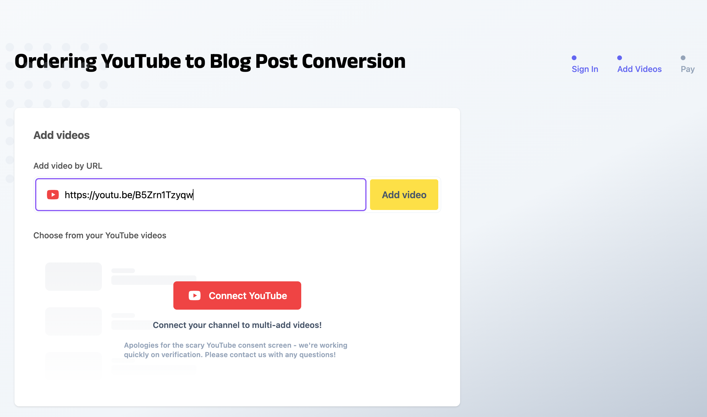
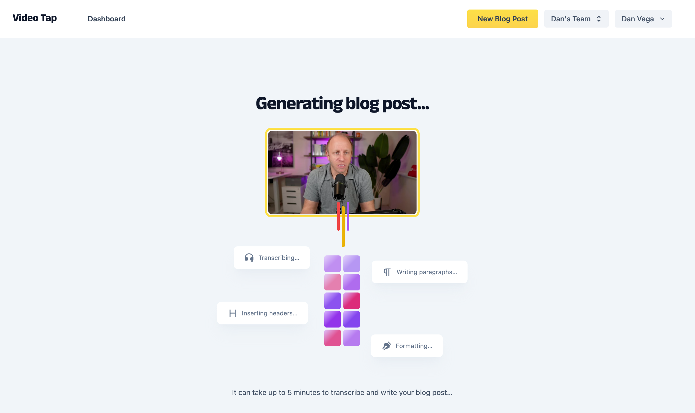
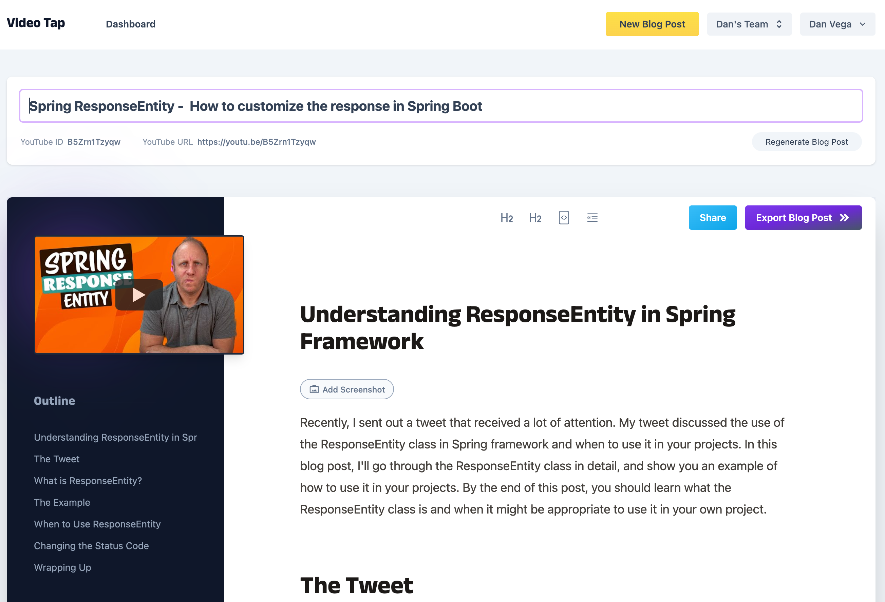
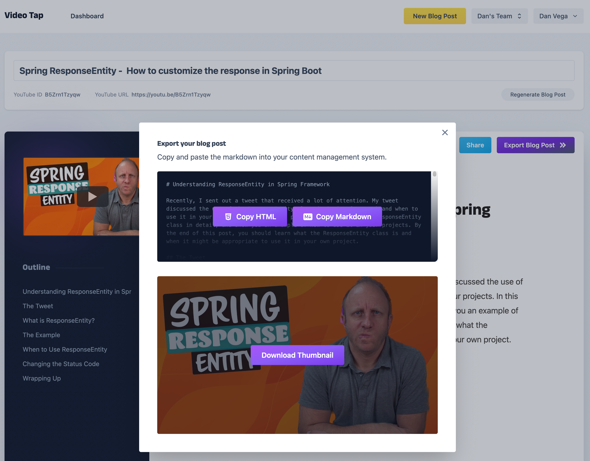

Are you a content creator who struggles to find enough time to produce written content alongside videos? Do you wish there was an easy way to transform your videos into compelling blog posts? Look no further than [VideoTap](https://videotapit.com/?via=dan)! This innovative service transcribes and converts your videos into high-quality blog posts, complete with code blocks and other engaging features. Plus, with their recent increase in video length limit to 25 minutes, most videos are a perfect fit. Say goodbye to the hassle of creating separate written content and hello to a more efficient workflow with VideoTap.

## Me as a Content Creator

As a content creator, I produce content for various mediums. I began my blog as a means of helping others who were encountering the same problems as I was. Through this process, I developed a deep appreciation for the writing process. This love for writing has inspired me to continue posting blog entries for over 15 years. I also started a [weekly newsletter](https://www.danvega.dev/newsletter/) as a way of keeping myself writing regularly.

Throughout this process I began to get very interested in Video for the same reasons. My fellow developers were on YouTube and looking for solutions to their problems. I also realized that I could create courses as a side hustle to make a little extra money.

I enjoy writing and producing video content, but there's a problem. As I've dedicated more time to creating videos, I've become less consistent with my writing. Unless I figure out how to clone myself (which I don't think anyone wants), I will have to choose where to spend my time.

A main goal of mine over the last 2 years has been to grow my YouTube channel, so that's where I'm currently focusing my efforts. Many people may not realize the amount of time and effort that goes into creating a single video, but I can attest that there's a lot involved.

### Blog Post → Video

Once I'm ready to publish a video, I often lack the energy to write a full blog post to accompany it. In an ideal scenario, I would start with a blog post. This would enable me to work on the code demo and decide exactly what I want to say, and more importantly, what I don't want to spend time on. After preparing the blog post, I could use it as a script to guide the video creation process.

However, in the real world, with a full-time job, family, and limited time, I need to be precise about how I spend my time. I would rather create two videos than one blog post plus a video. Nevertheless, I would prefer to make two videos and two blog posts instead of only one. That is why I'm excited about this new service that will allow me to do that.

## What is VideoTap

Now that you understand the problem that VideoTap solves, let's discuss how it does so. VideoTap is a service that transcribes and converts videos into blog posts. If all it did was take the transcript and create a blog post, it wouldn't be very helpful. In fact, I've tried doing this on my own before, and I can attest that nobody wants to read a video transcript.

What sets VideoTap apart is the quality of its blog posts. Instead of simply using a transcription, they utilize GPT-4 to generate high-quality blog posts that include headings, images, code blocks, and more. This makes their articles much more compelling. I'm not sure what their secret sauce is because I tried a similar process on my own, but was unable to come up with high-quality posts.

### How to convert a video to a blog post

Using VideoTap costs $1 per minute of video you want to convert. For example, a 20 minute video would cost $20. Additionally, they offer a white glove service where they take care of the video conversion for you and send you the final results. This service costs \$3 per minute of video.

Once you create a free account, you can begin the process by going to your dashboard. You can add a video by URL or connect your YouTube account. Once you add a video, the length will be determined, and you will be prompted to pay.

After your payment is processed, the service will start generating a blog post. This process may take a few minutes as it involves transcribing the video, adding titles, headers, code, and formatting everything.

When the conversion is complete you will be taken to this screen where you can make further edits. First off I love the simplicity of this design with the image and outline on the left. The blog post isn’t perfect and this is usually where I will make my first pass on editing it.

When the blog post is ready to export click the `Export Blog Post` button in the upper right hand corner. I write all of my blog posts in Markdown so the copy markdown is a great feature. It’s almost like this service was written by a developer for developers (👋🏻 Chris).

### Show me the ~~Money~~ Blog Posts

I think its easy to talk about a service but what about a real world use case. I have about 10 videos in VideoTap currently and here are a few examples of ones I have converted into blog post. At the top of each blog post you can find the YouTube video that I used to create the post.

- [GraphQL Mutations](https://www.danvega.dev/blog/2023/03/20/graphql-mutations/)
- [Spring Security Configuration - Lambda DSL](https://www.danvega.dev/blog/2023/03/15/spring-security-lambda-dsl/)
- [Building Command Line Applications with Spring](https://www.danvega.dev/blog/2023/03/02/spring-shell-intro/)
- [Building Native Images with GraalVM](https://www.danvega.dev/blog/2023/02/03/native-images-graalvm/)

### YouTube Generator

They also have a free service for [generating YouTube Chapters](https://videotapit.com/youtube-chapters-generator?ref=dan) which I have found really useful. This is another one of those tasks during the video creation process that I find exhausting. You just spent all this time producing, editing and publishing the video and instead of moving on to the next one you need to watch it again to figure out where the chapter marks are.

## Conclusion

I think at this point I should be transparent and tell you that I am an affiliate for [VideoTap](https://videotapit.com/?via=dan). if you know me though you know I don’t push products or services. I have almost 30k YouTube subscribers and have yet to take a single brand deal. I’m an affiliate for VideoTap because it is one of those services I absolutely love and believe in. If you wouldn’t mind using my [link](https://videotapit.com/?via=dan) it will cost you nothing extra and it helps support my content creation.

<strong>Happy Coding</strong> 
Dan

