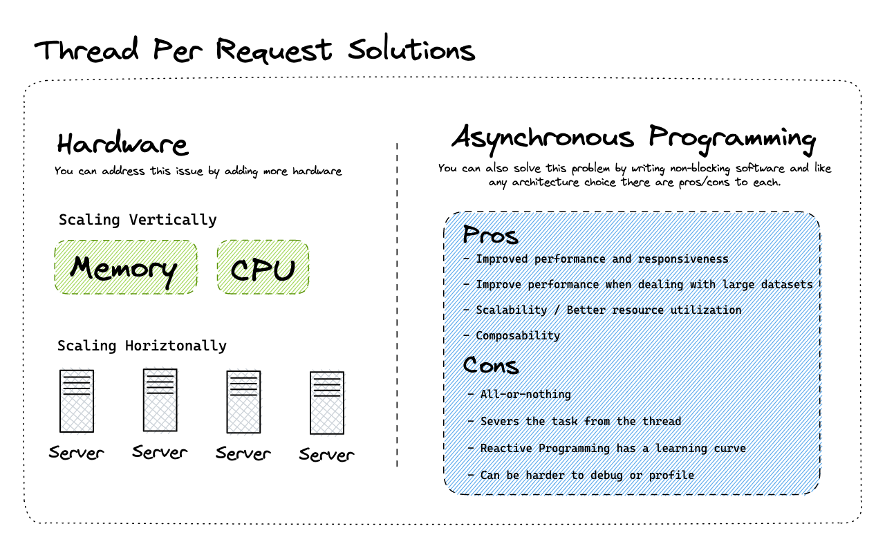

Welcome back, friends! Today, we're diving into Project Loom and specifically virtual threads. We'll be covering what they are, why you should care as a Spring developer, and even provide a demo on using virtual threads in a Spring application. Let’s begin!

## What is Project Loom?

Project Loom aims to reduce the effort of writing, maintaining, and observing high-throughput concurrent applications. It introduces virtual threads as a solution to improve performance and scalability, particularly when dealing with blocking APIs commonly found in Spring MVC applications.

It's been announced that [virtual threads are targeted for JDK 21](https://openjdk.org/jeps/444), which is exciting news as it means they might show up in Spring Framework 6.1 (also targeted for later this year). So it's about time we all learn about virtual threads and why we might care about them as Spring developers.

## History: Why We Need Virtual Threads

Let's first understand the thread-per-request model and how threads work in Java. When a client makes a request to a server, the request often involves the server to process blocking operations, such as reading or persisting from a database using JDBC or JPA, writing to a file, or communicating with another service.

This application works great on your laptop and during the initial stages of implementation. However, once news spreads about your exceptional new application, you may start experiencing a high volume of traffic that could cause it to crash.

Why is this happening? What can you do to address this?


To answer these questions you must understand the thread-per-request model. When a request is handled by the web server it is using a Java Thread and that thread is tied to an operating system thread. When you make a call to a blocking operation like reading or persisting to a database that thread is blocked from doing anything else until the request is fulfilled.

The thread-per-request model ties up threads in the system, and there is a maximum number of concurrent threads allowed. When the number of maximum threads has been reached, each subsequent request will need to wait for a thread to be released to fulfill that request. This can cause slowness or even errors in the application when it experiences high traffic.


## Scalability Solutions

To improve scalability, there are two main approaches that you can currently take advantage of:

1. **Scaling Hardware**: Add more memory, CPU or servers (vertical and horizontal scaling)
2. **Asynchronous Programming**: Writing non-blocking software to optimize thread usage



## Introduction to Virtual Threads

Virtual threads, available as a preview release in JDK 19 and 20, are lightweight, inexpensive, and easy to create. They are tied to a platform thread that is connected to the operating system thread. Consequently, we no longer tie up platform threads in our applications and can handle more concurrent requests. The most exciting aspect of virtual threads is that we can use them in our Spring applications with little or no code changes.


## Demo: Using Virtual Threads in Spring Applications

To create a new Spring project that uses virtual threads, follow these steps:

1. Go to [start.spring.io](https://start.spring.io/) and select Maven, Java, and the latest version of Spring Boot.
2. Fill in the project metadata, choose Java 20 (or 19 if available), and select the "Web" dependency.
3. Generate the project, open it in IntelliJ, and make sure the `pom.xml` file has `maven-compiler-plugin` configuration setup to enable the preview feature.

   ```xml
   <plugin>
   	<groupId>org.apache.maven.plugins</groupId>
   	<artifactId>maven-compiler-plugin</artifactId>
   	<configuration>
   		<compilerArgs>--enable-preview</compilerArgs>
   		<source>19</source>
   		<target>19</target>
   	</configuration>
   </plugin>
   ```

4. Create a controller mapping to the root path, and return the current thread's information as a string.

   ```java
   @RestController
   public class HomeController {
       @GetMapping("/")
       public String hello() {
           return Thread.currentThread().toString();
       }
   }
   ```

5. Run the application and test it by making a request to the local server. The response should display the main thread's information.
6. In your `@SpringBootApplication` class, create a new Bean called `TomcatProtocolHandlerCustomizer` and set its executor to the new `VirtualThreadPerTaskExecutor`.

   ```java
   @Bean
   	TomcatProtocolHandlerCustomizer<?> protocolHandlerVirtualThreadExecutorCustomizer() {
   		return protocolHandler -> {
   			log.info("Configuring " + protocolHandler + " to use VirtualThreadPerTaskExecutor");
   			protocolHandler.setExecutor(Executors.newVirtualThreadPerTaskExecutor());
   		};
   	}
   ```

7. Restart your application and test it again by making another request to the local server. The response should now display the virtual thread's information.

And that's it! With just a few changes, you can start using virtual threads in your Spring application and take advantage of its performance improvements.

## Conclusion

Virtual threads offer an exciting solution to improve performance and scalability for Spring developers. With little or no code changes required, it's worth exploring how virtual threads can benefit your applications. Be sure to check out the Spring blog posts to learn more about [embracing virtual threads](https://spring.io/blog/2022/10/11/embracing-virtual-threads) and their [performance analysis](https://spring.io/blog/2023/02/27/web-applications-and-project-loom).

Happy coding, friends!<br/>
Dan

