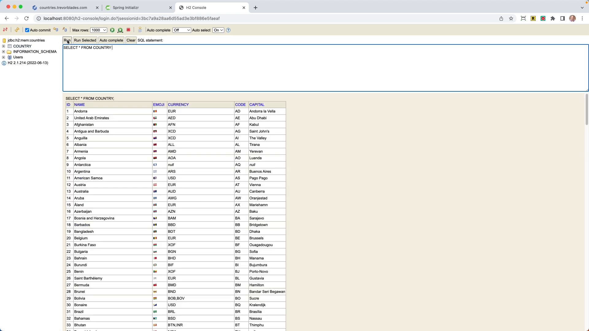

If you're working on a Spring application and you need to call another REST API, you have tools such as RestTemplate or WebClient. But what if you need to call a GraphQL API? With Spring, a GraphQL Client is available. In this tutorial, you will learn how to include it in your project and use it by building a practical example.

## Accessing a Free GraphQL API

To demonstrate, we will utilize a free GraphQL API from [Countries Trevorblades.com](www.examplelink.com). The query returns information such as the country's name, emoji, currency, code, and capital. Note that some fields may return `null` values, so we should guard against those in our application.

## Creating Our Application

We will generate our Spring Boot project from [start.spring.io](www.examplelink.com). For our application, we will use Maven as a build tool, Java as the language, and the latest version of Spring Boot. Let's name the application `Countries`, and we will be using Java 17. For our dependencies, we require `Web`, `Spring Data JDBC`, and `H2 Database`.


The `Web` dependency enables us to build a web application. `Spring Data JDBC` is crucial because it will allow us to load country data and store it in a database to avoid repeating GraphQL API calls. For our database, we will use an `H2` in-memory database for simplicity.

## Setting Up Our Country Record

Having generated the application, let's move to the IDE and start coding. We will create a `Model` package and within it a record named `Country` to represent a country based on the fields from the GraphQL API.

```java
public record Country(
        @Id
        Integer id,
        String name,
        String emoji,
        String currency,
        String code,
        String capital
) {
}
```

## Building Our Country Repository

We'll then build a `CountryRepository` interface in the `repository` package that extends `CrudRepository<Country, Integer>`. This will provide basic CRUD functionality for the `Country` entity.

```java
public interface CountryRepository extends ListCrudRepository<Country,Integer> {

}
```

## Constructing The Country Service

Next, let's create a `CountryService` in the `Service` package. This service will connect with the GraphQL API and return the list of countries.

In the service, we can use a standard WebClient, but to simplify the process, we will utilize the `HttpGraphQLClient` provided by Spring for GraphQL.

To use this client, we will add another dependency, `spring-boot-starter-graphql`. If you already selected Spring for GraphQL from the Spring Initializr you can skip this step.

```xml
<dependency>
  <groupId>org.springframework.boot</groupId>
  <artifactId>spring-boot-starter-graphql</artifactId>
</dependency>
```

Then, we instantiate a `GraphQLClient`.

```java
private final HttpGraphQlClient graphQlClient;

public CountryService() {
    WebClient client = WebClient.builder()
            .baseUrl("https://countries.trevorblades.com")
            .build();
    graphQlClient = HttpGraphQlClient.builder(client).build();
}
```

## Calling The GraphQL API

Now that our GraphQL client is ready, we can create a method, `getCountries()`, to make the API call to retrieve a list of countries.

```java
    public Mono<List<Country>> getCountries() {
        String document = """
        query {
            countries {
              name
              emoji
              currency
              code
              capital
            }
        }
        """;

        Mono<List<Country>> countries = graphQlClient.document(document)
                .retrieve("countries")
                .toEntityList(Country.class);

        return countries;
    }
```

The `graphQLClient.query(document).retrieve().asEntityList(Country.class)` sequence initiates the API call, retrieves the result, and maps it to a list of `Country` objects.

## Running The Application

To run the application, we need to add a CommandLineRunner in the main application class that will call `getCountries` and save the list of countries in the database using our `CountryRepository`.

```java
@Bean
CommandLineRunner commandLineRunner(CountryService service, CountryRepository repository) {
  return args -> {
    Mono<List<Country>> countries = service.getCountries();
    countries.subscribe(repository::saveAll);
  };
}
```

After running the application and no exceptions are thrown, we can confirm that our country data has been saved in the database. You can check this by accessing the H2 Console and running a `SELECT * FROM country;`.



That's all there is to connecting to a GraphQL API in Spring Boot! You now have the tools needed to tackle any GraphQL requests in your projects, courtesy of Spring for GraphQL.

If you found this post helpful, please give it a thumbs up, subscribe to the channel, and, as always, happy coding!
