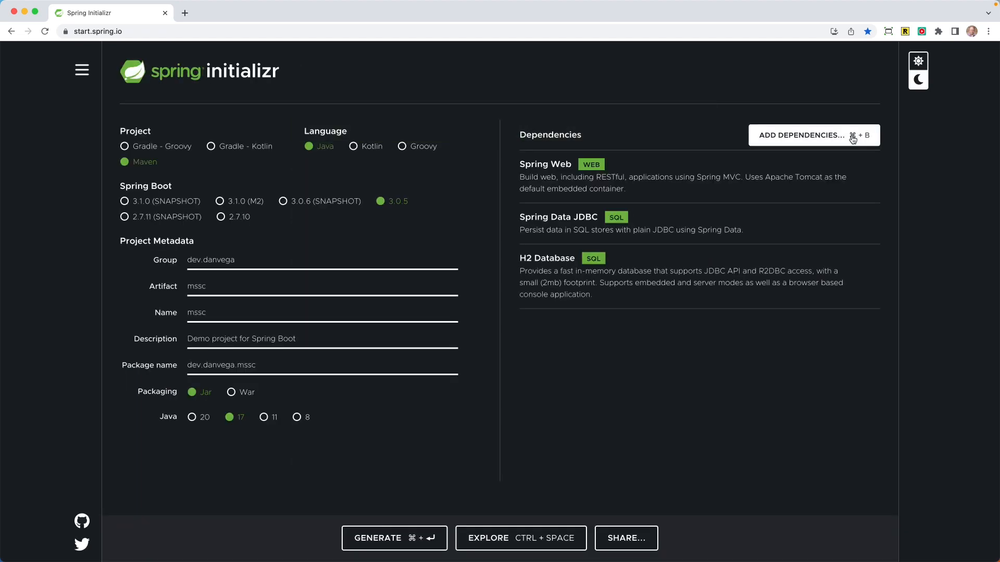

Security is an important aspect of any application, and Spring Security makes it secure by default. In this tutorial, we will discuss how to create multiple Spring Security configurations and why you might want to do so. We'll cover everything from setting up a new project, to customizing security configurations, and exploring multiple security filter chains. So let's dive in!

## Creating a New Project

First, head over to [start.spring.io](https://start.spring.io) and create a new project with the following settings:

- Build Tool: Maven
- Language: Java
- Packaging: Jar
- Java Version: 17

Next, add the following dependencies:

- Web
- Spring Security (leave it off for now, we'll add it later)
- Spring Data JDBC
- H2 Database

Generate the project and open it up in your favorite IDE.

## Setting up the Application

First, create a simple domain model called `Post` with some fields like `id`, `title`, and `content`. Annotate the `id` field with `@Id`:

```java
public record Post(@Id Integer id, String title, String content) {

}
```

Next, create a `PostRepository` interface that extends `CrudRepository`.

```java
public interface PostRepository extends ListCrudRepository<Post,Integer> {

}
```

Then, create two controllers:

1. `HomeController` with two mappings for the root and private URLs, returning strings "hello home" and "secured" respectively.

```java
@RestController
public class HomeController {

    @GetMapping("/")
    public String home() {
        return "Hello, World!";
    }

    @GetMapping("/private")
    public String secure() {
        return "secured";
    }
}
```

2. `PostController` with a request mapping for `/api/posts` and a method `findAll` that returns all the posts using the `PostRepository`.

```java
@RestController
@RequestMapping("/api/posts")
public class PostController {

    private final PostRepository repository;

    public PostController(PostRepository repository) {
        this.repository = repository;
    }

    @GetMapping
    public List<Post> findAll() {
        return repository.findAll();
    }

}
```

After this, create a `schema.sql` file in the `resources` folder with SQL to create a `posts` table and insert a single row. Also, update your `application.properties` file to set the data source name to "blog" and enable the H2 console.

```sql
create table Post (
    id int auto_increment primary key ,
    title varchar(255) not null,
    content text not null
);
INSERT INTO POST(title,content) VALUES ('Hello, World!','My First Blog Post');
```

```properties
spring.datasource.generate-unique-name=false
spring.datasource.name=blog
spring.h2.console.enabled=true
```

Now, run the application and you should be able to access the H2 console at `localhost:8080/h2-console`.

## Adding Spring Security

Add the Spring Security dependency manually to your project configuration:

```xml
<dependency>
    <groupId>org.springframework.boot</groupId>
    <artifactId>spring-boot-starter-security</artifactId>
</dependency>

```

Refresh your Maven dependencies, then restart the application. You'll notice you now need to authenticate to access the H2 console (with a randomly generated password and the username "user").

## Configuring Spring Security

In this tutorial, we'll create multiple Spring Security configurations for different authorization scenarios:

1. Configuration for the H2 console
2. Configuration for securing the API with HTTP Basic authentication
3. Configuration for securing the private URL with form login

Let's start by creating a `SecurityConfig` class within a `config` package, and annotating it with `@EnableWebSecurity` and `@Configuration`. We will define beans of type `SecurityFilterChain` for each scenario.

```java
@Configuration
@EnableWebSecurity
public class SecurityConfig {

}
```

### API Security Filter Chain

Create an `apiSecurityFilterChain` bean that also takes in an `HttpSecurity` object. This time, the configuration should ensure that any request for `/api/**` requires authentication, with HTTP basic authentication and session management disabled.

Remember to add another `@Order` annotation here, for example `@Order(1)`.

```java
@Bean
@Order(1)
SecurityFilterChain apiSecurityFilterChain(HttpSecurity http) throws Exception {
    return http
            .securityMatcher("/api/**")
            .authorizeHttpRequests(auth -> {
                auth.anyRequest().authenticated();
            })
            .sessionManagement(session -> session.sessionCreationPolicy(SessionCreationPolicy.STATELESS))
            .httpBasic(withDefaults())
            .build();
}
```

### H2 Console Security Filter Chain

Create a `h2ConsoleSecurityFilterChain` bean that takes in an `HttpSecurity` object. Ensure that any request for `/h2-console/**` is permitted, CSRF protection is ignored for H2 console, and frame options are disabled.

You'll also need to add an `@Order` annotation here to ensure that this security configuration is processed in the correct order. For example, add `@Order(2)` as an annotation on your `h2ConsoleSecurityFilterChain` method.

```java
@Bean
@Order(2)
SecurityFilterChain h2ConsoleSecurityFilterChain(HttpSecurity http) throws Exception {
    return http
            .securityMatcher(AntPathRequestMatcher.antMatcher("/h2-console/**"))
            .authorizeHttpRequests( auth -> {
                auth.requestMatchers(AntPathRequestMatcher.antMatcher("/h2-console/**")).permitAll();
            })
            .csrf(csrf -> csrf.ignoringRequestMatchers(AntPathRequestMatcher.antMatcher("/h2-console/**")))
            .headers(headers -> headers.frameOptions().disable())
            .build();
}
```

### Form Login Security Filter Chain

Finally, create a `formLoginSecurityFilterChain` bean that takes in an `HttpSecurity` object. In this configuration, permit access to the root URL ("/") without authentication, and authenticate any other request with form login.

Add the `@Order(3)` annotation to ensure that this security configuration is processed last.

```java
@Bean
@Order(3)
SecurityFilterChain securityFilterChain(HttpSecurity http) throws Exception {
    return http
            .authorizeHttpRequests(auth -> {
                    auth.requestMatchers("/").permitAll();
                    auth.requestMatchers("/error").permitAll();
                    auth.anyRequest().authenticated();
                }
            )
            .formLogin(withDefaults())
            .build();
}
```

### Adding Security Matchers

To ensure that each security filter chain is only invoked for the matching pattern, add an `@SecurityMatcher` annotation to each bean:

- For the H2 Console filter chain, use an Ant matcher: `@SecurityMatcher(AntPathRequestMatcher("/h2-console/**"))`
- For the API filter chain, use an MVC matcher: `@SecurityMatcher(MvcRequestMatcher("/api/**"))`
- For the Form Login filter chain, you can omit the `@SecurityMatcher` as it will only be invoked if none of the other matchers apply.

Now, run the application again and test each scenario:

1. Access the H2 console without authentication: `http://localhost:8080/h2-console`
2. Call the `/api/posts` endpoint and authenticate using HTTP Basic
3. Access the `/private` URL and authenticate using Form login

You should find that each security configuration works as expected.

## Conclusion

In this tutorial, we covered how to create multiple Spring Security configurations for different authorization scenarios. This approach can help keep your security configurations clean and focused, making them easier to understand and maintain. By leveraging Spring Security's `@Order`, `@SecurityMatcher`, and other features, you can easily build complex and secure applications.

Happy coding!

