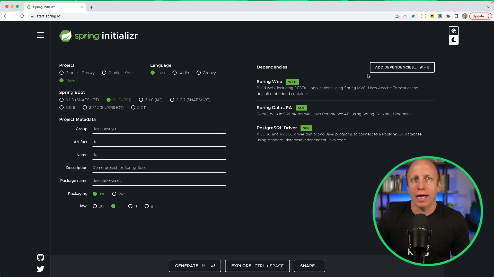

In this article we're talking all about Spring Boot 3.1 RC1, which has just been released with many great features. In particular, we're going to focus on the ability to use Docker Compose files directly with Spring Boot applications.

This isn't a new feature per se, but it comes with some significant improvements over previous versions. One of the major enhancements is that the Spring Boot Docker Compose Module will start and stop your containers automatically. Additionally, you no longer need to duplicate properties between your Docker Compose file and `application.properties`.

In this blog post, I'll show you how to get started with this exciting new feature in Spring Boot 3.1 RC1. Let's begin with a demo!

## Setting up a Spring Boot 3.1 Project

First, let's set up a basic Spring Boot 3.1 project using [Spring Initializr](https://start.spring.io/). Here's a quick overview of the options we're going to select:

- Maven Project
- 3.1.0 RC1 version
- Java 17
- Dependencies: Web, Spring Data JPA, PostgreSQL Driver



With these options selected, click "Generate" and extract the downloaded zip file. Open the extracted project in your favorite IDE or editor (I'm using IntelliJ IDEA Ultimate Edition).

## Creating a Simple Blog Application

For this demo, let's create a simple blog application with a single `Post` entity and a RESTful API to fetch all posts.

Start by creating a Java class called `Post` in the `model` package:

```java
@Entity
public class Post {

    @Id
    @GeneratedValue
    private Integer id;

    private String title;

    private String body;

    // Constructors, getters, setters, and toString() methods go here
}
```

Next, create a new interface called `PostRepository` in the `repository` package that extends `CrudRepository<Post, Integer>`:

```java
public interface PostRepository extends CrudRepository<Post, Integer> {

}
```

Now, let's create a `PostController` class in the `controller` package with a single GET endpoint to fetch all posts:

```java
@RestController
@RequestMapping("/api/posts")
public class PostController {

    private final PostRepository repository;

    public PostController(PostRepository repository) {
        this.repository = repository;
    }

    @GetMapping
    public List<Post> findAll() {
        return (List<Post>) repository.findAll();
    }
}
```

## Adding Docker Compose

At this point, we've got a basic application with a single REST endpoint to fetch all posts. Now, let's add Docker Compose for spinning up a PostgreSQL container as our database.

Create a new file called `docker-compose.yml` in the project's root directory:

```yaml
version: "3.1"

services:
  db:
    image: postgres
    restart: always
    ports:
      - "5432:5432"
    environment:
      POSTGRES_USER: postgres
      POSTGRES_PASSWORD: password
      POSTGRES_DB: blog
```

Now that we have a Docker Compose file in place, we need to make a couple of changes to enable auto-start/stop of containers and avoid duplicating properties.

First, add the `spring-boot-starter-docker-compose` dependency in your `pom.xml`:

```xml
<dependency>
    <groupId>org.springframework.boot</groupId>
    <artifactId>spring-boot-starter-docker-compose</artifactId>
    <version>3.1.0-RC1</version>
</dependency>

```

Then, in your `application.properties` file, add the following line to enable auto-generation of DDL statements for JPA:

```properties
spring.jpa.hibernate.ddl-auto=create
```

Now, you're ready to run your application! When you start the Spring Boot application, it will automatically create the PostgreSQL container and set up the connection using the properties defined in the `docker-compose.yml` file. Additionally, no duplicated properties are required, making this a much cleaner solution.

## Conclusion

In this blog post, we've taken a look at one of the exciting new features in Spring Boot 3.1 RC1 – simplified Docker Compose usage. This new feature allows developers to auto-start/stop containers and avoid duplicating properties, which makes for a better overall development experience.

If you found value in this tutorial, please consider subscribing to my newsletter for more content like this. As always…

Happy Coding!

