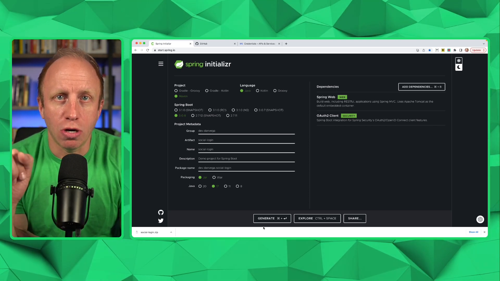

In this tutorial, we will discuss how to set up OAuth 2 logins in Spring Security with Spring Boot. OAuth 2 logins are a convenient way to let your users log in via social media (GitHub, Google, Twitter) without needing to register on your system.

## Prerequisites

You should be familiar with Java, Spring Boot, and Spring Security. Optionally, you should know how to use IntelliJ IDEA, but you can use any IDE of your choice.

## Setting up the Project

1. Visit [start.spring.io](https://start.spring.io/) to create a new Spring Boot project.
2. Select Maven as your build tool and Java as your language.
3. Change the group to something meaningful. For example, `dev.danvega`.
4. Name your project, like `SocialLogin`.
5. Choose JDK 17 (or the latest available).
6. Add dependencies: `web` and `oauth2-client`. Spring Security will be added as a transitive dependency.
7. Generate and download the project. This will provide a zip file.



Unzip the project and open it in your favorite IDE or text editor. I'll use IntelliJ IDEA Ultimate.

## Creating a Controller

Start by creating a `HomeController` class, where we'll set up both public and private routes.

```java
@RestController
public class HomeController {

    @GetMapping("/")
    public String home() {
        return "Hello, home!";
    }

    @GetMapping("/secured")
    public String secured() {
        return "Hello, secured!";
    }
}
```

With these routes in place, we can now set up our security configuration.

## Configuring Spring Security

First, create a new `SecurityConfig` class in the `config` package:

```java
@Configuration
@EnableWebSecurity
public class SecurityConfig {

    @Bean
    SecurityFilterChain securityFilterChain(HttpSecurity http) throws Exception {
        return http
                .authorizeHttpRequests(auth -> {
                    auth.requestMatchers("/").permitAll();
                    auth.requestMatchers("/favicon.ico").permitAll();
                    auth.anyRequest().authenticated();
                })
                .oauth2Login(withDefaults())
                .formLogin(withDefaults())
                .build();
    }

}
```

Here, we configured Spring Security to allow anyone to access the `/` route, but require authentication for any other route. We've enabled both form login and OAuth2 login as authentication methods.

## Setting up OAuth2 Providers

To set up OAuth2 providers, add the following properties to your `application.properties` file.

```properties
# Logging level
logging.level.org.springframework.security=TRACE

# GitHub
spring.security.oauth2.client.registration.github.client-id=<your-github-client-id>
spring.security.oauth2.client.registration.github.client-secret=<your-github-client-secret>

# Google
spring.security.oauth2.client.registration.google.client-id=<your-google-client-id>
spring.security.oauth2.client.registration.google.client-secret=<your-google-client-secret>

```

Note: You'll need to replace `<your-github-client-id>`, `<your-github-client-secret>`, `<your-google-client-id>`, and `<your-google-client-secret>` with the corresponding values from your OAuth providers.

### Setting up GitHub as an OAuth Provider

1. Go to your GitHub account settings, and navigate to Developer settings > OAuth Apps.
2. Click "New OAuth App" and fill in the required fields.
3. For the "Authorization callback URL," use: `http://localhost:8080/login/oauth2/code/github`.
4. Register the application, and you'll receive a `client_id` and `client_secret` for your properties file.

### Setting up Google as an OAuth Provider

1. Visit the Google Cloud Console at [console.cloud.google.com](https://console.cloud.google.com/).
2. Set up the OAuth 2 consent screen if you haven't done so already.
3. Go to the Credentials section and create a new OAuth 2 client ID.
4. Select "Web application" as the type, and enter a name for the application.
5. Add an authorized redirect URI: `http://localhost:8080/login/oauth2/code/google`.
6. Click "Create" to obtain your `client_id` and `client_secret` for your properties file.

## Testing the Application

Run your Spring Boot application and visit [http://localhost:8080/](http://localhost:8080/) in your browser. You should see the public "Hello, home!" message.

Now, navigate to [http://localhost:8080/secured](http://localhost:8080/secured), and you will be prompted to log in via form login or the OAuth providers you configured (GitHub and Google). Log in using one of those providers, and you will be redirected to the secured "Hello, secured!" page.

## Conclusion

In this blog post, we demonstrated how easy it is to set up OAuth 2 logins in Spring Security with Spring Boot, allowing your users to authenticate via social media platforms like GitHub and Google without having to register on your system.

If you're interested in customizing the login page or want further information about configuring OAuth2 properties, you can refer to the [Spring Security documentation](https://docs.spring.io/spring-security/site/docs/current/reference/html5/#oauth2).

