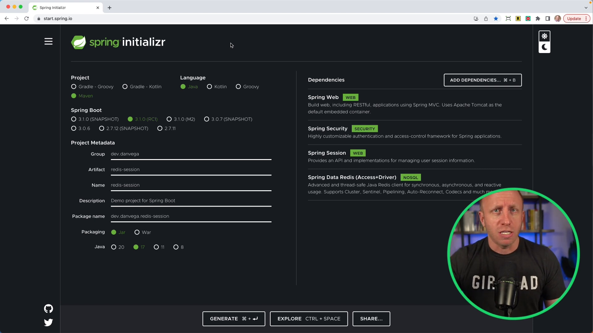

## Understanding Spring Session and its Benefits

In this tutorial, we're going to discuss:

- What is a session on the web?
- What is Spring Session?
- Why might you want to use it in your next Spring Boot application?

This discussion was prompted by a recent episode of the Spring Office Hours podcast, where Spring Session was the featured topic. In this blog post, we'll explore some of the benefits that Spring Session brings to the table.

To understand Spring Session better, let's create a new Spring Boot application using [Spring Initializr](https://start.spring.io). We'll begin with a simple application that features web security and gradually include additional dependencies such as Spring Session and Redis support.

## Creating a Spring Boot Application

Start by creating a new project at `start.spring.io`. Choose Java as the language, Maven as the build tool, and Spring Boot 3.1 (or any later version). Next, add the following dependencies:

- Spring Boot 3.1
- Web
- Spring Security
- Spring Session
- Spring Data Redis



Before diving into how Spring Session can help with managing user session information, let's comment out the Spring Session and Spring Data references and build a basic application without them.

## Default Behavior of Spring Security

Create a `HomeController` with a `home()` method that simply returns a message containing the name of the currently logged-in user.

```java
@RestController
public class HomeController {

    @GetMapping("/")
    public String home(Principal principal, HttpSession session) {
        return "Hello, " + principal.getName();
    }

}
```

Once the application is running, navigate to http://localhost:8080/. You'll be presented with a form login, which is the default security behavior provided by Spring Security.

However, there is a problem with the default session handling. When the application is restarted, you will have to log in again, as the previous session data is lost. This is because the session is tied to the application server (in our case, Tomcat) and is not persisted across server restarts.

This can be even more problematic in a horizontally scaled environment where multiple instances of an application are running. In such cases, a user's session might not be available if they're connected to a different instance of the application.

This is where Spring Session comes into play.

## Introducing Spring Session and Redis

Spring Session provides a solution for managing user session information in a way that is not tied to the application server. In our example, we'll use Redis as a data store for session management.

First, uncomment the lines that include the Spring Session and Spring Data Redis dependencies:

```xml
<!-- Spring Session -->
<dependency>
    <groupId>org.springframework.session</groupId>
    <artifactId>spring-session-data-redis</artifactId>
</dependency>
<dependency>
    <groupId>org.springframework.boot</groupId>
    <artifactId>spring-boot-starter-data-redis</artifactId>
</dependency>

```

Next, we'll set up a Docker Compose file to run a Redis container:

```yaml
version: "3.1"
services:
  redis:
    image: redis:alpine
    ports:
      - "6379:6379"
```

With this configuration in place, our Spring Boot application will automatically start the Redis container when it starts up. This allows us to persist session data across application restarts and share it across multiple instances.Depending on the version of Spring Boot you're on you might need to add the following dependency.

```xml
<dependency>
  <groupId>org.springframework.boot</groupId>
  <artifactId>spring-boot-docker-compose</artifactId>
</dependency>
```

Modify the `HomeController` to track a user's session and display a view counter that increments each time the user accesses the home page. The view counter's value should be stored as a session attribute.

```java
@RestController
public class HomeController {

    private final String HOME_VIEW_COUNT = "home_view_count";

    @GetMapping("/")
    public String home(Principal principal, HttpSession session) {
        incrementCount(session,HOME_VIEW_COUNT);
        return "Hello, " + principal.getName();
    }

    @GetMapping("/count")
    public String count(HttpSession session) {
        return "HOME_VIEW_COUNT: " + session.getAttribute("HOME_VIEW_COUNT");
    }

    private void incrementCount(HttpSession session, String attr) {
        var homeViewCount = session.getAttribute(HOME_VIEW_COUNT) == null ? 0 : (Integer) session.getAttribute(HOME_VIEW_COUNT);
        session.setAttribute(attr,homeViewCount + 1);
    }
}
```

Now, run the application, log in, and observe that the view counter correctly increments and that the session persists across application restarts.

## Wrapping Up

Spring Session provides a powerful way to manage user session information in Spring Boot applications, allowing for more scalable and resilient applications. In our example, we used Redis as the data store, but other options such as JDBC and Hazelcast are also supported.

If you're using Spring Security in your application, it's worth considering integrating Spring Session to improve the overall user experience. However, if you're building a stateless application (such as a REST API), Spring Session might not be necessary.

To learn more about Spring Session, take a look at the [official documentation](https://docs.spring.io/spring-session/docs/current/reference/html5/).

Happy coding!

