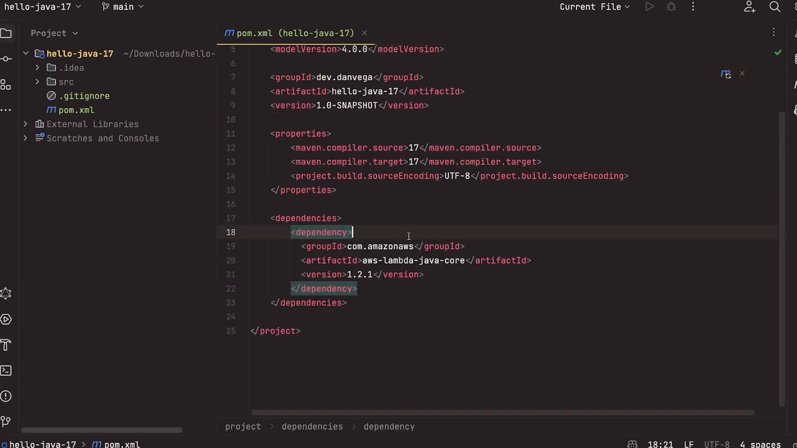
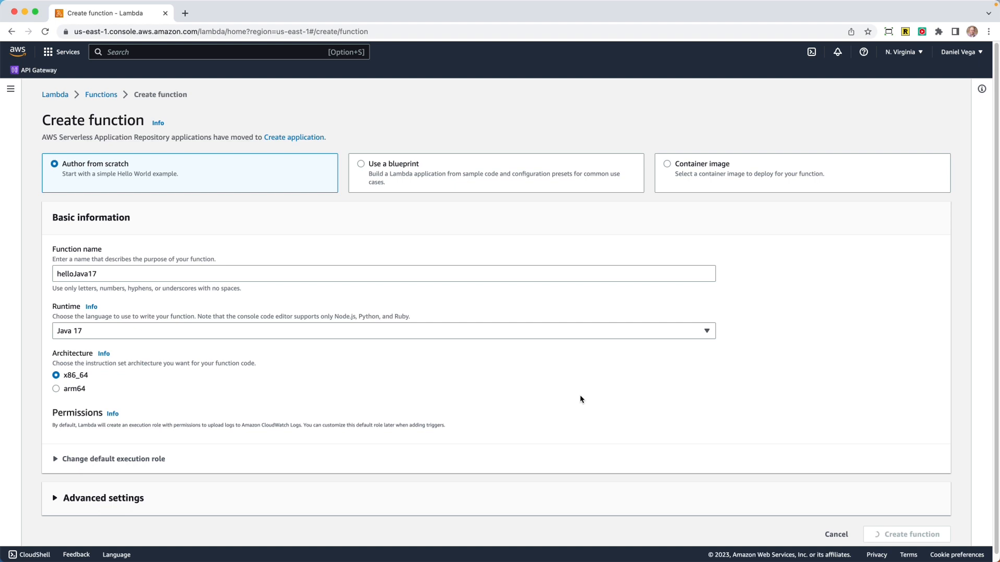
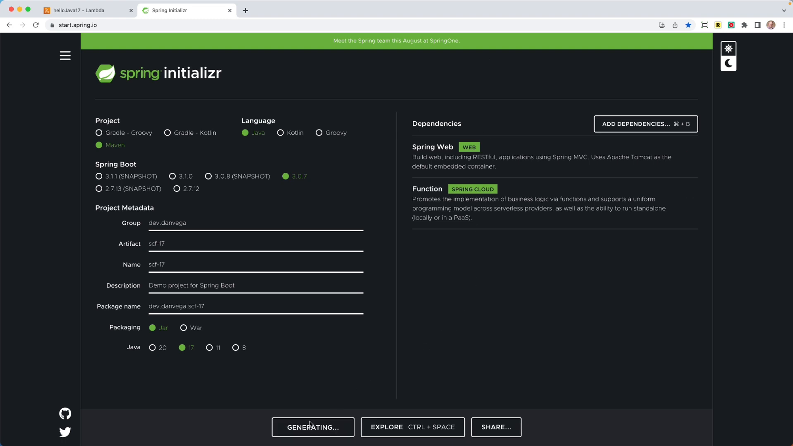

AWS has made a big announcement recently: Java 17 runtime is now supported on AWS Lambda. What this means is, you now have the freedom to write your lambda functions using Java in Spring and specifically target JDK 17.

This announcement comes with a significant improvement as the base requirement for Spring Boot 3 is at least Java 17. So, prior to this, we couldn't use Spring Boot 3 for writing our serverless functions. But now, we can! Let's get started with writing some code!

## Creating a New Project Using Java

I will first show you how to develop a new project utilizing Java only. Let's use the AWS Core Lambda library to create a new AWS Lambda function in Java and send the code to AWS Lambda. Fair warning, Java 17 works beautifully with AWS Lambda, but let's see it in action.

First, I will create a new project in my IntelliJ IDE (although, you can work with any IDE or text editor of your choice). This new project will be named 'Hello, Java 17' and I will save it in my downloads folder.



This Java project is a Maven project that uses the Coretto 17 version of JDK. My group ID will be 'dev.danvega' and the artifact will be 'hello-java-17'. On creating this project, I will open it in IntelliJ.

Here is a cool thing. IntelliJ IDE automatically sets the Maven compiler source and target to Java 17. This is a nice a time-saver.

```xml
<maven.compiler.source>17</maven.compiler.source>
<maven.compiler.target>17</maven.compiler.target>
```

Next, let's add a dependency block. This block will come from AWS Lambda Java Core.

```xml
<dependencies>
    <dependency>
      <groupId>com.amazonaws</groupId>
      <artifactId>aws-lambda-java-core</artifactId>
      <version>1.2.1</version>
    </dependency>
</dependencies>
```

On refreshing Maven, you will notice that everything is now in place and we're ready to write some code. We can create a new Java class named 'SimpleHandler'. Here, I will implement the request handler from AWS and create methods to get the inputs.

```java
package dev.danvega.hj17;

import com.amazonaws.services.lambda.runtime.Context;
import com.amazonaws.services.lambda.runtime.LambdaLogger;
import com.amazonaws.services.lambda.runtime.RequestHandler;

public class SimpleHandler implements RequestHandler<String,String> {

    public String handleRequest(String input, Context context) {
        LambdaLogger logger = context.getLogger();
        logger.log("JDK Version: " + System.getProperty("java.version"));
        return input.toUpperCase();
    }

}
```

With the SimpleHandler created, we can use Maven to create the Java Archive (.jar) that we will then upload to AWS as a Lambda function. To do that, build the Maven Shade plugin by inputting the command - `clean package`.

```xml
<build>
  <plugins>
    <plugin>
      <groupId>org.apache.maven.plugins</groupId>
      <artifactId>maven-shade-plugin</artifactId>
      <version>3.2.4</version>
      <configuration>
        <createDependencyReducedPom>false</createDependencyReducedPom>
      </configuration>
      <executions>
        <execution>
          <phase>package</phase>
          <goals>
            <goal>shade</goal>
          </goals>
        </execution>
      </executions>
    </plugin>
  </plugins>
</build>
```

```bash
mvn clean package
```

The `clean` command cleans the Maven project by deleting the target directory. The `package` command, on the other hand, packages compiled source code into its distributable format. The jar will be saved in the target directory as 'hello-java-17-1.0-SNAPSHOT.jar'.

## Uploading the Jar to AWS Lambda

Now that we have our jar ready, we can go ahead and upload it to AWS Lambda. Let's create a new function from scratch and name it 'Hello, Java 17'. The exciting part here is the runtime selection. Here, you can choose Java 17.



For the purposes of this tutorial, I'll keep the architecture at X86 - this is because if you want to use something like SnapStart, you’ll need to use X86 as it currently does not support ARM64. Having selected the runtime, create the function.

Next, let's upload the jar file using the 'Upload from .zip or .jar file' option and save it. Now, edit the runtime settings. Here, you will need to provide the handler as 'package name.class name::method name'.

```
dev.danvega.HelloJava17.SimpleHandler::handleRequest
```

Save the settings and test the code. Create a test event with a string (e.g., 'hello Java 17'). You should see your string returned in uppercase, proving that the function works and that yes, we are indeed running on Java 17.

With the simple Java application created successfully, let's try using Spring Boot.

## Creating a Project Using Spring Boot

Next, is to create a new project using Spring Boot 3. To do so, we will head over to ['start.spring.io'](https://start.spring.io/), a handy website for quickly setting up a Spring Boot Project.

On the website, we can select the necessary configurations for our project. For this project, we'll be utilizing Java 17 and Spring Boot 3. For dependencies, select 'Web' and 'Spring Cloud Function'.



Once the project parameters are set up, you can generate the project. The resulting .zip file can be opened in your preferred IDE (for this project, we are using IntelliJ IDEA). In the application, the `reverse` function simply reverses the given input string. Here is the code for the `reverse` function:

```java
@Bean
public Function<String, String> reverse() {
    return input -> new StringBuilder(input).reverse().toString();
}
```

This function creates a new string builder with the input string, reverses the string, and then converts it back to a string. Next, you need to build an artifact and target the AWS Lambda runtime. To do so, include the `spring-cloud-function-adapter-aws` in your `pom.xml` file:

```xml
<dependency>
    <groupId>org.springframework.cloud</groupId>
    <artifactId>spring-cloud-function-adapter-aws</artifactId>
</dependency>
```

With the Maven Shade plugin in place, you can run the `mvn clean package` command to build the JAR file. When this is complete, you should see a new JAR file with `aws` in the name, which is what you can upload to AWS. The process is the same as before, so we won't repeat it here.

## Conclusion

If you're looking for the source code for both of these demos you can find them below:

- [GitHub Repo - Java 17]( https://github.com/danvega/hello-java-17)
- [GitHub Repo - Spring Cloud Function](https://github.com/danvega/scf-17)

To sum it all up, the support for Java 17 on AWS Lambda opens up new opportunities for both Java and Spring development. It's really exciting to see what we will be able to build with this at our disposal. As always, **Happy Coding Friends**!
