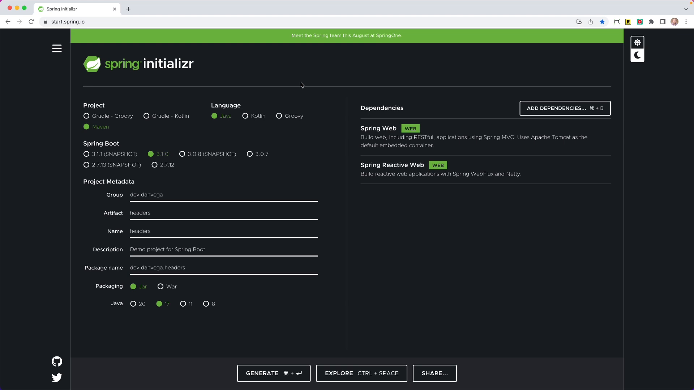

In this article, we'll be exploring how to customize **HTTP interfaces in Spring Boot 3**. This stemmed from a question that popped up during a recent presentation I gave: *How do you add headers to requests?* Be it for a single request, where you may want to add one header and its value, or for multiple or all requests sent to a certain service – how do you accomplish that? This post aims to dive right into these questions!

If you’re new to HTTP Interfaces check out this article for an introduction to what they are and how to get started with them.

## Building a Demo Project

Primarily, our goal here is to have a service within a Spring application, reaching out to another service in your network, be it a Microservice or a public API. Another question that typically arises in this context is: *How do you monitor which headers are being transmitted?* In the case of a browser application, the DevTools allow us to see the request and response. We'll attempt to tackle this conundrum as well in our session.

Let's dive straight into the code.

Our project was initiated on [*Start Spring IO*](https://start.spring.io/) with Maven as the build tool, Java as the language, and the most current version of Spring Boot (3.1.0). Our project name for the purpose of guiding you through this post is "headers". Our language of choice for this project is Java 17. The dependencies we have selected for the demo are Spring Web and Web Flux. Potentially, you might select Spring Web for constructing a REST API, but here we turn to Web Flux albeit not constructing a reactive stack as HTTP interfaces utilize the reactive web client under the hood in Spring Boot. This feature does not necessarily have to be blocking or non-blocking; we'll explore an example further down. We'll now generate our project and launch it in IntelliJ IDEA to get things started.



## Creating a Model

We'll be developing an application within this demo and for that, we need a model. We'll craft a new Java class named ‘Post’, serving as a record in the model package. We’re modelling a blog post here, which includes:

- Integer ID
- Integer user ID
- String title
- String body

The model was designed this way because the service we would be calling adheres to this context. Following the model creation, a new service package was generated. To further illustrate, our service in question is called *JSON Placeholder*. This API provides a collection of resources, one of which has a “/posts” endpoint that syncs well with our established record.

Now we’re all set to formulate a *JSON Placeholder Service*.

## Initiation of JSONPlaceholderService

To get started, we created a Java class and named the interface as JSONPlaceholderService. The main base URL to make a call is "<http://jsonplaceholder.typicode.com>" and the endpoint to fetch posts is "/posts". In our simulation, we want to retrieve all posts. Hence, we establish a GET exchange to Posts, and based on the return type provided, we can decide whether our call is "blocking" or "non-blocking". Here, we don't have to be bothered with blocking or non-blocking status of calls. We set this up by providing a method that simply returns the list of posts when called "FindAll". But, the question arises here, how to send a specific header just for this method?

## Including Request Headers

There are two possible scenarios; either you may want to send a request header alone with the request, or send a header and a value for all requests. To add a request header to the FindAll method, we need to add a request header annotation to the method and provide the headers that need to be sent with the request. We did that by creating a map of headers and passing it to the FindAll method.

```
@GetExchange("/posts")
List<Post> findAll(@RequestHeader Map<String, String> headers);
```

> Blockquote: The `@RequestHeader` annotation indicates that a method parameter should be bound to a Web request header. The method parameter can be a Map&lt;String, String&gt;, MultiValueMap&lt;String, String&gt;, or HttpHeaders and then the map is populated with all header names and values.

Upon running the application, as we can see in the logs, the headers are getting passed to the request. Voila!

You might wonder, what if we want to pass some headers for all requests? The response to that is pretty simple. We just need to set a default header in the client configuration.

```
.defaultHeaders(headers -> headers.add("Spring-Boot-Version","3 10"))
```

Upon re-running the application, as is evident in the logs, we are able to pass the header with request to all methods.

## Conclusion

In this article we've looked into adding headers to requests, and more specifically, how to do it with **HTTP clients interface in Spring Boot 3**. The key takeaways are:

1. To add a header to each request, you can add a default header in client configuration.
2. To add a header to a specific request, you can add a request header annotation to the method along with the headers.
3. To monitor headers in your logs, change the logging level for the web to 'Trace'.

*Note: Please note that the logging level should be reverted back for production.*

Hope this post has been of assistance to you. Keep an eye out for more such informative posts. Until next time, happy coding!
