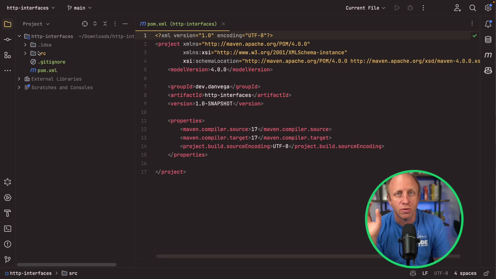
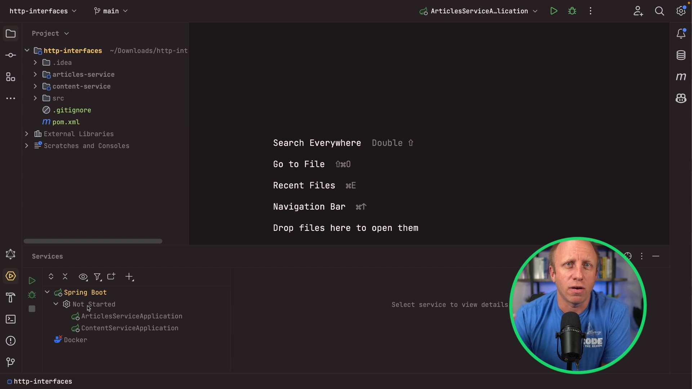
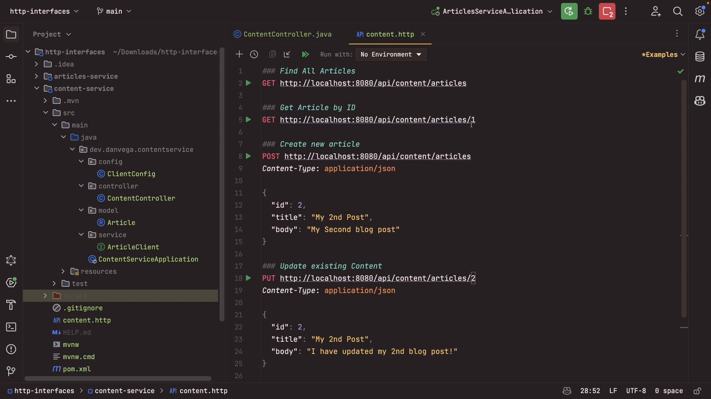

In this blog post, we will explore the concept of HTTP interface clients in the Spring Framework 6 and Spring Boot 3. We will go through the process of creating a full REST API in Spring MVC and then create a new service to consume that API using Spring's HTTP interface clients. This blog post will provide a step-by-step guide and example code snippets to help you understand the implementation details. So, let's get started!

## Table of Contents

- Setting up the Project
- Creating the REST API in the Article Service
- Creating the Article Client in the Content Service
- Testing the Implemented API

## Setting up the Project

Before we dive into the implementation details, we need to set up the project structure. The project will be a Maven multi-module project consisting of two modules: the Article Service and the Content Service. We will create an empty Maven project and add the necessary submodules to it. Let's start by setting up the project in IntelliJ IDEA, although you can use any IDE or text editor of your choice.



Once you have created an empty Maven project, go ahead and create the Article Service and the Content Service as submodules. You can choose the appropriate settings, such as Java version and group ID, according to your preferences. Once the project is set up, you can move on to creating the REST API in the Article Service.



## Creating the REST API in the Article Service

In the Article Service, we will create a REST API using Spring MVC. We will define the necessary CRUD (Create, Read, Update, Delete) operations for managing articles. Let's start by creating the Article class, which will represent the structure of an article in our system. We will define the ID, title, and body fields for the article.

```java
public record Article(Integer id, String title, String body) {}
```

Next, we will create the `ArticleController` class, which will be responsible for handling the HTTP requests related to articles. We will define the necessary methods to handle the CRUD operations. Here's an overview of the methods we will create:

- `findAll`: This method will retrieve all the articles from the service.
- `findById`: This method will retrieve a specific article based on the provided ID.
- `create`: This method will create a new article.
- `update`: This method will update an existing article.
- `delete`: This method will delete an article.

To create the `ArticleController` class, follow these steps:

1. Create a new Java class called `ArticleController` in the `controller` package.
2. Annotate the class with `@RestController` and specify the request mapping for the API, e.g., `@RequestMapping("/api/articles")`.
3. Define a constructor for the class and inject the necessary dependencies, such as the `ArticleRepository`.
4. Implement the CRUD methods mentioned above.

```java
@RestController
@RequestMapping("/api/articles")
public class ArticleController {

    private final List<Article> articles = new ArrayList<>();

    @GetMapping
    public List<Article> findAll() throws InterruptedException {
        Thread.sleep(6000);
        return articles;
    }

    @GetMapping("/{id}")
    public Optional<Article> findById(@PathVariable Integer id) {
        return articles.stream().filter(article -> article.id().equals(id)).findFirst();
    }

    @PostMapping
    @ResponseStatus(HttpStatus.CREATED)
    public void create(@RequestBody Article article) {
        this.articles.add(article);
    }

    @PutMapping("/{id}")
    @ResponseStatus(HttpStatus.NO_CONTENT)
    public void update(@RequestBody Article article, @PathVariable Integer id) {
        var currentArticle = articles.stream().filter(a -> a.id().equals(id)).findFirst();
        currentArticle.ifPresent(value -> this.articles.set(articles.indexOf(value), article));
    }

    @DeleteMapping("/{id}")
    @ResponseStatus(HttpStatus.NO_CONTENT)
    public void delete(@PathVariable Integer id) {
        this.articles.removeIf(a -> a.id().equals(id));
    }

    @PostConstruct
    private void init() {
        Article article = new Article(1,"Hello, World!","This is my first post");
        this.articles.add(article);
    }

}
```

That's it! You have successfully created the REST API in the Article Service. You can test the API endpoints using tools like curl or Postman. Now, let's move on to creating the Article Client in the Content Service.

## Creating the Article Client in the Content Service

In the Content Service, we will create an Article Client using Spring's HTTP interface clients to consume the REST API provided by the Article Service. The Article Client will be responsible for making HTTP requests to the API endpoints of the Article Service and retrieving the necessary data. Let's start by creating the necessary configuration and interface definition.

1. Create a new package called `service` in the Content Service.
2. Create a new class called `ArticleClientConfig` in the `config` package. Annotate it with `@Configuration`.
3. Define a bean for the `ArticleClient` using the `WebClient` builder and specify the base URL of the Article Service API.
4. Create an interface called `ArticleClient` in the `service` package. This interface will define the methods for interacting with the Article Service API.
5. Annotate the `ArticleClient` interface with `@FeignClient` and specify the name of the client, e.g., `@FeignClient("article-service")`.

The `ArticleClient` interface will contain the necessary method declarations for interacting with the Article Service API. The methods will have `@GetMapping`, `@PostMapping`, `@PutMapping`, or `@DeleteMapping` annotations to specify the corresponding HTTP method and URL. Each method will have a returning type according to the expected response from the Article Service API.

Here's an example of the `ArticleClient` interface:

```java
public interface ArticleClient {

    @GetExchange("/articles")
    ResponseEntity<List<Article>> findAll();

    @GetExchange("/articles/{id}")
    Optional<Article> findOne(@PathVariable Integer id);

    @PostExchange("/articles")
    void create(@RequestBody Article article);

    @PutExchange("/articles/{id}")
    void update(@RequestBody Article article, @PathVariable Integer id);

    @DeleteExchange("/articles/{id}")
    void delete(@PathVariable Integer id);
}
```

That's it! You have created the Article Client in the Content Service. The Article Client will utilize the Feign client under the hood to handle the HTTP requests and responses.

## Testing the Implemented API



Now that we have implemented the REST API in the Article Service and created the Article Client in the Content Service, we can test the API endpoints to ensure they work as expected. To test the API, follow these steps:

1. Start both the Article Service and the Content Service applications.
2. Use tools like curl or Postman to make HTTP requests to the API endpoints of the Content Service.
3. Use the Article Client methods in the Content Service to retrieve, create, update, or delete articles in the Article Service.

For example, you can use the following HTTP requests to test the API endpoints:

- To retrieve all articles: GET `http://localhost:8081/api/content/articles`
- To retrieve a specific article: GET `http://localhost:8081/api/content/articles/{id}`
- To create a new article: POST `http://localhost:8081/api/content/articles` with the article data in the request body
- To update an existing article: PUT `http://localhost:8081/api/content/articles/{id}` with the updated article data in the request body
- To delete an article: DELETE `http://localhost:8081/api/content/articles/{id}`

Make sure to replace `{id}` with the actual ID of the article you want to retrieve, update, or delete.

That's it! You have successfully implemented the REST API using HTTP interface clients in the Spring Framework 6 and Spring Boot 3. You now have a fully functional API that can be consumed by other services through the Article Client. This approach helps reduce boilerplate code and simplifies the process of calling external services.

## Conclusion

In this blog post, we covered the concept of HTTP interface clients in the Spring Framework 6 and Spring Boot 3. We explored the process of creating a REST API in the Article Service and consuming it through an Article Client in the Content Service. The use of HTTP interface clients simplifies the process of making HTTP requests to external services and reduces the amount of low-level code that needs to be written. By following the steps and code snippets provided in this blog post, you should now have a good understanding of how to create and utilize HTTP interface clients in your Spring applications.
