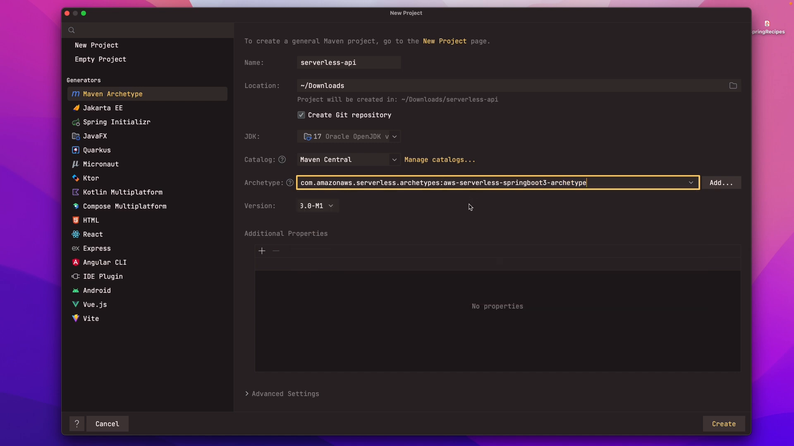
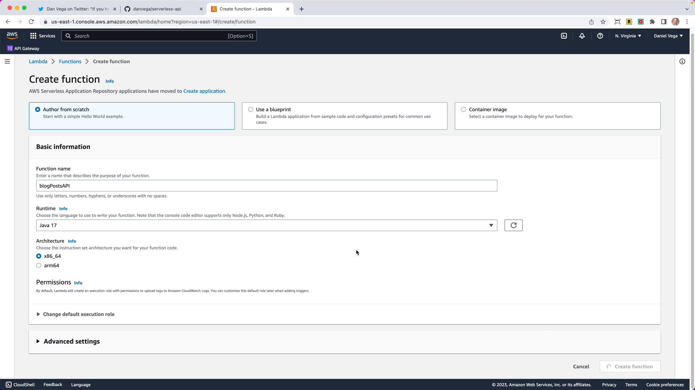
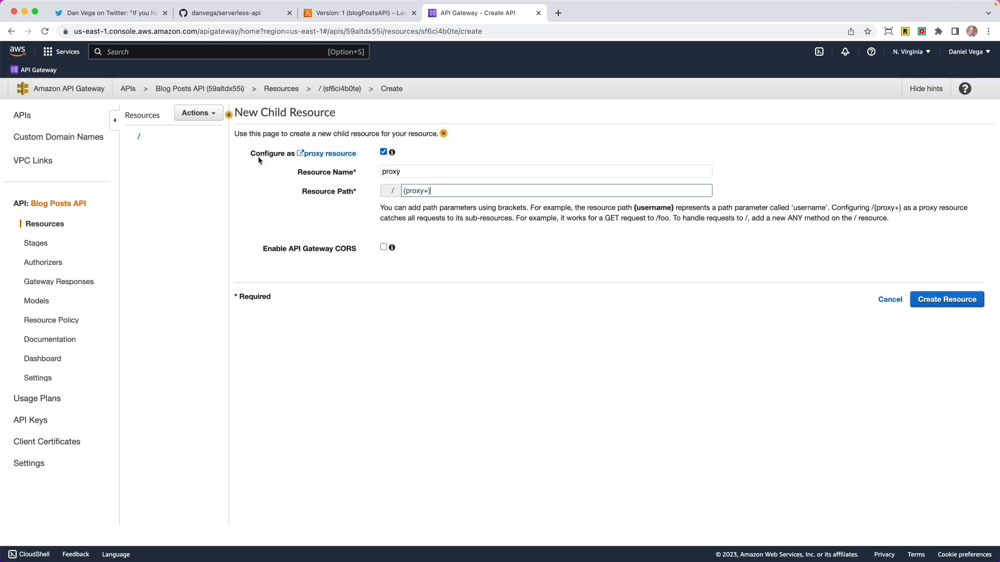

Welcome to this detailed and comprehensive blog post about deploying Spring Boot applications to AWS Lambda! If you've been searching for a solution to hosting your personal Spring Boot projects without breaking the bank, you're in the right place. In this blog post, we'll cover everything you need to know about deploying your Spring Boot apps to AWS Lambda, including why you might want to do it, the benefits of serverless computing, and a step-by-step guide on how to get started.

## Why Deploy to AWS Lambda?

Before we dive into the details of deploying to AWS Lambda, let's take a moment to discuss why you might want to choose this approach. Traditionally, when deploying a Spring Boot application, you would package it as a JAR file and deploy it to a server or containerized it using Docker and deploy it to Kubernetes. While this approach works well, it comes with the responsibility of managing and maintaining your own servers, including patching, security, and scaling.

AWS Lambda, on the other hand, is a serverless compute service that allows you to run code without the need to provision or manage servers. With AWS Lambda, you only pay for the time that you consume, which makes it an ideal solution for personal projects or applications with variable traffic that can scale to zero. By deploying your Spring Boot applications to AWS Lambda, you can offload the burden of server management and focus on developing and delivering your applications.

## The Solution: AWS Lambda

So, what is the solution to your hosting problem? The answer lies in AWS Lambda. In this blog post, we'll be exploring how to deploy entire Spring Boot applications to AWS Lambda, not just individual functions as service, which we've covered in the past.

By leveraging AWS Lambda, you can deploy your Spring Boot applications as serverless functions, taking advantage of the benefits of serverless computing, such as automatic scaling, high availability, and reduced costs. As we mentioned earlier, AWS Lambda is a pay-per-use service, and even better, the free tier includes 1 million free requests per month. This means that for most personal projects, you can deploy them to AWS Lambda without incurring any additional costs.

It's important to note that while we'll be focusing on personal projects in this blog post, AWS Lambda is a versatile solution that can be used for a variety of use cases. Any application with variable traffic that can scale to zero is a great candidate for AWS Lambda.

## Getting Started with AWS Lambda and Spring Boot

Now that we understand why AWS Lambda is a great solution for hosting our personal Spring Boot projects, let's dive into the details of how we can deploy our applications to AWS Lambda.

In the [GitHub repository](https://github.com/danvega/serverless-api) associated with this blog post, you'll find all the code and resources you need to follow along. The first step is to create a new Spring Boot project using a Maven archetype specifically designed for deploying Spring Boot applications to AWS Lambda.

To create the project using IntelliJ, you can use the Maven archetype generator. Alternatively, you can run the following command from the command line:



```bash
mvn archetype:generate \-DarchetypeGroupId=com.amazonaws.serverless.archetypes \-DarchetypeArtifactId=aws-serverless-spring-java-archetype \-DarchetypeVersion=1.0.0 \-DgroupId=com.example \-DartifactId=my-spring-boot-app \-Dversion=1.0.0 \-DinteractiveMode=false
```

Once you've created the project, you'll notice a few important dependencies in the `pom.xml` file. These dependencies include `aws-serverless-java-container-springboot3`, which enables running Spring Boot applications on AWS Lambda, and `spring-boot-starter-web`, which provides the necessary components for building a REST API. Additionally, the `assembly-zip` profile is used to package the application as a ZIP file.

Next, we're going to start building out our Spring Boot REST API. In this example, we'll be creating a blog post API. Our API will have CRUD (Create, Read, Update, Delete) functionality for managing blog posts.

We'll start by creating a Java record called `Post`, which represents a blog post. This record will have properties for `id`, `title`, and `body`.

```java
public record Post(Integer id, String title, String body) {

}
```

Next, we'll create a new class called `PostController`, which will be annotated with `@RestController`. This class will handle requests related to blog posts, such as retrieving all posts, getting a single post by ID, creating a new post, updating an existing post, and deleting a post. The `PostController` class will have an in-memory collection of posts, which we'll initialize with some dummy data.

```java
@RestController
@RequestMapping("/api/posts")
public class PostController {

    private List<Post> posts = new ArrayList<>();

    @GetMapping
    List<Post> findAll() {
        return posts;
    }

    @GetMapping("/{id}")
    Optional<Post> findById(@PathVariable Integer id) {
        return Optional.ofNullable(posts
                .stream()
                .filter(post -> post.id().equals(id))
                .findFirst()
                .orElseThrow(() -> new PostNotFoundException("Post with id: " + id + " not found.")));
    }

    @PostMapping
    void create(@RequestBody Post post) {
        posts.add(post);
    }

    @PutMapping("/{id}")
    void update(@RequestBody Post post, @PathVariable Integer id) {
        posts.stream()
                .filter(p -> p.id().equals(id))
                .findFirst()
                .ifPresent(value -> posts.set(posts.indexOf(value),post));
    }

    @DeleteMapping("/{id}")
    void delete(@PathVariable Integer id) {
        posts.removeIf(post -> post.id().equals(id));
    }

}
```

To populate our in-memory collection, we can use a service called JSONPlaceholder, which provides a fake data API. We'll create a new interface called `JSONPlaceholderService`, which defines a method for loading posts from the JSONPlaceholder API. We'll implement this service to fetch 100 posts and populate our in-memory collection during application initialization.

```java
public interface JsonPlaceholderService {

    @GetExchange("/posts")
    List<Post> loadPosts();

}
```

```java
@SpringBootApplication
public class Application {

    public static void main(String[] args) {
        SpringApplication.run(Application.class, args);
    }

    @Bean
    JsonPlaceholderService jsonPlaceholderService() {
        WebClient client = WebClient.builder()
                .baseUrl("https://jsonplaceholder.typicode.com")
                .build();
        HttpServiceProxyFactory factory = HttpServiceProxyFactory.builder(WebClientAdapter.forClient(client)).build();
        return factory.createClient(JsonPlaceholderService.class);
    }
}
```

```java
@RestController
@RequestMapping("/api/posts")
public class PostController {

    private static final Logger log = LoggerFactory.getLogger(PostController.class);
    private final JsonPlaceholderService jsonPlaceholderService;
    private List<Post> posts = new ArrayList<>();

    public PostController(JsonPlaceholderService jsonPlaceholderService) {
        this.jsonPlaceholderService = jsonPlaceholderService;
    }

    // CRUD methods omitted for brevity

    @PostConstruct
    private void init() {
        // JsonPlaceHolder Service
        if(posts.isEmpty()) {
            log.info("Loading posts using JsonPlaceholderService");
            posts = jsonPlaceholderService.loadPosts();
        }
    }
}
```

Once we have our Spring Boot application and REST API set up, we can proceed to package and deploy our application to AWS Lambda.

## Packaging and Deploying to AWS Lambda

To package our application, we can use Maven. From the terminal, navigate to the root directory of your project and run the following command:

```bash
mvn clean package
```

This command will create a ZIP file in the `target` directory, which contains our packaged application.

With our packaged application in hand, we can now proceed to deploy it to AWS Lambda. To create a new Lambda function, navigate to the AWS Management Console and select AWS Lambda. Click on "Create function" and choose the "Author from scratch" option.



In the function creation wizard, provide a name for your function and select "Java 17" as the runtime. Note that we'll be using the x86 architecture, as there are some limitations with Snapstart and Java 17 on other architectures.

After creating the function, you'll need to upload the ZIP file containing your packaged application. Click on "Upload" and select the ZIP file from your local machine.

Next, we need to configure the runtime settings and set the handler for our Lambda function. The handler is the entry point for our application and determines how requests are processed. In our case, the handler class is named `dev.danvega.StreamLambdaHandler` and the method to handle requests is `handleRequest`. Once you've set the handler, click "Save" to apply the configuration.

To test the Lambda function, you can use the AWS Management Console. Select the function, click on "Test", and create a new test event using the "API Gateway AWS Proxy" template. Fill in the necessary details, such as the path to the resource you want to test, and click "Create".

If everything is set up correctly, you should see a successful response from your Lambda function. You can also use the test event to verify that the different endpoints of your REST API are working as expected.

Now that we have our Lambda function up and running, we can create an API Gateway to serve as the front-end for our application. The API Gateway will act as a proxy, forwarding incoming requests to our Lambda function.

## Creating an API Gateway

To create an API Gateway, navigate to the AWS Management Console and select API Gateway. Click on "Create API" and choose the "REST API" option.

Provide a name for your API and choose "Create API". This will create a new REST API in API Gateway.

To define the resources and methods for our API, we'll create a new resource for each endpoint of our REST API. For example, if we have an endpoint `/posts`, we'll create a resource named "Posts". Under each resource, we can define the HTTP methods that are allowed, such as GET, POST, PUT, and DELETE.



To configure the integration between the API Gateway and our Lambda function, select a resource and method, and click on "Integration Request". Choose the Lambda function as the integration type and select the appropriate Lambda function from the list. Click "Save" to apply the changes.

Once the integration is set up, you can deploy your API by creating a new stage. This will provide you with a unique Invoke URL that you can use to access your API.

Congratulations! You have successfully deployed your Spring Boot application to AWS Lambda using API Gateway as a front-end proxy. You can now access your REST API using the provided Invoke URL.

## Conclusion

In this comprehensive blog post, we explored the process of deploying Spring Boot applications to AWS Lambda. We discussed the benefits of serverless computing, such as automatic scaling, reduced costs, and high availability. By leveraging AWS Lambda, you can offload the burden of server management and focus on developing and delivering your applications.

We walked through the process step-by-step, from creating a new Spring Boot project using a Maven archetype specifically designed for AWS Lambda, to packaging and deploying the application to AWS Lambda using the AWS Management Console.

Now that you have the knowledge and resources to deploy your Spring Boot applications to AWS Lambda, you can unlock the power of serverless computing and take your projects to the next level.

If you have any questions or need further assistance, please don't hesitate to leave a comment and I'll be happy to help. I hope you found this blog post helpful and informative. As always, happy coding, friends!
