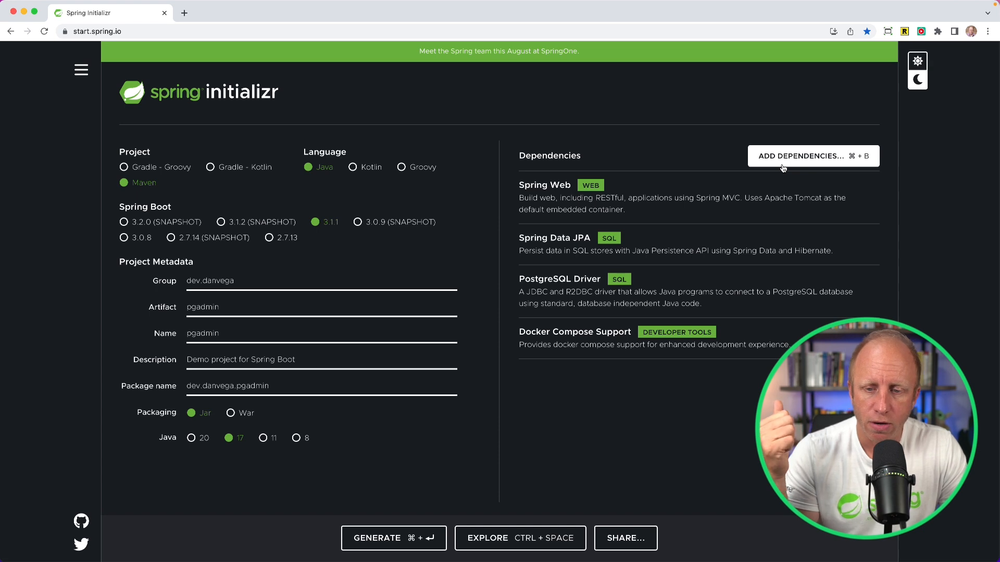

If you have been following this channel, you know that Im am a big fan of GraphQL, especially when paired with Spring. Today, we will delve into some exciting new releases in Spring for GraphQL and share how they can improve your development workflow.

I've created a number of tutorials centred on these recent updates but thought it appropriate to kick things off by examining the inspection report. A lesser-known feature to many, the inspection report can be an absolute game changer in how you troubleshoot issues in your GraphQL schema.

Let's dive in!

## What is the Inspection Report in GraphQL?

While working with GraphQL, you often start with writing your schema, in what's known as the schema-first approach. You may write a controller with methods typically referred to as "data fetchers" or "data resolvers" that pair with your schema. There are certain situations where mismatches can occur between the schema and the class on the Java side or between the schema and controller methods. These mismatches tend to create confusion since it might be challenging to pinpoint where things went awry.

Often, it's difficult to determine if the returned null is genuine because no data was found, or it resulted from a missing mapping. This is where the inspection report swoops in to save the day, providing a seamless way to troubleshoot these inconsistencies.

By enabling an opt-in inspection feature, you can configure your system to generate a report delineating what's happening in your schema. This, in turn, allows you to spot what's missing quickly and efficiently.

Today, we'll create a sample application around the idea of conference events and sessions using this fabulous feature. Our mission will be to establish a simple project, thereby illustrating how to use the inspection report and how it can significantly improve your GraphQL debugging experience.

## Beginning Our Project: The Building Blocks

To kick off our project, we'll use [Spring Initializr](https://start.spring.io). We will choose a Maven project using Java, with Web and Spring for GraphQL as our only dependencies.



Please note that the version used in this blog is 3.1.1, which is the latest version at the time of writing. With our project generated and opened in our favorite ID or editor, we will commence with writing some code.

### Adding a Schema

Create a new file called `schema.graphqls` in `/src/main/resources/graphql` which will contain our schema. In terms of creating a schema, we have the freedom to start with any root-level operation types, such as query, mutation, and subscription. In this case, we'll begin by modelling a conference event as an object type, which we'll name `Event`. It features properties such as:

- ID
- Name
- Description
- Start date
- End date
- CFP start date (Call for Proposals start date)
- CFP end date
- Location
- Website

The event details are expected to be of a certain type. For instance, the `ID` is an identifier type, `name` and `location` are strings, `start date` and `end date` are dates, while `website` is a URL.

```graphql
type Event {
  id: ID!
  name: String!
  description: String
  startDate: Date
  endDate: Date
  cfpStartDate: Date
  cfpEndDate: Date
  location: String
  website: URL
}
```

Notice that the `Date` and `URL` are not built-in types which means we need to declare them as extended scalars. If you need more examples on how to handle extended scalar types in GraphQL, check out this [previous video tutorial](https://youtu.be/ooknmgr4WiA).

Here's some code on how you can add the `Date` and `URL` extended scalars.

```xml
<dependency>
  <groupId>com.graphql-java</groupId>
  <artifactId>graphql-java-extended-scalars</artifactId>
  <version>20.0</version>
</dependency>
```

```java
@Configuration
public class GraphQlConfiguration {

    private static final Logger log = LoggerFactory.getLogger(GraphQlConfiguration.class);

    @Bean
    public RuntimeWiringConfigurer runtimeWiringConfigurer() {
        return wiringBuilder -> wiringBuilder
                .scalar(ExtendedScalars.Date)
                .scalar(ExtendedScalars.Url);
    }
}
```

```graphql
scalar Date @specifiedBy(url:"https://tools.ietf.org/html/rfc3339")
scalar Url @specifiedBy(url:"https://www.w3.org/Addressing/URL/url-spec.txt")
type Event {
    id: ID!
    name: String!
    description: String!
    startDate: Date!
    endDate: Date!
    cfpStartDate: Date!
    cfpEndDate: Date!
    location: String
    website: Url
    sessions(first: Int,last: Int,before: String,after: String): SessionConnection
}

```

At this point, we have a schema in place for our GraphQL API.

## Java Side: Adding a Spring Record

To mirror the GraphQL schema in our Java code, we create a new package for events, `com.example.demo.event` package. This will contain a `spring record` named `Event`, which will contain two properties initially: integer `id` and string `name`.

```java
public record Event(@NotBlank Integer id,@NotBlank String name) {}
```

When we define a query and then run the application, we notice that everything starts up correctly with no obvious indications of any mismatches. However, when we run some query requests, they return `null`.

## How to Enable GraphQL Inspection Reports: Unmasking Mismatches

To avoid confusion and make diagnosing mismatches easier, we can enable the inspection feature of GraphQL to check that all schema fields have a corresponding data fetcher. There are two main steps involved in enabling inspection reports:

1. Enable introspection in the `application.yml` or `application.properties` file by setting the property `spring.graphql.schema.introspection.enabled` to true:

```properties
spring.graphql.schema.introspection.enabled=true
```

2. Add a custom bean to the source builder of your GraphQL API which will handle the report. You access the report and choose what to do with it. In our case, we'll log it as a string.

```java
@Configuration
public class GraphQlConfiguration {

    private static final Logger log = LoggerFactory.getLogger(GraphQlConfiguration.class);

    @Bean
    GraphQlSourceBuilderCustomizer inspectionCustomizer() {
        return source -> source.inspectSchemaMappings(report -> log.info(report.toString()));
    }
}
```

The complete configuration of the `GraphQLConfig` class also includes declaring exposure of extended scalars, such as `Date` and `URL`, using a `RuntimeWiringConfigurer` bean. Here's how that entire class could look like:

```java
@Configuration
public class GraphQlConfiguration {

    private static final Logger log = LoggerFactory.getLogger(GraphQlConfiguration.class);

    @Bean
    public RuntimeWiringConfigurer runtimeWiringConfigurer() {
        return wiringBuilder -> wiringBuilder
                .scalar(ExtendedScalars.Date)
                .scalar(ExtendedScalars.Url);
    }

    @Bean
    GraphQlSourceBuilderCustomizer inspectionCustomizer() {
        return source -> source.inspectSchemaMappings(report -> log.info(report.toString()));
    }
}
```

With the inspection report enabled, it becomes straightforward to identify that there is an "unmapped field" `events` in our query. We can infer that the query `events` does not map to any controller method in our schema. If you run the application you should see the report logged to the console:

```bash
Unmapped fields: {Event=[description, startDate, endDate, cfpStartDate, cfpEndDate, location, website]}
Unmapped registrations: {}
Skipped types: []
```

## Wrapping Up

While it may seem subtle, the inspection report is an incredibly powerful feature in Spring for GraphQL. It enhances the ease of troubleshooting potential mismatches between your GraphQL schema and Java code, saving you lots of time in your debugging.

I'll be creating more tutorials on Spring GraphQL, including best practices on paging and sorting. If you find this interest in these topics, please let me know.

Happy coding!
