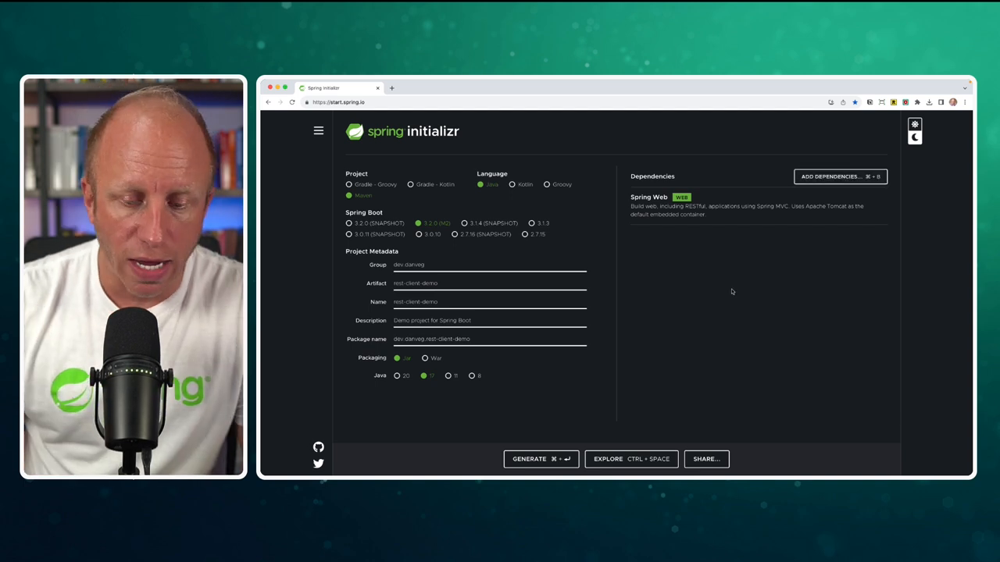

# Exploring the New REST Client in Spring Boot 3.2

Greetings, folks! It's Dan Vega, Spring developer advocate at VMware. Today, I am thrilled to dive into Spring Boot 3.2 and its new REST client. But before we do, let's take a moment to examine our journey to this moment.

## From Start to REST Client

The term "client" in the context of REST refers to a method for invoking another REST API within our organization, or perhaps a public API. In the Spring framework world, we've had numerous implementations of [REST clients](https://docs.spring.io/spring-framework/reference/integration/rest-clients.html), and today we'll touch on a few of those.

If you're developing a Spring MVC application, a blocking application, you'd traditionally use something like the [RestTemplate](https://docs.spring.io/spring-framework/reference/integration/rest-clients.html#rest-resttemplate). `RestTemplate` is fantastic — it offers numerous overloaded methods and the ability for us to construct a service that calls another service. However, the myriad of overloaded methods can lead to confusion about which method is appropriate for the scenario you're addressing.

Next up, we had the [WebClient](https://docs.spring.io/spring-framework/reference/web/webflux-webclient.html). In the reactive space, with Spring WebFlux, we needed a fresh client. The `WebClient` took a plethora of lessons from the `RestTemplate` and enhanced upon them, with the beautiful bonus of a fluent API, allowing a graceful and straightforward declaration of service-to-service communication.

Fast forward to the introduction of `RestClient`. The RestClient took a lot from the WebClient and applied it to Spring MVC. The key advantage here is that you can use it in your MVC applications without having to bring in an external dependency.

What's really fascinating to note is the support for HTTP interfaces that came in Spring Boot 3 and Spring Framework 6. This support extends to the RestClient as well. This means you no longer need to include the Spring WebFlux dependency to utilize HTTP interfaces.

Let's create a small CRUD service application that uses the Rest client to make a call to a public API. Excited? Let's create a new application on [start.spring.io](http://start.spring.io)!

## Building an Application

Start off by selecting a project type like Maven and choosing Java as your language. I'm using Spring's Boot 3.2.0, Milestone 2. If you're tuning in from the future, please go ahead with the most current milestone release of 3.2, or perhaps 3.2+ if it's publicly available.



Once you've entered your group and project names, choose Spring Web for your dependencies. Our application will be auto-configured, and we'll have access to the Rest client in all of our classes. Let's generate our application. Upon doing this, a zip file will be downloaded. Open it up in your IDE or text editor of choice - I'll be using IntelliJ Ultimate Edition.

## Coding the Application

The application we're creating is aimed at calling a public service known as [JSONPlaceholder](https://jsonplaceholder.typicode.com/) – it's a super useful, free API we can use for testing. Our system will be modeled around the post schema of JSONPlaceholder.

To get started, you need to make new packages and create a Java record called Post to represent a post entity.

```java
public record Post(Integer id, Integer userId, String title, String body){

}
```

Now let's create a PostController class marked with the `@RestController` annotation and set up a PostService through constructor injection. Put simply, controllers receive requests, delegate to another class for business logic, and return responses.

```java
@RestController
@RequestMapping("/api/posts")
public class PostController {

    private final JsonPlaceholderService postService;

    public PostController(JsonPlaceholderService postService) {
        this.postService = postService;
    }

    @GetMapping("")
    List<Post> findAll() {
        return postService.findAll();
    }

    @GetMapping("/{id}")
    Post findById(@PathVariable Integer id) {
        return postService.findById(id);
    }

    @PostMapping
    @ResponseStatus(HttpStatus.CREATED)
    Post create(@RequestBody Post post) {
        return postService.create(post);
    }

    @PutMapping("/{id}")
    Post update(@PathVariable Integer id, @RequestBody Post post) {
        return postService.update(id, post);
    }

    @DeleteMapping("/{id}")
    @ResponseStatus(HttpStatus.NO_CONTENT)
    void delete(@PathVariable Integer id) {
        postService.delete(id);
    }

}
```

In the PostService class, we're going to create an instance for our client. This is where the action really starts. We use the builder method to pass in a base URL (the endpoint of the service you're calling) and build the RestClient.

```java
@Service
public class PostService {

    private final RestClient restClient;

    public PostService() {
        restClient = RestClient.builder()
                .baseUrl("https://jsonplaceholder.typicode.com")
                .build();
    }

}
```

Then we need to create methods to interact with our service, such as a `findAll` method to get all of the posts in the system.

```java
public List<Post> findAll() {
    return restClient.get()
            .uri("/posts")
            .retrieve()
            .body(new ParameterizedTypeReference<List<Post>>() {});
}
```

Just run your Spring Boot application, and if it starts up fine, you can test it out using an HTTP client to list the posts.

```http
GET http://localhost:8080/api/posts
```

To further demonstrate the elegance of the RestClient, let's create a few more methods - for creating, updating, and deleting posts. Once you've written the methods, it's straightforward to test them all in an HTTP client.

```java
@Service
public class PostService {

    private final RestClient restClient;

    public PostService() {
        restClient = RestClient.builder()
                .baseUrl("https://jsonplaceholder.typicode.com")
                .build();
    }

    public List<Post> findAll() {
        return restClient.get()
                .uri("/posts")
                .retrieve()
                .body(new ParameterizedTypeReference<List<Post>>() {});
    }

    public Post findById(Integer id) {
        return restClient.get()
                .uri("/posts/{id}", id)
                .retrieve()
                .body(Post.class);
    }

    Post create(Post post) {
        return restClient.post()
                .uri("/posts")
                .contentType(MediaType.APPLICATION_JSON)
                .body(post)
                .retrieve()
                .body(Post.class);
    }

    Post update(Integer id, Post post) {
        return restClient.put()
                .uri("/posts/{id}", id)
                .contentType(MediaType.APPLICATION_JSON)
                .body(post)
                .retrieve()
                .body(Post.class);
    }

    void delete(Integer id) {
        restClient.delete()
                .uri("/posts/{id}", id)
                .retrieve()
                .toBodilessEntity();
    }


}
```

```http
### List Posts
GET http://localhost:8080/api/posts

### Get Post by ID
GET http://localhost:8080/api/posts/1

### Create new Post
POST http://localhost:8080/api/posts
Content-Type: application/json

{
  "title": "Dan's Test Title",
  "body": "Dan's Test Body",
  "userId": 1
}

### Update Post
PUT http://localhost:8080/api/posts/1
Content-Type: application/json

{
  "id": 1,
  "title": "UPDATED TITLE",
  "body": "UPDATED BODY",
  "userId": 1
}

### Delete Post
DELETE http://localhost:8080/api/posts/1
```

At this point, you can see how effortlessly we've made connections to a public API using the Rest Client. I hope what comes thorugh in the tutorial is the simplicity of the API and the readability of the code.

## HTTP Interfaces + REST Client

To save you from the manual implementation of all connectivity details, Spring Boot 3.0 introduced HTTP interfaces. Essentially, you define the contracts for your HTTP requests in an interface and allow Spring to fill in the implementation details at runtime.

The novelty here is that while you needed the WebClient to utilize HTTP interfaces in Spring Boot 3.0, Spring MVC applications that leverage RestClient can now use HTTP interfaces natively, sidestepping the need to add an additional dependency to your Maven configuration.

```java
public interface JsonPlaceholderService {

    @GetExchange("/posts")
    List<Post> findAll();

    @GetExchange("/posts/{id}")
    Post findById(Integer id);

    @PostExchange("/posts")
    Post create(Post post);

    @PutExchange("/posts/{id}")
    Post update(@PathVariable Integer id, Post post);

    @DeleteMapping("/posts/{id}")
    void delete(@PathVariable Integer id);

}
```

```java
@SpringBootApplication
public class Application {

	public static void main(String[] args) {
		SpringApplication.run(Application.class, args);
	}

	@Bean
	JsonPlaceholderService jsonPlaceholderService() {
		RestClient client = RestClient.create("https://jsonplaceholder.typicode.com");
		HttpServiceProxyFactory factory = HttpServiceProxyFactory
				.builderFor(RestClientAdapter.create(client))
				.build();
		return factory.createClient(JsonPlaceholderService.class);
	}

}
```

## Wrapping Up

And that's it, folks! With the new RestClient, you'll find your Spring Boot app development journey easier and more enjoyable. The fluent API, fantastic readability, and compatibility with HTTP Interfaces make a compelling case for adopting the RestClient.

Remember, your feedback is valuable. So feel free to drop a comment if you've started tinkering with the RestClient and what you think about it.
