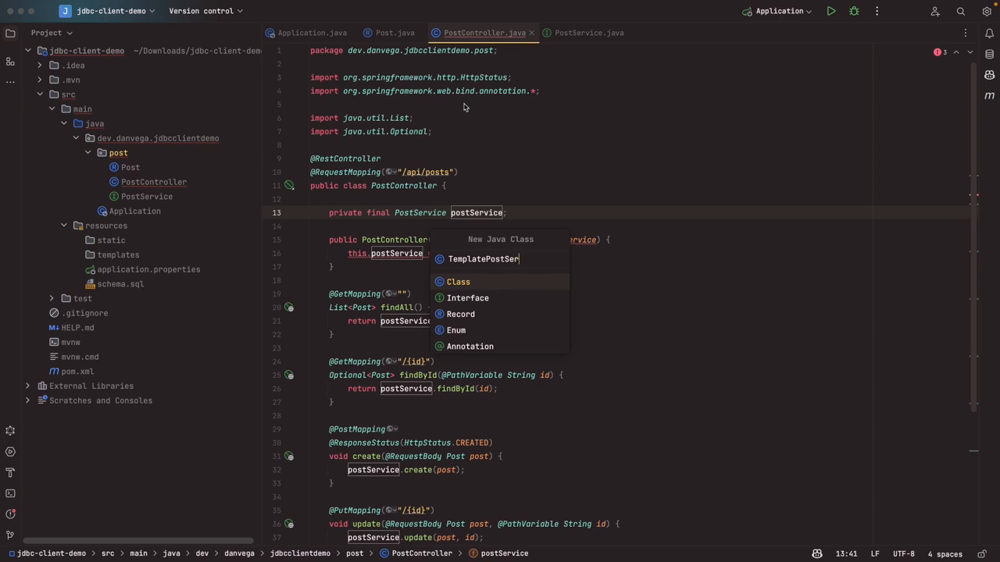

# A First Look at Spring Framework's New JDBC Client

In this tutorial, we'll be diving into the fresh waters of the new JDBC client in Spring Framework 6.1 and Spring Boot 3.2.

We'll be not only reviewing how to use it but also discussing some of the associated advantages. So, without further ado, let's delve into it.

## Remembering the Journey - JDBC Template

Before we get started, let's talk about how we got here. Interacting with the database, reading and persisting data in Java has historically been quite complex.

You need to consider a lot of factors, like building JDBC URLs, managing database connections, dealing with real-world application concerns such as connection pools, etc. Fortunately, Spring came to our rescue and made these tasks more manageable through its abstractions. One of such is the JDBC template in Spring.

The JDBC template is a solid abstraction that simplified our interaction with databases. However, it has a few cons as it can get pretty verbose if you're building simple CRUD services based on resources. It demands a deeper understanding of all the methods you need to communicate with a database - factors like row mappers, column to field mapping and so on - which can be pretty tricky.

Despite these complexities, one main advantage is the complete control over SQL, which is highly appreciated amongst developers.

## Introducing the New JDBC Client

This is where the newest kid on the block - the JDBC client, comes in. Among the things it brings to the table is a fluent API, which is a breeze to understand and read. You'll see this when we glance over the code.

One exciting feature with the JDBC client is that it's auto-configured for us in Spring Boot 3.2. This means we can simply ask for a bean in our application, and we get an instance of it, hassle-free!

## Diving Deep Into Code

Let's get to the fun part - the coding! Being a massive fan of the new JDBC client, I trust that you will love it too!



### Step 1: Creating a New Application

For this demo, we'll create a brand-new application and set up database access to a local H2 database. For the starter, we are going to use the [Spring Initializr](https://start.spring.io/) which allows you to quickly prototype your application.

After generating the skeleton of your Maven project, import it in your favorite IDE or text editor.

### Step 2: Building the Application

We'll start by creating a `Post` class, which represents a blog post in our application. It's a basic record with properties like `ID`, `title`, `slug`, `localDateTime`, `tags`, etc.

```java
public record Post(String id, String title, String slug, LocalDate date, int timeToRead, String tags) {

}
```

Next, we'll create a `PostController` that will act as a REST controller. It will respond to a request mapping of "api/posts". For this controller, we'll wire in a `PostService`.

```java
@RestController
@RequestMapping("/api/posts")
public class PostController {

    private final PostService postService;

    public PostController(PostService postService) {
        this.postService = postService;
    }

    @GetMapping("")
    List<Post> findAll() {
        return postService.findAll();
    }

    @GetMapping("/{id}")
    Optional<Post> findById(@PathVariable String id) {
        return postService.findById(id);
    }

    @PostMapping
    @ResponseStatus(HttpStatus.CREATED)
    void create(@RequestBody Post post) {
        postService.create(post);
    }

    @PutMapping("/{id}")
    void update(@RequestBody Post post, @PathVariable String id) {
        postService.update(post, id);
    }

    @DeleteMapping("/{id}")
    void delete(@PathVariable String id) {
        postService.delete(id);
    }

}
```

Crucially, it's important to provide implementations for the `PostService` concerning the two types of JDBC that we're discussing. For this, it involves creating an interface and then defining several methods like `findAll`, `findById`, `create`, `update`, and `delete`.

```java
public interface PostService {

    List<Post> findAll();

    Optional<Post> findById(String id);

    void create(Post post);

    void update(Post post, String id);

    void delete(String id);

}
```

### Step 3: Connecting to the Database

Before we progress, we need to ensure that we can connect to a database. For that, we'll create a `schema.sql` file that will define our database table structure, which should correspond to the `Post` record we've created.

```sql
DROP TABLE IF EXISTS Post;

CREATE TABLE Post (
  id varchar(255) NOT NULL,
  title varchar(255) NOT NULL,
  slug varchar(255) NOT NULL,
  date date NOT NULL,
  time_to_read int NOT NULL,
  tags varchar(255),
  PRIMARY KEY (id)
);
```

You will also need to update `application.properties` to include the database connection details.

```properties
spring.datasource.generate-unique-name=false
spring.datasource.name=blog
spring.h2.console.enabled=true
```

Remember, since we are not utilizing something like JPA, we must create our table. With all these in place, our application should be ready to launch.

### Step 4: Implementing the JDBC template

Create a `TemplatePostService` class. The task here is to implement all the methods that we previously defined in the `PostService` interface.

For each method, we'll employ the JDBC template to write SQL queries. On a general note, each query method in the JDBC template will necessitate a row mapper to map columns in the database table to the `Post` record, which can be quite tasking.

```java
@Service
public class TemplatePostService implements PostService {

    private static final Logger log = LoggerFactory.getLogger(TemplatePostService.class);
    private final JdbcTemplate jdbcTemplate;

    public TemplatePostService(JdbcTemplate jdbcTemplate) {
        this.jdbcTemplate = jdbcTemplate;
    }

    RowMapper<Post> rowMapper = (rs, rowNum) -> new Post(
            rs.getString("id"),
            rs.getString("title"),
            rs.getString("slug"),
            rs.getDate("date").toLocalDate(),
            rs.getInt("time_to_read"),
            rs.getString("tags")
    );

    @Override
    public List<Post> findAll() {
        var sql = "SELECT id,title,slug,date,time_to_read,tags FROM post";
        return jdbcTemplate.query(sql, rowMapper);
    }

    @Override
    public Optional<Post> findById(String id) {
        var sql = "SELECT id,title,slug,date,time_to_read,tags FROM post WHERE id = ?";
        Post post = null;
        try {
            post = jdbcTemplate.queryForObject(sql,rowMapper,id);
        } catch (DataAccessException ex) {
            log.info("Post not found: " + id);
        }

        return Optional.ofNullable(post);
    }

    @Override
    public void create(Post post) {
        String sql = "INSERT INTO post(id,title,slug,date,time_to_read,tags) values(?,?,?,?,?,?)";
        int insert = jdbcTemplate.update(sql,post.id(),post.title(),post.slug(),post.date(),post.timeToRead(),post.tags());
        if(insert == 1) {
            log.info("New Post Created: " + post.title());
        }
    }

    @Override
    public void update(Post post, String id) {
        String sql = "update post set title = ?, slug = ?, date = ?, time_to_read = ?, tags = ? where id = ?";
        int update = jdbcTemplate.update(sql,post.title(),post.slug(),post.date(),post.timeToRead(),post.tags(),id);
        if(update == 1) {
            log.info("Post Updated: " + post.title());
        }
    }

    @Override
    public void delete(String id) {
        String sql = "delete from post where id = ?";
        int delete = jdbcTemplate.update(sql,id);
        if(delete == 1) {
            log.info("Post Deleted: " + id);
        }
    }
}
```

This is just to show off an example of how to use the JDBC Template so you can compare it to the JDBC Client.

### Step 5: Using the JDBC Client

Now, we're going to simplify things. We've seen the `TemplatePostService`; now it's time to bring in the sleek `ClientPostService`. This class implements the `PostService` interface, with similar methods to those we have already discussed.

We'll start by obtaining an instance of the JDBC client. Just like the JDBC template for `TemplatePostService`, the auto-configured JDBC client of Spring Boot 3.2 is handed over to us.

```java
@Service
public class ClientPostService implements PostService {

  private final JdbcClient jdbcClient;

  public ClientPostService(JdbcClient jdbcClient) {
    this.jdbcClient = jdbcClient;
  }

  @Override
  public List<Post> findAll() {
    return jdbcClient.sql("SELECT id,title,slug,date,time_to_read,tags FROM post")
      .query(Post.class)
      .list();
  }

  @Override
  public Optional<Post> findById(String id) {
    return jdbcClient.sql("SELECT id,title,slug,date,time_to_read,tags FROM post WHERE id = :id")
      .param("id", id)
      .query(Post.class)
      .optional();
  }

  @Override
  public void create(Post post) {
    int update = jdbcClient.sql("INSERT INTO post(id,title,slug,date,time_to_read,tags) values(?,?,?,?,?,?)")
      .params(List.of(post.id(), post.title(), post.slug(), post.date(), post.timeToRead(), post.tags()))
      .update();

    Assert.state(update == 1, "Failed to create post " + post.title());
  }

  @Override
  public void update(Post post, String id) {
    var updated = jdbcClient.sql("update post set title = ?, slug = ?, date = ?, time_to_read = ?, tags = ? where id = ?")
      .params(List.of(post.title(), post.slug(), post.date(), post.timeToRead(), post.tags(), id))
      .update();

    Assert.state(updated == 1, "Failed to update post " + post.title());
  }

  @Override
  public void delete(String id) {
    var updated = jdbcClient.sql("delete from post where id = :id")
      .param("id", id)
      .update();

    Assert.state(updated == 1, "Failed to delete post " + id);
  }

}
```

The JDBC client has a cleaner and much more readable interface compared to the JDBC template, making writing code smoother and more intuitive.

### Step 6: Using the new Post Service

As the final step, we'll swap the JDBC template version of our `PostService` with the JDBC client version in the `PostController` class. When the type is
`PostService` are there are 2 implementations you need to be explicit about which implementation Spring should select. There are a few
ways to do this but one way is to use the `@Qualifier` annotation.

```java
@RestController
@RequestMapping("/api/posts")
public class PostController {

    private final PostService postService;

    public PostController(@Qualifier("clientPostService") PostService postService) {
        this.postService = postService;
    }

    // ...

}
```

```java
@SpringBootApplication
public class Application {

	public static void main(String[] args) {
		SpringApplication.run(Application.class, args);
	}

	@Bean
	CommandLineRunner commandLineRunner(@Qualifier("clientPostService") PostService postService) {
		return args -> {
			postService.create(new Post("1234", "Hello World", "hello-world", LocalDate.now(), 1, "java, spring"));
		};
	}

}
```

In navigating to our localhost API in the browser, we should see a collection of all the posts we have inserted and check individual post records by id. For non-existing records, a null result will be returned.

## Conclusion

That concludes our exploration of the new JDBC Client in the Spring Framework 6.1 and Spring Boot 3.2. Once again, Spring has introduced a tool that simplifies otherwise complex tasks – a fluent API with easy setup for smooth use in your spring project.

> "Simplicity is the ultimate sophistication" - Leonardo da Vinci.
