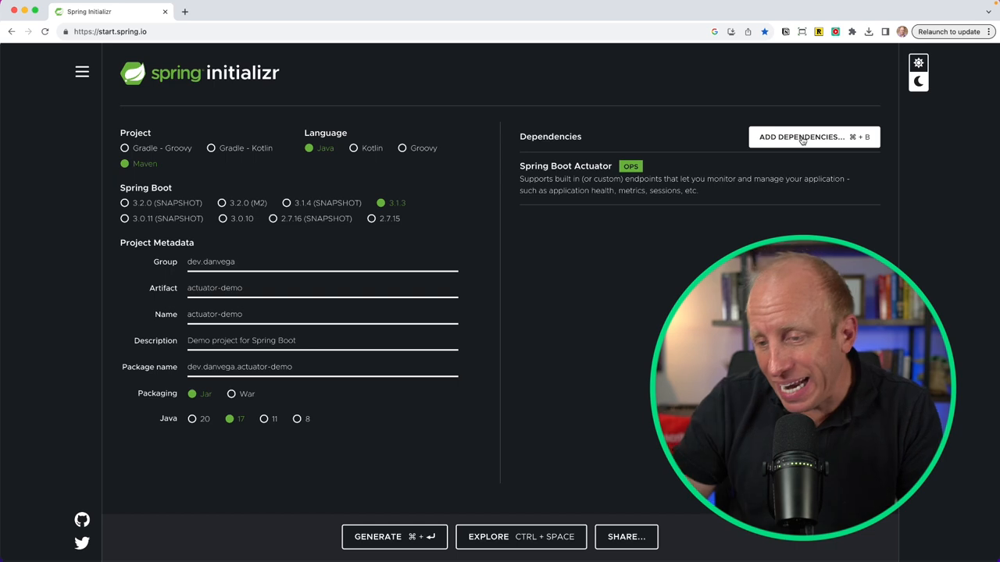

In this article, we will focus on the most important Spring Boot starter that you should include in all of your projects. When creating a new Spring Boot Application, you have multiple choices for the dependencies you should include based on what you're building. While this is just my opinion, I will share what I believe is the number one Spring Boot Starter that you should include in each of your applications. Before reading the entire article, do you have any guesses?

## What is a Spring Boot Starter

For those who are not familiar with the concept, Spring Boot Starters are a set of convenient dependency descriptors that you can include in your application. You get a one-stop-shop for all the Spring and related technology you may need. Basically, starters are a set of convenient dependency bundles that you can include in your application.

You head over to [start Spring IO](https://start.spring.io/), fill in some metadata about your project, and then shift over to the right side of the screen. Here you have a plethora of dependencies to choose from.

The pivotal question here is: From this vast range of dependencies, which one should you include in every project you create?

There's no universally correct answer to this question, as it largely hinges on your specific project requirements. However, in this post, I am sharing my opinion or rather the solution that I religiously follow - Include the Spring Boot Actuator in every single project.


## Why the Spring Boot Actuator?

Our ultimate goal while developing a new application is to usher it to the promised land - production. Regardless of whether you're building a straightforward demo, an MVP (Minimum Viable Product), or even the next-gen SaaS offering, the application should be production-ready.

This is where the [Spring Boot Actuator](https://docs.spring.io/spring-boot/docs/current/reference/html/actuator.html) comes into play.

It offers several additional features to monitor and manage your application when you push it into production, providing invaluable insights into app functionality. This is much beyond merely pushing code into production and waiting for traffic.

The Spring Boot Actuator fosters a solid understanding of what's happening within your app.

## Setting the Stage: Building a New Application

In today's discussion, the primary objectives are:

- Building a new application from scratch,
- Incorporating Spring Boot Actuator,
- Discussing what you get out of the box,
- Exploring potentials to configure it,
- Reviewing several endpoints that arrive with Spring Boot Actuator.

In addition to this, we will also delve into creating your custom endpoints for tailoring added functionality within the actuator.

So, are we all set for an exciting journey into the realm of the Spring Boot Actuator? Well, let's roll up our sleeves and get coding!

## Creating a New Project with Spring Boot Actuator

To kickstart our process, navigate to start Spring IO and create a new project. Here's a step-by-step guide to assist you with this:

- Choose maven java as your project type.
- Select the latest stable release of Spring Boot, the current one being 3.1.3.
- Fill in the metadata, say, developer name - Dan Vega, and project name - actuator demo.
- Click on dependencies and choose Spring Boot Actuator.
- Depending on the type of application, you can add other dependencies. In this case, I will keep the app simple and include the web dependency for building a web application.
- Finally, generate the project, download the zip file, and open it in your preferred IDE (Integrated Development Environment).



Now that we have a new project with the Spring Boot Actuator dependency configured, it's time to explore what the actuator brings to the table and how we can leverage it to its optimum potential.

## Running the Application: Taking a Peep Underneath the Hood

If you do nothing and just run the application as is you will see in the console that there is mapping exposed at “/actuator”. Head over to your browser and open http://localhost:8080/actuator.

Here, you will notice some exposed endpoints. Start your exploration with the Health endpoint; it will display a status of "up." This status update is an indicator for other applications about the functioning status of your application.

However, out-of-the-box, Spring Boot Actuator doesn't offer much. To understand why, let's hop over to the documentation.

## Diving Deeper into the Spring Boot Actuator

Examining the [Spring Boot documentation](https://docs.spring.io/spring-boot/docs/current/reference/htmlsingle/#production-ready), you can find a section titled "Production-ready features." Here's where you will encounter details about the Actuator, Endpoints, metrics observability, etc.

The Actuator provides a variety of features to help you monitor and manage your application. You can manage and monitor these features either over HTTP endpoints or JMX. Currently, we're working with HTTP.

You can apply features like auditing, health, and metrics gathering to your applications automatically. How to do this? Simply include the Spring Boot Starter Actuator!

The Actuator Endpoints enable you to monitor and interact with your application. While there are several built-in endpoints, you also hold the liberty to add your own. Some of these might be contingent on whether you have another dependency included.

Most of these endpoints are disabled by default, and then you can go through and configure them as per your requirements. In essence, they offer a substantial amount of insight about the beans in your application context.

If you open up `[application.properties](http://application.properties)` you can set the following properties to enable all of the endpoints and get more information in the health endpoint.

```bash
management.endpoints.web.exposure.include=*
management.endpoint.health.show-details=always
```


## Extending the Usability of Spring Boot Actuator: Creating Your Own Custom Endpoint

While the pre-built endpoints of Spring Boot Actuator are great, you might experience the need to develop your own endpoint. The following illustration shows how to create a custom endpoint:

- To create a new random endpoint, add the @Endpoint annotation and give it an ID of "random."
- Implement different operations based on your needs.
- In this case, we want to provide a random number via the custom endpoint. So, @ReadOperation would be the most fitting choice here.
- Enter the return type (integer in this case).
- Write down the method to create a random number, such as {return new Random().nextInt(100);}
- Lastly, it's essential to annotate the custom endpoint class with Spring's @Service annotation to ensure that Spring recognizes it, and it's correctly injected into the application context.

```java
@Service
@Endpoint(id = "random")
public class RandomEndpoint {

    @ReadOperation
    public String random() {
        return String.valueOf(new Random().nextInt());
    }

}
```

Congratulations! You have successfully extended the usability of the Spring Boot Actuator by creating your own custom endpoint.

## Summing Up the Spring Boot Actuator Journey

The Spring Boot Actuator proves to be an exceptionally versatile tool for Spring Developers, aiding in efficient application monitoring and management when pushed into production with minimal effort. It provides an additional layer of insight into application functionality, thereby leaving no room for guesswork.

Whether it's the out-of-the-box usability or the freedom to extend its capability further by developing your custom endpoints, the Spring Boot Actuator checks all the boxes.

So, if you are planning to embark on your next Spring Boot project, do give the Spring Boot Actuator a whirl. It is one Spring Boot Starter that promises to revamp your coding journey, making it more insightful and streamlined.

Happy coding, folks!
