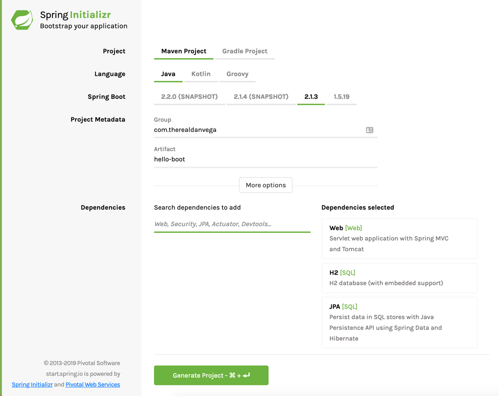

The Spring Team [just announced](https://spring.io/blog/2019/03/05/spring-initializr-new-ui) that the Spring Initializr has been updated with a brand new UI and it is now available at http://start.spring.io. You can see a screen shot of it below but I have say my first impressions were all positive. 

## What is the Spring Initializr 

Before I get into my thoughts on the redesign it might be a good idea to discuss what the Spring Initializr is for those of you who might be new to it. The [Spring Initializr](https://start.spring.io) provides a web UI that will allow you the ability to quickly create a new Spring Boot project customized just the way you want it. 

When I am describing this to students I often make the analogy of going to the grocery store when you're planning on preparing a big meal. You know what you need to make and you know what the ingredients are and now you need to gather them all up. 

When you're building a new application you have a similar story. You know what you're building, even if you don't know all the details. If you find out later on you need to add new features you can certainly do so, the same way you inevitably will need to run out on Thanksgiving for those cranberries.   

## The new look & feel

As I said earlier in the article my first impressions were all great. I am someone who has always enjoyed a nice clean interface so this appealed to me. At a quick glance I was able to fill out everything I needed for my project but there is one small problem and to some folks its a big issue. 

I didn't even notice this at first but I was scrolling through twitter I noticed some comments 

https://twitter.com/oodamien/status/1102875897290473472

The problem is that in the previous version of the Spring Initializr you could switch to a full version and see all of the available starters. 

## Conclusion

In conclusion this is what I was thinking about. 

