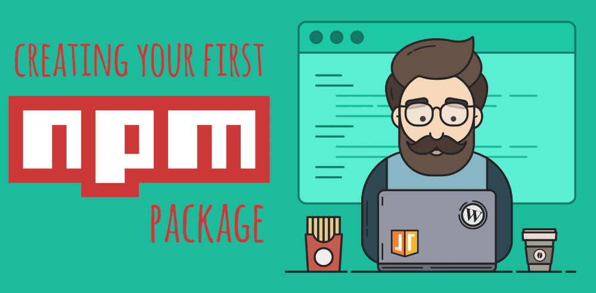

Welcome to Coffee and Code with me, Dan Vega. This newsletter is a little insight into what I was up to this week, things I found interesting and anything on my radar for the upcoming week. If you don't already have a cup of coffee grab one now and let's get to it.

## Previous Week

It was my birthday this week (I lost count at this point) and I want to thank everyone who reached out to me to wish me a Happy Birthday.

### Vue Composition API

Back in June VueJS released an RFC (request for comments) called **_Function-based Component API_**. There were some that got really upset with this proposal and it caused a lot of conversation in the community. This week the Vue Core Team released an updated version of the RFC titled [**_Composition API_**](https://github.com/vuejs/rfcs/pull/78).

I think a lot of the complaints came from everyone thinking that this is how they would have to write their Single File Components (SFC) and that just wasn't the case. There are some important changes to the RFC and if you want to learn more about the Composition API there is an entire documentation site dedicated to it.

[https://vue-composition-api-rfc.netlify.com/#summary](https://vue-composition-api-rfc.netlify.com/#summary)

### **Blog**

I don't have any new articles this week but I do have one that a bunch of folks have been sharing on Twitter lately. If you are in the JavaScript ecosystem you know there is this package manager called NPM.

Most of us just use it as away to pull dependencies into our projects but have you ever thought about creating your NPM package? if so I have this really great article that walks you through creating and publishing your [first NPM package](https://www.danvega.dev/blog/2019/02/10/creating-your-first-npm-package).

## Around the Web

These are things I found cool around the web this week.

### Articles

- [What I like About Vue - Dave Rupert](https://daverupert.com/2019/07/what-i-like-about-vue/)
- [Build an infinite scroll image gallery with Gatsby and Netlify functions](https://scotch.io/tutorials/build-an-infinite-scroll-image-gallery-with-gatsby-and-netlify-functions)
- [Let’s Build a JAMstack E-Commerce Store with Netlify Functions](https://css-tricks.com/lets-build-a-jamstack-e-commerce-store-with-netlify-functions/)
- [Using Slots in VueJS](https://www.smashingmagazine.com/2019/07/using-slots-vue-js/)

### Books

- [You first year in code](https://leanpub.com/firstyearincode)
- [Get Together Book](https://gettogetherbook.com)

### Videos

- [SmashingConf Toronto Conference Playlist](https://www.smashingmagazine.com/2019/08/smashingconf-toronto-2019-video/)
- [From Swift Developer to YouTuber](https://www.youtube.com/watch?v=l4P53_nGnmg&t=799s)

### Podcasts

- [Chats with Kent: Getting Started with Code Live Streaming - Suz Hinton](https://kentcdodds.com/chats-with-kent-podcast/seasons/01/episodes/getting-started-with-code-live-streaming-with-suz-hinton)
- [Raju Gandhi on Vuejs and Evaluating web frameworks](https://nofluffjuststuff.com/podcast/1/raju_gandhi_on_vuejs_and_evaluating_web_frameworks)
- [MKBHD: YouTube Sues, Elon Tweets, and Apple Has Battery Problems](https://podcasts.apple.com/us/podcast/youtube-sues-elon-tweets-and-apple-has-battery-problems/id1474429475?i=1000447602345)

### Projects

- [The Github Package Registry is now in beta](https://help.github.com/en/articles/about-github-package-registry)
- [Vue Testing Library](https://github.com/testing-library/vue-testing-library)
- [Download This Video](https://twitter.com/this_vid)

### Conferences

- [Flashback Conference](https://cfe.dev/events/flashback-conference-2020/)
- [Vue.js London 2019](https://vuejs.london/)
- [Code Mash CFP](http://www.codemash.org/call-speakers/)

### Follow This Person

I came across a presentation by Raju Gandhi on testing for some research I am doing on the topic and I was just blown away. When I come across people like this I try to find as much content from them as possible. I also listened to a [podcast](https://nofluffjuststuff.com/podcast/1/raju_gandhi_on_vuejs_and_evaluating_web_frameworks) that he was on talking about how much he enjoys working with VueJS.

Raju has a Java background, loves Vue and dabbles in all kinds of tech. Did I mention he also lives in Ohio? I need to tak some time, head down to Columbus and hang out with Raju soon! Please give him a follow on Twitter using the link below.

[https://twitter.com/looselytyped](https://twitter.com/looselytyped)

## Until Next Week

Thanks for sitting down and sharing a cup of coffee with me my friend. I hope you enjoyed this first installment of Coffee & Code and I will see you next Sunday morning. If you have any links you would like me to include please contact me and I might add them to a future newsletter. I hope you have a great week and as always friends...

Happy Coding 
Dan Vega 
danvega@gmail.com 
[https://www.danvega.dev](https://www.danvega.dev/) 
