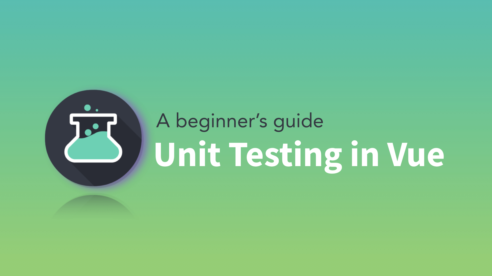
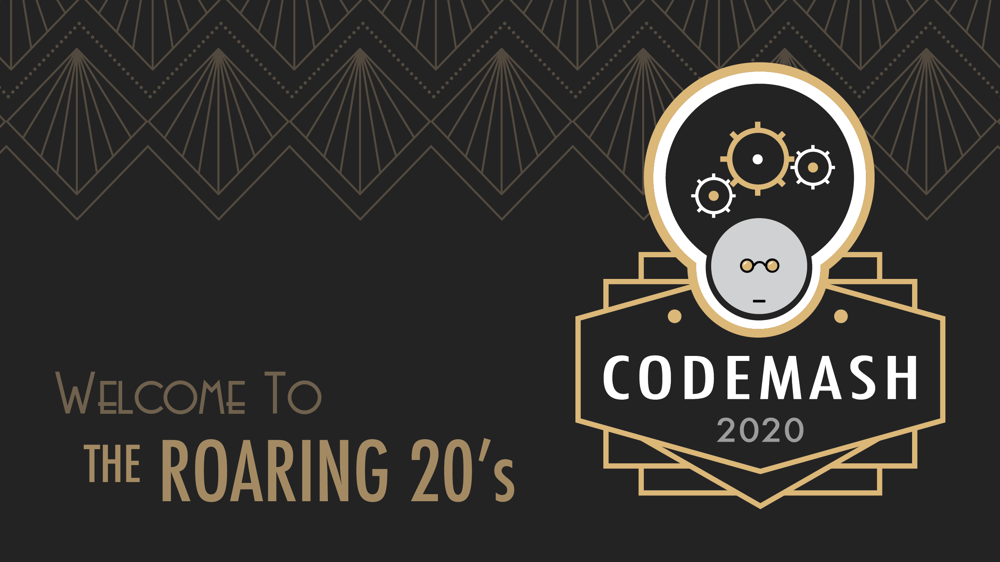

Welcome to Coffee and Code with me, Dan Vega. This newsletter is a little insight into what I was up to this week, things I found interesting and anything on my radar for the upcoming week. If you don't already have a cup of coffee grab one now and let's get to it.

## Previous Week

This has been an amazing week for me and I have a lot of great news to share with you so let's get straight to it.

### Vue Mastery

I have been dropping some hints to you guys that I was working on a big article and I am happy to announce that it has been released. The first article in a 3 part series has been released on Vue Mastery titled ["A beginner's guide: Unit Testing in Vue"](https://www.vuemastery.com/blog/unit-testing-vue-1). I really want to thank Adam Jhar and the team over at Vue Mastery for this opportunity to get my writing in front of such a great audience.

If this wasn't exciting enough I got mentioned in a tweet by Vue Mastery and VueJS!

https://twitter.com/VueMastery/status/1177696674787012609

https://twitter.com/vuejs/status/1177701970305527809

### Code Mash 2020

I am excited to announce that I have been accepted to speak at [CodeMash 2020](http://www.codemash.org/). This conference takes place on January 7-10 2020 about an hour away from me in Sandusky OH. I will be talking about all of the awesome new features in Vue 3. If you're going to be there please let me know and let's hang out!

### YouTube Videos

In the last newsletter, I told you I was working hard on producing higher quality and more consistent videos for YouTube. This week was the first step in that process as I released 2 new videos. I know that If I am going to meet my goals on YouTube the first step in that process is to be consistent. I don't have an idea of what my bandwidth is going to be but I think for now my goal is to upload at least 1 video per week. I like the idea of a tutorial and some type of discussion or product review.

**CSS Grid Generator**

This week I [released a tutorial](https://www.youtube.com/watch?v=ZopBBEs9TPg) on how to create CSS Grid Layouts using an awesome tool called the CSS Grid Generator.

**Learn to code: One language at a time**

As I was working on few different projects I put out the following tweet earlier this week.

https://twitter.com/therealdanvega/status/1176882121060880384

This tweet seems to really hit home for a bunch of people so I decided to create a video on the same topic. What I hoped to convey in this message is that it is overwhelming to learn a single programming language. It's even harder when you start thinking to yourself how am I ever going to learn all of these languages and frameworks that people are telling me I need to know.

The simple truth is you're never going to learn everything and the sooner you can accept that the better. You can though, over time understand that the core concepts you learn of one programming language can carry over to the next. I have been doing this for 20 years now so my advice is to stay patient, keep learning and the rest will come.

[Learn to code one language at a time](https://www.youtube.com/watch?v=AkXVA6ukdcc)

## Upcoming Week

I have a new tutorial coming this week on YouTube that covers the Vue CLI 3. In this tutorial I walk you through how to install the Vue CLI and how to use a few of the commands. One command I don't see being mentioned often is `vue serve` which allows you to serve a single file component in development mode.

If you aren't already [subscribed](http://www.youtube.com/therealdanvega) do so now and be on the lookout for that one this week!

## Around the Web

These are things I found cool around the web this week.

### Articles

- [What's Wrong with the Tech Interview Process?](https://dev.to/remotesynth/what-s-wrong-with-the-tech-interview-process-3b3m)
- [Announcing .NET Core 3.0](https://devblogs.microsoft.com/dotnet/announcing-net-core-3-0/)
- [Comparing React Hooks with Vue Composition API](https://dev.to/voluntadpear/comparing-react-hooks-with-vue-composition-api-4b32)
- [You can now generate self-hostable static blogs right from your DEV content via Stackbit](https://dev.to/devteam/you-can-now-generate-self-hostable-static-blogs-right-from-your-dev-content-via-stackbit-7a5)
- [Want Free Coding Lessons? Twitch Makes It Happen in Real Time](https://www.wired.com/story/want-free-coding-lessons-twitch-real-time/)

### Videos

- [.NET Videos](https://dotnet.microsoft.com/learn/videos)
- [IntelliJ IDEA for beginners](https://www.youtube.com/watch?v=yefmcX57Eyg)
- [freeCodeCamp: Learn Go Programming - Golang Tutorial for Beginners](https://www.youtube.com/watch?v=YS4e4q9oBaU)
- [Gridsome Remark](https://www.youtube.com/watch?v=e-ThzHtBnys&list=PLFZAa7EupbB61QMSYFB8YX9qQUKnWxu_M)

### Podcasts

- [Ladybug Podcast: How To Teach Code](https://ladybug.dev/episode/teaching-code/)
- [Shop Talk Show: Making money on the web](https://shoptalkshow.com/episodes/379/)

### Projects

- [Cascadia Code Open Source Font by Microsoft](https://github.com/microsoft/cascadia-code)

Books

- [A Go Developer's Notebook](https://leanpub.com/GoNotebook)

### Courses

- [Learn Data Structures from a Google Engineer](https://www.freecodecamp.org/news/learn-data-structures-from-a-google-engineer/)

### Conferences

- [.NET Conf 2019 (Day 1)](https://youtu.be/W8yL8vRnUnA)
- [.NET Conf 2019 (Day 2)](https://www.youtube.com/watch?v=Dd37HBvfnRk)

### Follow This Person

My person to follow this week is my friend Mark Shust. Mark lives in Cleveland near me and is an online instructor focusing on PHP & Magento. If you are into either of those technologies Mark is a great instructor and a must-follow!

[https://twitter.com/markshust](https://twitter.com/markshust)

## Until Next Week

Thanks for sitting down and sharing a cup of coffee with me my friend. I hope you enjoyed this installment of Coffee & Code and I will see you next Sunday morning. If you have any links you would like me to include please contact me and I might add them to a future newsletter. I hope you have a great week and as always friends...

Happy Coding 
Dan Vega
