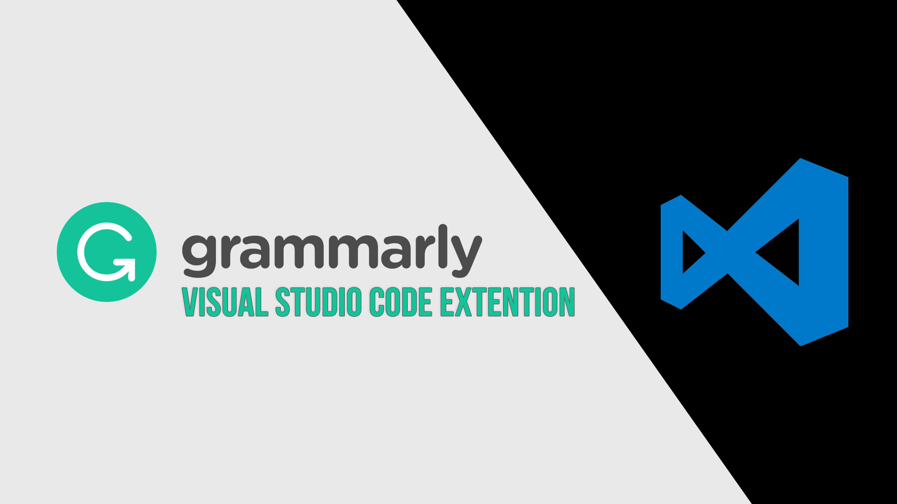

Welcome to Coffee and Code with me, Dan Vega. This newsletter is a little insight into what I was up to this week, things I found interesting and anything on my radar for the upcoming week. If you missed last week's newsletter you can checkout Coffee and Code #21 [here](https://www.danvega.dev/newsletter/coffee-and-code/21). If you don't already have a cup of coffee grab one now and let's get to it.

## Previous Week

I'm back! Sorry for taking a few weeks off but I was super busy and I can't wait to tell you all about it. I hope all of your holidays were wonderful and you're all recharged and ready for the new year. I have a bunch to get into so let's do it.

### CodeMash 2020

I was really busy over the holidays preparing for [CodeMash](http://codemash.org). This was my very first time attending and speaking at CodeMash so I had my hands full. This was an amazing conference and I can't recommend it enough. I have two blog posts below that recap both the conference and my talk.

- [Vue 3: Smaller, Faster & Stronger](https://www.danvega.dev/blog/2020/01/09/codemash-2020/)
- [CodeMash 2020 Recap](https://www.danvega.dev/blog/2020/01/13/codemash-2020-recap/)

### Start using Vue 3 in a project right now (Screencast)

So you've heard of Vue 3 and you want to start playing around with it but not sure where to start. Did you know that you can add Vue 3 to a new project using the Vue CLI? In this tutorial, I will show you how to create a new project using the Vue CLI and then using a new plugin, add Vue 3 Alpha to your project.

With Vue 3 installed we will walk through creating a new component using the Composition API. We will start by creating a simple Counter component and it might be a trivial example it does allow you to see the building blocks of Vue's new Composition API.

[https://www.danvega.dev/blog/2020/01/17/start-using-vue3-today/](https://www.danvega.dev/blog/2020/01/17/start-using-vue3-today/)

### Grammarly Visual Studio Code Extension

In this tutorial, I am going to show you a new extension that brings Grammarly support to Visual Studio Code. Personally, I have been interested in Grammarly for Code for a long time now so you can imagine how excited I was to find out someone released an extension.

I will walk through how to find it, install it, use it and how you can customize it. I also show another extension that you might need to disable to get this to work properly. I have only been using Grammarly for Visual Studio Code for a few days now but it's already become one of my favorite extensions.

[https://youtu.be/Pfmrs9F7S-g](https://youtu.be/Pfmrs9F7S-g)

### 7,000+ YouTube Subscribers

I hit another big milestone this week as I crossed 7,000 subscribers on YouTube. I want to thank all of you for subscribing and if you haven't yet, what are you waiting for 😉I uploaded two more videos this week and it's a constant learning process for me. I don't have a big room with natural light so I am always experimenting with new ways to record tutorials. If you have any feedback for me or tutorials you would like to see please don't hesitate reaching out.

[http://www.youtube.com/therealdanvega](http://www.youtube.com/therealdanvega)

[https://youtu.be/o-jiS563yI8](https://youtu.be/o-jiS563yI8)

## Around the Web

These are things I found cool around the web this week.

### Articles

- [Illustrated.dev resources to improve your drawing and visual thinking skills.](https://illustrated.dev/resources/)
- [How Rahul Kadyan built a Grammarly Extension for Visual Studio Code](https://znck.dev/blog/2019-grammarly-in-code)
- [The new Microsoft Edge is out of preview and available for download](https://blogs.windows.com/msedgedev/2020/01/15/upgrading-new-microsoft-edge-79-chromium/)

### Videos

- [Test driven development with Vue.js by Sarah Dayan](https://www.youtube.com/watch?v=DD1fEhcEzY8)
- [dotCSS 2019 - Sarah Dayan - In Defense of Utility-First CSS](https://www.youtube.com/watch?v=R50q4NES6Iw)

### Podcasts

- [Syntax FM: Hasty Treat - A Month On Firefox](https://syntax.fm/show/213/hasty-treat-a-month-on-firefox)

### Courses

- [https://egghead.io/playlists/introduction-to-tailwind-and-the-utility-first-workflow-0b697b10](https://egghead.io/playlists/introduction-to-tailwind-and-the-utility-first-workflow-0b697b10)

### Projects

- [Grammarly Visual Studio Code Extension](https://marketplace.visualstudio.com/items?itemName=znck.grammarly)
- [A list of /uses pages detailing developer setups, gear, software and configs.](https://uses.tech/)
- [HTTPie 2.0](https://github.com/jakubroztocil/httpie/releases/tag/2.0.0)
- [JetBrains Mono](https://www.jetbrains.com/lp/mono/)

## Until Next Week

Thanks for sitting down and sharing a cup of coffee with me my friend. I hope you enjoyed this installment of Coffee & Code and I will see you next Sunday morning. If you have any links you would like me to include please contact me and I might add them to a future newsletter. I hope you have a great week and as always friends...

Happy Coding 
Dan Vega 
danvega@gmail.com 
[https://www.danvega.dev](https://www.danvega.dev/)
