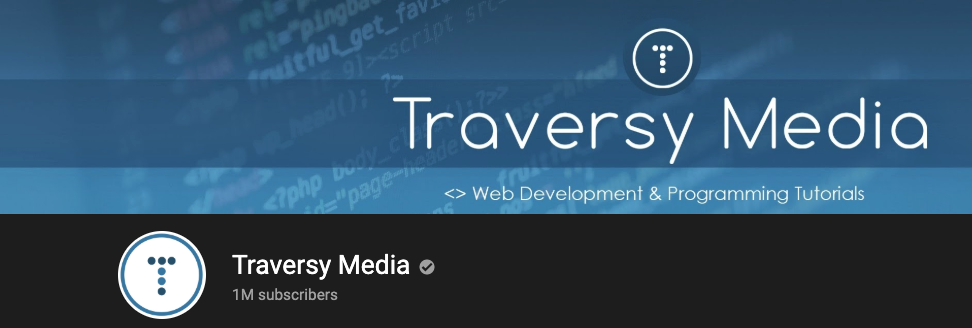

Welcome to Coffee and Code with me, Dan Vega for the week of Feb 17 - Feb 23, 2020. This newsletter is a little insight into what I was up to this week, things I found interesting and anything on my radar for the upcoming week. If you don't already have one grab a cup and your favorite beverage and let's get to it.

## Previous Week

This week I [posted a new video](https://youtu.be/BkiM3qu-2vo) where I discussed the results of the [2020 HackerRank Developer Skills Report](https://research.hackerrank.com/developer-skills/2020). In this report, one of the metrics that I thought was really interesting was that **Go** was the #1 programming language that developers wanted to learn this year. I started learning Go towards the end of last year and I couldn't agree more, it's a fascinating language and I hope to share more of that journey soon.

The title for the video that I posted was [The #1 Programming Language that Developers want to learn in 2020](https://youtu.be/BkiM3qu-2vo). I had a couple of people mention to me that it sounded clickbaity and while I would agree with that I need to defend my thought process and offer up an alternative way of thinking about it.

I think there is a clear distinction between **click bait** and **clickable titles**. When it comes to click bait you are deceiving the viewer for clicks and I don't ever want to do that. As a small YouTuber who really wants to grow his channel I need to do a couple of things. First and this is the big one, I need to be more consistent with the tutorials. Second, I also need to create content that will reach a larger audience.

This is why you might see more experiments with this type of content so I would love to hear your feedback.

## Traversy Media

While we are on the subject of YouTube I need to take a minute and congratulate Brad Traversy. If you don't know Brad is a YouTuber who teaches a wide variety of programming topics on YouTube. Brad creates some amazing tutorials and is the epitome of consistency. He crossed 1 million subscribers this week and it is a well-deserved milestone. Congrats Brad and looking forward to you hitting 2 million.

I watched a tutorial from Brad this week on creating a clone of [Microsoft.com](http://microsoft.com) using CSS Grid, Flex, and media queries. It was really good and got it me thinking about creating a similar tutorial using Tailwind CSS. I have had a lot of fun building layouts with Tailwind lately and I thought I would like to share those. I have an initial version on my Github and if you're interested in YouTube tutorials on Tailwind please let me know.

[https://github.com/danvega/microsoft-wind](https://github.com/danvega/microsoft-wind)

### Vue

A huge thank you to Anthony Gore for including me in this weeks [Vue.js Developers Newsletter](https://vuejsdevelopers.com/newsletter/issue/156/). My article on when to use `ref()` vs `reactive()` was including in the Newsletter and I am grateful for being included with so many great articles.

## Upcoming Week

My focus is on YouTube and I should be able to release two videos this week. I want to try and get on a consistent schedule so my thought is Tuesday and Friday but as you know plans can always change. Look out for a video on how to connect IntelliJ's Database Tools to an H2 database in a Spring Boot application & Visual Studio Code themes.

## Around the Web

These are things I found cool around the web this week.

### Articles

- [Ray Camden: Ionicons in Vue.js](https://www.raymondcamden.com/2020/02/17/ionicons-in-vue)
- [Ray Camden: Charting with Vue: A comparison](https://blog.logrocket.com/charting-with-vue-a-comparison/)
- [Creating a self-paced email course with ConvertKit, Typeform, and Zapier](https://joelhooks.com/self-paced-email-course)
- [Getting Acquainted With Svelte, the New Framework on the Block](https://css-tricks.com/getting-acquainted-with-svelte-the-new-framework-on-the-block)

### Videos

- [The State of Vue.js in 2020 - Why You Should Make The Leap - Gwendolyn Faraday - YouTube](https://www.youtube.com/watch?v=eiUgVa2Td_k)
- [Microsoft Homepage Clone - CSS Grid, Flex & Media Queries](https://www.youtube.com/watch?v=uKgn-To1C4Q)
- [Get Started with Tailwind CSS in 15 Minutes](https://www.youtube.com/watch?v=6zIuAyLZPH0)

### Podcasts

- [Enjoy the Vue: JAMming, MCing, Vuex & More with Divya Sasidharan](https://enjoythevue.io/episodes/4/)
- [Go Time: Quack like a wha-?](https://changelog.com/gotime/118)
- [Syntax.fm: Serverless / Cloud Functions - Part 1](https://syntax.fm/show/224/serverless-cloud-functions-part-1)

### Projects

- [Announcing TypeScript 3.8 | TypeScript](https://devblogs.microsoft.com/typescript/announcing-typescript-3-8/)
- [Draggable JS – JavaScript drag and drop library](https://shopify.github.io/draggable/)
- [Learn CSS Positioning with 😸](https://ishadeed.com/article/learn-css-positioning)
- [esbuild: JavaScript Bundler written in Go](https://github.com/evanw/esbuild/)
- [Git Command Explorer](https://gitexplorer.com/)

### Courses

- [JetBrains Academy: Java, Kotlin & Python Courses](https://www.jetbrains.com/lp/academy/)

### Newsletters

- [Tales from the jar side: Spring training, Groovy 3, and other updates](https://kenkousen.substack.com/p/tales-from-the-jar-side-spring-training)
- [Vue.js Developers Newsletter Issue #156](https://vuejsdevelopers.com/newsletter/issue/156/)
- [Groovy Calamari](http://groovycalamari.com/issues/174?#start)

## Until Next Week

Thanks for sitting down and sharing a cup of coffee with me my friend. I hope you enjoyed this installment of Coffee & Code and I will see you next Sunday morning. If you have any links you would like me to include please contact me and I might add them to a future newsletter. I hope you have a great week and as always friends...

Happy Coding 
Dan Vega 
danvega@gmail.com 
[https://www.danvega.dev](https://www.danvega.dev/)
