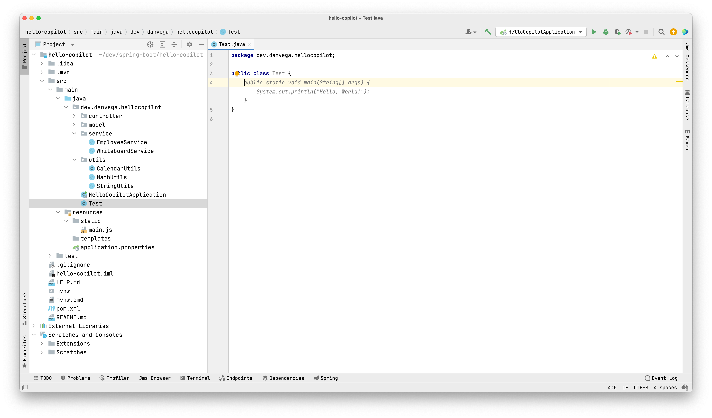
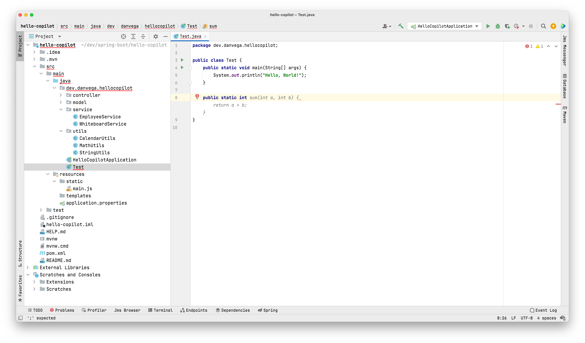
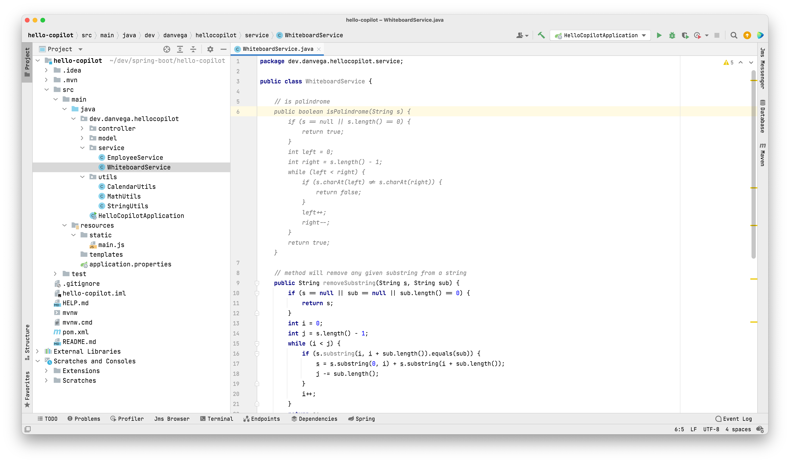
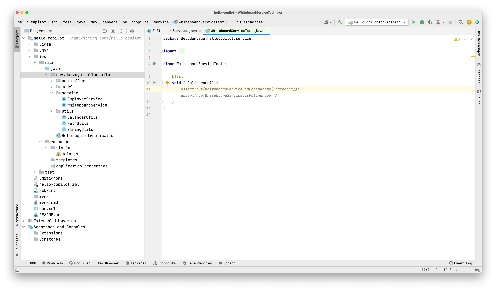

Happy Halloween, I hope you have a spooktacular day! If you're a Visual Studio Code user [James Q Quick has a Halloween theme](https://www.youtube.com/watch?v=tqd3O5RpAHQ) perfect for nighttime coding.

I have been a big fan of Microsoft for a long time now. It hasn't always been that way but I think for me it started when Satya Nadella took over as CEO. They really began to embrace Open Source and have done some amazing work on tools and the cloud.

When we talk about open source software we as developers use on a daily basis Git & Github are at the top of that list for me. In 2018 Microsoft purchased Github for 7.5 billion and I remember a lot of fear from developers that they would run it into the ground.

Fast forward to 2021 and that could be nothing further from the truth. They have done nothing but improve a tool that is vital to most of us. I'm old enough to remember when we had to pay for private repositories. In fact what we tend to forget is this tool that helps us maintain, version, share, and learn code is completely FREE. I think we take this for granted sometimes. Thank you, Microsoft 🙏

Github Universe 2021 was this week so I thought I would mention a couple of highlights from the conference that I am really excited about.

## Github Copilot for IntelliJ

Earlier this year GitHub launched Copilot, an AI pair-programmer. With GitHub Copilot, get suggestions for whole lines or entire functions right inside your editor. I'm not sure if it supported Java when it was first launched but at the time of writing this, the technical preview supports Python, JavaScript, TypeScript, Ruby, Java & Go.

This week GitHub announced support for IntelliJ and I was excited to get my hands on this. To get started go to Preferences > Plugins and search for Github Copilot.

To get started create a new Java class called Test. If you place your cursor inside of the class Copilot will make a suggestion for a new main method that prints out "Hello, World!" to the console. If you hit the tab key, that method will be completed for you.

Another way to trigger Copilot is by typing the name of a method and based on the name you will get suggestions of how to complete that method. Again, hit the tab key to complete the code.

Finally, you can use a comment to let Copilot know what you're trying to accomplish. In the example below I would like to write a method that will check to see if a string is a palindrome.

The real question you might have without reading through that code is "Does it work?". I generated a new Test and Copilot is suggesting an assertion and after running my test it passes.

It might not be up to the standard of the palindrome king [Ken Kousen](https://twitter.com/kenkousen), but it works! This is still very much a technical preview and I think there is room for improvement. I'm also not sure how valuable this is in my day-to-day work but I will test it out and report back. I hope to put together a video on this next week for my [YouTube channel](http://www.youtube.com/danvega) that will include some Spring Boot examples so if you're not a subscriber what are you waiting for!

## Github Command Palette

GitHub launched a [command palette](https://docs.github.com/en/get-started/using-github/github-command-palette) to navigate, search and run commands directly from your keyboard.

Open the command palette using one of the following keyboard shortcuts:

- Windows and Linux: `Ctl +k` or `Ctl + alt + k`
- Mac: `⌘ + k` or `⌘ + option + k`

From my personal GitHub page, it lets me quickly jump to repositories, projects & packages.

If you use `>` you can run commands. In this example, I want to quickly switch over to the dark dimmed theme.

## github.dev

This is entirely new but since we are talking about GitHub I thought I would share this little tip with you. If you're looking at a particular file in your repo you can edit the raw file but you lose out on all that code assistance and completion that we all love. Press the`.` or swap `.com` with `.dev` in the URL and you will be taken directly to a Visual Studio Code environment in your browser.

It’s a quick way to edit and navigate code. It's especially useful if you want to edit multiple files at a time or take advantage of all the powerful code editing features of Visual Studio Code when making a quick change. For more information, see our [documentation](https://github.co/codespaces-editor-help).

## DevOps P

Emily Freeman who is a keynote speaker, best-selling author, and DevOps wizard was the feature of two amazing videos. I thought both of these were well thought out and the quality is great.

- [Rethinking the SDLC - GitHub Universe 2021](https://www.youtube.com/watch?v=Z66-us_VDu8)
- [What is DevOps](https://www.youtube.com/watch?v=kBV8gPVZNEE)

## Around the Web

### 📝 Articles

- [Creator tip: Handling inconsistent revenue streams as a full-time course creator](https://teachable.com/blog/handling-inconsistent-revenue-streams)

### 🎬 Videos

- [The Best of Both Worlds: ISG for Nuxt by Ishan Anand](https://www.youtube.com/watch?v=G8aq4n9F9E4)
- [VueJS London 2021 Recordings](https://portal.gitnation.org/events/vuejs-london-2021)

### 🎙 Podcasts

- [JavaScript Jam](https://www.javascriptjam.com/)
- [Groovy Podcast, S05E03 (83, with Paul King)](https://www.youtube.com/watch?v=onN4Ecm2RXM)

### 💻 Projects

- [Nuxt 3 Beta](https://v3.nuxtjs.org/)
- [Kaleidoscope App](https://kaleidoscope.app/)
- [Templatesurf](https://templatesurf.com/)

### ✍️ Quote of the week

The answer in Chief Executive Officer Satya Nadella’s mind is clear. “Creation, creation, creation—the next 10 years is going to be as much about creation as it is about consumption and about the community around it, so it’s not creating alone,”

## Until Next Week

Thanks for sitting down and sharing a cup of coffee with me my friend. I hope you enjoyed this installment of Coffee & Code and I will see you next Sunday morning. If you have any links you would like me to include please contact me and I might add them to a future newsletter. I hope you have a great week and as always friends...

Happy Coding 
Dan Vega 
danvega@gmail.com 
[https://www.danvega.dev](https://www.danvega.dev/)
