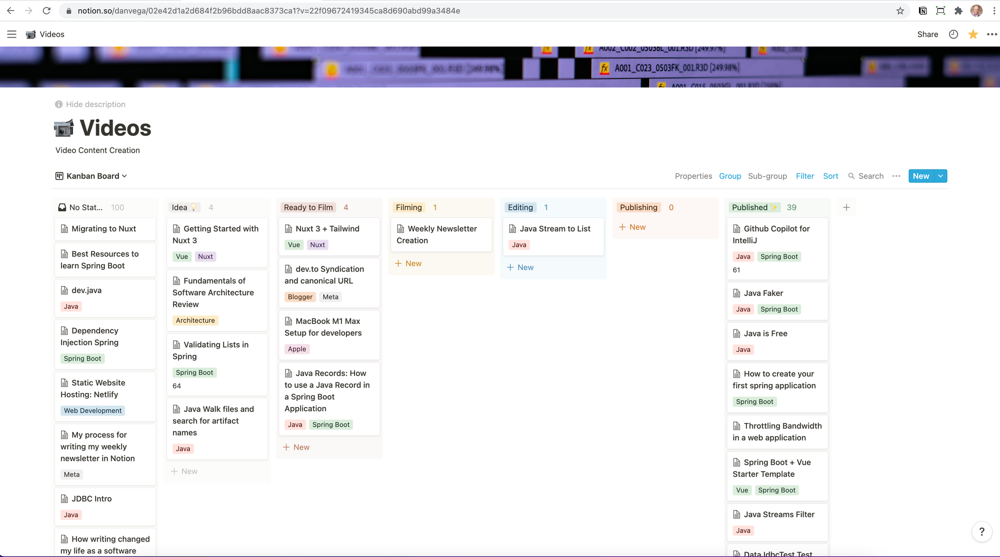

It's hard to believe that it's Thanksgiving this week here in the US and that 2021 is almost over. If you're in the US and celebrating I would like to wish you and your family a Happy Thanksgiving. I don't mind fall but it's quickly moving from fall to winter here in Northeast Ohio where we recently saw some snow ❄️ and temps in the 20s 😩

## MacBook Review & Setup Guide

This week I had a chance to put together a [blog post](https://www.danvega.dev/blog/2021/11/15/macbook-pro-m1-max-review/) and [YouTube video](https://youtu.be/t-hEOyUnaXQ) on my M1 MacBook Pro review and setup. I actually got all the way through the video and started editing it and realized that I was using the wrong microphone.

This is because I use a program called Krisp which does a really good job at filtering out background noise. Apparently, it selected the wrong microphone and was using the onboard one. I swear I didn't do this on purpose and it doesn't sound as good as my USB microphone but it turned out ok and is just another thing that impresses me about this laptop.

I received the following email from someone who read my review:

> Hi, Dan:
Thanks for sharing information about setting up your new Mac Book.  I have never used a Mac before and was hesitant to buy an expensive laptop and not have setup information for development work.  As soon as I saw the title of your post, I decided to buy it.  Thanks again. - Jorge
>

I just want to say thank you for taking the time to send that in Jorge. Sometimes It can get lonely on this side of the keyboard and your feedback means a lot to me.

## Content Creation

I have been thinking about content creation a lot lately. As we head into the holidays and the new year quickly approaches I want to clean things up a bit so I can set (and hopefully accomplish) some goals next year.

### Newsletter

I am working on a video this week where I will show you how I create this newsletter that you are reading. Each week I start with a new template in Notion and as the week goes on I try and add content to it. At the end of the week, I will publish the newsletter on my website and send it off to you using [ConvertKit](https://app.convertkit.com/referrals/l/ad254512-ed8b-4542-85d0-a02af83e2f7c). I'm hoping someone finds this useful so look out for this early this week.

### ConvertKit

Speaking of [ConvertKit](https://app.convertkit.com/referrals/l/ad254512-ed8b-4542-85d0-a02af83e2f7c), it is an amazing tool that I am not using to my advantage. To do so I started off by cleaning up my account and removing all of the old forms and landing pages that I was no longer using. Next, I removed all of my old rules, tags, segments, and sequences. The only way you can land on my email list now is by signing up for this newsletter and I want to add a sequence (welcome email) around that.

I learned this week that ConvertKit had a feature called Tip Jars. This allows creators to create a simple form and earn tips from their audience. I decided to [create one](https://danvega.ck.page/products/content-creator-tip-jar) and you will start to see this embedded in blog posts. I might move this form to my website soon but for now, I will just host it on ConvertKit. If you want to [buy me a coffee](https://danvega.ck.page/products/content-creator-tip-jar), this is the easiest way to do so 😉

### Teachable

For anyone new around here, I [teach courses online](https://www.danvega.dev/courses). When I started out creating courses I did so on Udemy. When you don't have an audience a marketplace like Udemy is a great place to start. After I started to gain a following I thought that I would self host my courses and instead of splitting the profits with Udemy I would keep them for myself, well more specifically for my wife's Amazon addiction.

The problem with that was now I have to maintain my courses on two different platforms. When you don't have a marketplace you have to do all of the marketing for your courses yourself and on top of not having a lot of experience doing that, I just don't have the time. Most of my courses are still selling well on Udemy but I don't sell any courses on Teachable. For this reason, I decided that to downgrade to a free account which means I won't be selling courses on that platform anymore.

I'm not sure what this means for the future of my courses. I had a plan to release a free course on building REST APIs in Spring Boot that would turn into a full course. I will figure out how to make that happen but for now and sticking with my theme of simplifying things as we head into the new year this just seemed like the right move.

### Udemy

Speaking of Udemy, this is another part of my business that I need to get cleaned up heading into the new year. Trying to keep up with student questions on Udemy is not an easy task. In the past, I found some great people on Upwork to help me with that workload. I currently don't have anyone helping me and I need to fix that very soon. There is also a need to update course content and I just need to find some time to determine what needs updating and get it done. If you're a Udemy student of mine, thank you for your patience.

### YouTube

In addition to the MacBook Review and setup video I also released a tutorial on turning a [stream into a list](https://youtu.be/EObFO5ohikg) in Java 16. For those counting that is 2 videos in a week and I haven't done that in about a year.

You know that question people ask "If money wasn't an issue and you could do anything for work what would you do?" for me that's easy, I would learn and teach what I've learned to others. The best place to teach is YouTube and I'm hoping to do some big things in 2022. To do so I realized that I have to have a better system for creating videos.

I have been using Notion to organize my video ideas for a while now but I haven't done a great job of turning those ideas into videos. With that, I decided to take an approach from the software development world and spend time "grooming the backlog".

I flush out an idea with as much detail as possible and when I feel like it's ready to go I move it into the ready-to-film column. Now when I sit down to record I don't really have to think about what that video is going to look like. That has already been figured out and I can just start creating!

If anyone is interested in seeing my Notion setup for creating videos let me know and I will put that together.

## Netlify

I am a huge fan of Netlify and this week they announced that they raised $105 million in funding. They already make building for the web easy and I am excited to see what they do next!

[https://twitter.com/netlify/status/1460973163823697922](https://twitter.com/netlify/status/1460973163823697922)

If anyone actually reads this whole newsletter you deserve a prize 🥳

## Around the Web

### 📝 Articles

- [Kubernetes and Docker Updates in IntelliJ IDEA 2021.3](https://blog.jetbrains.com/idea/2021/11/kubernetes-and-docker-updates-2021-3/)
- [Slack Introduces New Platform With Help From Deno](https://deno.com/blog/slack)
- [First Look: Announcing API Authentication on Netlify](https://www.netlify.com/blog/2021/11/17/first-look-announcing-api-authentication-on-netlify/)

### 🎬 Videos

- [New Notion Feature - Simple Tables](https://www.youtube.com/watch?v=m_uo9sUvVGA)
- [Those Who Can Should Also Teach](https://www.youtube.com/watch?v=WnBjGNWdayw&t=226s)
- [Spring Cloud Gateway: Resilience and Security • Thomas Vitale • GOTO 2021](https://www.youtube.com/watch?v=wYk0JrNdb8g)

### 🎙 Podcasts

- [Between Chair & Keyboard with Sharat Chander](https://www.youtube.com/watch?v=PcwGUtf95JY)
- [Deep Dive with Ali Abdaal - Krissy Cela On Finding Your Vision, Mission and Why](https://www.youtube.com/watch?v=qB9Zae87RbE)

### 💻 Projects

- [Netflix Top 10 (Built with Tailwind CSS 🥳)](https://top10.netflix.com/)

### ✍️ Quote of the week

"If you don't believe in yourself, who will?" - Krissy Cela

### 🐦 Tweets

[https://twitter.com/mkbhd/status/1460976089933787140](https://twitter.com/mkbhd/status/1460976089933787140)

## Until Next Week

Thanks for sitting down and sharing a cup of coffee with me my friend. I hope you enjoyed this installment of Coffee & Code and I will see you next Monday morning. If you have any links you would like me to include please [contact me](http://twitter.com/therealdanvega) and I might add them to a future newsletter. I hope you have a great week and as always friends...

Happy Coding 
Dan Vega 
danvega@gmail.com 
[https://www.danvega.dev](https://www.danvega.dev/)
