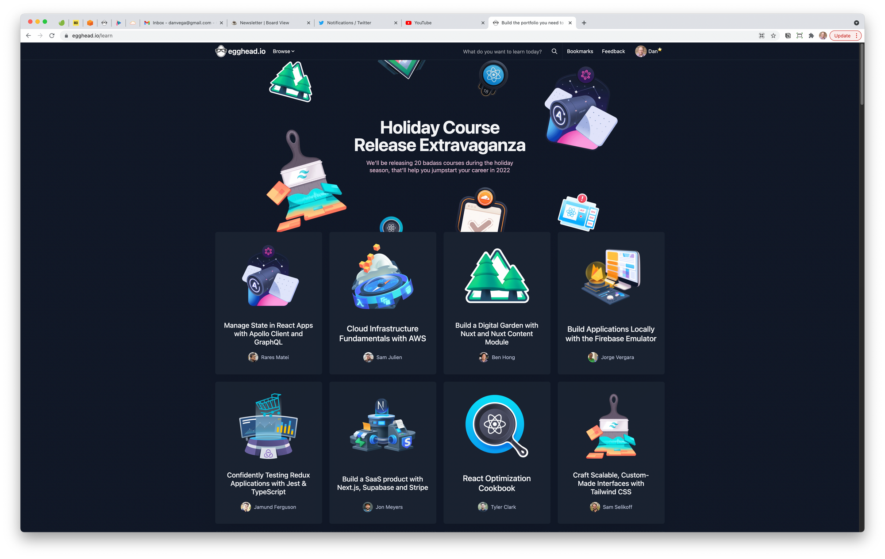

I hope you all had a great week last week and are excited for another productive week. Christmas is coming up on us quickly and with that the end of another year. As I have told you a few times it's been a little of a crazy year for me (and probably all of us) so I am looking forward to the new year. In this edition of the newsletter, I want to tell you about starting a new contract at work, and some exciting things that happened last week.

## Started a new contract at work

Last week I started a new contract at work. If you don't know I work for Briebug Software and I have been with them for about a year now. When I started I was assigned to the biggest logistics company on the planet. I am still with that client but I ended up transferring to another org within the company.

With that transfer, I will have to learn a whole new side of the business and the software that runs it. Part of my responsibilities as an architect is to understand the business, the software and make recommendations where I think we can we can improve the product for both the users and the developers. As a developer, I take that last responsibility to heart. I want to make sure that I am helping anyone on that project be successful.

Most of the new software I am working on is in Spring Boot / Spring Cloud / Java space. I tweeted this out earlier this week but the first thing I do when I am dropped into a new project is to make sure I can build it. After a few minutes, I was able to get this project to build and my next step is to take a peek at the build file. In this case, we are using Maven so I opened up `pom.xml` to see what I'm working with. The first thing I noticed is there were a TON of dependencies and my first thought was there is no way we are using all of them. A quick run of `mvn dependency:anaylze` and my suspicions were true, there was a whole lot of unused dependencies.

[https://twitter.com/therealdanvega/status/1467920900456697866](https://twitter.com/therealdanvega/status/1467920900456697866)

These are the easy types of recommendations you can make right away. Removing all of these unused dependencies can speed up startup time for developers and ultimately make the executable we ship much smaller. I created a new branch and removed all of them only to come across a few errors. Remember that this tool is analyzing what dependencies you are using at compile-time and won't know which ones are being used at runtime. After fixing a few of those, we have a much faster build and a lighter JAR that will get shipped to the cloud.

What are some of the things you look for when you are first dropped into a project? I have a few more and maybe I will compile a checklist if that is something that might be helpful to others.

## Log4J Vulnerability

If you're in the Java world chances are you have probably heard of this by now. There was an exploit found in the popular logging library, [Log4J](https://logging.apache.org/log4j/2.x/). If you want to learn more about the exploit you can check out [CVE-2021-44228](http://cve.mitre.org/cgi-bin/cvename.cgi?name=2021-44228).

This zero day vulnerability affects the 2.x line so if you're using the Log4J library explicitly please make sure you update to v2.15 where the behavior and root cause of the issue have been disabled by default. There is a chance you could be using it implicitly if a dependency you declared uses it, also know as a transitive dependency.

There is a really [great explanation from Microsoft](https://msrc-blog.microsoft.com/2021/12/11/microsofts-response-to-cve-2021-44228-apache-log4j2/?s=09) on what this vulnerability is and how it works. This is a serious exploit and you should take the time to investigate if you are using Log4J. If you are using it explicitly or implicitly please take the necessary steps to fixing it.

### Spring Boot Users

If you're a Spring Boot users this shouldn't affect unless you have moved away from the default logging library, SL4J. There is a good article on the [Spring Blog](https://spring.io/blog/2021/12/10/log4j2-vulnerability-and-spring-boot) that shares some details about this and how to fix it.

## Egghead holiday courses

Learning is one of the biggest skills we need as software engineers. I think it's one of the main reasons I love what I do. If you heard me talk about this at all you know I love to learn new things.

I think everyone has a different way of learning depending on what your objective is. If you're brand new to language and programming in general you may want to take a depth vs breath approach. In that case you might want to reach for one of those big text books and learn everything about the subject.

In some cases you might want to learn one specific thing. For those instances I have been a big fan of Egghead courses. These courses lose the fluff and drop you right into the subject at hand.  Right now they have a [Holiday Course Release Extravaganza](https://egghead.io/learn) going on where they are releasing a new course every day.

I was able to go through a couple courses that I can highly recommend:

- [Cloud Infrastructure Fundamentals with AWS by Sam Julien](https://egghead.io/courses/cloud-infrastructure-fundamentals-with-aws-ee4bb845)
- [Build a Digital Garden with Nuxt and Nuxt Content Module by Ben Hong](https://egghead.io/courses/build-a-digital-garden-with-nuxt-and-nuxt-content-module-9b67f0de)

*What are some of your favorite resources for learning?*

## Tailwind CSS v3.0

Tailwind CSS, a CSS Utility framework that I happen to be a big fan of released v3.0 last week. There is a great roundup here of all the new features [here](https://tailwindcss.com/blog/tailwindcss-v3) but here are a few of my favorite.

- **Just-in-Time, all the time** — lightning fast build times, stackable variants, arbitrary value support, better browser performance, and more.
- **Every color out of the box** — including all of the extended palette colors like cyan, rose, fuchsia, and lime, and fifty shades of ~~grey~~ gray.
- **Colored box shadows** — for fun glow and reflection effects, and more natural shadows on colored backgrounds.
- **Play CDN** — the new Just-in-Time engine squeezed into a CDN script that runs right in the browser.

If you have some time check out this video below where Simon walks us through all the cool new features.

[https://www.youtube.com/watch?v=mSC6GwizOag](https://www.youtube.com/watch?v=mSC6GwizOag)

## Matrix Resurrections - Official Trailer 2

The original Matrix will go down as one of my all time favorite movies. I'm also probably in the minority here, but I enjoyed all 3 of the movies. That is why I am so excited for The Matrix Resurrections which comes out later this month. I have a subscription to HBO Max so I can technically watch this one at home but I think this is a good time to return to the theater.

[https://www.youtube.com/watch?v=nNpvWBuTfrc](https://www.youtube.com/watch?v=nNpvWBuTfrc)

## Around the Web

### 📝 Articles

- [The best way to log SQL statements with Spring Boot](https://vladmihalcea.com/log-sql-spring-boot/)
- [Tailwind CSS v3.0](https://tailwindcss.com/blog/tailwindcss-v3)
- [New AOT Engine Brings Spring Native to the Next Level](https://spring.io/blog/2021/12/09/new-aot-engine-brings-spring-native-to-the-next-level)
- [https://tanzu.vmware.com/content/ebooks/the-state-of-spring-2021](https://tanzu.vmware.com/content/ebooks/the-state-of-spring-2021)

### 🎬 Videos

- [Spring Cloud Stream with RabbitMQ](https://www.youtube.com/watch?v=Y1bwOL08mqs)
- [Building a Course Platform in a Weekend - (Next.js Conf 2021)](https://www.youtube.com/watch?v=qEBEo76gKK0)
- [Video Editing 101: How to Edit YouTube Thumbnails](https://www.youtube.com/watch?v=W9KdGcL80jQ)

### 🎙 Podcasts

- A [Bootiful Podcast - Josh Long with **Patrick Chanezon**](https://bootifulpodcast.fm/#/episodes/5878ef4e-c575-463b-a27e-67548fbad6d0)
- [Building Go Apps Using Encore with André Eriksson](https://softwareengineeringdaily.com/2021/12/06/building-go-apps-using-encore/)

### 📚 Books

- [The Cold Start Problem](https://www.coldstart.com/?twclid=11468056396621139976)

### ✍️ Quote of the week

“Patience is not the ability to wait, but the ability to keep a good attitude while waiting.” - Unknown

## Until Next Week

Thanks for sitting down and sharing a cup of coffee with me my friend. I hope you enjoyed this installment of Coffee & Code and I will see you next Monday morning. If you have any links you would like me to include please [contact me](http://twitter.com/therealdanvega) and I might add them to a future newsletter. I hope you have a great week and as always friends...

Happy Coding 
Dan Vega 
danvega@gmail.com 
[https://www.danvega.dev](https://www.danvega.dev/)
