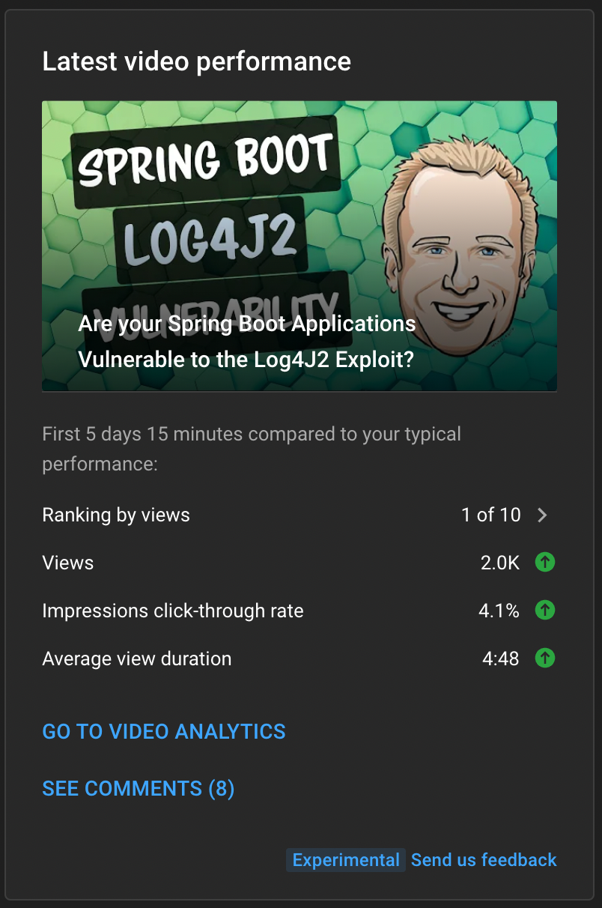

Welcome to what might very well be the last installment of the newsletter in 2021. I only have a few days left of work for the year and honestly, I don't think I will have much to talk about. I am working on a couple of exciting things for the new year and I can't wait to share those with you. In this week's edition of the newsletter we continue our conversation about the Log4J2 Vulnerability.

## Are your Spring Boot Applications vulnerable to the Log4J2 Exploit?

In last week's newsletter, I mentioned the Log4J Vulnerability that was going around. I had some more time at the beginning of the week to dig into it and more specifically if we were affected at work. This brought up a lot of questions around how logging works in Spring Boot so I thought I would go through some of that here.

The biggest thing you need to know from a Spring Boot standpoint is that if you don't deviate from the default configuration you are safe. Let's start out with how logging works out of the box. When you add a dependency like `web (spring-boot-starter-web)` that will bring in the `spring-boot-starter` which brings in `spring-boot-starter-logging.` If you run `mvn dependency:tree` you will see something that looks like this:

```bash
[INFO] +- org.springframework.boot:spring-boot-starter-web:jar:2.6.1:compile
[INFO] |  +- org.springframework.boot:spring-boot-starter:jar:2.6.1:compile
[INFO] |  |  +- org.springframework.boot:spring-boot:jar:2.6.1:compile
[INFO] |  |  +- org.springframework.boot:spring-boot-autoconfigure:jar:2.6.1:compile
[INFO] |  |  +- org.springframework.boot:spring-boot-starter-logging:jar:2.6.1:compile
[INFO] |  |  |  +- ch.qos.logback:logback-classic:jar:1.2.7:compile
[INFO] |  |  |  |  \- ch.qos.logback:logback-core:jar:1.2.7:compile
[INFO] |  |  |  +- org.apache.logging.log4j:log4j-to-slf4j:jar:2.14.1:compile
[INFO] |  |  |  |  \- org.apache.logging.log4j:log4j-api:jar:2.14.1:compile
```

Spring Boot uses SLF4J which is a facade that builds on top of logging frameworks like Logback and Log4J2. If you take a look at the dependencies in `spring-boot-starter-logging` you will notice that `logback-classic` is the first dependency.

```xml
<dependencies>
  <dependency>
    <groupId>ch.qos.logback</groupId>
    <artifactId>logback-classic</artifactId>
    <version>1.2.7</version>
    <scope>compile</scope>
  </dependency>
  <dependency>
    <groupId>org.apache.logging.log4j</groupId>
    <artifactId>log4j-to-slf4j</artifactId>
    <version>2.14.1</version>
    <scope>compile</scope>
  </dependency>
  <dependency>
    <groupId>org.slf4j</groupId>
    <artifactId>jul-to-slf4j</artifactId>
    <version>1.7.32</version>
    <scope>compile</scope>
  </dependency>
</dependencies>
```

If we go back to that tree view there are 2 dependencies with the name log4j in them. I want to make sure we are clear here, these 2 dependencies by themselves will not make you vulnerable to the exploit.  You need to also have the `log4j-core.jar` on the classpath and current it is not.

```bash

[INFO] |  |  |  +- org.apache.logging.log4j:log4j-to-slf4j:jar:2.14.1:compile
[INFO] |  |  |  |  \- org.apache.logging.log4j:log4j-api:jar:2.14.1:compile


```

### Switching to Log4J2

So if we aren’t vulnerable by default, what actions will make us open to this exploit and how do we fix it. Remember that by default the `spring-boot-starter` will bring our `spring-boot-logging` starter that configures Logback for us. If you want to use a different framework like Log4J2, you need to first exclude the logging starter. Next you can include the `spring-boot-starter-log4j2` which will configure Log4J2.

```bash
<dependencies>
  <dependency>
      <groupId>org.springframework.boot</groupId>
      <artifactId>spring-boot-starter</artifactId>
      <exclusions>
          <exclusion>
              <groupId>org.springframework.boot</groupId>
              <artifactId>spring-boot-starter-logging</artifactId>
          </exclusion>
      </exclusions>
  </dependency>
  <dependency>
      <groupId>org.springframework.boot</groupId>
      <artifactId>spring-boot-starter-log4j2</artifactId>
  </dependency>

</dependencies>
```

This will result in the `log4j-core` dependency which is now going to make us vulnerable to the exploit.

```bash
<dependency>
  <groupId>org.apache.logging.log4j</groupId>
  <artifactId>log4j-core</artifactId>
  <version>2.14.1</version>
  <scope>compile</scope>
</dependency>
```

This doesn’t mean that you can’t use Log4J2, it just means you can’t use that specific version. Anything < `2.15.0` is vulnerable and at the time of writing this newsletter the current version is `2.17.0`. All you need to do to bump the version is to add a new property to the properties section in your `pom.xml` that defines the version of Log4j2 that you want to use.

```bash
<properties>
    <java.version>17</java.version>
    <log4j2.version>2.17.0</log4j2.version>
</properties>
```

### Spring Boot Log4J2 Vulnerability Video

Everything that we just talked about here is in the video below.

[https://youtu.be/nGqVYiwu8uo](https://youtu.be/nGqVYiwu8uo)

As a small YouTuber you need to try and jump on trends as they are happening. I know these are numbers are all relative but for me it was best performing video of all time in the first 1,3, and 5 days. At the time of this writing I have had over 2,000 views in the first 5 videos. If you were one of those 2,000 viewers, thank you!



## Around the Web

### 📝 Articles

- [The Kubernetes Java Client and GraalVM support with Spring Native 0.11.x](https://joshlong.com/jl/blogPost/kubernetes-java-client-and-spring-native-and-graalvm.html)
- [Go 1.18 Beta 1 is available, with generics](https://go.dev/blog/go1.18beta1)
- [Client Side Development with Spring Boot Applications](https://spring.io/blog/2021/12/17/client-side-development-with-spring-boot-applications)

### 🎬 Videos

- [Introducing AWS Amplify Studio](https://www.youtube.com/watch?v=7MKVCmNKT1c)
- [Effortless typography, even in dark mode — Tailwind CSS Typography v0.5](https://www.youtube.com/watch?v=GEYkwfYytAM)
- [Podcasting coming to YouTube…](https://www.youtube.com/watch?v=khh6Xo8YNvY)

### 🎙 Podcasts

- [Working Podcast: Episode 053: Product Management with Adam Lehman](https://workingcode.dev/episodes/053-product-management-with-adam-lehman/)

### 📰 Newsletters

- [James Clear](https://jamesclear.com/3-2-1)

### 💻 Jobs

- [Frontend developer - Cloud Team (Remote)](https://axoniq.io/job-overview/frontend-developer-cloud-team) ****

### ✍️ Quote of the week

### 🐦 Tweets

[https://twitter.com/NotionHQ/status/1470824658941341696](https://twitter.com/NotionHQ/status/1470824658941341696)

## Until Next Year

Thank you for taking the time to let me ramble. I hope you enjoyed this and all of the newsletters that preceded it this year. I want to take this opportunity to wish you and your family a very happy, healthy holidays and New Year. As always friends ...

Happy Coding<br/>
Dan Vega<br/>
danvega@gmail.com<br/>
[https://www.danvega.dev](https://www.danvega.dev/)
