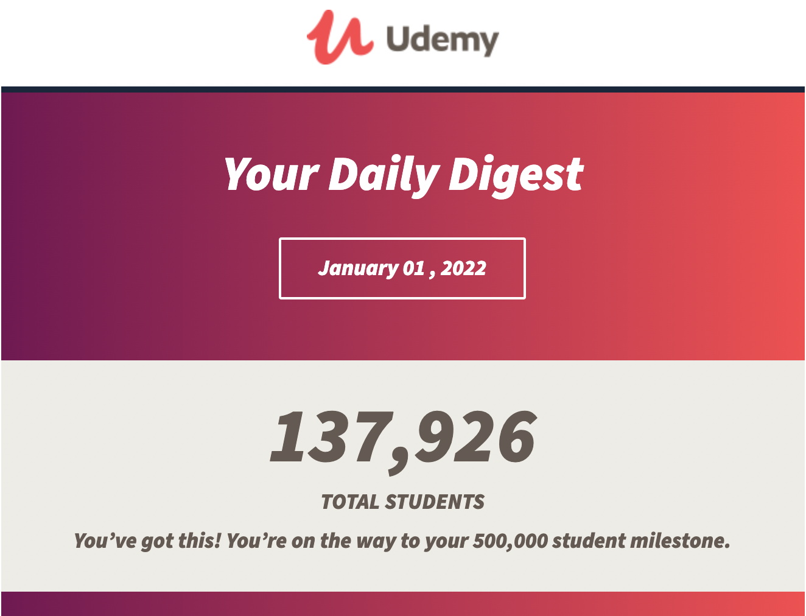

Happy New Year friends. Welcome to the first installment of this newsletter in 2022. I hope this finds you and your family healthy and happy. In this edition of the newsletter, I want to talk about New Year's goals and plans to move my website over to Nuxt 3.

## New Year, New Me 🤷‍♂️

I wrote up my annual [New Years’ post](https://www.danvega.dev/blog/2022/01/01/happy-new-year-2022/) in which I looked back at some of my highlights from 2021 and looked ahead to 2022. From a professional standpoint, my focus this year is on producing more quality content.

I took a look at my numbers from last year and they were a little embarrassing. I am giving myself a bit of a break because we are still in the middle of a pandemic and mentally it’s just been an exhausting couple of years. The goals I am setting when it comes to content are this:

- YouTube: 1 video per week for a total of 52 videos
- Live Streaming: 2x a month for a total of 24 live streams
- Courses: 2 New Courses
- Live Training 👀 (More on this soon)
- Blog: 1 post per month for a total of 12 posts

### YouTube

As you can see YouTube is where I want to focus this year. I’m really proud that I have been able to grow my channel to almost 14k subscribers and I have done so without being consistent. I looked back at my stats and I only published **11 videos** in 2021. That is less than 1 per month and I know I can do better than that.

You might be thinking that moving from 11 to 52 videos in a year is a lofty goal and I would completely agree. I think the one thing I have on my side is that I can create YouTube shorts much quicker than normal tutorials. Are you a fan of consuming shorts on YouTube? If so can you let me know what types of videos you want to see or some of your favorite creators that are creating shorts?

## Courses

I love creating courses but I haven’t been able to in a while. I have been struggling with what to create and where. The one thing I know for sure is that I want to create smaller courses that are focused on a particular topic which means no more 12-15 hour courses from me. I could create them on my own platform and charge more or host them on something like Udemy and sell them for less. I have also thrown around the idea of creating a platform and inviting some other creators to build on it. Whatever I end up doing I hope to publish at least 2 courses in 2022 and I can’t wait to share those with you. Until then I am extremely blessed to have 138,000 students around the world taking my courses. Thank You 🙏

## Moving my website to Nuxt 3

I’m really happy with my [current website](https://www.danvega.dev/). Every time I post a new article I head over to the site to make sure it looks ok and I remember just how proud I am of it. The current version of my website is written in a framework called [Gridsome](https://gridsome.org/), which is a static site generator for VueJS. I have been really happy with Gridsome but there are a few limitations that are stopping me from doing some of the things I want to do. That and the project hasn’t been moving forward that much over the last couple of years.

Enter Nuxt 3 which just went into beta and brings a whole bunch of exciting features. There are too many to mention here but these are my favorites so far

- Vue 3 Support
- TypeScript Support
- Vite - My favorite build tool
- Nitro - Nuxt 3 Server
- FAST!

Nuxt 3 is still in beta and while I love what they are doing there are still some things missing that are going to prevent me from moving over right now. The biggest one of all is static site generation which is coming soon 🤞🏻 Lucky for me I am in no rush to move over which gives me a great opportunity to spend some time learning Nuxt 3. I put together a couple of videos recently on getting started with Nuxt 3 and Nuxt 3 + Tailwind CSS 3.

`youtube:https://www.youtube.com/watch?v=tdOoKKXlDCQ`

`youtube:https://www.youtube.com/watch?v=0oE2r51HyF0`

## Around the Web

### 📝 Articles

- [Instagram Previews on Twitter](https://about.instagram.com/blog/announcements/introducing-better-previews-of-your-content-outside-of-instagram/)
- [Startups are taking advantage of AWS at a whole new level](https://siliconangle.com/2021/12/17/startups-taking-advantage-aws-whole-new-level-reinvent/)
- [Compose Multiplatform 1.0 is going live!](https://blog.jetbrains.com/kotlin/2021/12/compose-multiplatform-1-0-is-going-live/)
- [Announcing the First Release of kcctl](https://www.morling.dev/blog/announcing-first-release-of-kcctl/)
- [Generics facilitators in Go](https://rakyll.org/generics-facilititators/)

### 🎬 Videos

- [Gopher Con 2021 Session Videos](https://www.youtube.com/c/GopherAcademy/videos)
- [https://twitter.com/BillyKorando/status/1472959983612358657](https://twitter.com/BillyKorando/status/1472959983612358657)

### 💻 Projects

- [Spring Native 0.11.1 available now](https://spring.io/blog/2021/12/22/spring-native-0-11-1-available-now)
- [Spring Boot 2.6.2 is available now](https://spring.io/blog/2021/12/21/spring-boot-2-6-2-available-now)
- [Compose Multiplatform](https://www.jetbrains.com/lp/compose-mpp/)
- [Pico.css Minimal CSS Framework for semantic HTML](https://picocss.com/)
- [Groovy Language Server](https://github.com/GroovyLanguageServer/groovy-language-server)

### 📚 Books

- [Patterns.dev](https://www.patterns.dev/)

### 👨🏼‍💻 Courses

- [Golang Tutorial for Beginners [Full Course]](https://dev.to/techworld_with_nana/golang-tutorial-for-beginners-free-course-330)

### 📰 Newsletters

- [This month in Spring - December 2021](https://tanzu.vmware.com/content/josh-blog/this-month-in-spring-december-2021)

### ✍️ Quote of the week

“Perfectionism is the mother of procrastination.” - Michael Hyatt

### 🐦 Tweets

[https://twitter.com/chrismunns/status/1472960906498035712](https://twitter.com/chrismunns/status/1472960906498035712)

## Until Next Week

Thanks for sitting down and sharing a cup of coffee with me my friend. I hope you enjoyed this installment of Coffee & Code and I will see you next Monday morning. If you have any links you would like me to include please [contact me](http://twitter.com/therealdanvega) and I might add them to a future newsletter. I hope you have a great week and as always friends...

Happy Coding 
Dan Vega 
danvega@gmail.com 
[https://www.danvega.dev](https://www.danvega.dev/)
