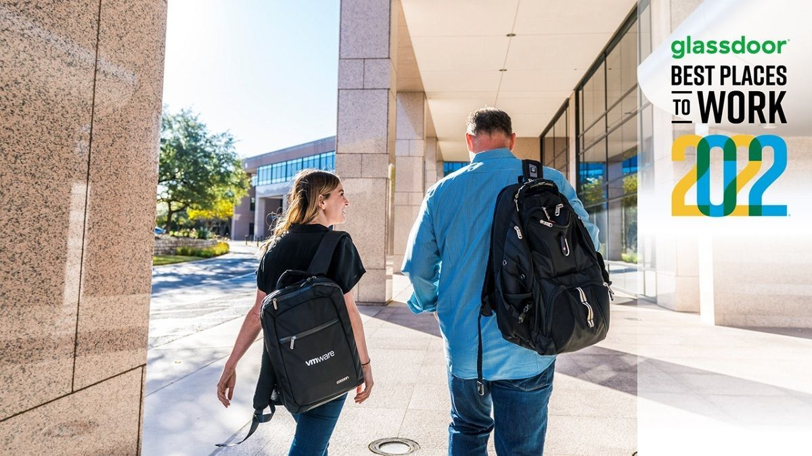

[Read this on danvega.dev](https://www.danvega.dev/newsletter/im-joining-vmware)

I apologize for missing the last couple of weeks but I have had a lot going on in my life. As you probably already saw from the title I am joining VMware so we will start there and I will catch you up on what I have been up to the past few weeks.

## Spring Developer Advocate 🥑

I’m excited to announce that I have joined VMware as a Spring Developer Advocate. This is literally a dream for me on so many levels. First I get to join a world-class organization that continually gets ranked as one of the best places to work. I get to join a team made of so many great developers and teachers and I can’t wait to learn from them. Finally, I get to talk about Java & Spring every single day and create content around languages, frameworks, projects, and tools that I genuinely enjoy using. If you want to read more about my decision you can [read a blog post here](https://www.danvega.dev/blog/2022/01/24/im-joining-v-mware/) where I detailed everything.

## Live Streaming with Greg Turnquist

I forgot to mention this in my last newsletter but Greg and I did a live stream on New Year's Eve. If you’re not familiar with Greg, he works on the Spring Team (and now he’s a coworker 🥳) and is an author of some amazing Spring books.

In this stream, we talked about some of our highlights from the year as well as our predictions for  2022. We also tried to answer the question of what makes a “pro” developer. There is a lot to unpack here and certainly not enough time to cover everything. I hope I get a chance to come back and answer some of the questions fully for my blog or YouTube channel in the near future.

`youtube:https://www.youtube.com/watch?v=Un5wpBy4aJA`

## Nuxt 3 Nitro Server Engine

I have spent the last few weeks learning about Nuxt 3 (which is currently in beta) and taking that opportunity to take what I have learned and create some short tutorials around. In this tutorial, I take a look at Nuxt Nitro, the new server engine in Nuxt 3. With Nitro, you can create API routes by simply adding a `server/api` folder and creating a JavaScript (or TypeScript) file that exports a default function. Check out the video below if you want to start creating full-stack applications in Nuxt 3.

`youtube:https://www.youtube.com/watch?v=FeKleFJkKNY`

If you enjoyed this you might like what I will be releasing this week. I created a tutorial on how to use Nuxt 3 + Notion API to retrieve and update a database stored in Notion. If that sounds fun make sure you subscribed to my [YouTube channel](http://www.youtube.com/danvega).

## Java Champions Conference

The [Java Champions Conference](https://jchampionsconf.com/) started last week and will continue Monday and Tuesday this week. Each of the presentations is given by a Java Champion which means there are a lot of really smart people talking. Here are a few talks I enjoyed from Thursday & Friday

- [Getting Started with Serverless Java](https://www.youtube.com/watch?v=CxrwIphxsgM)
- [Functional Programming in Java, Kotlin, and Groovy](https://www.youtube.com/watch?v=3ENintpjAIY)
- [The Secrets of the Fastest Java Developers on Earth](https://www.youtube.com/watch?v=cK19rE2V9UY)
- [5 tips on creating modern, cloud-native applications](https://www.youtube.com/watch?v=6qOsBys7jhQ)

## Around the Web

### 📝 Articles

- [Web3 is the Future of the Creator Economy](https://www.entrepreneur.com/article/403948)
- [No code reviews by default](https://www.raycast.com/blog/no-code-reviews-by-default/)
- [Java Annotated Monthly – January 2022](https://blog.jetbrains.com/idea/2022/01/java-annotated-monthly-january-2022/)

### 🎬 Videos

- [Tanzu TV - Code with Josh and Deshaun](https://www.twitch.tv/videos/1268630354)
- [Introduction to VMware Tanzu Application Platform (TAP)](https://www.youtube.com/watch?v=SDobPYHk_sQ)
- [Vue.js Advanced Data Provider Component Patterns Explained](https://www.youtube.com/watch?v=0JY8O1LBA7U)

### 🎙 Podcasts

- [airhacks.fm - Java, Jakarta EE and MicroProfile on Azure](https://airhacks.fm/#episode_171)
- [Between Chair and Keyboard with Glenn Vanderburg](https://tanzu.vmware.com/developer/tv/bcak/50/)
- [Between Chair and Keyboard with Heidi Waterhouse](https://tanzu.vmware.com/developer/tv/bcak/51/)

### 💻 Projects

- [GitHub Action for GraalVM](https://github.com/marketplace/actions/github-action-for-graalvm)
- [Deno by Example](https://examples.deno.land/)
- [Vue 3 docs preview](https://staging.vuejs.org/)

### 📚 Books

- [YouTube Formula](https://amzn.to/3GYRryW)

### ✍️ Quote of the week

> “If I had an hour to solve a problem **I'd spend 55 minutes thinking about the problem and five minutes thinking about solutions**.” - Albert Einstein
>

### 👨🏼‍💻 Courses

- [Getting Started with CSS](https://frontendmasters.com/courses/getting-started-css/)

### 🎓 Conferences

- [TheJam.dev 2022](https://cfe.dev/events/the-jam-2022/)
- [Java Champions Conference](https://jchampionsconf.com/)
- [VueJS Nation Conference](https://vuejsnation.com/)

### 🐦 Tweets

Evan You create a version of Wordle using Vue

[https://twitter.com/youyuxi/status/1485202083225616385](https://twitter.com/youyuxi/status/1485202083225616385)

## Until Next Week

Thanks for sitting down and sharing a cup of coffee with me my friend. I hope you enjoyed this installment of Coffee & Code and I will see you next Monday morning. If you have any links you would like me to include please [contact me](http://twitter.com/therealdanvega) and I might add them to a future newsletter. I hope you have a great week and as always friends...

Happy Coding 
Dan Vega 
danvega@gmail.com 
[https://www.danvega.dev](https://www.danvega.dev/)
