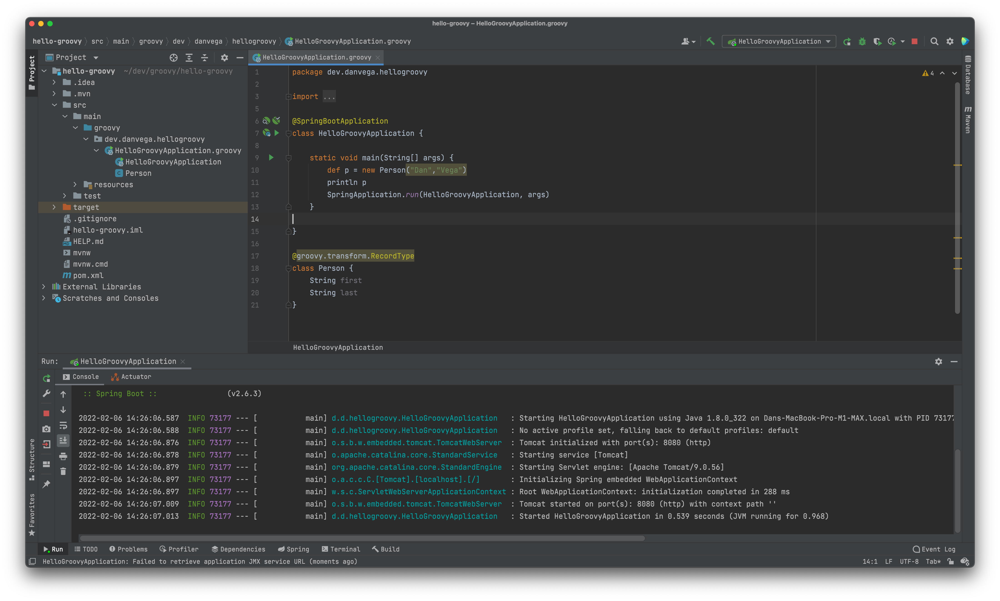

Good morning, Happy Monday, and welcome to another edition of the newsletter friends. If you’re anywhere near me (Cleveland, OH) I hope you’re staying warm as we experienced quite the snowstorm last week. I’m encouraged that we have crossed over into February and that the worst of winter is almost behind us.

The one day I have marked on my calendar every year is the day we move the clocks forward. I’m encouraged that it's staying light out longer but on that glorious day when we move the clocks forward, I know Spring and Summer are right around the corner. If you take part in daylight savings time that day is March 13th this year, so put it on your calendars! With that let’s take a look at what happened last week.

## Testing with Spring and JUnit 5

I had the privilege of co-hosting [Tanzu Tuesdays](https://tanzu.vmware.com/developer/tv/tanzu-tuesdays/0083/) where our guest was the great [Sam Brannen](https://twitter.com/sam_brannen). Sam was kind enough to present to us on Testing with [Spring](https://spring.io/projects/spring-boot) and [JUnit 5](https://junit.org/junit5/docs/current/user-guide). It was a great talk and I will leave a link to the talk below.

`youtube:https://youtu.be/krA-A2HqWFQ`

I write tests, probably not enough of them but I do write them. I write tests in Spring and JUnit but what is becoming apparently clear to me is that I am not caught up on all the cool things that JUnit 5 has to offer.

I think one that really stuck with me was the fact that we need to make sure we are testing our Spring Native applications using:

`mvn -Pnative test`

You’re no longer on the JVM so your normal test suite isn’t going to cut it. Most of the time you aren’t going to run into any issues but you want to make sure you’re testing for your target platform. Thanks for the tip, Sam!

## Netlify & Gridsome Builds

My website is written in a static site generator for Vue in a framework called [Gridsome](https://gridsome.org/). Whenever I write a new blog post or a new newsletter like the one you’re reading now I follow a similar process.

All of my writing starts in Notion because that is the single source of truth for all my content creation.  When I have completed an article or newsletter I will create that content over on my website. This consists of creating a markdown file, adding some front matter (metadata about the article), and exporting the markdown from Notion into my website.

Two weeks ago I had the article about me [joining VMware](https://www.danvega.dev/blog/2022/01/24/im-joining-v-mware/) ready to go. I also had a newsletter edition ready to go that pointed to that article. My process for getting these pieces of content live is simple, **git push**.

This will trigger a new build on Netlify and after a few minutes my content is live. Well this is usually how it works but when I did this on the first day of my new job I ran into an issue. I started seeing this build process time out and I would see the following in the logs

```bash
10:51:42 AM: Render HTML (258 files) - 3.72s
10:51:42 AM: Process files (1 files) - 0.23s
10:58:05 AM: Processing images (1047 images) -
0%Processing images (1047 images) -
2%Processing images (1047 images) -
5%Processing images (1047 images) -
7%Processing images (1047 images) -
10%Processing images (1047 images) -
12%Processing images (1047 images) -
14%Processing images (1047 images) -
17%Processing images (1047 images) -
19%Processing images (1047 images) -
21%Processing images (1047 images) -
24%Processing images (1047 images) -
26%Processing images (1047 images) -
29%Processing images (1047 images) -
31%Processing images (1047 images) -
...
(1047 images) - 86%Processing images (1047 images) - 88%Processing images (1047 images) - 90%
```

From what I can tell this is Gridsome creating different versions of every single image on my website. This process was taking too long and the build would simply timeout each time. So I have this article about how I am starting my dream job and I can’t get it live 🤦‍♂️

After trying to find a solution to this problem I started thinking about it differently. I ran a build locally and it worked just fine. I have this great machine, why not let it do the work. It was then I found [these instructions](https://gridsome.org/docs/deploy-to-netlify/) that showed me how I could deploy to Netlify directly using the Netlify CLI.

I Installed the Netlify CLI, ran the build locally, and pushed it to production using the command

`netlify deploy --prod`

This ended up not only working great but was really fast. I think I am going to take this approach going forward even If I find a solution to my problem.

If you’re interested in doing this just make sure you go into Netlify and turn off automatic builds on commits to your repository.

## Groovy 4

If you're new around here I’m a huge fan of [Groovy](https://groovy-lang.org/) and have been for a while now. I created a [14-hour course](https://www.udemy.com/course/apache-groovy/?referralCode=7FB8CB67D3D3D17CF1EA) that teaches you all the fundamentals of Groovy. I haven’t been using it as much lately but it will always be special to me.

[Groovy 4 was just released](https://groovy-lang.org/releasenotes/groovy-4.0.html) and there are some really great new features. I will need some time to go through all of them but I will talk about one of them here. If you’re on Java 16+ you have access to records but what happens if you’re still stuck in the stone age of Java 8.

If you’re using Groovy 4 you can use the new  **RecordType** and take advantage of record style classes, regardless of what version of Java you’re on. If you’re a version that supports records the generated class will be a record but if It isn’t it will be an immutable type that resembles the characteristics of a record class. Pretty cool if you ask me 🥳



## Spring Boot Magic

I’m worked on some demo’s last week that might turn into an article, tutorial, presentation, course or all of the above. I think a lot of us build out a Spring Boot application without understanding what is happening behind the scenes.   The Spring Initializr, Spring Boot Starters and Auto Configuration can make getting started seem a little bit like magic.

As I started putting these demos together I remembered that I already have a tutorial on this. In the video below I show how to start with a simple Maven project and build out a simple Spring Framework application.

`youtube:https://youtu.be/e8aSyQo0nHo`

The next evolution of this is building out a web application with an embedded Tomcat server, logging, externalized configuration and a database connection. If you can think of anything else you would like to see in this demo please let me know.

## Live Streaming

I am going to live stream this week but I just don’t have it scheduled yet. If you’re not following me [Twitch](https://www.twitch.tv/danvega) or [subscribed to me on YouTube](http://www.youtube.com/danvega) please do that now to be notified when I go live. If there are any topics you would like to see me cover please let me know.

## Around the Web

### 📝 Articles

- [Java on Visual Studio Code Update – January 2022](https://devblogs.microsoft.com/java/java-on-visual-studio-code-update-january-2022/)
- [Spring Boot 2.6.3 ARM64 Image](https://dashaun.hashnode.dev/spring-boot-263-arm64-image)

### 🎬 Videos

- [SDKMAN Explained](https://foojay.io/today/video-sdkman-explained/)
- [You may not need JavaScript | Simon Martinelli (EN)](https://www.youtube.com/watch?v=cyqfiUlx2UE)

### 🎙 Podcasts

- [A Bootiful Podcast: Spring Data lead and architect extraordinaire, Oliver Drotbohm](https://bootifulpodcast.fm/#/episodes/1a1dc9ea-c306-46b8-a835-5e248f7d4636)
- [A Bootiful Podcast: Spring Framework co-founder and project lead, friend, and all-around amazing human being, Juergen Hoeller](https://bootifulpodcast.fm/#/episodes/1c136ac9-2cc3-4b76-80fa-da458fedbafe)

### 💻 Projects

- [Chuck Norris API](https://github.com/chucknorris-io/chuck-api)

### 👨🏼‍💻 Courses

- [Cloud Native Java with Kubernetes, 2nd Edition by Josh Long](https://learning.oreilly.com/videos/cloud-native-java/9780137834051/)

### 🗣 Conferences

- [Block by Block Notion Conference](https://blockbyblock.notion.com/)

### 🐦 Tweets

[https://twitter.com/therealdanvega/status/1488265020840767489](https://twitter.com/therealdanvega/status/1488265020840767489)

## Until Next Week

Thanks for sitting down and sharing a cup of coffee with me my friend. I hope you enjoyed this installment of Coffee & Code and I will see you next Monday morning. If you have any links you would like me to include please [contact me](http://twitter.com/therealdanvega) and I might add them to a future newsletter. I hope you have a great week and as always friends...

Happy Coding<br/>
Dan Vega<br/>
danvega@gmail.com<br/>
[https://www.danvega.dev](https://www.danvega.dev/)
