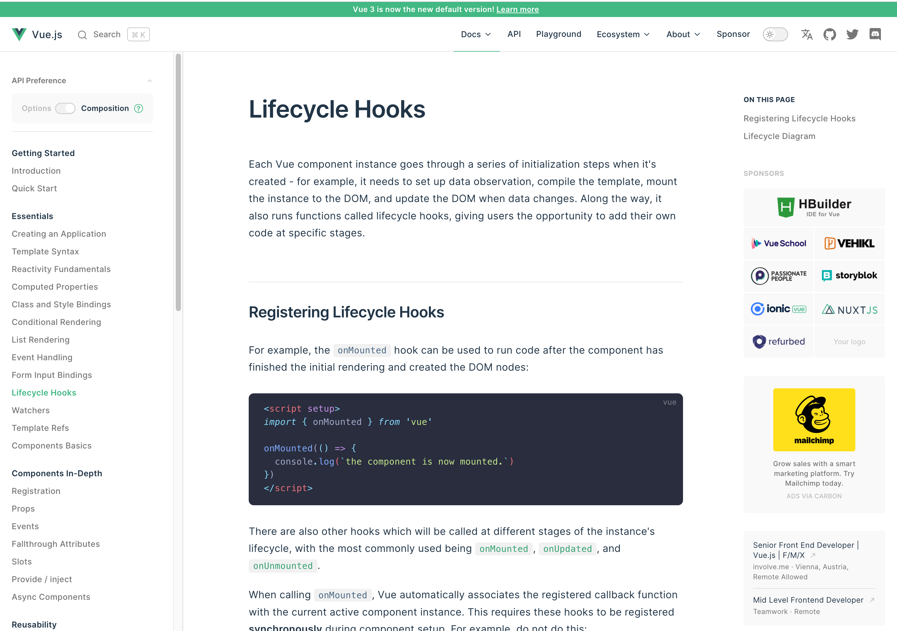

It’s Monday, February 14th and I am once again petitioning for the day after the Super Bowl to be a national holiday. I’m writing this before the game takes place so I don’t know how it ends. I’m just hoping for a good game and a great halftime show. In this week's edition of the newsletter, I want to talk about Live Streaming, Netlify Serverless Functions, Vue 3, and The Dropout.

## Live Streaming

In my new role as a Spring Developer Advocate, I am going to be presenting a lot more this year. I already have a bunch of virtual events lined up including one this week. On Wednesday, February 16th I will be speaking with Mala Gupta at JetBrains. In this session, I will be talking about building REST APIs with Spring Boot.

As much experience as I have with creating and editing videos I don’t have a ton of experience live streaming or presenting virtually. With that, I thought I would start practicing last week and I ended up live streaming 3 times which is probably more action than my Twitch channel has ever seen.

My main goal was just to get used to the software and work out any issues. I am a big fan of [Ecamm](https://www.ecamm.com/) and I want to use the software to stream with but I keep having issues with it. There are times when it works fine and there are other times where the audio gets out of sync and for the life of me I can’t figure it out. This even happens when I use the record-only mode. I thought after getting my [brand new MacBook](https://www.danvega.dev/blog/2021/11/15/macbook-pro-m1-max-review/) that this would go away but unfortunately, it didn’t. If anyone knows what would cause this please let me know.

I also used Streamyard for the first time this week and was happy with it. We have a group account for this at work and I will also be using this on my stream this Wednesday. I wish it was as customizable as Ecamm but on the other hand, I didn’t have any audio issues. I’m still trying to find a good way to play background music on Streamyard. I think I found a solution using [Loopback](https://rogueamoeba.com/loopback/) but I am still testing that out.

You can find the 3 live stream recordings below. If you’re not already following me on [Twitch](https://www.twitch.tv/danvega) or [YouTube](http://www.youtube.com/danvega) please do to be notified when I go live next.

- [https://www.twitch.tv/videos/1291608965](https://www.twitch.tv/videos/1291608965)
- [https://www.twitch.tv/videos/1292435014](https://www.twitch.tv/videos/1292435014)
- [https://www.twitch.tv/videos/1293492510](https://www.twitch.tv/videos/1293492510)

As far as what I did in the live streams, I will cover that in the next section.

## Netlify Serverless Functions

Throughout the live streams I mentioned above I was trying to solve a real problem that I have. With all of these speaking appearances, I have scheduled this year I need a way to display them on my website.

If you follow anything I do you know I am a huge fan of Notion. I keep everything I do in Notion so naturally, I would like to store all of my conferences, user group meetups, and live streams in one place. I started with just a list of upcoming live streams and using the [Notion API](https://developers.notion.com/) I was able to pull all of them into a page on my website.

The next question becomes how do you do that when you’re using a frontend framework like Vue. My website is a static generated website using Gridsome + Vue. You don’t want to make API calls from a frontend because you can expose your authentication / API secrets. I could stand up a backend with something like Node or Java but that seems like a lot for such a simple task. This is a perfect use case for serverless functions.

I was able to do this thanks to [Netlify Serverless functions](https://docs.netlify.com/functions/overview/). With Netlify you can create a directory and any file that exports a handler function gets turned into a serverless function and uploaded to AWS Lambda. I decided to take what I learned from the live streams and created a simple tutorial on how I used a Netlify function to connect to the Notion API.

`youtube:https://youtu.be/A-b1ZdlNbww`

## Vue 3 Documentation

If you haven’t been paying attention the [Vue 3 docs](https://vuejs.org/) have been released. Along with this release Vue 3 has now become the default. If you look in the upper left-hand corner of the documentation you will see an API reference section. This toggle will allow you to switch the docs based on if you’re using the Options or Composition API. I thought that was a really nice touch 🎉

## The Dropout

I am fascinated by the story of Elizabeth Holmes and Theranos. I read [Bad Blood](https://amzn.to/36eN1GJ) by [John Carreyrou](https://www.amazon.com/John-Carreyrou/e/B07CWLT57D/ref=dp_byline_cont_book_1) a few years back and was totally sucked into everything that went on. There was also a really good documentary on HBO about this that I also enjoyed.

Elizabeth Holmes has been in the news lately as she went to trial and was found guilty of defrauding investors. There is a new show coming to Hulu called the dropout which has an incredible cast.

`youtube:https://youtu.be/novUDyBszA8`

## Nuxt 3

This was a really great Twitter thread by Sébastien Chopin on where we are with Nuxt 3. I am obviously paying close attention to this because I’m hoping to move my website over to Nuxt 3 this year.

[https://twitter.com/Atinux/status/1492134648733913089](https://twitter.com/Atinux/status/1492134648733913089)

## Until Next Week

Thanks for sitting down and sharing a cup of coffee with me my friend. I hope you enjoyed this installment of Coffee & Code and I will see you next Monday morning. If you have any links you would like me to include please [contact me](http://twitter.com/therealdanvega) and I might add them to a future newsletter. I hope you have a great week and as always friends...

Happy Coding 
Dan Vega 
danvega@gmail.com 
[https://www.danvega.dev](https://www.danvega.dev/)
