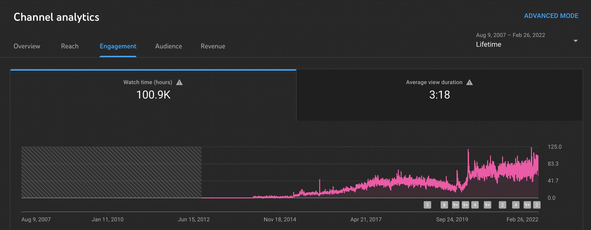

With everything going on in the world it’s hard to sit here and act like everything is normal. My heart is broken on what the people of Ukraine are going through. Please keep them in your prayers and thoughts and if you can do anything to support them please do.

After missing last week I’m back with another edition of the newsletter and I have a lot to talk about. Last week marked 1 month at VMware for me and It still doesn’t feel real to me. I get to wake up every single day and do what I love.

In the past 2 weeks, I gave 2 presentations and I will tell you all about those in case you missed them. I also want to talk about the Twitter Community I started and a major milestone that I crossed on YouTube.

## Building REST APIs in Spring Boot

I was honored to be asked to speak on the IntelliJ IDEA YouTube live stream with Mala Gupta. In this presentation, you will learn how to build a CRUD REST API using Spring Boot. I spent most of this presentation live coding and teaching the mechanics of building a REST API without going to much into REST principles.

I was asked a lot of questions about which plugins I use for IntelliJ. A lot of people were amazed at some of the things [Github Copilot](https://youtu.be/97C3fQqzj-I) can do and I would have to agree with them. I am using 2021.3 Ultimate Edition at the time of this recording. The plugins I was asked about the most are:

- Live Templates: [https://www.jetbrains.com/help/idea/using-live-templates.html](https://www.jetbrains.com/help/idea/using-live-templates.html)
- HTTP Client: [https://www.jetbrains.com/help/idea/http-client-in-product-code-editor.html](https://www.jetbrains.com/help/idea/http-client-in-product-code-editor.html)
- Github Copilot: [https://copilot.github.com/](https://copilot.github.com/)

If you want to watch the recording of this presentation you can check it out below. The source code and slides can be found [here](https://github.com/danvega/building-rest-apis-spring-boot).

[https://www.youtube.com/watch?v=q_RLfOB7axQ&t=2320s](https://www.youtube.com/watch?v=q_RLfOB7axQ&t=2320s)

## What’s new in Spring Boot 2.6

I was asked to speak at the San Francisco Java User Group and jumped on the opportunity. In this presentation, I gave an overview of what’s new in Spring Boot 2.6. I spent a lot of time going through the [release notes](https://github.com/spring-projects/spring-boot/wiki/Spring-Boot-2.6-Release-Notes) for Spring Boot 2.6.

In the past, I have gone through the release notes but it was more of a let me scan through here and see if anything is interesting to me. There were times I didn’t understand some of the updates until I saw one of those great [overview videos](https://www.youtube.com/watch?v=lgyO9C9zdrg) from Phil Webb. That’s why I was really excited to put this presentation together and show some code examples of what was new in Spring Boot 2.6.

The release notes for each major upgrade are broken down into 2 sections, Upgrading from the previous version and New & Noteworthy. I was prepared to talk about the following and we ended up getting to most of them:

**Upgrading from Spring Boot 2.5**

- Release Versioning
- Deprecations
- Circular References
- Path Matching Strategy
- Actuator Env
- Application Startup (2.4)
- Records & Configuration Properties

**New & Noteworthy**

- Dependency Upgrades
- Reactive Server Session Properties
- Build Info Property Exclusion
- SameSite Cookie Attribute
- Pluggable Sanitization Rules
- Java Runtime Information
- WebTestClient for Spring MVC
- Metrics Support
- Docker Image Building Support

[https://www.youtube.com/watch?v=oNs8sLbbAT4](https://www.youtube.com/watch?v=oNs8sLbbAT4)

I’m going to come back and create videos for specific items on this list for YouTube. If you would like a detailed dive into anything new in Spring Boot 2.6 please reach out and let me know.

## Spring Developers Twitter Community

I was finally able to get access to create a new Community on Twitter. You can think of Twitter Communities as a combination of Facebook Groups and Reddit. I created a community for Spring Developers to connect, share what they are working on, and ask questions. In just a few days we climbed up to 800+ members. I’m excited to see where this goes so if you’re not a member please [join us](https://twitter.com/i/communities/1496544801533091844).

## Awesome Spring

A huge shoutout to Thomas Vitale for adding me to his [Awesome Spring Resource](https://github.com/ThomasVitale/awesome-spring). This is a really good collection of resources from the Spring Community. What I love about this is that it is a carefully hand-crafted list and not just a huge dump of resources. Thomas is big in the Spring community and this is a great resource if you enjoy please show your support by giving it a star.

[https://twitter.com/vitalethomas/status/1495883469498507267](https://twitter.com/vitalethomas/status/1495883469498507267)

## YouTube

I recently passed 100,000 hours of watch time on YouTube. To date I have only uploaded 232 videos most of which I would say aren’t great so to hit this milestone is pretty amazing. I want to thank all of you who support the channel and if [you’re not subscribed yet](http://www.youtube.com/danvega), what are you waiting for? I have a bunch of content in the backlog for the next month so stay tuned!

## Around the Web

### 📝 Articles

- [From Tumblr girl to engineer](https://mashable.com/article/tumblr-girl-learn-code)
- [Announcing Netlify Graph: A faster way for teams to develop web apps with APIs](https://www.netlify.com/blog/announcing-netlify-graph-a-faster-way-for-teams-to-develop-web-apps-with-apis)
- [Spring Security without the WebSecurityConfigurerAdapter](https://spring.io/blog/2022/02/21/spring-security-without-the-websecurityconfigureradapter)
- [How I moved to a healthy component-based Spring Security configuration](https://blog.trifork.com/2022/02/25/getting-out-of-a-codependent-relationship-or-how-i-moved-to-a-healthy-component-based-spring-security-configuration/)

### 🎙 Podcasts

- [A Bootitful Podcast: Java team luminary Sharat Chander](https://bootifulpodcast.fm/#/episodes/af8b106e-273f-4fc9-ad19-97f3da52906f)

### 💻 Projects

- [Java 18](https://jdk.java.net/18/)
- [Hilla - A modern web framework for Java](https://hilla.dev/)
- [State of JS 2021](https://2021.stateofjs.com/en-US/)

### 📚 Books

- [Head first Git](https://amzn.to/3KdfsUb)

### 🐦 Tweets

[https://twitter.com/jetbrains/status/1496786254494670851](https://twitter.com/jetbrains/status/1496786254494670851)

## Until Next Week

Thanks for sitting down and sharing a cup of coffee with me my friend. I hope you enjoyed this installment of Coffee & Code and I will see you next Monday morning. If you have any links you would like me to include please [contact me](http://twitter.com/therealdanvega) and I might add them to a future newsletter. I hope you have a great week and as always friends...

Happy Coding 
Dan Vega 
danvega@gmail.com 
[https://www.danvega.dev](https://www.danvega.dev/)
