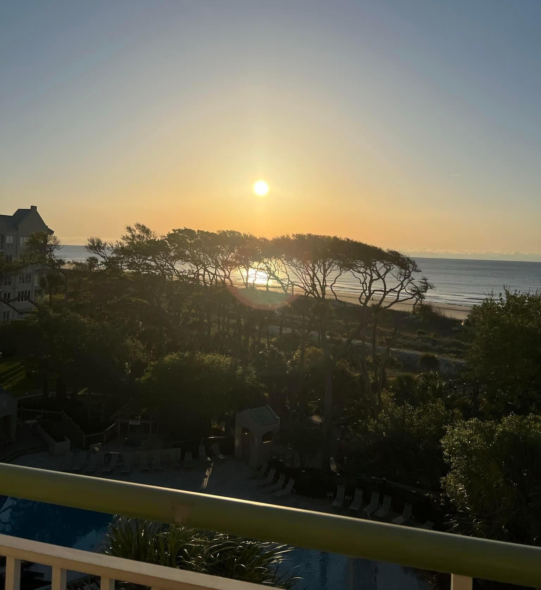
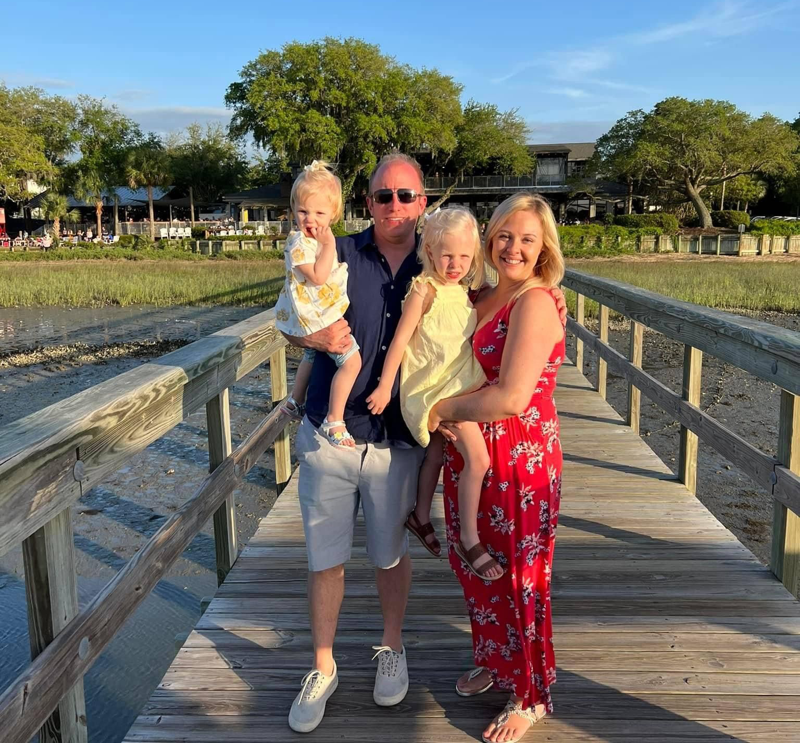
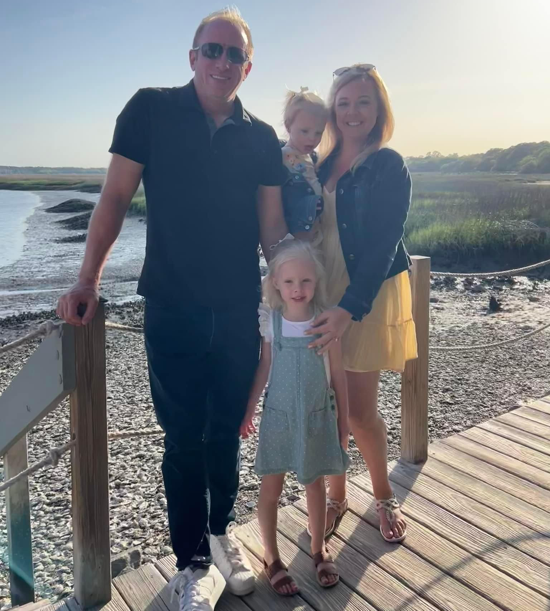
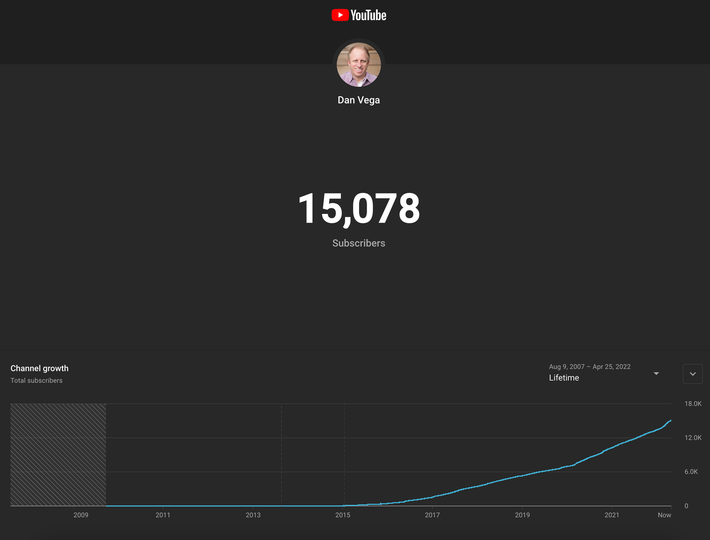

Happy Monday friends! It’s been a while since we last talked and I have a lot to share with you. A couple of weeks ago my family and I took a much-needed vacation to Hilton Head, SC. We had such a great time at the beach, riding bikes and eating so much good food.

We returned on a Saturday and on Sunday I began packing for SpringOne Tour in Chicago. That night I decided to take a Covid test because I had a bit of a cough. I tested positive and didn’t believe it so I tested again with the same result. I didn’t believe it because even as of recent I have been hearing of others getting pretty sick and I wasn’t sick.

I was really bummed out because this meant that I had to cancel my trip to Chicago. This was the first time I was going to get to hang out with coworkers in person. This also meant that I wouldn’t be giving my talk on Spring for GraphQL which I worked really hard on.

At the end of the day, it’s just the first conference of many this year. I spent last week catching up on some things at work and after that and a vacation, I feel ready to go for conference season!

## Conference Talks

Speaking of conferences I received notice that I would be speaking at 2 more conferences this summer while I was on vacation. When you receive as many declines as I do you tend to celebrate the wins and I am so pumped for both of these. 🥳

### VueConf US

If you know me you know that I am a huge fan of Vue and the community. I have submitted a number of talks over the years to Vue-related conferences with no luck. I was so excited to find out that I will be speaking at [VueConf US](https://us.vuejs.org/) which is located in Ft. Lauderdale FL! I will be speaking on Nuxt 3 and more specifically what’s coming in Nuxt 3!

I think what I am looking forward to most is meeting so many people from the Vue community that I have talked to over the years and never met. If you’re heading to this conference please let me know so we can catch up.

### Code on the Beach

A few days later I got notice that I had been accepted to [Code on the Beach](https://www.codeonthebeach.com/). This conference also takes place in FL but this time we move up the coast to Atlantic Beach. I have heard some great things about this conference and I was excited to hear I will be joined by a couple of coworkers. In this talk, you will learn how to build Full Stack Java applications with Spring Boot.

## VMware

I celebrated 3 months last week at VMware! I can’t remember the last time I was this happy at work. The company I work for is amazing on so many levels. I get to go to work every single day and do what I love with a really great team.

VMware attracts some of the most talented people in our industry and you can see it with every interaction company wide. The benefits are amazing and I appreciate the freedom to maintains work/life balance. A lot of companies will preach this but it’s often just talk, not here.

To top it all off VMware was ranked [#2 by Forbes](https://www.forbes.com/lists/best-employers-diversity) on America’s best employers for diversity last week.

## YouTube 15,000 Subscriber Milestone

While I was on vacation I crossed 15,000 subscribers on [YouTube](http://www.youtube.com/danvega)! This is amazing and If I was home I probably would have created a video to talk through this amazing milestone. Next up is 20k and I will try and put something together for that one.

## This newsletter

I have been trying to figure out what to do with this newsletter. It might not seem like it but it takes a lot of effort and I’m not sure anyone would miss it. I pay attention to the analytics and I can tell that some of you are reading this but I just feel like my efforts can be better spent elsewhere. For now I will keep this around but I am going to move it to an every other week cadence. If you have any feedback for me on this newsletter please feel free to reach out.

## Around the Web

### 📝 Articles

- [Remote Development With JetBrains Gateway and Gitpod](https://blog.jetbrains.com/blog/2022/04/28/jetbrains_partners_with_gitpod/)
- [Hibernate ORM 6.0 Delivers Improved Performance](https://www.infoq.com/news/2022/04/red-hat-releases-hibernate-6/)
- [GraalVM 22.1: Developer experience improvements, Apple Silicon builds, and more](https://medium.com/graalvm/graalvm-22-1-developer-experience-improvements-apple-silicon-builds-and-more-b7ac9a0f6066)

### 🎙 Podcasts

- [Cloud guru Tiffany Jernigan](https://bootifulpodcast.fm/#/episodes/28280dc4-c9ca-4229-8075-b4f63a4cb6c4)

### 💻 Projects

- [https://openjdk.java.net/jeps/8273943](https://openjdk.java.net/jeps/8273943)
- [https://nuxtjs.org/announcements/nuxt3-rc/](https://nuxtjs.org/announcements/nuxt3-rc/)
- [Project Loom preview set for Java 19](https://openjdk.java.net/jeps/425)

### 📰 Newsletters

- [This month in Spring - April 2022](https://tanzu.vmware.com/content/josh-blog/this-month-in-spring-april-2022)

### ✍️ Quote of the week

### 🐦 Tweets

[https://twitter.com/juliendubois/status/1518671023415177217](https://twitter.com/juliendubois/status/1518671023415177217)

## Until Next Week

Thanks for sitting down and sharing a cup of coffee with me my friend. I hope you enjoyed this installment of Coffee & Code and I will see you in 2 weeks. If you have any links you would like me to include please [contact me](http://twitter.com/therealdanvega) and I might add them to a future newsletter. I hope you have a great week and as always friends...

Happy Coding 
Dan Vega 
danvega@gmail.com 
[https://www.danvega.dev](https://www.danvega.dev/)

