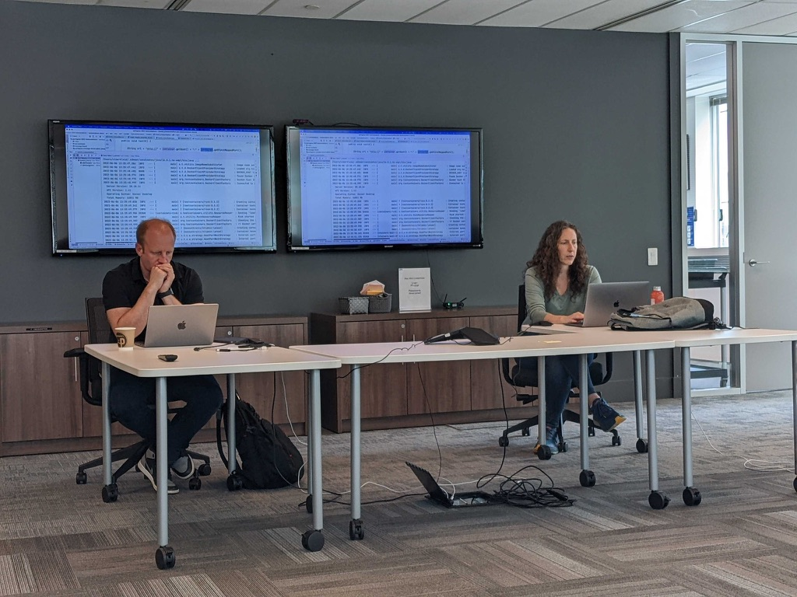
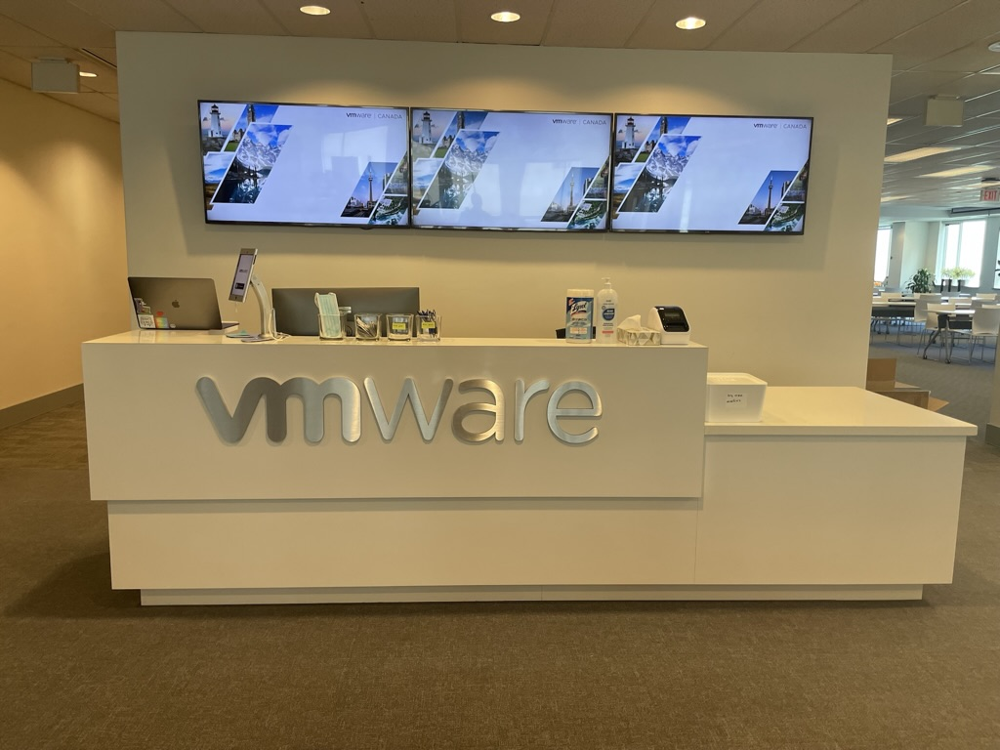
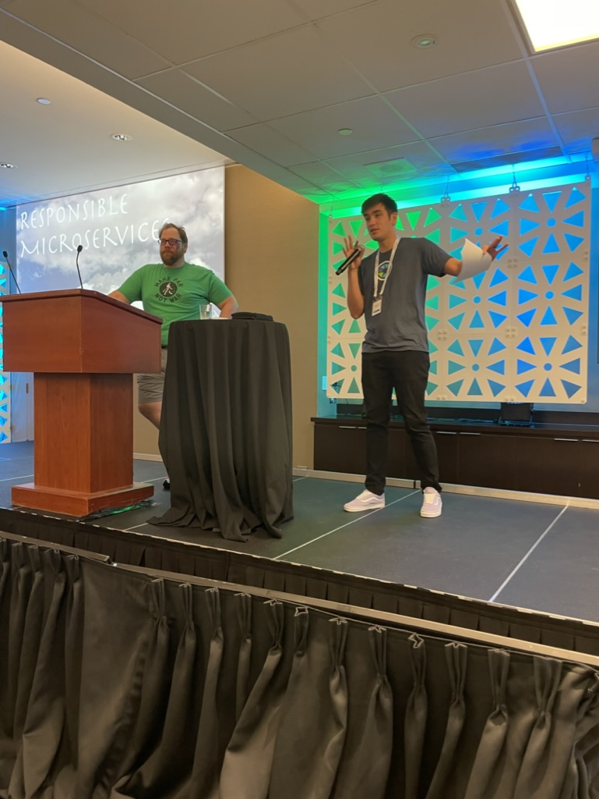
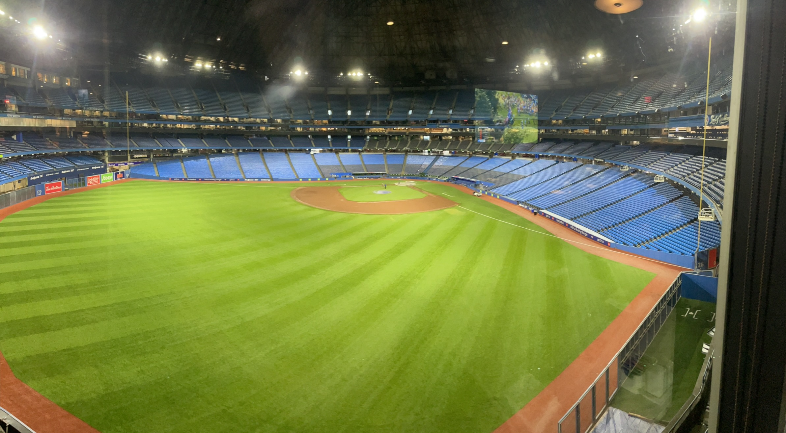
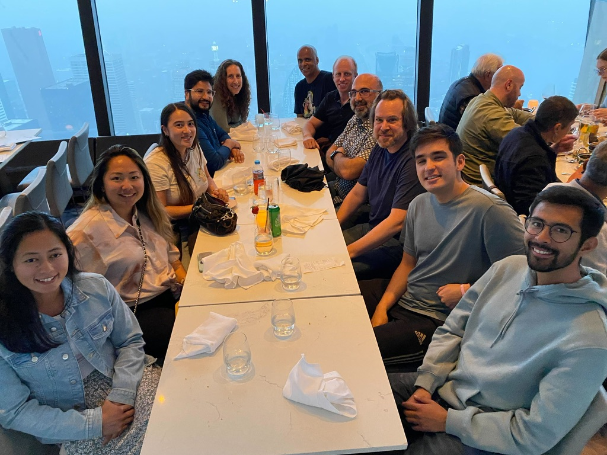
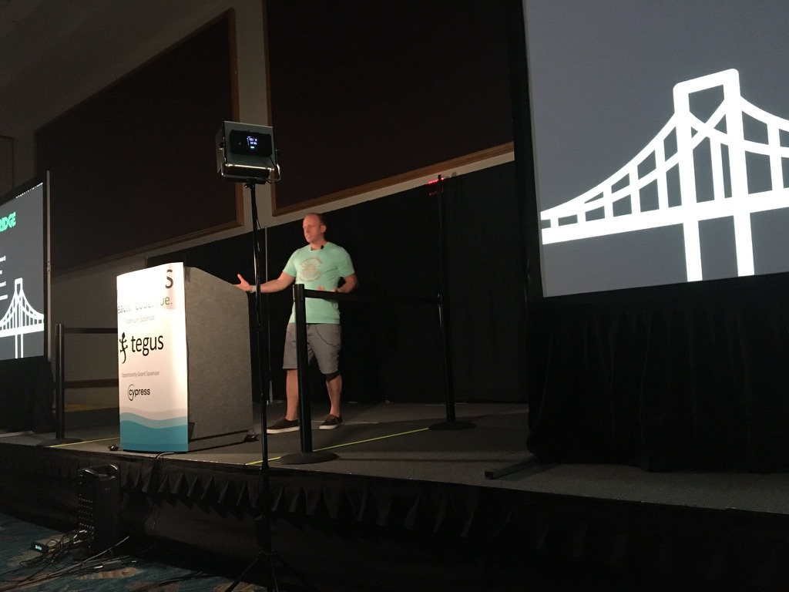
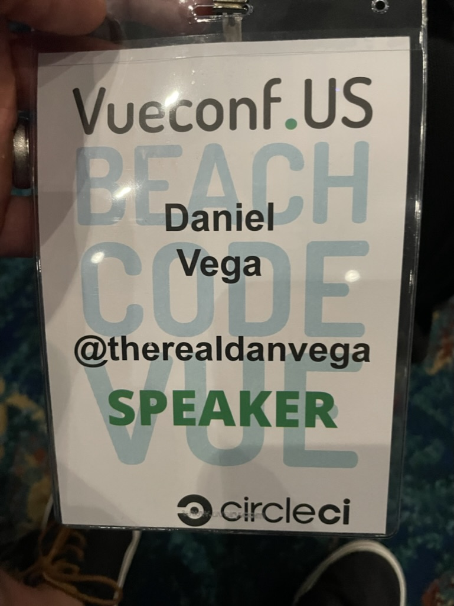
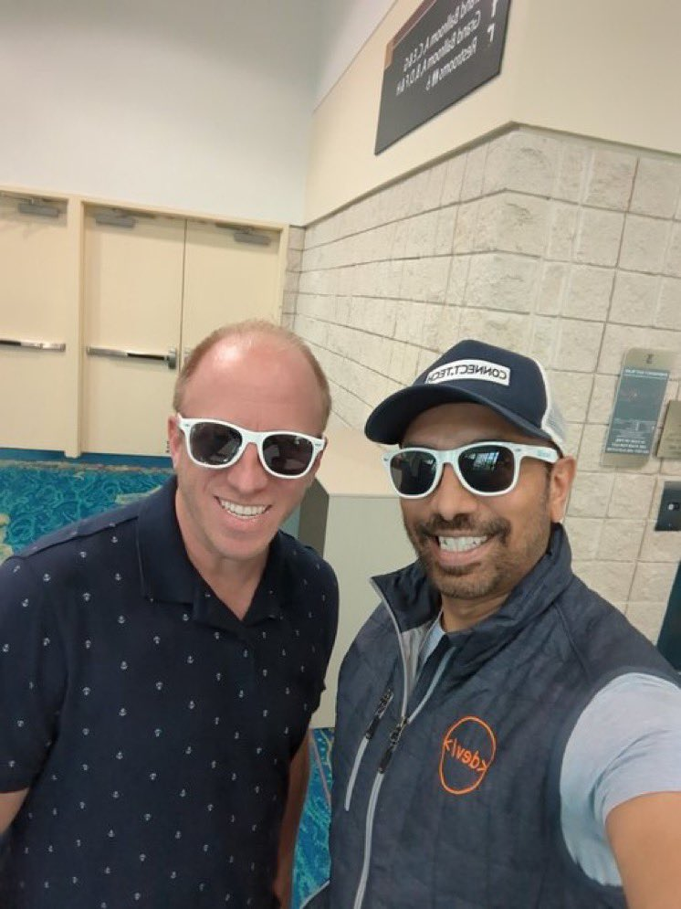

It was a busy week on the road last week and I’m happy to be back home and publishing the newest edition of this newsletter. Last week I had the honor of giving 3 brand new talks in 4 days in 2 different countries.

## Toronto Spring Meetup Group

I started out by flying into Toronto on Monday morning. I was supposed to leave at 7 AM and get in by 8:30 and my flight time was pushed back twice to 10:45 AM. This put a little stress on me because I had to give a meetup talk at 12:30 so it was going to be tight. I ended up getting there right on time and it was a really relaxed meetup group.

[Cora](https://tanzu.vmware.com/developer/team/cora-iberkleid/) and I did a talk on [Testcontainers](https://www.testcontainers.org/) and this was the first time we gave that talk. I was interested in finding out how our timing was going to work. We ended up having some problems with jerks on zoom and also deep dove into a couple of things that we weren't going to cover so we ended up spending a lot more time than the hour that we planned. All in all the talk went great and I can’t wait to share more about Testcontainers in the future!

I want to thank everyone at the VMware offices for welcoming us with open arms and we even got a tour of the office!

## SpringOne Tour Toronto

Next up was our [SpringOne Tour](https://tanzu.vmware.com/developer/springone-tour/) that took place on Tuesday & Wednesday in Toronto. This was our 2-day conference where you can meet the experts (and me) in person. This was also the first time I was able to meet a lot of my coworkers so that was really exciting.

The conference kicked off with [Nate Schutta](https://tanzu.vmware.com/developer/team/nate-schutta/) talking about microservices. I was sitting in the front row listening to Nate speak and all I could think of was “I have to follow this guy”. Nate is a great storyteller and presenter and I learned a lot from him.

I gave my talk on Spring for GraphQL and I thought that it went pretty well. There were some great questions afterward that I jotted down that I hope to explore further in the near future. The rest of the conference was amazing with so many great talks by Josh Long, Spencer, Glenn, DaShaun and so many more.

I ended up staying at the Marriott that is attached to the Rogers Centre where the Toronto Blue Jays play. They have a restaurant there that overlooks the field. They weren’t playing while I was there but I want to go back one day when they are. Look at this view 🤩

A bunch of us went out for dinner one night at the CN Tower and wow, what a great experience!

I’m really excited about our next tour stop in [New York City](https://tanzu.vmware.com/developer/springone-tour/2022/new-york/) where most of my team should be in the same place at the same time. If you’re in a city where we are stopping make sure you sign up and come say hi 👋🏻

## VueConf.US

I have been a part of the Vue community for almost 4 years now and this was my first Vue Conference. Needless to say, I was really excited when I got accepted to speak. I said this on stage but I want to say it again, thank you to everyone who put on this conference, and thank you for allowing me to ramble for 30 minutes.

My talk was on what’s new in Nuxt 3. I have been looking into moving my website over to Nuxt 3 for a while now and as we get closer and closer to a release I’m getting really excited about the move.

What I loved most about this conference was what I love about all conferences, the people. I got to meet some people that I have talked to over the years like Adam Jahr and Erik Hanchett and caught up with an old friend Cameron Childress. I really appreciate everyone who came up to me and provided some feedback.

One person asked me how I am so confident on stage and that was a bit of a shock to me. I have some confidence because I knew the material well and it’s something I like talking about but I wouldn’t ever think of myself as overconfident, so thank you for that!

## What’s next

I am home for the next two weeks so I hope to pump out a bunch of content before heading back on the road for SpringOne Tour NYC. If there is anything you would like to see please reach out to me on Twitter.

## Around the Web

### 📝 Articles

- [GitHub is free for teams](https://github.blog/2020-04-14-github-is-now-free-for-teams/)
- [Tailwind CSS v3.1](https://tailwindcss.com/blog/tailwindcss-v3-1)
- [Launching a developer product - part 2](https://www.jobrunr.io/en/blog/2022-06-10-my-own-product-part-2/)

### 🎬 Videos

- [Bootiful Kubernetes Operators by Cora Iberkleid and Josh Long @ Spring I/O 2022](https://www.youtube.com/watch?v=5IROOj7sLKg)
- [Declarative Clients in Spring by Rossen Stoyanchev and Olga Maciaszek-Sharma @ Spring I/O 2022](https://www.youtube.com/watch?v=5IROOj7sLKg)
- [How fixing a broken window cut down our build time by 50% by Philip Riecks @ Spring I/O 2022](https://www.youtube.com/watch?v=c-GV2PxymoY)
- [Ahead Of Time and Native in Spring Boot 3.0 by Brian Clozel and Stéphane Nicoll @ Spring I/O 2022](https://www.youtube.com/watch?v=oTn8SHz5Ux8)

### 🎙 Podcasts

- [Kubernetes legend and friend Cora Iberkleid on Tanzu, Cartographer, and more](https://bootifulpodcast.fm/#/episodes/564cc3c0-378f-45cb-86c3-e652da8067b0)

### 💻 Projects

- [Histoire](https://histoire.dev/)

### 📚 Books

- [Learning Microsoft Azure (Early Edition)](https://learning.oreilly.com/library/view/learning-microsoft-azure/9781098113315/)

### 👨🏼‍💻 Courses

- [MKBHD - Masterclass](https://www.masterclass.com/sessions/classes/make-compelling-videos-that-go-viral)

## Until Next Week

Thanks for sitting down and sharing a cup of coffee with me my friend. I hope you enjoyed this installment of Coffee & Code and I will see you next Monday morning. If you have any links you would like me to include please [contact me](http://twitter.com/therealdanvega) and I might add them to a future newsletter. I hope you have a great week and as always friends...

Happy Coding 
Dan Vega 
danvega@gmail.com 
[https://www.danvega.dev](https://www.danvega.dev/)
