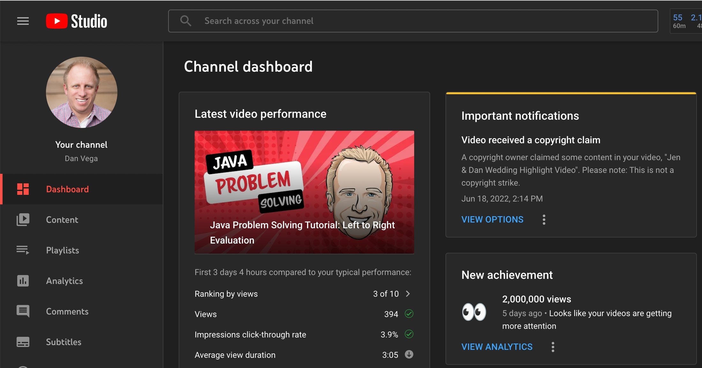
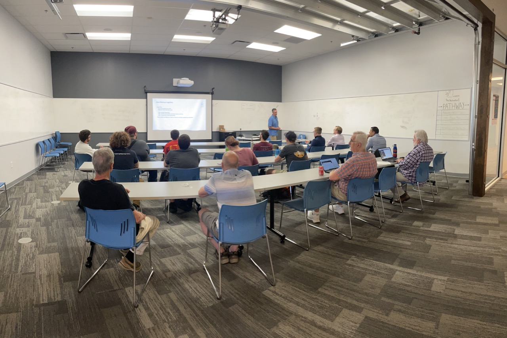
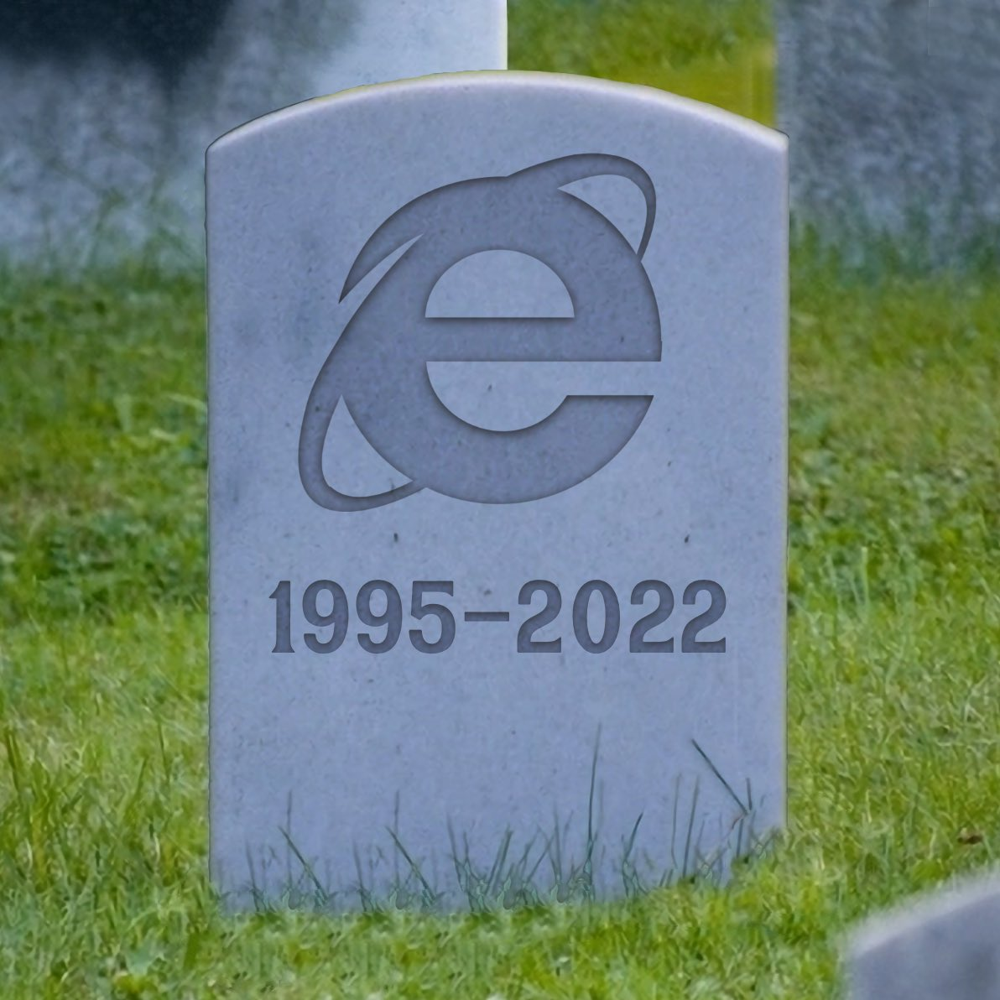
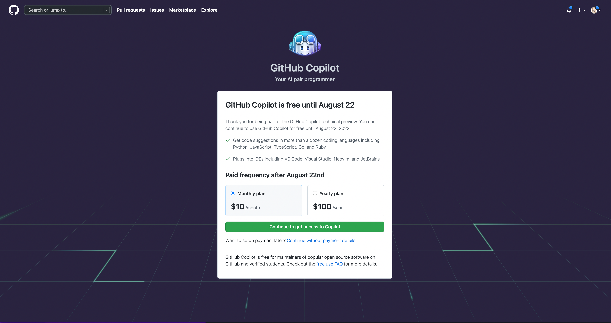

Happy Monday and welcome to another edition of the newsletter. I am either on my way or in NYC depending on when you are reading this. I’m visiting for the next stop on our [SpringOne Tour](https://tanzu.vmware.com/developer/springone-tour/2022/new-york/). If you happen to be attending the conference please say hi 👋🏻 It’s been a busy couple of weeks for me which means I have plenty to share so let’s get into it.

## YouTube Videos

I was able to create and publish 5 videos over the last 2 weeks which is a lot. I’m trying to cut down on production value and focus on the content so that I can publish videos faster.

- [Github Codespaces](https://youtu.be/PN2K1_jMl5A)
- [Create a new annotation in Spring Boot](https://youtu.be/1lEeEvdcZT0)
- [Vue 3 Options API: You don’t have to use the Composition API](https://youtu.be/dciF5Pc3G1s)
- [Spring Boot Multi-document properties](https://youtu.be/5KjCHz9-nJo)
- [Java Problem Solving: Left to Right Eval](https://youtu.be/FZFzKCSq8n8)

I also got the notification this week that my YouTube channel crossed 2,000,000 views. That is so freaking cool and I can’t thank all of you enough for watching.

## Java Frameworks Panel Discussion

It’s so great to be back in person for meetups. This was just our 2nd meeting after bringing back the Cleveland Java User Group. This was a Java Frameworks Panel discussion where we had representatives of Spring Framework, Quarkus, and Micronaut.

It was a great turnout and we had the opportunity to answer questions and then go into some demos. I was the Spring representative and I went through and explained What Spring Framework is and where Spring Boot comes into the picture. Another question that always comes up with developers new to Spring is what types of applications can I build?

I wrapped up my portion of the presentation by building a simple application with Spring Boot. This gave me a chance to show off the Spring Initalizr, talk about dependency injection and demo how easy it is to connect to a database.

## Internet Explorer

On June 15, 2022, [Internet Explorer officially retired](https://blogs.windows.com/windowsexperience/2022/06/15/internet-explorer-11-has-retired-and-is-officially-out-of-support-what-you-need-to-know/). On one hand, it’s a little bit sad because for a long time this is how many users explored the internet.  On the other hand, I don’t have a lot of great memories of developing for the web with IE standing in my way. I remember fondly IE 6 being the biggest pain to target. When we no longer had to support IE 6 we could stop using the numerous amounts of hacks that existed in CSS & JavaScript.

This is how I was feeling that day 🤣

[https://twitter.com/therealdanvega/status/1537068063601958912](https://twitter.com/therealdanvega/status/1537068063601958912)

## Github Copilot

If you aren’t aware yet there is a project by Github called Copilot which is an AI trained on billions of lines of code that will help you write code. It does this through comments and context of an application. It also does a really good job of writing documentation and I use it often in Markdown files.

I have been lucky enough to have been invited to the Github Copilot program early on. I have used it for building frontend applications with JavaScript, TypeScript and Vue within Visual Studio Code. I have also used it for building Java & Spring applications within IntelliJ IDEA. I really enjoy the product and I believe it makes me more productive.

This past week Github Copilot was now available to anyone who wanted to try it out. The catch was that they will be charging for it soon. I can tell you that I have no problem paying for it and have already signed up.

I heard some comments on Twitter that people were upset that Github was taking their code for free and now charging for Github Copilot. I can certainly understand that point of view but It doesn’t bother me. Github is one of the most important tools in life as a developer and it is given to us for **FREE** by Microsoft. If you

## Around the Web

### 📝 Articles

- [Spring for GraphQL with Querydsl](https://medium.com/javarevisited/spring-for-graphql-with-querydsl-9c4964a225d9)
- [Java garbage collection: The 10-release evolution from JDK 8 to JDK 18](https://blogs.oracle.com/javamagazine/post/java-garbage-collectors-evolution)
- [StackOverflow 2022 Developer Survey](https://survey.stackoverflow.co/2022/)

### 🎬 Videos

- [Java 19 Virtual Threads - JEP Café #11](https://www.youtube.com/watch?v=lKSSBvRDmTg)
- [How to Inspect and Troubleshoot Spring Microservices on Kubernetes](https://www.youtube.com/watch?v=A7LMrVz8QhM)
- [ϟ Enlightning: Event-Driven Architecture and Real-Time Analytics](https://www.youtube.com/watch?v=WTZmTcvDAB8)
- [[VDTRIESTE22] Spring For Architects - Conference by Nate Schutta and Jakub Pilimon](https://www.youtube.com/watch?v=lLTdGmGesIs)
- [Spring Office Hours: SpringOne Tour Toronto Recap](https://tanzu.vmware.com/developer/tv/spring-office-hours/0007/)

### 🎙 Podcasts

- [Spring Framework contributor Sébastien Deleuze on GraalVM, AOT, project Leyden, and WebAssembly](https://bootifulpodcast.fm/#/episodes/0083a911-e923-4982-8c22-d024a1eee2c7)
- [The Changelog Podcats: What is DevRel?](https://changelog.com/podcast/493)

### 👨🏼‍💻 Courses

- [JavaBrains - 01 Course Introduction (Reactive programming with Java - full course)](https://www.youtube.com/watch?v=EExlnnq5Grs)
- [AWS for Web Developers](https://aws-for-web.dev/)
- [Adobe Max 2021 Session Recordings](https://www.adobe.com/max/2021/sessions.html)

### 📰 Newsletters

- [This Week in Spring - June 21st, 2022](https://spring.io/blog/2022/06/21/this-week-in-spring-june-21st-2022)

## Until Next Week

Thanks for sitting down and sharing a cup of coffee with me my friend. I hope you enjoyed this installment of Coffee & Code and I will see you next Monday morning. If you have any links you would like me to include please [contact me](http://twitter.com/therealdanvega) and I might add them to a future newsletter. I hope you have a great week and as always friends...

Happy Coding 
Dan Vega 
danvega@gmail.com 
[https://www.danvega.dev](https://www.danvega.dev/)
