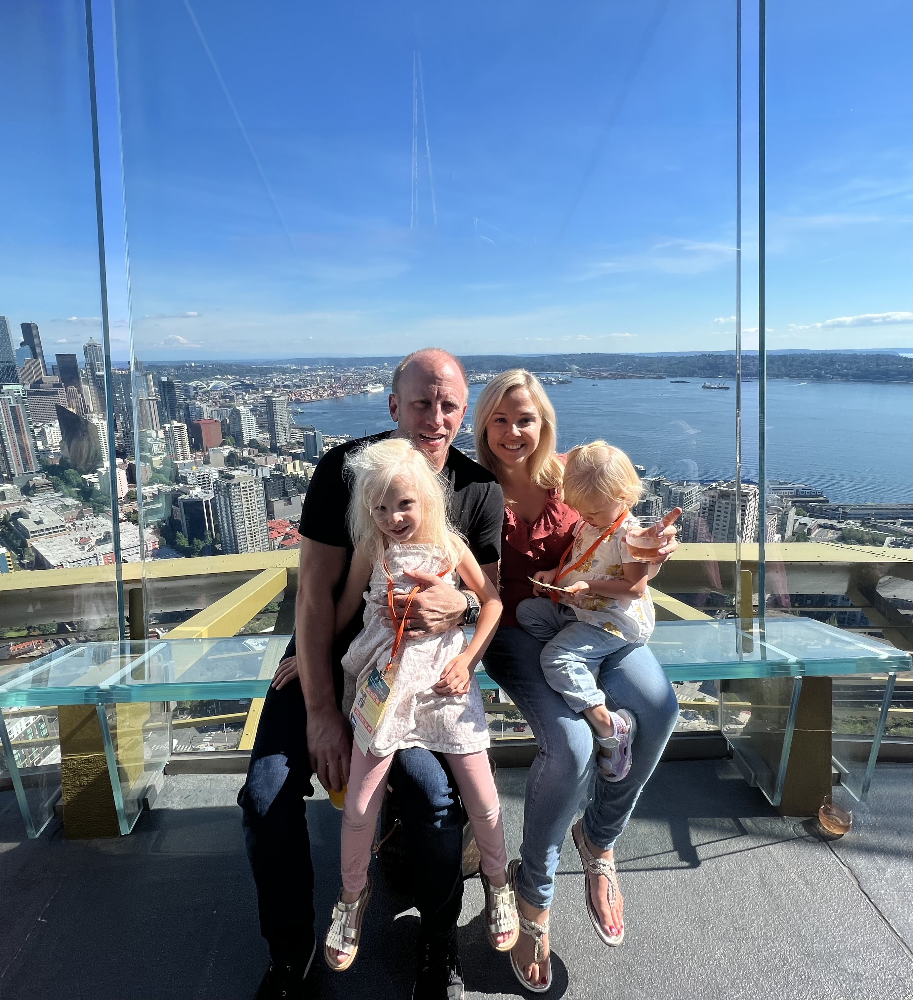
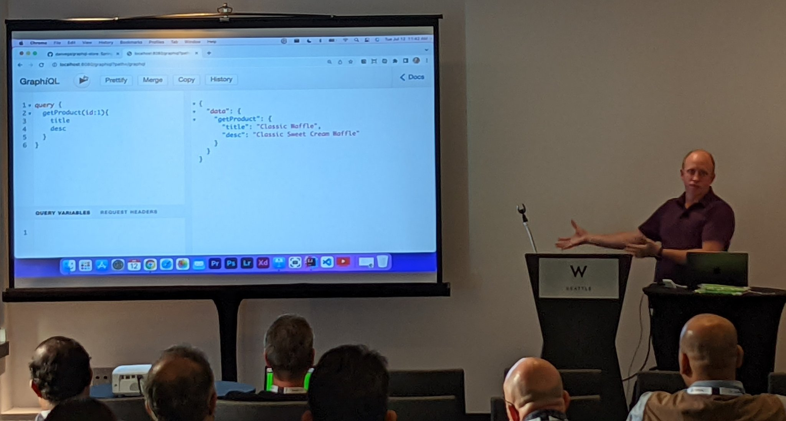

I hope all of you had a wonderful weekend full of friends, family, and fun and are ready to tackle another week. I’m writing this newsletter back in my home office after a fantastic trip to Seattle for a [SpringOne Tour stop](https://tanzu.vmware.com/developer/springone-tour/2022/seattle/). I’ll tell you more about that as well as the one I have coming up next week in Florida.

## SpringOne Tour Seattle

I spent most of last week in the great city of Seattle and I was lucky to be able to take my family with me on this trip. Before I get into the SpringOne Tour stop I just have to say what a beautiful city Seattle is. We had a chance to visit the pier, Space Needle, and more, and the views of the water, mountains, and city are just breathtaking.

As for the conference, I knew that I would be giving my Introduction to GraphQL talk and half of a new talk on Testcontainers. I found out while I was in Seattle that my coworker Cora wasn’t going to be able to make it so I knew I would need to step up and give the presentation by myself.

### Introduction to Spring for GraphQL

This was my 3rd time giving this presentation and at this point, I am pretty comfortable with the material. In this talk, we talk about why you should learn GraphQL and that’s usually the first question developers have.

I found that after the talk the main question I kept getting asked was “When do we know it’s time to move from REST to GraphQL”. I will try and create some content around that question in the near future but here is my short answer. If you find yourself creating many endpoints to support the number of clients calling your application it might be time to take a look at GraphQL.

The more custom endpoints and code you are writing means the more code you’re going to have to support and maintain. With GraphQL you can have a single endpoint and let your clients tell you what information they need instead of you telling the clients what information is available to them.

I don’t think I will be giving this talk at any other SpringOne Tour stops this year so if you’re interested in me giving this presentation at your conference or meetup please reach out and let me know.

### Level up your integration testing with Testcontainers

As I mentioned earlier I was prepared to give half of this 40-minute talk but not the whole thing. Lucky for me my coworker put together a bunch of great slides and I was able to give an introduction to Testcontainers using them.

With this essentially being the first time I gave this talk I thought it went really well. I started out by talking about the importance of testing and that if tests are slow and hard to write I won't write them. Cora says this often and I thought I would share it with the audience because it is so true!

To me this means that if we can make testing easy, fast and concise I will be more likely to write tests, which is what we all should be doing. In the last 25 minutes, I went through a live Spring Boot demo where I created a new integration test and used Testcontainers. We talked through the progression of running a docker command, docker compose, a generic Testcontainer and finally a specific Testcontainer Module.

## VueConf US Recordings

At the beginning of June, I had the honor of speaking at VueConf US in Ft. Lauderdale FL. It was an amazing conference with so many great speakers and it was my first time attending and speaking at a Vue conference.

My session was 30 minutes and it was on “What’s new in Nuxt 3” and as the title suggests we take a tour of the new features in Nuxt 3. All of the sessions were recorded and you can find mine using the link below.

[https://www.vuemastery.com/conferences/vueconf-us-2022/whats-coming-in-nuxt3](https://www.vuemastery.com/conferences/vueconf-us-2022/whats-coming-in-nuxt3)

## Code on the Beach

Next week I will be speaking at Code on the Beach in Atlantic Beach FL. I’ll be honest, I can get used to trips to Florida to talk about code and spend time on the beach 😉

My talk is on Full-Stack Java Development with Spring Boot. The first topic I want to discuss in this presentation is the term **Full-Stack** because depending on who you ask you might get a different definition of what the role involves. The question is what is a Full-Stack Developer?

To me, it starts with the word developer. When we qualify this person as a developer we are saying they write code. I know as well as anyone that there is much more to a developer than writing code but for this conversation, I will keep it to that. With that comes some understanding of how the internet works so I will also omit that for this conversation.

When it comes to writing code I believe that this individual works on both the front-end and back-end of the stack. This means that they have front-end skills like HTML, CSS & JavaScript. I realize those are broad buckets and we can spend an entire article getting specific about those but I won’t at this time. In JavaScript I believe you should also have some experience with frameworks like React, Angular or Vue. If you have worked with those you might also have experience with bundlers and build tools.

When it comes to the back-end they should have experience in a programming language like Java, build tools like Maven or Gradle, a framework like Spring, and working with databases. Again I have simplified those requirements a bit but those are the types of skills one would need to build back-end web applications.

This is just one stack and would be different if you were working on something like mobile applications but the important part is that you are writing code on both the front-end (client) and back-end (server) of the application.

I think where some of the argument comes in is how much involvement would this person have in the deployment process. Should they understand Containers, Docker, scripting, CI/CD, and everything else that goes into DevOps? Personally, I think it’s nice to understand some of that but as a requirement that would probably depend on the company and position.

I’m curious what your thoughts are on what the responsibilities are of a Full-Stack Developer. If you want I have a tweet that you can reply to or you can reply directly to this email.

[https://twitter.com/therealdanvega/status/1548355158332952577](https://twitter.com/therealdanvega/status/1548355158332952577)

## Spring Office Hours

I have talked about this before but my friend [DaShaun](https://github.com/dashaun) and I run a show called Spring Office Hours.  This is your chance to find out what’s new in the Spring Community, check out some demos, and ask any questions you might have. This week our show returns live on Tuesday at 11 AM EDT and you can find out more using the link below.

[https://tanzu.vmware.com/developer/tv/spring-office-hours/](https://tanzu.vmware.com/developer/tv/spring-office-hours/0008/)

## Around the Web

### 📝 Articles

- [Vite 3.0 is out!](https://vitejs.dev/blog/announcing-vite3.html)
- [Pagination in a Reactive Application](https://joshlong.com/jl/blogpost/pagination_in_a_reactive_application.html)
- [Create Command-line Applications with Spring Shell](https://reflectoring.io/spring-shell/)
- [“Full-Stack Developer” Is a Mindset](https://medium.com/97-things/full-stack-developer-is-a-mindset-207632bcf34c)

### 🎬 Videos

- [What’s next for Vue - Evan You](https://www.youtube.com/watch?v=3QPp_DlcZpM)
- [Nuxt.js and Chrome - Kara Erickson](https://www.vuemastery.com/conferences/vueconf-us-2022/nuxtjs-and-chrome)
- [Building Accessible Components - Homer Gains](https://www.vuemastery.com/conferences/vueconf-us-2022/building-accessible-components)

### 🎙 Podcasts

- [A Bootiful Podcast with Nate Schutta](https://spring.io/blog/2022/07/14/a-bootiful-podcast-nate-schutta-the-thinking-person-s-architect-my-friend-and-teammate)
- [Engineering with Empathy](https://www.infoq.com/podcasts/engineering-empathy/)

### 💻 Projects

- [JDK 19 - Early-Access Release Notes](https://jdk.java.net/19/release-notes)

### 📚 Books

### 📰 Newsletters

- [This week in Spring - July 12th](https://spring.io/blog/2022/07/12/this-week-in-spring-july-12th-2022)
- [DevRel Weekly](https://devrelweekly.com/)

### 🐦 Tweets

I’m signed up for ViteConf which is happening in October. If you’re not signed up for what are you waiting for, it’s FREE.

[https://twitter.com/ViteConf/status/1548362941321187330](https://twitter.com/ViteConf/status/1548362941321187330)

## Until Next Week

Thanks for sitting down and sharing a cup of coffee with me my friend. I hope you enjoyed this installment of the newsletter and I will see you next Monday morning. If you have any links you would like me to include please get i[n touch with me](http://twitter.com/therealdanvega) and I might add them to a future newsletter. I hope you have a great week and as always friends...

Happy Coding 
Dan Vega 
danvega@gmail.com 
[https://www.danvega.dev](https://www.danvega.dev/)
