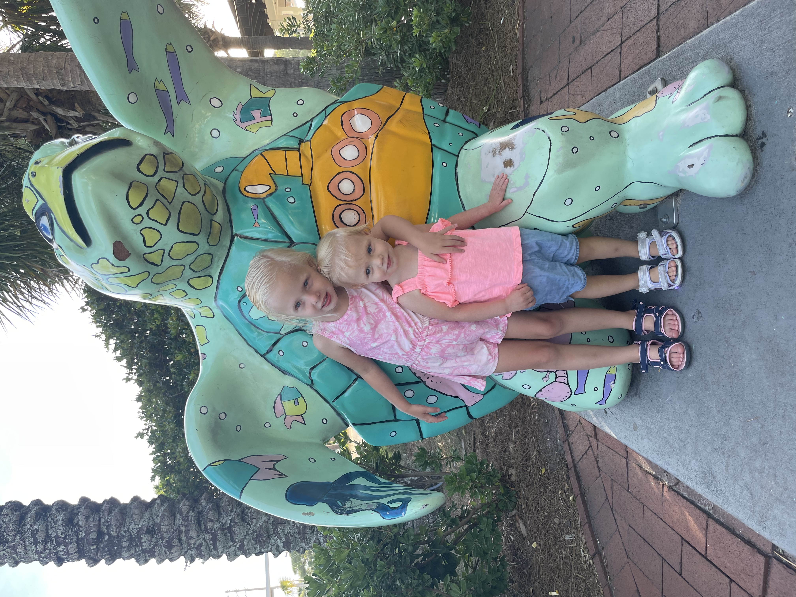
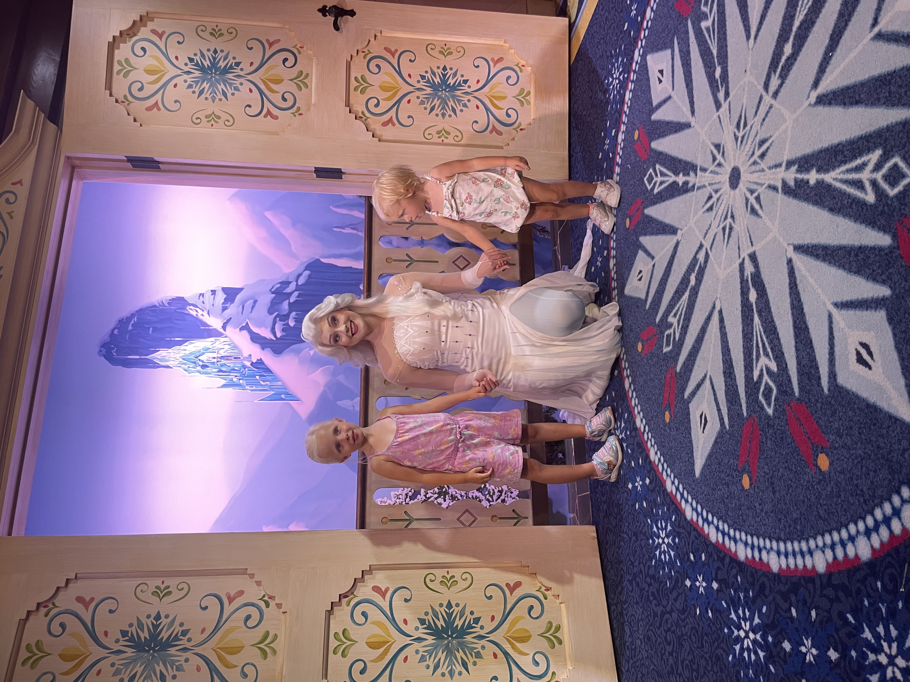
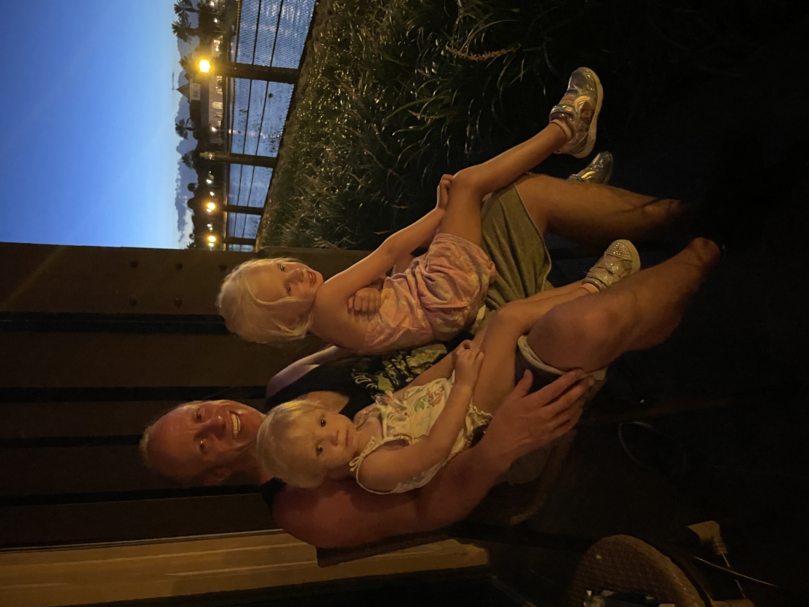

Happy Monday and welcome to another edition of the newsletter. I am back from a week in sunny **HOT** Florida. I spent a few days in the Atlantic Beach area for Code on the Beach and then my family and I drove down to Orlando to spend a few days at Disney World.

## Code on the Beach

I’ll start with Code on the Beach where this was my first time attending and speaking. I said this in a previous newsletter but I could really get used to conferences on the beach. I was able to speak at VueConf US earlier this summer in Ft Lauderdale and now this one in Atlantic Beach.

I want to start by thanking the conference organizers for not only selecting me to speak but they did an amazing job of putting on a really great conference. The keynotes were amazing, top-notch speakers, the food was great and a built-in beach break was the cherry on top.

The conference was held at the [One Ocean Resort and Spa](https://www.oneoceanresort.com/) in Atlantic Beach and it was gorgeous. We had an ocean view room with a balcony and the crew there were all very helpful. There was a little town with shops, restaurants, and bars there and it was the perfect place to spend a few days.

This is a place that I don’t know I would have ever gone to if I didn’t have a reason to go there and this is one thing I am truly thankful for when it comes to my job. If you have a chance to spend a few days there I would highly recommend it.

### Full Stack Java Development with Spring Boot

I will start with my talk on Full-Stack Java Development with Spring Boot. I gave a version of this talk at [SpringOne](https://springone.io/2021/sessions/full-stack-development-with-spring-boot-vuejs) last year. When I got accepted to give this talk I knew it wasn’t going to be the exact same talk but I envisioned a version of it.

When I finally sat down and started to think about what I wanted to cover I quickly realized that this was going to be a whole new talk. I ended up putting this presentation together in about 4 days which is an improvement over the months it used to take me. I guess it does help when you get to devote your entire day to it and you don’t have to constantly context switch.

What I really wanted to cover in this talk was the responsibilities of a full-stack developer and then talk about the particular stack that I am working with on the front and backend. This talk was recorded but I am not sure if it will be available to the general public or not. Either way, I will probably create another version of this for YouTube so stay on the lookout for that. If you want to check out the code and slides from my talk you can get them [here](https://github.com/danvega/full-stack-java-spring).

### Code on the Beach Sessions

I was able to catch a few sessions while I was there and here are my notes from a few of them.

**The Pursuit of Knowledge**

[Cecil Phillip](https://twitter.com/cecilphillip) kicked off the conference with a keynote on the Pursuit of Knowledge. As someone who is constantly trying to learn, I really appreciated his talk. One thing he said a few times was that Information is not knowledge. You can watch as many YouTube tutorials or read as many books as you want but that isn’t going to give you what you need to really understand something.

As developers, we need to be taking what we learn and applying it. I think these are all things we have heard before but Cecil's talk was great and it inspired me to work on removing distractions from my day-to-day work so I can focus on the things I want to learn.

**Rebuilding Together**

The day 2 keynote was given by [Valarie Regas](https://twitter.com/therealdanvega/status/1551917107436290049) and it was about rebuilding together. Valarie shared her personal story about switching careers and how the pandemic affected her. You never want to hear about someone struggling but it’s a reminder that you aren’t the only one. Her story was inspiring and a reminder that our health, both physical and mental are the most important things you can focus on in your life.

The one thing I took away from her talk is that the people who don’t seem like they need help are probably the ones that we should be checking in on and that’s so true. Be a good person and reach out to your friends and coworkers and just ask them how they are doing and if there is anything you can do to help them out.

**Cloud Native Architecture**

The last session I want to highlight was by my friend Nate Schutta. He gave an hour talk on Cloud Native Architecture and it was packed full of knowledge. Nate is such a great presenter and I learn something from him every single time I watch him talk. His ability to keep a presentation moving and interesting is something you just don’t see from everyone. If this recording gets posted I would highly recommend watching it.

[https://twitter.com/therealdanvega/status/1551991104744181760](https://twitter.com/therealdanvega/status/1551991104744181760)

## Disney World

My family and I decided to make the 2.5-hour drive from Jacksonville to Orlando and stay at Disney’s Polynesian Resort for a few days. First off this was the first time staying at a resort that is on Disney and wow what a difference that makes. I don’t think I can ever go back to staying off the resort again.

The ability to hop on and off a monorail, boat, or bus to go wherever you want whenever you want is very convenient and something you need when traveling with small kids. We spent our time at Disney Springs, Magic Kingdom, Hollywood Studios, and Epcot.

I’m still not sure how we survived walking around in 100-degree weather for 3 days but we did. Did I mention that Florida is HOT 🥵 I already knew this though because we went with my daughter when she was 1 in the middle of July and for some reason, I didn’t learn my lesson. I think the next time we go we will shoot for March.

My girls had so much fun and it really is the most magical place on earth. Just seeing how excited my girls were will be a memory I carry with me for the rest of my life. I feel very fortunate that I was able to be there with them ❤️

## SpringOne Workshop

I have known about this for a while now and I might have even teased it out a couple of times. I’m so excited to announce that I will be giving an Introduction to Spring Boot workshop at SpringOne this year. Join me and my friend [DaShaun](https://twitter.com/dashaun) as we help you get up and running with Spring Boot by learning the fundamentals of the Spring Framework.

[https://springone.io/2022/workshops/spring-boot](https://springone.io/2022/workshops/spring-boot)

## Spring Office Hours

There are 2 new recordings up of Spring Office Hours. This is our chance to talk about what’s new in the Spring Community and answer any questions you have. I really enjoyed episode 09 where we had our friend Greg Turnquist join us to talk about Spring Data.

- [https://tanzu.vmware.com/developer/tv/spring-office-hours/0008/](https://tanzu.vmware.com/developer/tv/spring-office-hours/0008/)
- [https://tanzu.vmware.com/developer/tv/spring-office-hours/0009/](https://tanzu.vmware.com/developer/tv/spring-office-hours/0009/)

`youtube:https://youtu.be/p4gC7M6fjMU`

## KCDC

I will be presenting at KCDC next week. If you're there please make sure to find me!

## Around the Web

### 📝 Articles

- [Java on Visual Studio Code Update – July 2022](https://devblogs.microsoft.com/java/java-on-visual-studio-code-update-july-2022/)
- [Google Launches Carbon, an Experimental Replacement for C++](https://thenewstack.io/google-launches-carbon-an-experimental-replacement-for-c/)
- [DALL E Now Available in Beta](https://openai.com/blog/dall-e-now-available-in-beta/)
- [Listing Maven dependencies in Spring Boot Actuator Info endpoint](https://maciejwalkowiak.com/blog/maven-dependencies-spring-boot-actuator-info/)

### 🎬 Videos

- [How to make an impact at a conference or event (if you are not a sponsor)](https://www.youtube.com/watch?v=xGBWppaDzjk)
- [https://www.youtube.com/c/devnexus-conference/videos](https://www.youtube.com/c/devnexus-conference/videos)
- [Ex-YouTube Employee Reveals How To Grow Your YouTube Channel](https://www.youtube.com/watch?v=eAQBWamiaVY)

### 🎙 Podcasts

- [The Changelog - Love live RSS!](https://changelog.com/podcast/499)
- [Spring Cloud Kubernetes contributor Ryan Baxter](https://bootifulpodcast.fm/#/episodes/6fa8d806-2e62-4782-bd15-e232b1e22eee)

### 💻 Projects

- [Carbon Language: An experimental successor to C++](https://github.com/carbon-language/carbon-lang)

### 📰 Newsletters

- [This Week in Spring - July 26th, 2022](https://tanzu.vmware.com/developer/blog/this-week-in-spring-july-26th-2022/)

### ✍️ Quote of the week

“I've learned that people will forget what you said, people will forget what you did, but people will never forget how you made them feel.” - Maya Angelou

### 🐦 Tweets

Sad news from the Java world recently as we lost a special one 😢

[https://twitter.com/Java_Champions/status/1548737176841572352](https://twitter.com/Java_Champions/status/1548737176841572352)

## Until Next Week

Thanks for sitting down and sharing a cup of coffee with me my friend. I hope you enjoyed this installment of Coffee & Code and I will see you next Monday morning. If you have any links you would like me to include please [contact me](http://twitter.com/therealdanvega) and I might add them to a future newsletter. I hope you have a great week and as always friends...

Happy Coding 
Dan Vega 
danvega@gmail.com 
[https://www.danvega.dev](https://www.danvega.dev/)
