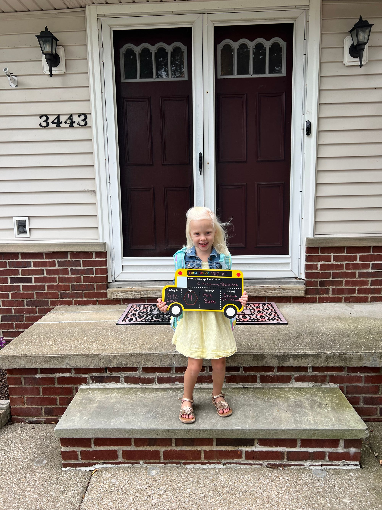

Happy Monday friends and welcome to another edition of the newsletter. This week I have a new new content on securing REST endpoints in Spring Boot with JWTs, upcoming talks, VMware Explore and YouTube is adding paid courses. As always I included some of the best things I found on the web over the last couple of weeks.

## Current Status

If you’re new around here I am a huge fan of Cleveland sports and for the first time since 2004, the Cleveland Browns are 1-0. Hard to believe that it's been that long since they won the first game of the year but also not that hard to consider if you pay attention to football 🤦‍♂️

My daughter starts pre-k school and this year she has moved up to the 4-year-old classroom. We were really excited to find out that she will be in the same class as 2 of her best friends which always makes it easier. I’m excited for her because she loves to be around other kids and just like her dad she loves to learn.

I think I speak for all parents who work from home in saying I look forward to the house being a little bit calmer so I can get some work done. Next year the 2-year-old will be 3 and they will both be in school 🤩

## Spring Security & JSON Web Tokens (JWT)

If you perform a quick search on how to secure REST APIs in Spring Boot using JSON Web Tokens you will find a lot of the same results. These results contain a method that involves writing a custom filter chain and pulling in a 3rd party library for encoding and decoding JWTs.

After staring at these convoluted and confusing tutorials I said there has to be an easier way to do this. I did what anyone with direct access to the Spring Security team would do, I asked them for help. They informed me that indeed Spring Security has built-in support for JWTs using oAuth2 Resource Server.

You will find the video below but I also [created a blog post](https://www.danvega.dev/blog/2022/09/06/spring-security-jwt/) for this content as a place you can always reference back to. This video has done better than any other video on my channel in the first three days of its release. Thank you again to everyone who continues to support my content, I truly appreciate it.

`youtube:https://youtu.be/KYNR5js2cXE`

## Upcoming Talks

- [Sept 22nd - Spring Recipes: A collection of common sense solutions](https://tanzu.vmware.com/content/webinars/sep-22-spring-recipes-a-collection-of-common-sense-solutions)
In this session, you will learn about common situations you will encounter as a developer and how Spring can make the right thing to do the easy thing to do. Cutting through the cruft, you will leave armed with practical code examples you can use on your projects.
- Oct 5th: Creating GraphQL APIs in Java
I am giving a lunch and learn to over 100 developers for an awesome Fortune 500 company. In this talk I am going to introduce them to GraphQL and how they can start using it today in their Java / Spring applications.
- [Dec 6th - 8th: SpringOne Workshop](https://springone.io/2022/workshops/spring-boot)
In this workshop we are going to introduce you to Spring Boot. If you’re new to Spring and what to learn what types of applications you can build and how to get started this is the workshop for you. By the end of this session you will be able to build your first Spring Boot application.

If you would like me to speak at your conference, meetup group or company wide meeting please feel free to reach out to me.

## VMware Explore

I work for VMware and our big conference, VMware Explore was a couple of weeks ago. First off I had some major FOMO as I saw all of the pictures and videos hitting Twitter. I hope I am able to make it next year and be a part of this amazing conference.

There were lots of exciting product announcements that came out of the conference but I was tuning in for one really exciting one. My good friend and coworker [DaShaun Carter](https://twitter.com/dashaun) was on the main stage for the general session to help announce VMware Aria. It was so exciting to see DaShuan on the big stage where he belongs and he absolutely crushed it!

`youtube:https://youtu.be/yDpRDh9Lt_A`

## YouTube Courses?

YouTube is already the best platform for both producing and consuming educational content on the web. It currently isn’t a place where creators like myself can host paid content though. This might all be changing soon.

Right now I have a handful of [paid courses](https://www.danvega.dev/courses) on Udemy. While I haven’t created a new one in a while they are still doing pretty well on the platform. When you don’t have a huge audience you need a platform that can give you audience and that is what Udemy has done for me.

With that said I am huge fan of YouTube and the platform it gives me. I love putting free content on there and I am going on all in on YouTube. I first heard that YouTube might be offering paid courses through a tweet from Roberto Blake who is about as plugged into the YouTube community as anyone:

[https://twitter.com/robertoblake/status/1568235062331670528](https://twitter.com/robertoblake/status/1568235062331670528)

Next I saw a similar message from Robert Kyncl who is YouTube's Chief Business Officer. Coincidently the question Robert was answering was from Roberto as well.

`youtube:https://youtu.be/0e2m9DOY0ec`

I’m really excited about this prospect and can’t wait to see this start rolling out. Does anyone know of any creators that already have paid courses on YouTube? What are your thoughts on this feature?

## SpringOne

Our long-running [SpringOne conference](https://springone.io/) is coming up December 6th to 8th, in San Francisco. There is going to be an amazing lineup of speakers and sessions and we are back in person. I will be giving a workshop on getting started with Spring Boot and hopefully a general session. You can get $200 off when registering if you use the code S1VM22_Advocate_200.

## Around the Web

### 📝 Articles

- [Understanding logging in Spring Boot](https://medium.com/javarevisited/understanding-logging-in-spring-boot-ac0fd79177b4)
- [How to do password hashing in Java applications the right way!](https://snyk.io/blog/password-hashing-java-applications/)
- [Deno 1.25 Release Notes](https://deno.com/blog/v1.25)
- [Should We Have a Constructor on JPA](https://dzone.com/articles/jpa-constructor)

### 🎬 Videos

- [Java Champion James Ward on the State of Java and JVM Languages](https://www.infoq.com/articles/james-ward-java-jvm-languages/)
- [What makes a good developer- (-Christin Gorman)](https://vimeo.com/748032161)
- [Jakarta EE 10 - Feature by Feature-(Ivar Grimstad)](https://vimeo.com/748031614)
- [Das Boot- Diving into Debugging Spring Boot Applications- (Mark Heckler)](https://vimeo.com/748031405)

### 🎙 Podcasts

- [Between Chair and Keyboard with Soumik Majumder](https://www.youtube.com/watch?v=tM79Z08WDkM)
- [Sytax.fm - Big Deno Changes](https://syntax.fm/show/506/big-deno-changes)

### 💻 Projects

- [Blogging for Devs](https://bloggingfordevs.com/)

### 📚 Books

- [Functional Programming in Java, Second Edition](https://pragprog.com/titles/vsjava2e/functional-programming-in-java-second-edition/)
- [Create Something Awesome: How Creators are Profiting from Their Passion in the Creator Economy](https://amzn.to/3qwWBM0)

### 📰 Newsletters

- [This Month in Spring - August 2022](https://tanzu.vmware.com/content/josh-blog/this-month-in-spring-august-2022)
- [InfoQ Java Roundup - August 2022](https://www.infoq.com/news/2022/08/java-news-roundup-aug22-2022/)

### 🗣 Conferences

- [ViteConf](https://viteconf.org/)
- [Github Universe is Coming!](https://www.linkedin.com/pulse/github-universe-coming-github/)

### 🐦 Tweets

Navigating tech as a woman from the great Angie Jones

[https://twitter.com/techgirl1908/status/1563289706195849218](https://twitter.com/techgirl1908/status/1563289706195849218)

## Until Next Week

Thanks for sitting down and sharing a cup of coffee with me my friend. I hope you enjoyed this installment of the newsletter and I will see you in the next one. If you have any links you would like me to include please [contact me](http://twitter.com/therealdanvega) and I might add them to a future newsletter. I hope you have a great week and as always friends...

Happy Coding 
Dan Vega 
danvega@gmail.com 
[https://www.danvega.dev](https://www.danvega.dev/)
