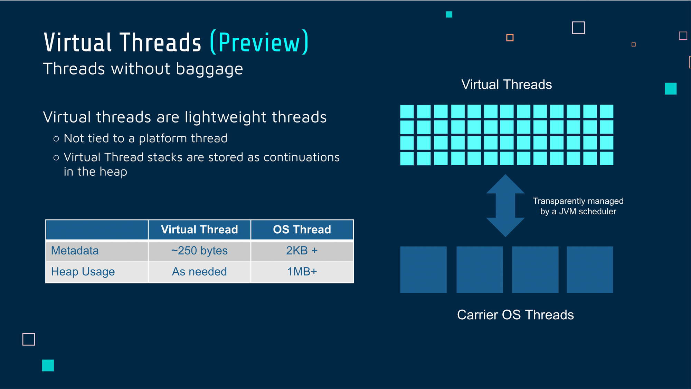

Happy Monday and welcome to another edition of the newsletter. It was another busy week here as the weather has started to cool off and we are officially into fall 🍁 In this week's newsletter, I want to talk about the upcoming SpringOne conference, Java 19, a Java User Group meeting I attended, and a bunch of new content that I was able to put out there.

## Current Status

If you have been paying attention this is the 3rd week in a row that I am releasing a newsletter after telling everyone that I was moving to a 2-week cadence. If you haven’t noticed, what am I doing here? I love to write so when I have something to talk about I will tell you about it. This means that my official cadence has moved to “Whenever I have something to share with you”.

I’m currently reading [Deep Work by Cal Newport](https://amzn.to/3fiiJad) and what a great time this book has come into my life. I found Cal through his podcast and YouTube channel where he often talks about time management and productivity. Deep work is the ability to focus without distraction on a cognitively demanding task.

I have gotten into a good grove at work and find myself taking on as much as I can and I like to keep busy. With that though I really need to be focused, prioritize my work and come up with a good quarterly, weekly, and daily plan. This has helped me shift from being reactive to proactive. I’m not longer heading into a workday asking myself what’s next, I have that ready to go and my days planned out as much as possible.

There is just something about reading or listening to someone who has devoted so much time and research to a particular subject. I’m enjoying binging on all of his content right now and so far his book is exactly what I hoped it would be.

I also want to give a huge shout out to the Cleveland Guardians who did what nobody thought they could do and that is win the division. They are the youngest team in all of baseball and the 2nd lowest payroll in the league. I can’t wait for the playoffs to start and see what kind of October magic they can put together.

I have a lot to share with you so let's get into it.

## SpringOne

This week we made the first of our announcements around speakers, workshops, and sessions. If you haven’t had a chance you should head over to [www.springone.io](http://www.springone.io) and check out the content. The list of speakers, sessions, and workshops is one of the best I have ever seen. I seriously can’t wait to be in San Francisco and learn from some of the best in our community.

In that list of speakers and sessions, you will find me presenting on Spring for GraphQL. I’m so excited to be giving this presentation at SpringOne and have already begun working on it. I have a lot of content on GraphQL and spent the year talking about it on the SpringOne tour but this presentation will be an updated one.

I’m also giving a workshop on getting started with Spring Boot which you can now [register for](https://springone.io/2022/workshops/spring-boot-beginner). You can get $200 off when registering if you use the code S1VM22_Advocate_200.

## Java 19

Java 19 was released last week and what an exciting time it is to be a Java developer. Ever since Java has moved to a new release cadence we get a new version every 6 months that is packed with new features, performance & security improvements, and did I mention we get all of this for ***FREE***? Hats off 🧢 to everyone who helped make the newest version of Java possible.

Java 19 is packed full of some big features and while a lot of them are incubator or preview they will shape the future of Java. We have features that full under project Amber and Panama but the highlight of this release is Project Loom. [JEP 425 brings](https://openjdk.org/jeps/425) us Virtual Threads in preview mode. Virtual Threads are lightweight threads that dramatically reduce the effort of writing, maintaining, and observing high-throughput concurrent applications.

I am really looking forward to learning more about Virtual Threads and seeing what the Java community does with them. I have some resources below that will help you get caught up with everything new in Java 19.

- [Open JDK 19](https://openjdk.org/projects/jdk/19/)
- [Moving Java Forward with Java 19](https://www.youtube.com/watch?v=6pN0Ymsl1H0)
- [InfoQ: Java 19 Released](https://www.infoq.com/news/2022/09/java19-released)
- [The 5 Most Pivotal and Innovative Additions to OpenJDK 19](https://foojay.io/today/the-5-most-pivotal-and-innovative-additions-to-openjdk-19/)

## Cleveland Java User Group

This months topic at the Cleveland Java User Group was a deep dive into Java Concurrency. We were lucky to have Daniel Mikusa and Scott Seighman both present on the topic. Dan went through and walk through the basics of how concurrency works in Java and I thought it was a really great introduction to something that can be a pretty complicated topic.

Next, right on topic Scott was able to break down the new Virtual Threads feature in Java 19. I thought his examples were a really great introduction to what you can do with them.

Virtual Threads (Preview)

If you want to check out the demos you can visit the following Github Repo:

[https://github.com/dmikusa/java-concurrency-demo/](https://github.com/dmikusa/java-concurrency-demo/)

## Content

Another busy week producing content and preparing for a bunch of content I will be focusing on in the near future. I hope you’re learning some new 🤩 and enjoying what I am getting out there.

### Spring Office Hours

In this weeks episode DaShuan and I took a look at what’s new in the Spring community and answered your questions. We also had an opportunity to show some demos of things we are currently working on. I’m also pleased to report back that my camera did not overheat this week. It was defiantly due to me changing the recording settings to 4k which is ok for normal videos but not great for streaming.

`youtube:https://youtu.be/mquczsmTIm8`

### H2 Database Spring Boot

In this tutorial, you will learn everything you need to know to connect and configure an in-memory H2 database in Spring Boot. I will also walk you through what you need to look out for if you are using Spring Security in your application.

`youtube:https://youtu.be/PSrHcCwvfVQ`

### YouTube Shorts

I am really having fun putting short form videos together. Obviously the shorter videos take less time to produce and edit but they also give me a chance to get in front of a larger audience. Seeing how much YouTube is investing in shorts it just makes sense for me to create both short and long form content. Here are a coupe of shorts I published last week:

- [Java 19 Short](https://youtube.com/shorts/KirPiS-M_Gg?feature=share)
- [SpringOne 2022 Short](https://youtube.com/shorts/BP71pgx1bi4?feature=share)

## Upcoming Talks / Content

- Oct 5th: Creating GraphQL APIs in Java I am giving a lunch and learn to over 100 developers for an awesome Fortune 500 company. In this talk, I am going to introduce them to GraphQL and how they can start using it today in their Java / Spring applications.
- [SpringOne - A Gentle Introduction to Spring for GraphQL](https://springone.io/2022/sessions/a-gentle-introduction-to-spring-for-graphql)
- [SpringOne Workshop - Getting Started with Spring Boot](https://springone.io/2022/workshops/spring-boot-beginner)

I’m working on a YouTube video that will teach the basics of SpringBoot. I put this poll out there. What do you think is better? 1 long video or a playlist of multiple videos. I’m not sure on the length yet but it could be in the 3-4 hour range. If you have thoughts on this please feel to reply to this email or reach out to me on Twitter.

[https://twitter.com/therealdanvega/status/1573744850117316608](https://twitter.com/therealdanvega/status/1573744850117316608)

## Around the Web

### 📝 Articles

- [InfoQ: Java 19 Released](https://www.infoq.com/news/2022/09/java19-released/)
- [The arrival of Java 19](https://inside.java/2022/09/20/the-arrival-of-java-19/)
- [The 5 Most Pivotal and Innovative Additions to OpenJDK 19](https://foojay.io/today/the-5-most-pivotal-and-innovative-additions-to-openjdk-19/)
- [Made on YouTube: supporting the next wave of creative entrepreneurs](https://blog.youtube/news-and-events/supporting-the-next-wave-of-creative-entrepreneurs/)
- [Spring Data REST Vulnerability (CVE-2022-31679)](https://spring.io/blog/2022/09/19/spring-data-rest-vulnerability-cve-2022-31679)
- [Jakarta 10 has Landed!](https://jakartaee-ambassadors.io/2022/09/22/jakarta-ee-10-released/)

### 🎬 Videos

- [Moving Java Forward with Java 19](https://www.youtube.com/watch?v=6pN0Ymsl1H0)
- [Made on YouTube: New ways to join YPP, Shorts Monetization & Creator Music](https://www.youtube.com/watch?v=h6TrvCV3NdU)

### 🎙 Podcasts

- [Inside Java Podcast: Java 19 is here](https://inside.java/2022/09/20/podcast-026/)
- [Between Chair and Keyboard with Simon Brown](https://www.youtube.com/watch?v=VgfoqtPNA8s)
- [Bootiful Podcast: Couchbase and Cloud legend Laurent Doguin](https://bootifulpodcast.fm/#/episodes/6b898e9a-c89f-449f-ae33-8c744c713402)

### 💻 Projects

- [Open JDK 19](https://openjdk.org/projects/jdk/19/)

### 📚 Books

- [Deep Work - Cal Newport](https://amzn.to/3fiiJad)

### ✍️ Quote of the week

“The happiest, most passionate employees are not those who followed their passion into a position, but instead those who have been around long enough to become good at what they do. On reflection, this makes sense. - Cal Newport”

### 🐦 Tweets

[https://twitter.com/devnexus/status/1571861700071940096](https://twitter.com/devnexus/status/1571861700071940096)

## Until Next Week

Thanks for sitting down and sharing a cup of coffee with me my friend. I hope you enjoyed this installment of the newsletter and I will talk to you in the next one. If you have any links you would like me to include please [contact me](http://twitter.com/therealdanvega) and I might add them to a future newsletter. I hope you have a great week and as always friends...

Happy Coding 
Dan Vega 
danvega@gmail.com 
[https://www.danvega.dev](https://www.danvega.dev)
