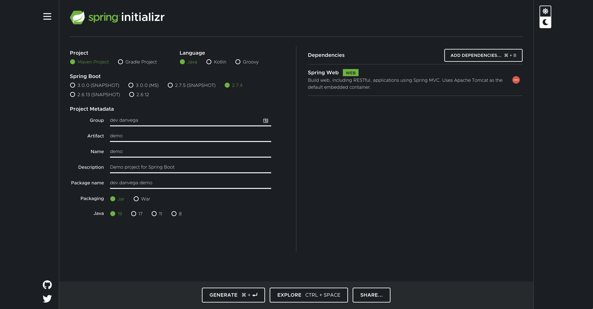
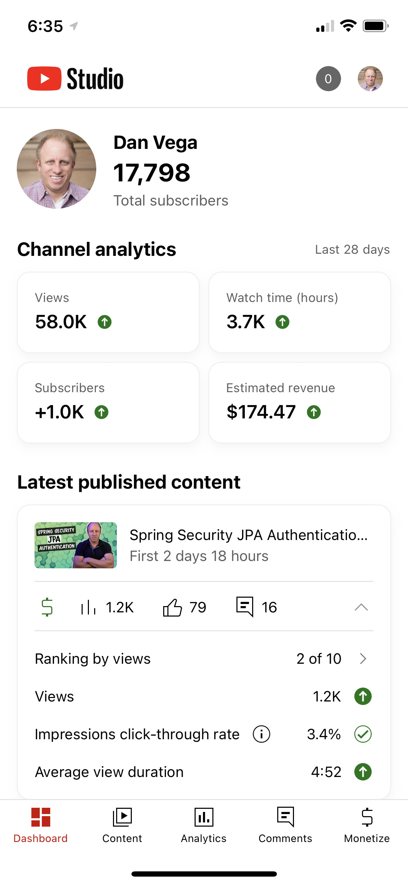

Happy Monday and welcome to another edition of the newsletter. Are you reading this? If so and you have any feedback for me on ways to improve this newsletter please feel free to reply to this email or reach out to me on Twitter. Today I want to talk to you about being accepted to CodeMash, How to learn Spring, and lots of new content.

## Current Status

Throughout the week I collect things I want to talk about in Notion. This is the tool I use to collect all of my thoughts, write articles and newsletters, plan videos, and schedule all of the content I am working on. I tell you this because it’s currently Friday afternoon and this is when I begin to collect these thoughts and turn them into the newsletter you’re reading now.

As I began typing this out I received the exciting news that I have been accepted to speak at CodeMash 2023. I will be giving a talk on GraphQL and I’m also giving a workshop on Getting Started with Spring. I immediately brought this excellent graphic into Notion and so I am sharing that with you.

I am beginning to submit to conferences for next year and it’s always tough. You have to put yourself out there and unless you’re a top speaker in our industry you’re going to get more declines than acceptances. It is a really competitive space right now and I get that, it comes with the position I am in.

However when I do get accepted to talk you can bet I am going to celebrate them. Make sure you stop to celebrate your wins friends. A big thank you to CodeMash for having me back and accepting my talks. I haven’t given a precompiled at CodeMash before and I am beyond excited to talk about my favorite topic, Spring!

I can’t wait to be back at Kalahari Resort next year surrounded by some amazing people. I’m also looking forward to telling the kids, they love that place 🤩

## Learning Spring

I often get asked at conferences, meetups, on Twitter, or via email “What is the best way to learn Spring?”. This is one of those questions that I get often and I need to work on some content so I can point people towards that as my official answer. I’m going to brain dump some initial thoughts here but I would love to hear your feedback.

I think when someone tells me they want to learn Spring my first question to them is why do you want to Spring? There isn’t a wrong answer here but it's a pretty loaded question so I need a little more information to answer it.  The answers I usually get look something like this:

1. I’m new to Java and I want to learn how to build web applications.
2. My job has asked me to learn it.
3. I want to get a job and Spring is in demand.

The reason I ask this is that Spring can be used to build a wide range of applications and provide solutions to a variety of problems. When I want to learn something new I start with my why? Why do I want to learn this thing? This allows me to narrow my focus. If you wanted to learn to speak another language to visit a country vs learning another a language to become a teacher those are 2 entirely different paths.

When I want to learn a new programming language, framework or tool having an end goal gives me clarity and makes the path towards that goal a straight one. Let’s say for example I wanted to learn Go. Learning an entire programming language can be a little overwhelming but if my goal was focused on learning Go to so that I could write a REST API that seems more manageable.

The reason you want to narrow your focus is that Spring as a solution to a number of problems. You can use Spring to build :

- Web Applications (Synchronous & Asynchronous)
- Cloud Applications
- Microservices (Distributed Applications)
- Serverless
- Event Driven Applications
- Batch
- CLIs

When you have it narrowed down to what you’re going to learn Spring for I like to tackle this problem like I do any other problem, by breaking it down into a series of smaller problems. Let’s say that for example, you wanted to learn Spring to build a REST API. While this might seem like a simple problem statement we can actually break this down into a series of problems.

Your first tasks might be to learn the mechanics of how to build out a REST Controller in Spring. As you start building this out you might realize you also need to understand the following:

- How to add logging to your application.
- How Dependency Injection works in Spring.
- How to validate incoming data.
- How to connect to a database.
- How to configure properties in your application.
- How to write Unit & Integration tests.
- and more…

As you start learning about Spring you will hear the terms Spring Framework and Spring Boot. This might be pretty confusing at first, are these 2 different frameworks? These are valid questions and I promise this will make more sense in time. My friend Mark Heckler has a [really great video](https://www.youtube.com/watch?v=Spzug_SjJnM) on this and I suggest starting there.

Most people like to jump into official documentation and while our documentation is really good this can be overwhelming with a project as large as Spring. Not to mention now that you know there is the Spring Framework, Spring Boot and all of the projects in the ecosystem that is a lot of documentation to go through.

I like to start with a guide that tells me how to perform a specific task. We have 2 collections of guides that you can use for free and I think are a great place to get started:

- [Spring IO Guides](https://spring.io/guides)
- [Tanzu Developer Center](https://tanzu.vmware.com/developer/guides/)

You can find a specific guide for creating a REST API.  This will walk you through step-by-step on the mechanics of creating a REST API and what to expect along the way. Once you have that down you can find guides for each of the other tasks you have identified to complete your application.

If you get stuck on any of these guides you could always look for another tutorial either in written form or on YouTube. Just make sure that you are searching for the exact thing you are trying to do and not go down the rabbit hole of watching hours and hours of videos.

My biggest problem with tutorials is that you can’t just follow along with the author and then call it day. Take what you have just learned and build something completely different. If the tutorial you were watching used the domain of a ToDo list build something related to something you’re interested in. The constant repetition of taking what you learn, applying it, failing and figuring out what went wrong is where you will learn the most.

After you have spent some time building some of the different parts to your application this is now a good time to check out the official documentation. For me personally this is where I will usually jump all the way in.

I will pick up a book or 2 but I treat these as reference materials and read specific chapters to accomplish a task but I avoid reading it cover to cover. I also find some YouTubers who are big in that space and binge on their content. Finally, I am big on consuming content on Twitter so I will find people I can connect with there. This will also lead me to other blogs, videos, podcasts etc..

As I said from the start, this is just my initial brain dump of thoughts on the subject. I will try and put together a more thought out response to this question but for now I will leave you with a few resources go get you started.

### Resources

- [Spring Framework Reference Documentation](https://docs.spring.io/spring-framework/docs/current/reference/html/)
- [Spring Boot Reference Documentation](https://docs.spring.io/spring-boot/docs/current/reference/html/)
- [Spring Blog](https://spring.io/blog)
- [Tanzu Developer Center](https://tanzu.vmware.com/developer/)
- [Awesome Spring](https://github.com/ThomasVitale/awesome-spring)

## Content

Another busy week for me producing content. We had a great guest during Spring Office hours this week and I feel like this show is really starting to take off. If you count the replay of that show (I do) I was able to post 5 videos to YouTube this week. Yes, 1 was a YouTube Short and 1 was a replay of a live stream but that is impressive and unsustainable. I’m really just trying to find my feet here and find a number that

### Spring Office Hours

Last week during Spring Office Hours we welcomed in our guest, [Jonatan Ivanov](https://twitter.com/jonatan_ivanov). Jonatan is on the Spring Engineering team and focuses on Observability. I was really interested in chatting with him because I feel like this is an area in Spring that I need to learn more about. A few things stuck out for me.

- The 3 pillars of observability are:
    1. Logging
    2. Metrics
    3. Distributed Tracing
- If you're currently using Spring Cloud Sleuth that will be going away in Spring Boot 3 and the core of that project is being moved to Micrometer Tracing.
- If you want to learn more check out the following [repository on Github](https://github.com/micrometer-metrics/micrometer-samples) to see some of the examples Jonatan went through during our live stream.

`youtube:https://youtu.be/zgaAEZ4Y_uI`

### Spring Security CORS

The first video I published this week was in response to a question I have been receiving a lot lately. The question was about the different ways to configure CORS and specifically when Spring Security is a part of your application.

`youtube:https://youtu.be/HRwlT_etr60`

### Domain Class Converter

Next up I came across this handy class in Spring Data called the Domain Class Converter. It allows you to take an id and automatically convert it to a domain object by using Spring Data’s `CrudRepository`.

`youtube:https://youtu.be/_QBe2ZiXV-0`

### Spring Security JPA

I have been putting out a lot of content lately on Spring Security and this was the next progression of that material. In previous videos, I took a look at how to configure an in-memory user and connect to a database using JDBC. There is no built-in mechanism for authenticating against a database using Spring Data JPA but it’s fairly simple to do when you understand what you need to do.

`youtube:https://youtu.be/awcCiqBO36E`

### YouTube Shorts

I mentioned this last week but I am really enjoying creating short-form videos. They take less time to film, edit and produce and it’s a great way to practice. Java 19 was recently released and I thought I would put together a quick video on how to install it using [SdkMan](https://sdkman.io/). If you’re not aware SdkMan is a really great tool for managing parallel versions of SDKs.

[The best and fastest way to Install Java 19 #shorts](https://youtube.com/shorts/VZoqz9PPHNs?feature=share)

Speaking of Java 19, did you see that it is now an option over at [start.spring.io](http://start.spring.io) 🤩

### YouTube

Just to close out this section on YouTube. I ended up posting a total of 17 videos in the month of September and your support means the world to me. With some consistency and talking about topics like Spring Security that more of you are searching for I had my best month ever. I ended up adding 1,000+ subscribers over the last 28 days and that is just mind blowing 🤯 to me. I’m closing in on 20,000 and have a goal of hitting it before the year ends!

### Spring Recipes Recording

A couple of weeks ago my friend Nate Schutta and I gave an online presentation “Spring Recipes: A collection of common-sense solutions”. This was a similar talk to the one that we gave at KCDC over the summer and it was fun to give this talk another spin. We could seriously write a book (should we) with the amount of content we have piled up on this talk. If you want to watch the recording you can do so using the link below.

[https://tanzu.vmware.com/content/webinars/sep-22-spring-recipes-a-collection-of-common-sense-solutions](https://tanzu.vmware.com/content/webinars/sep-22-spring-recipes-a-collection-of-common-sense-solutions)

## Upcoming Talks

- Oct 5th: Creating GraphQL APIs in Java I am giving a lunch and learning to over 100 developers for an awesome Fortune 500 company. In this talk, I am going to introduce them to GraphQL and how they can start using it today in their Java / Spring applications.
- [SpringOne - A Gentle Introduction to Spring for GraphQL](https://springone.io/2022/sessions/a-gentle-introduction-to-spring-for-graphql)
- [SpringOne - Getting Started with Spring Boot Workshop](https://springone.io/2022/workshops/spring-boot-beginner)
- [CodeMash 2023](https://www.codemash.org/): Give your APIs a REST & Make the move to GraphQL
- [CodeMash 2023](https://www.codemash.org/): Getting Started with Spring

## Around the Web

### 📝 Articles

- [Native Support in Spring Boot 3.0.0-M5](https://spring.io/blog/2022/09/26/native-support-in-spring-boot-3-0-0-m5)
- [My SpringOne - Josh Long](https://spring.io/blog/2022/09/23/my-springone-2022)
- [Introducing Spring Boot Migrator](https://www.infoq.com/news/2022/09/spring-boot-migrator)
- [8 things you didn’t know you could do with GitHub Copilot](https://github.blog/2022-09-14-8-things-you-didnt-know-you-could-do-with-github-copilot/)

### 🎬 Videos

- [Knative and Spring Native - Bringing back the func by Thomas Vitale and Mauricio Salatino](https://www.youtube.com/watch?v=byNh7sWJnRE)
- [IntelliJ IDEA Conf 2022 (day 1)](https://www.youtube.com/watch?v=vmS9vNbta-w)
- [IntelliJ IDEA Conf 2022 (day 2)](https://www.youtube.com/watch?v=-8epeIFdKWo)

### 🎙 Podcasts

- [Between Chair and Keyboard with Coté](https://www.youtube.com/watch?v=6wJ69TPWRZg)

### 📚 Books

- [Deep Work - Cal Newport](https://amzn.to/3fiiJad) - *Currently Reading*

### 📰 Newsletters

- [This Month in Spring - September 2022](https://tanzu.vmware.com/content/blog/this-month-in-spring-september-2022)
- [Java Annotated Monthly – October 2022](https://blog.jetbrains.com/idea/2022/10/java-annotated-monthly-october-2022/)

### ✍️ Quote of the week

"I am a great believer in luck, and I find the harder I work, the more I have of it.”

### 🐦 Tweets

Thanks for this great little tip Marcio!

[https://twitter.com/marcioendo/status/1574375251521294341](https://twitter.com/marcioendo/status/1574375251521294341)

## Until Next Week

Thanks for sitting down and sharing a cup of coffee with me my friend. I hope you enjoyed this installment of the newsletter and I will talk to you in the next one. If you have any links you would like me to include please [contact me](http://twitter.com/therealdanvega) and I might add them to a future newsletter. I hope you have a great week and as always friends...

Happy Coding 
Dan Vega 
danvega@gmail.com 
[https://www.danvega.dev](https://www.danvega.dev)
