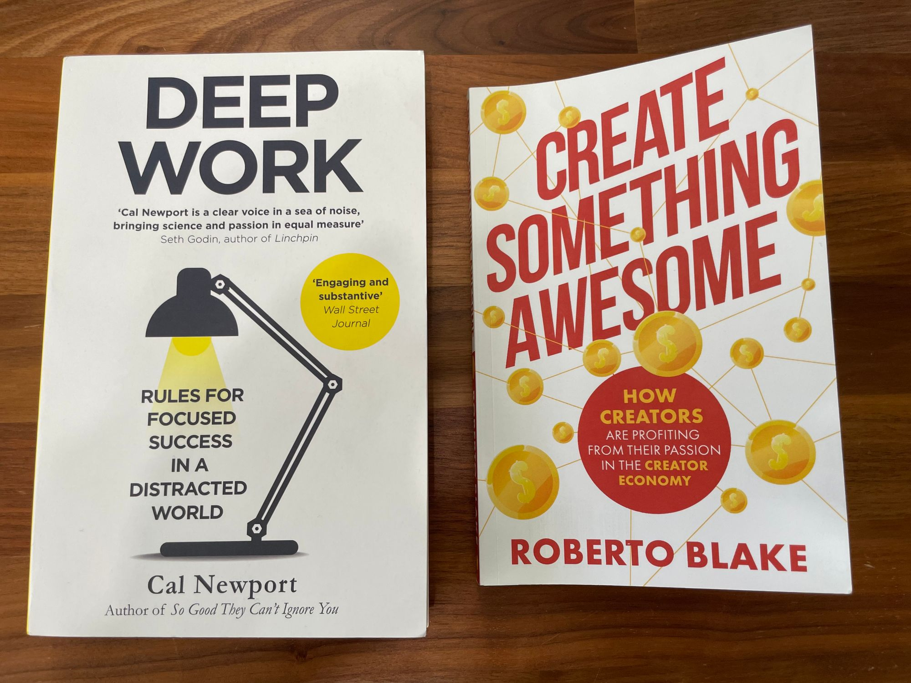
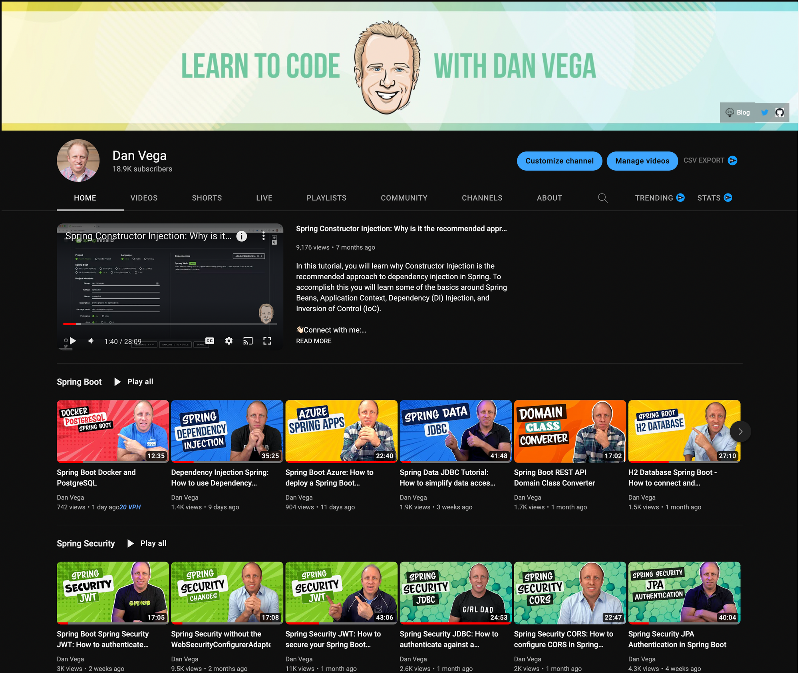
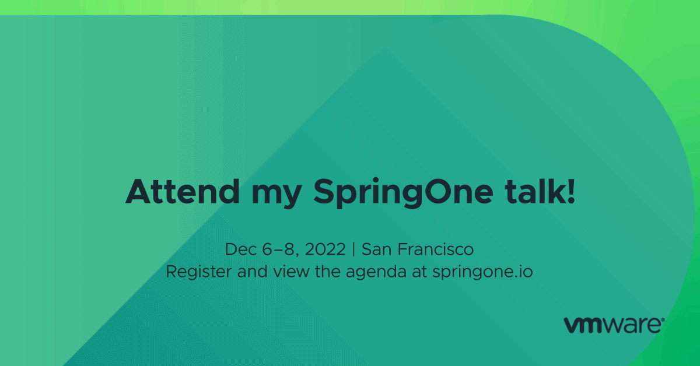

Happy Monday and welcome to another edition of my newsletter. I want to wish all of you a very happy and spooky Halloween 🎃 If you’re enjoying this newsletter and wouldn’t mind [sharing](https://www.danvega.dev/newsletter/) it with a friend that would mean the world to me. In today’s episode, I want to talk about some books I’m currently reading, YouTube, and Spring Office Hours. I will also give you a little bit of a peek into what I am working on this week.

## Current Status

I took a short little trip to Ocean Isle, NC last weekend for a friend's wedding. I ended up having to go by myself because my wife and I couldn’t find anyone to watch the kids. I decided that I would take this opportunity to get some running in along the ocean, which by the way is one of the most therapeutic things I have ever had the pleasure of doing and something I recommend to everyone.

I also decided to take this opportunity to do a little reading. I decided to take 2 books with me not knowing how much I would get done but to my surprise, I was able to finish them both. I forgot that traveling without kids, especially little ones can actually be relaxing. I ended up taking [Deep Work by Cal Newport](https://amzn.to/3TRc8TC) which I was already 30 pages into and [Create Something by Roberto Blake](https://amzn.to/3SKBilz). I will start by giving a mini-review of Deep Work this week and in the next newsletter, I will talk about Create Something awesome. Mini spoiler, I thought they were both really great. 👏🏻

### Deep Work

I was really excited to get through this book as I believe it found me at an appropriate time in life. Deep work is a productivity book on how to be focused in a distracted world. I was already a big fan of Cal Newport's when I happened to come across his Podcast which I have been binging on lately.

The first part of the book went into describing what deep work is. Deep work is all about the ability to focus with distraction on a cognitively demanding task. This becomes especially true when you have little ones in the house every day all day. For me, my meaningful work is creating content that includes articles, videos, courses, this newsletter you’re reading, or a presentation for an upcoming conference.

If that is Deep work shallow work is everything else that is not contributing to the goals you have set out for yourself. This could be anything from meetings, catching up on emails, or those pesky expense reports. It’s not to say that these things are not important but we need to find ways to batch these tasks and create time blocks to focus on our deep work.

Cal talks extensively about creating time blocks for your work day and being more proactive than reactive. If you wake up on Monday and ask what should I work on today there is too much room for distractions to creep in. Each Sunday I take a look at my quarterly goals, what items I would like to complete this week, and plan out my week.

The rest of the book is all about the rules to deep work:

- Work Deeply
- Embrace Boredom
- Quit Social Media
- Drain the shallows

Each of these rules is well thought out and backed up by case studies and real-world experiences. I think what really stood out for me was the ability to embrace boredom. Once your brain becomes accustomed to on-demand distractions (like looking at your smartphone while standing in line at the grocery store) it’s harder to shake the addiction, even when you want to concentrate.

**My Takeaways from the book**

- I know my cutoff is 5 PM each day. I take each day and plan backward from there based on the tasks I want to accomplish that day.
- As I mentioned earlier I spend a little bit of time on Sunday reflecting on the previous week, what my quarterly goals are and what I would like to accomplish this week.
- I have turned off all notifications from my phone for anything that is urgent. This includes personal email, Twitter, YouTube, etc…
- Both my personal and work email are not open on my computer. I will spend time blocks checking email but I don’t want the distraction of the notification each time I receive an email.
- I want to quit all social media but I just can’t. I took the first step by getting rid of TikTok which was just mindless scrolling. I run a Facebook group for Spring Developer and for my non-profit that I run so for now that will have to stick around. I would love to get rid of Facebook and Instagram so I will try and convince myself to do that next.
- Spend a few minutes in my shallow work blocks unsubscribing from spam and cleaning out my email boxes.

### Next Up

Next up on the reading list is actually something I was referred to by Cal Newport. The book is by Adam Grant and it’s called [Give and Take](https://amzn.to/3zunHYN), Why helping others drive our success. I have already started this one and I can’t wait to make my way through it.

## Spring Office Hours

If you haven’t been paying attention my coworker and friend DaShaun and I have been running a weekly live stream called [Spring Office Hours](https://tanzu.vmware.com/developer/tv/spring-office-hours/). This is a chance for us to share with you what is new in the world of Spring. We also like to show off demos of whatever we are currently working on and most importantly it’s a chance for you to ask your questions and hopefully, we can answer them. Not only has this show been extremely helpful to the community but it’s the thing I look to most every week.

Lately, we have gotten more consistent with the show which airs every Tuesday at 3:30 EDT. With that, we have seen a rise in our viewers where almost 100 people joined us live last week, and thousands on the replay. In the latest episode, which you can find below, we talked all about the release of Spring Boot 3.0 RC1.

`youtube:https://youtu.be/WgcP00BOs5I`

## YouTube

YouTube launched a redesign of its desktop and mobile applications. I am a big fan of the new look which is cleaner and the slightly rounded corners on the thumbnails. I’m also a big fan of the tabs across the top where they have split out the video, shorts, and live streams. This makes it easier for viewers to consume the appropriate content. I’m also pretty proud of how my page looks with my current thumbnail design. I am not a designer but these turned out well. 🥳

Speaking of those thumbnails, I updated to macOS Ventura this week. There is a really great feature that allows you to copy just the subject from an image in your photos app.

[https://twitter.com/therealdanvega/status/1585102836312203264](https://twitter.com/therealdanvega/status/1585102836312203264)

## Content

I released a bunch of content over the last 2 weeks and I hope you enjoy them. I have talked about this in the past but I am having a lot of fun creating YouTube shorts. If you have randomly come across one of my short-form videos and are enjoying them please let me know 🤩

- [Spring Boot Azure](https://youtu.be/53T_R3xAPTg) - In this tutorial
- [Dependency Injection in Spring](https://youtu.be/TBlB2_4_Sqo)
- [Spring Office Hours: Spring to Production Part 2](https://youtu.be/m40_FKUCbq0)
- [Spring Office Hours: Spring Boot 3.0 RC1](https://youtu.be/WgcP00BOs5I)
- [Docker PostgreSQL Spring Boot](https://youtu.be/_Gdb-jK3Sr4)
- [Spring Boot 3.0 Short](https://youtube.com/shorts/zPg4z5d3WVo?feature=share)

## Upcoming Content

- [Spring Office Hours 18: Testing with Ted](https://tanzu.vmware.com/developer/tv/spring-office-hours/0018/) - We are excited to be joined by Ted Young AKA [JitterTed](https://twitter.com/jitterted) to talk all about testing in Spring.
- Serverless Spring - I wrote a new guide for the Tanzu Developer Center which should be published by the time you read this on Serverless Spring Boot. In this tutorial, you will learn how to build and deploy serverless functions using Spring Boot and Spring Cloud Function. I should be able to record a video version of this guide for my YouTube channel very soon.
- Spring Boot 3 - First Look: I am working on a video that introduces you to a lot of the new features in Spring Boot 3.
- [SpringOne - A Gentle Introduction to Spring for GraphQL](https://springone.io/2022/sessions/a-gentle-introduction-to-spring-for-graphql)
- [SpringOne - Getting Started with Spring Boot Workshop](https://springone.io/2022/workshops/spring-boot-beginner)
- [CodeMash 2023](https://www.codemash.org/): Give your APIs a REST & Make the move to GraphQL
- [CodeMash 2023](https://www.codemash.org/): Getting Started with Spring

## SpringOne

This week we made the last of our announcements around speakers, workshops, and sessions. If you haven’t had a chance you should head over to [www.springone.io](http://www.springone.io) and check out the content. The list of speakers, sessions, and workshops is one of the best I have ever seen. I seriously can’t wait to be in San Francisco and learn from some of the best in our community.

In that list of speakers and sessions, you will find me presenting on Spring for GraphQL. I’m so excited to be giving this presentation at SpringOne and have already begun working on it. I have a lot of content on GraphQL and spent the year talking about it on the SpringOne tour but this presentation will be an updated one.

I’m also giving a workshop on getting started with Spring Boot which you can now [register for](https://springone.io/2022/workshops/spring-boot-beginner). You can get \$200 off when registering if you use the code S1VM22_Advocate_200.

## Around the Web

### 📝 Articles

- [GraalVM 22.3 is here: JDK 19 builds, jlink support, new monitoring features, and more!](https://medium.com/graalvm/graalvm-22-3-is-here-jdk-19-builds-jlink-support-new-monitoring-features-and-more-f6e2b2eeff95)
- [IntelliJ IDEA 2022.3 EAP 4 is out!](https://blog.jetbrains.com/idea/2022/10/intellij-idea-2022-3-eap-4/)

### 🎬 Videos

- [Spring Tips: the road to Spring Boot 3: Spring Framework 6](https://www.youtube.com/watch?v=aUm5WZjh8RA)
- [GraalVM 22.3 Release stream 🚀](https://www.youtube.com/watch?v=BzsdYIOuNWQ)
- [Laurențiu Spilcă - The new Spring Security](https://www.youtube.com/watch?v=LlVy9Roh_bQ)
- [Prometheus: The Documentary](https://www.youtube.com/watch?v=rT4fJNbfe14)

### 🎙 Podcasts

- [Spring mad scientist Andy Clement on a Bootiful Podcast](https://bootifulpodcast.fm/#/episodes/8240ea1e-1084-47a7-bfd8-9210bb4d837c)
- [Between Chair and Keyboard - The one with Billy Williams](https://tanzu.vmware.com/developer/tv/bcak/69/)

### 📚 Books

- [Deep Work by Cal Newport](https://amzn.to/3TRc8TC)
- [Create Something Awesome by Roberto Blake](https://amzn.to/3SKBilz)
- [Give and Take by Adam Grant](https://amzn.to/3zunHYN)

### 👨🏼‍💻 Conferences

- [ViteConf 2022 | Full day | 42 talks about the tools and frameworks innovating in the Vite Ecosystem](https://www.youtube.com/watch?v=Znd11rVHQOE)

### ✍️ Quote of the week

The principle of give and take; that is diplomacy — give one and take ten.

### 🐦 Tweets

I updated to macOS Ventura this week and so far, no issues. 🤞🏻

[https://twitter.com/therealdanvega/status/1585090917991870464](https://twitter.com/therealdanvega/status/1585090917991870464)

## Until Next Week

Thanks for sitting down and sharing a cup of coffee with me my friend. I hope you enjoyed this installment of the newsletter and I will talk to you in the next one. If you have any links you would like me to include please [contact me](http://twitter.com/therealdanvega) and I might add them to a future newsletter. I hope you have a great week and as always friends...

Happy Coding 
Dan Vega 
danvega@gmail.com 
[https://www.danvega.dev](https://www.danvega.dev)

