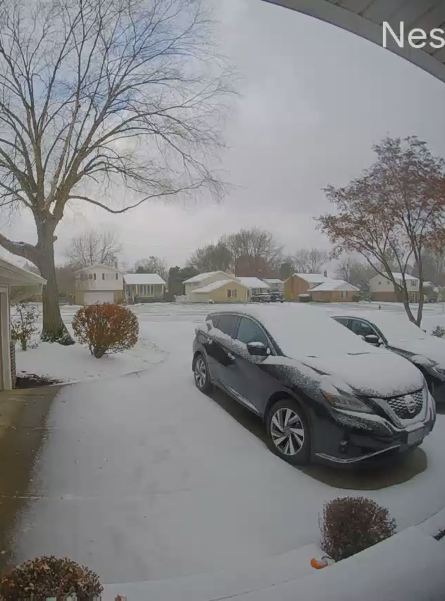

Happy Monday and welcome to another edition of the newsletter. It’s hard to believe that it is the middle of November and Thanksgiving is next week. We had our first snowfall over the weekend and I can say with confidence that I am not ready for this 🤦‍♂️

In this week's edition, I want to talk to you about creating something awesome, Twitter, SpringOne, and what I have been working on lately.

## Current Status

The last time I checked in with you I told you that I finished 2 new books on my quick trip to Ocean Isle NC for a friend's wedding. I gave you a [quick review](https://www.danvega.dev/newsletter/deep-work/) of the first book [Deep work](https://amzn.to/3WWSrMh) and today I want to talk quickly about the other book, [Create Something Awesome by Roberto Blake](https://amzn.to/3O5aQ5p).

I have followed [Roberto’s work](https://www.youtube.com/channel/UCovtFObhY9NypXcyHxAS7-Q) for a while now so I was really excited to pick this up when it came out. Roberto is a creative entrepreneur, YouTuber, and Keynote Speaker. I have learned a lot about YouTube from Roberto’s channel so my mindset going into this book was that it was going to be an extension of that.

This book is really geared towards someone who is interested in turning their passion into profits in the creator economy. I think this book is packed with real-world case studies, personal experiences as well as actionable advice. Even if you have been in the content creation game for a while I think there is still a lot you can and I certainly picked up some tips and motivation that I was looking for.

The message that runs throughout the book is that there is no better time to monetize your passion. This starts with understanding what the creator economy is, how to build a powerful brand and how to monetize by providing value first. The chapter on authenticity and boundaries and why being yourself is so important in this game really stood out to me. So much so that I went back and read it again before writing this review.

Roberto is a great person that embodies what creators should aspire to and it’s apparent that he poured his experience and passion into this book. If you are a creator looking to turn your passion into a career this is a must-read. Thank you, Roberto, 👏🏻

## Twitter

If you’re on Twitter you don’t need me to tell you what’s been going on. Instead, I want to offer a bit of a different insight. I went back and looked and I have been on Twitter since 2008 and have authored over 30,000 tweets. I have discussed with you my desire to rid myself of social media platforms like Facebook and Instagram in the past because I believe they do more harm than good.

Twitter for me a place where I connect with people like me. I get to talk with people who live near me, creators who like to create content, and the biggest community of all, developers. I don’t ever look at Twitter as toxic because as soon as someone becomes that way to me I stop following and will go as far as I need to to make sure those individuals don’t show up on my feed.

Like other social media platforms, there is still a problem with Twitter that I try and work on often. I am constantly comparing myself to other creators, developers, and people I look up to. On some level, it’s good to look up to others but the constant need to prove your worth to yourself because of something or someone you saw online is no way to live life. We all have to remember that the majority of what we see on social networks is the best view of them. Not many people rush to Twitter to tell you how hard life is and how they are dealing with it.

With all that said I don’t want to give up on Twitter. Yes, they are going through a pretty rough transition right now and I’m not sure what the future holds for them. I love the people I learn from every day and all of the new tech, software, and products I learn about on the platform. I saw an influx of people scrambling to create accounts on other platforms and I won’t be one of them. I’m hopefully optimistic that some good will come out of this change.

## SpringOne

By now I am sure that you heard but SpringOne in December was canceled. I was so sad when I heard this because I was looking forward to so many things. I was looking forward to giving a workshop on how to get started with Spring Boot. I was also giving a breakout session on Spring for GraphQL. I was really looking forward to the amazing lineup of speakers and getting a chance to meet so many of you in person for the first time. There is now a free [virtual conference](https://springone.io/) happening in January so if you’re interested please signup now.

As sad as I am about SpringOne, the show must go on. I know there will be many more opportunities to connect with all of you. I am speaking at CodeMash in January where I will be giving a talk on GraphQL as well as a workshop with my friend DaShaun. I am submitting to a lot of conferences in 2023 so if you would like me to speak at your event please reach out.

[https://twitter.com/therealdanvega/status/1591094107530731520](https://twitter.com/therealdanvega/status/1591094107530731520)

## Content

I wrote a guide for the [Tanzu Developer Center](https://tanzu.vmware.com/developer/) called [Serverless Spring](https://tanzu.vmware.com/developer/guides/serverless-spring/). Prior to working on this article, I didn’t have a ton of experience building serverless applications so I was excited to jump in and learn from the ground floor. Before I could start writing serverless applications with Spring I wanted to start with just Java and experience what that was like and experience some of the pain points to understand where something like Spring Cloud Function would help me. That is why you will find 3 new videos on YouTube related to creating your first lambda functions on AWS with Java.

- [Serverless Spring Guide](https://tanzu.vmware.com/developer/guides/serverless-spring/)
- [Spring Office Hours with Greg Turnquist](https://youtu.be/Mjq9g8hRaoI)
- [Hello AWS Lambda](https://youtu.be/MaHxZEBRcT4)
- [AWS Lambda Java Core](https://youtu.be/kyWllXOGMWQ)
- [AWS Lambda RDS PostgreSQL](https://youtu.be/K1OI-S0ET70)
- [Code on the Beach - Dan Vega - Full Stack Java Development with Spring Boot](https://www.youtube.com/watch?v=4cRbPH_GkBQ)

### Upcoming Talks

- [Spring Office Hours with Daniel](https://youtu.be/0i6Xu3Pf83Q)
- [CodeMash 2023](https://www.codemash.org/): Give your APIs a REST & Make the move to GraphQL
- [CodeMash 2023](https://www.codemash.org/): Getting Started with Spring

## Office Hours Repository

There is something that has been weighing on me heavily lately. I receive a lot of comments, questions, suggestions, and feedback from a variety of sources. A big source of this is YouTube, Spring Office Hours, and Twitter but I also get notifications through my website, email, and LinkedIn.

When it’s a comment I usually reply and thank that person for taking time out of their day to leave me a comment. When it’s a question and there is a simple answer to it I will reply to it. The problem is what if it isn’t an easy question to answer? What If I don’t have the answer and it will take some time to investigate? What if it's a suggestion for a future video?

I realize that I simply can’t reply to every single comment, suggestion, or question but I also don’t want to ignore people. With a variety of mediums, where do I store these questions so they don’t get lost? This is something that I have been thinking about lately and I have come up with an answer. Well, I have a solution and we shall see in the long term if it’s the answer.

I started a Github Repository called Office Hours. There is no code in this repository but there are some discussion boards. These boards are split up into content suggestions, Q&A, general chat, and polls. If you have a comment, question, or suggestion that falls into one of these buckets please consider submitting it below. I am going to find a good cadence to try and respond to what comes in there.

I know others who use Discord for this but I have to say, I am just not a big fan of Discord. For as much slack as Slack gets (see what I did there) it is just so much more of an enjoyable user experience for me. I find Discord clunky, and hard to use and the lack of threads gives me a headache. You can find the repository below and I would love your feedback on this going forward.

[https://github.com/danvega/office-hours/discussions](https://github.com/danvega/office-hours/discussions)

## YouTube 20,000

Speaking of YouTube I’m currently sitting around 19,500 subscribers on YouTube. This means that I will hopefully hit 20k before the end of the month. I haven’t really celebrated any milestones lately but I have been super excited about this one. I’m trying to figure out what I should do for this huge milestone. I will at the very least put together a video and thank all of you who have supported me over the years and helped me reach this huge goal of mine. Maybe we can do a giveaway? How about free Spring Boot 3 licenses for everyone 🤣

If you haven’t [subscribed to my channel](http://youtube.com/@danvega) yet, what are you waiting for 🤦‍♂️

## Around the Web

### 📝 Articles

- [How we built the Tinder API Gateway](https://medium.com/tinder/how-we-built-the-tinder-api-gateway-831c6ca5ceca)
- [How to publish a Java library to Maven Central - Complete Guide](https://maciejwalkowiak.com/blog/guide-java-publish-to-maven-central/)
- [Improving Developer Productivity at Disney with Serverless and Open Source](https://aws.amazon.com/blogs/opensource/improving-developer-productivity-at-disney-with-serverless-and-open-source/?tag=mochaglobal19-20)

### 🎬 Videos

- [What You Need to Know About Java Text Blocks](https://www.youtube.com/watch?v=zr7pEWKtVy4&t=348s)
- [A video for anyone feeling behind in life](https://www.youtube.com/watch?v=TMQZ921XvLg)

### 🎙 Podcasts

- [Java Champion, legend, and prolific open-source contributor Andres Almiray](https://bootifulpodcast.fm/#/episodes/b7f51cf1-6fac-4b11-9a75-ed35bda273f2)
- [Between Chair and Keyboard - with Billy Korando](https://tanzu.vmware.com/developer/tv/bcak/70/)

### 💻 Projects

- [IntelliJ IDEA 2022.3 EAP 5](https://blog.jetbrains.com/idea/2022/10/intellij-idea-2022-3-eap-5)

### 📚 Books

- [Deep Work by Cal Newport](https://amzn.to/3TRc8TC)
- [Create Something Awesome by Roberto Blake](https://amzn.to/3SKBilz)
- [Give and Take by Adam Grant](https://amzn.to/3zunHYN)
- [Getting to Know IntelliJ IDEA](https://leanpub.com/gettingtoknowIntelliJIDEA)

### ✍️ Quote of the week

“It’s easier to win if everybody wants you to win. If you don’t make enemies out there it’s easier to succeed.” - Randy Komisar

### 🐦 Tweets

[https://twitter.com/therealdanvega/status/1590796343710453760](https://twitter.com/therealdanvega/status/1590796343710453760)

## Until Next Week

Thanks for sitting down and sharing a cup of coffee with me my friend. I hope you enjoyed this installment of the newsletter and I will talk to you in the next one. If you have any links you would like me to include please get i[n touch with me](http://twitter.com/therealdanvega) and I might add them to a future newsletter. I hope you have a great week and as always friends...

Happy Coding 
Dan Vega 
danvega@gmail.com 
[https://www.danvega.dev](https://www.danvega.dev)

